Lab 10: Working with XML Files 
================================

We will not be building a single bot to
demonstrate XML actions. Instead, we will go through the individual
actions within the XML package. Each walk-through will provide a
step-by-step guide that shows you how to use each action. We will be
using the following packages:

For this lab, we will go through several separate walk-throughs.
Each one has been designed to demonstrate specific XML actions. We will
start by creating XML sessions so that we can work with an XML data
stream. Following this, we will look at reading data from XML files.
This will include reading a single node, as well as multiple nodes. To
do this, we will need to build a loop that will iterate through all the
records in an XML data stream. In the next walk-through, we will look at
updating, creating, and deleting nodes within an XML data stream. By the
end of this lab, you will be fully confident with all the different
aspects of XML data streams, including reading, updating, creating, and
deleting nodes.

In this lab, we will cover the following topics:

-   Starting, validating, and ending XML sessions
-   Reading and updating XML nodes
-   Inserting and deleting XML nodes
-   Executing XPath functions
-   Let\'s get started!

Technical requirements 
======================

You will need the following to install Automation Anywhere Bot agent:

-   Google Chrome
-   Completed registration with Automation Anywhere  Community
    Edition
-   Logged on successfully to Automation Anywhere  Community
    Edition
-   Successfully registered a local device
-   Successfully downloaded the sample data from GitHub

Starting, validating, and ending XML sessions 
=============================================

For the first exercise, you\'ll learn how to start and end an XML
session. The XML data stream can be stored as a `String`
variable or read from an XML file. We will be using the sample XML file
that\'s available as part of this course\'s GitHub repository. If you
copied this course\'s GitHub repository to your `C:\` drive, the
file we will be using can be found at
`C:\Hands-On-RPA-with-AA-Sample-Data\Chapter10_SampleFile.xml`.
The following screenshot shows a partial view of this file:

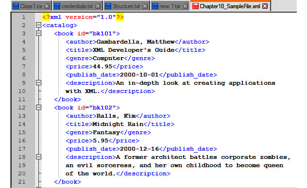

For this first walk-through,
we will perform the following tasks:

1.  Create a new XML session for the sample XML file.
2.  Validate the XML file.
3.  End the newly created session and close the XML file.

As always, we will start by adding some comments to guide us. Since we
are just looking at creating a session, we don\'t need to add a lot of
comments.

Let\'s start this walk-through by executing the following steps:

1.  Log into **Control Room**.

2.  Create a new bot and call it `Lab 10 – XML`. Place it
    in the `\Bot\` folder.

3.  As always, we\'ll begin by adding some comments that will be used as
    templates for our bot. Add a new **Comment** action called
    `"---------------------"` on line **1** and click on
    **Save**.

4.  Add another **Comment** action called
    `"------- Create XML Session"` on line **2** and click on
    **Save**.

5.  Add another **Comment**
    action called `"Validate XML data"`
    on line **3** and click on **Save**.

6.  Add another **Comment** action called `"End XML Session"`
    on line **4** and click on **Save**.

7.  Add another **Comment** action called
    `"---------------------"` on line **5** and click on
    **Save**. Our initial development interface should look like this:
    
    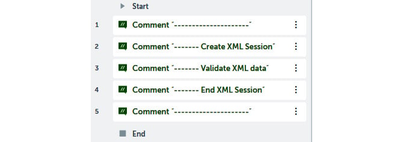

8.  To create our XML session, go to the **XML** package and drag the
    **Start session** action just below line **2**.

9.  Set the following properties for the **XML: Start session** action
    on line **3**:

    **Session name**: `xml_data`

    **Data Source**: **File**

    **Desktop file**:
    `C:\Hands-On-RPA-with-AA-Sample-Data\Chapter10_SampleFile.xml`

    The properties window should look like this:

    
    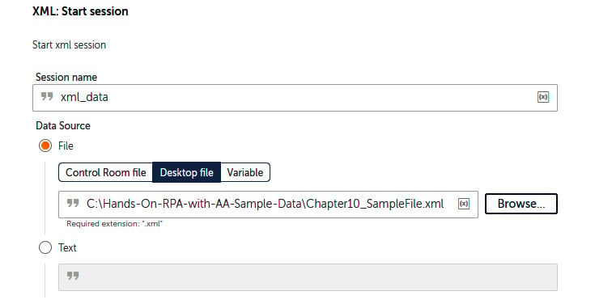
    

10. Click on **Save**.

When a new XML session is
created, we should check that the XML data format
is valid. To check the format, we can use the **Validate XML document**
action. This action returns a string with a value of either
`Valid` or `Invalid`. To store this result, we will
create a `String` type variable called `sValidXML`:

1.  Now that the XML session has been created, we can validate it. To
    validate our XML session, drag the **XML: Validate XML document**
    action just below line **4**.

2.  Set the following properties for the **XML: Validate XML document**
    action on line **5**:

    **Session name**: `xml_data`

    **Select validation type**: **Well formed**

    **Assign the output to variable**: **sValidXML - String**

    The properties window should look like this:

    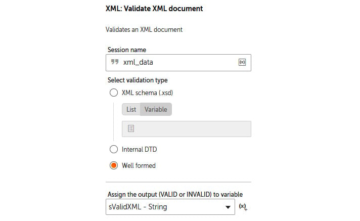

3.  Click on **Save**.

4.  We now have our validation result assigned to the
    `sValidXML` variable. However, we only want to proceed if
    the XML data stream is valid. We can ensure this happens by adding a
    condition statement. To add this, drag the **If** action just below
    line **5**.

5.  Set the following
    properties for the **If** action on line
    **6**:

    **Condition**: **String condition**

    **Source value**: `$sValidXML$`

    **Operator**: **Equals to (=)**

    **Target value**: `VALID`

    **Match case**: *Checked*

    The properties window should look like this:

    
    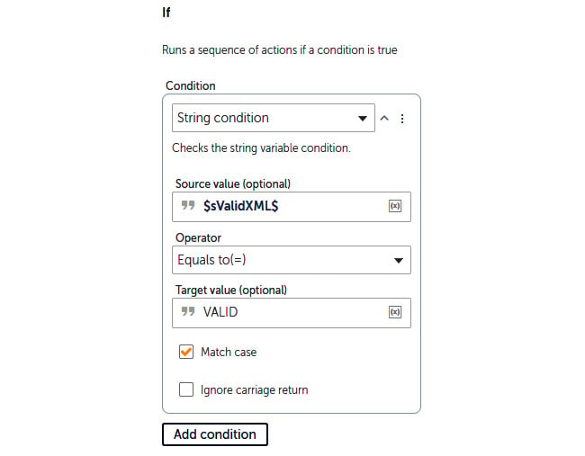
    

6.  Click on **Save**.

7.  So that we know what the
    validation result is, we will add a message
    box for each outcome. To add a message for a valid XML file, drag
    the **Message box** action just below line **6**.

8.  Set the **Message box** action properties on line **7** to the
    following:

    **Enter the message box window title**:
    `XML - Validation Check`

    **Enter the message to display**:
    `Result: $sValidXML$ - Bot will continue…`

    The properties window should look like this:

    
    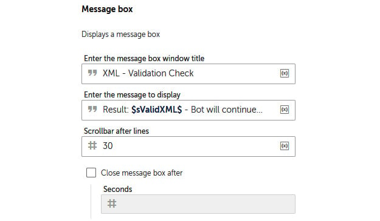
    

9.  Click on **Save**.

10. To add a message box in
    case the XML file is invalid, we will add an
    **Else** action to our condition. Drag the **Else** action from the
    **If** package just below line **7**. No properties need to be set
    for this.

11. Click on **Save**.

12. Add the message box for the invalid case by dragging the **Message
    box** action just below line **8**.

13. Set the **Message box** action properties on line **9** to the
    following:

    **Enter the message box window title**:
    `XML – Validation Check`

    **Enter the message to display**:
    `Result: $sValidXML$ - Bot will Stop!`

    The properties window should look like this:

    
    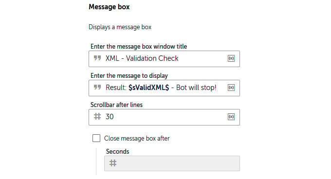
    

14. Click on **Save**.

15. Now that we have
    completed our XML session, we need to close
    it. Always refer to the session name whenever you\'re working with
    any type of connection to a data source. Remember that there may be
    instances where you may have multiple data sources open; you
    wouldn\'t want to use the wrong one. To end our XML session, drag
    the **XML: End session** action just below line **10**.

16. Set the following properties for the **XML: End session** action on
    line **11**:

    **Session name**: `xml_data`

    The properties window should look like this:

    
    
    

17. Click on **Save**. Your development interface
    should look like this:

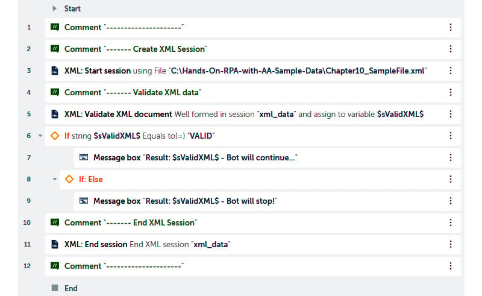

That wasn\'t too difficult. Now that we know how to establish an XML
session, we are ready to start working with the XML data. Go ahead and
run your bot to check your progress so far. It should tell you whether
the XML file is valid or not. You can try testing this out by modifying
the file. Remember to save it back to its original
format afterward.

In the next section, we will continue learning how to read XML nodes
before introducing you to the **Step** action, which allows you to group
a set of actions together as a single step.

Reading XML nodes 
=================

As we progress through this lab, we will be
learning the different ways we can work with XML data. To organize the
workflow, we will start by using the `Step` action. The
`Step` action is like creating a block of actions that perform
a complete step or task within your taskbot. Each step can be collapsed
or expanded, which makes it easier for you to read and understand your
actions. As with the *If* statements and loops, all the actions related
to a step must be indented within the step they belon to.

Reading a single node 
---------------------

Our sample XML file contains five records of
books. To read a single node, we must specify which record we wish to
read. For this example, we will get our bot to read the book title for
the second record.

Let\'s start this walk-through by executing the following steps:

1.  We will need a variable that will store our book title value. For
    this, create a `String` type variable called
    `sTitle`.

2.  Next, we\'ll add our first step so that we can start reading a
    single node group. Drag the **Step** action just below line **7**,
    ensuring it is indented within the **If** action on line **6**.

3.  Set the **Title** property of the **Step** action on line **8** to
    `Reading a Single Node`. The properties window should look
    like this:

    
    
    
4.  Click on **Save**.

5.  To read the title for the second record, drag the **Get single
    node** action from the **XML** package to just below line **8**,
    ensuring it is indented within the **Step** action we just created.

6.  Set the following properties for the **XML: Get single node** action
    on line **9**:

    **Session name**: `xml_data`

    **XPath expression**: `book[2]/title`

    **Assign the output to variable**: **sTitle - String**

    The properties window should look like this:

    
    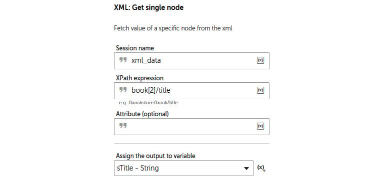
    

7.  Click on **Save**.

8.  Let\'s add a message box so that we can see the book title the bot
    has read from the XML file. We can do this by dragging the **Message
    box** action just below line **9**, ensuring it remains within our
    **Step** action.

9.  Set the **Message box** action properties on line **10** to the
    following:

    **Enter the message box window title**:
    `Reading a Single Node`

    **Enter the message to display**: `Book Title: |$sTitle$|`

    The properties window should look like this:

    
    
    

10. Click on **Save**.

Great work -- you have just created your first complete **Step**! This
**Step** has been tasked with reading a single node. In this example, we
specified the second record and the node name. Remember that you can
always replace these hard values with variables if needed. Your **Step**
action in the development interface should look like this:

To make your development interface more readable and understandable, the
**Step** action can be expanded and collapsed using the arrow icon on
line **8**. Go ahead and run the bot; it should display two message
boxes. The first will show the validity check result, while the second
will show the book title. Now that we have tested the bot and know that
the **Step** action works, collapse it -- we don\'t really need to visit
this again.

In the next section, we will learn how to read the
title nodes for each record in our XML data stream. In our sample data,
we have five book titles. We will build upon our bot so that it loops
through each title.

Reading multiple nodes 
----------------------

In this section, we will still read the book title
but for every record in our file. This will involve building a loop.
There is a specific loop available just for working with XML files. We
won\'t need a new variable as we already have `sTitle` from
the previous section.

Let\'s start this walk-through by executing the following steps:

1.  Add a new **Step** action on line **11**, ensuring it is aligned
    with the previous **Step** action on line **8**.

2.  Set the **Title** property of this new **Step** action on line
    **11** to `Reading Multiple Nodes`. Your development
    interface for this section should look like this:

    
    
    

3.  Click on **Save**.

4.  To loop through our XML dataset, we need to identify which node we
    will be reading. To do this, drag the **Get
    multiple nodes** action from the **XML** package to just below line
    **11**, ensuring it is indented within the **Step** action on line
    **11**.

5.  Set the following properties for the **XML: Get multiple nodes**
    action on line **12**:

    **Session name**: `xml_data`

    **XPath expression**: `book/title`

    **Get each node**: **Text value**

    The properties window should look like this:

    
    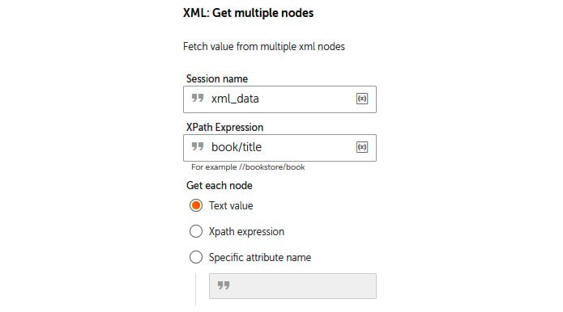
    

6.  Click on **Save**.

7.  Next, we will add the loop for our XML file by dragging the **Loop**
    action to just below line **12**, ensuring it is indented within the
    **Step** action on line **11**.

8.  Set the following properties for the **Loop** action on line **13**:

    **Iterator**: **For each Node in a XML Dataset**

    **Session name**: `xml_data`

    **Assign the current row to this variable**: **sTitle - String**

    The properties window should look like this:

    
    
    

9.  Click on **Save**.

10. Like we did previously, add a message box that shows the title by
    dragging the **Message box** action just below line **13**, ensuring
    it remains within the **Loop** action on line **13**.

11. Set the following properties for the **Message Box** action on line
    **14**:

    **Enter the message box window title**:
    `Reading Multiple Nodes`

    **Enter the message to display**: `Book Title: |$sTitle$|`

    The properties window should look like this:

    
    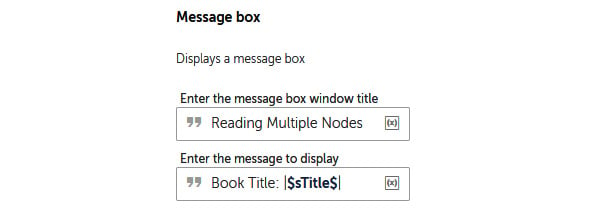
    

12. Click on **Save**. Your development window
    should look like this:

Now, you can run your bot. It should loop through all the book titles,
displaying the titles as it iterates through the XML dataset. Once you
have tested the bot, you can collapse the steps. Your bot\'s development
interface should look like this:

In the next section, we will continue building our
bot by learning how to update nodes in an XML dataset. Our approach will
be to create additional steps that demonstrate each action from the XML
package.

Updating XML nodes 
==================

At this point, you should be confident with
reading data from XML files. In this section, we will be looking at
updating nodes. We will start by updating a single node value. As we did
previously, we will need to know the specific record we wish to update.
Once we have learned how to update a single node, we will learn how to
update multiple nodes. Again, a loop will be needed to perform this
task.

Updating a single node 
----------------------

From our sample XML file, we will be updating the
genre for the first record. It is currently set to `Computer`.
We will update this to `Computer – Software`. We know that the
record number is 1, and we also know the node is `genre`. In
our XML file, this record currently looks like this:

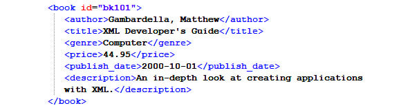

To apply an update, a two-step process must be performed. Here, you need
to make the update and then save the change back to your XML file.
You\'ll need a string variable to save the change back to your file.

Let\'s start this walk-through by executing the following steps:

1.  Create a `String` type variable called
    `sXML_DataStream` for saving any updates back to our file.

2.  Add a new **Step** action on line **15**, ensuring it is aligned
    with the previous **Step** action on line **11**.

3.  Set the **Title** property of the **Step** action on line **15** to
    `Updating a Single Node`. Your development interface
    should look like this:

    
    
    

4.  Click on **Save**.

5.  To update the `genre` property of
    the first record, drag the **XML: Update node** action from the
    **XML** package just below line **15**, ensuring it is indented with
    the **Step** action we have just created.

6.  Set the following properties for the **XML: Update node** action on
    line **16**:

    **Session name**: `xml_data`

    **XPath expression**: `book[1]/genre`

    **New value**: `Computer - Software`

    The properties window should look like this:

    
    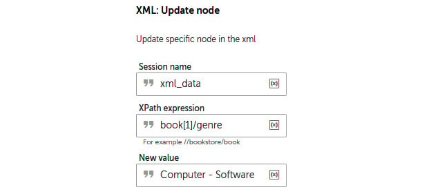
    

7.  Click on **Save**.

8.  To save this update back to our sample file,
    drag the **Save session data** action from the **XML** package just
    below line **16**, ensuring it remains indented with the **Step**
    action on line **15**.

9.  Set the following properties for the **XML: Save session data**
    action on line **17**:

    **Session name**: `xml_data`

    **Write XML data**: *Checked*

    **File path**:
    `C:\Hands-On-RPA-with-AA-Sample-Data\Chapter10_SampleFile.xml`

    **Overwrite**: *Checked*

    **Assign the output to variable**: **sXML\_DataStream - String**

    The properties window should look like this:

    
    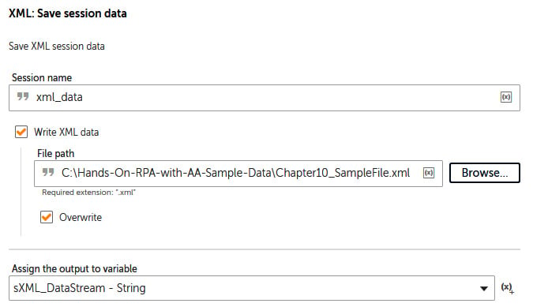
    

10. Click on **Save**.

11. As with all the previous steps, we must add a
    message box so that we can see what the bot is doing. Add a
    **Message box** action just below line **17**, ensuring it remains
    within the **Step** action on line **15**.

12. Set the following properties for the **Message box** action on line
    **18**:

    **Enter the message box window title**:
    `Updating a Single Node`

    **Enter the message to display**: `Record Number: 1`

    `Previous Genre: Computer`

    `New Genre: Computer Programming`

    The properties window should look like this:

    
    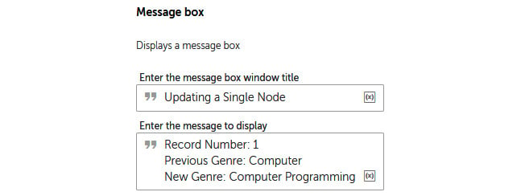
    

13. Click on **Save**.

That wasn\'t too difficult! With that, you have
learned how to update a single node, as long as you know which record it
is for. Your **Step** action should look like this in the development
interface:

You should be getting the hang of this by now. Once you have run the
bot, have a look at your XML file; the first record should have been
updated. It should look as follows:

In the next section, we will move on to updating
multiple nodes in our XML file.

Updating multiple nodes 
-----------------------

In this section, we will try and create a
realistic user case for updating multiple nodes in our XML file. Here,
we will apply a 10% price increase to all the books in our XML data
stream. This will involve performing the following steps:

1.  Building a loop to iterate through all the records.
2.  Reading the current price.
3.  Calculating the new price with a 10% increase.
4.  Updating the XML file with the new prices.

Every node that is read from an XML file is returned as a
`String` type. Since we want to calculate the price, we will
need to convert this `String` into a `Number`. The
same applies to updating a node: all the updated values need to be of
the `String` data type. This means that once we have
calculated the new price, we will need to assign this to a
`String` type variable. To perform these updates on multiple
nodes, we will need three variables for storing the old price, the new
price, and the record number, respectively. A `Number` type
and a `String` type will be required for each of these. This
means that an additional six variables will need to be created.

Let\'s start this walk-through by executing the following steps:

1.  Create three `String` type variables called
    `sRecordNum`, `sOldPrice`, and
    `sNewPrice`.

2.  Create three `Number` type variables called
    `nRecordNum`, `nOldPrice`, and
    `nNewPrice`.

    Your variable list should look like this:

    
    
    

3.  Add a **Step** action on line **19**, ensuring it is aligned with
    the previous **Step** action on line **15**.

4.  Set the **Title** property of this new **Step** action on line
    **19** to `Updating Multiple Nodes`. Your development
    interface should look like this:

    
    
    

5.  Click on **Save**.

6.  To read the price nodes for all the records, drag the **Get multiple
    nodes** action from the **XML** package to just below line **19**,
    ensuring it is indented within the **Step** action on line **19**.

7.  Set the following properties for the **XML: Get multiple nodes**
    action on line **20**:

    **Session name**: `xml_data`

    **XPath expression**: `book/price`

    **Get each node**: **Text value**

    The properties window should look like this:

    
    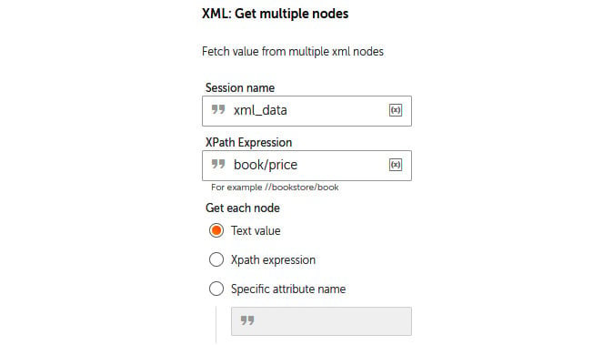
    

8.  Click on **Save**.

9.  Now, we can add our loop so that we can iterate through the
    `price` property of each record. Add the **Loop** action
    just below line **20**, ensuring it is within the **Step** action on
    line **19**.

10. Set the following properties for the **Loop** action on line **21**:

    **Iterator**: **For each Node in a XML Dataset**

    **Session name**: `xml_data`

    **Assign the current row to this variable**: **sOldPrice - String**

    The properties window should look like this:

    
    
    

11. Click on **Save**.

12. The default number that\'s assigned to our `nRecordNum`
    variable is `0`. We need to increment this value for each
    record. We can do this by adding the **Assign** action from the
    **Number** package just below line **21**, ensuring it is within the
    **Loop** action on line **21**.

13. Set the following properties for the **Number: Assign** action on
    line **22**:

    **Select the source string variable/ value**:
    `$nRecordNum$ + 1`

    **Select the destination number variable**: **nRecordNum -- Number**

    The properties window should look like this:

    
    
    

14. Click on **Save**.

15. Since we will be passing the record number as a parameter when
    applying the update, we need convert this into a **String**. To do
    this, drag the **To string** action from the **Number** package just
    below line **22**, ensuring it is within the **Loop** action on line
    **21**.

16. Set the following properties for the **Number: To string** action on
    line **23**:

    **Enter a number**: `$nRecordNum$`

    **Enter the number of digits after decimal**: `0`

    **Assign the output to variable**: **sRecordNum - String**

    The properties window should look like this:

    
    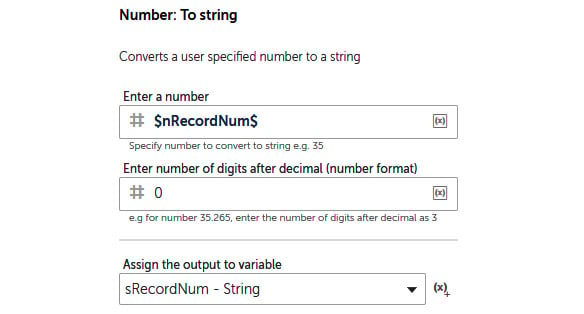
    

17. Click on **Save**.

18. To calculate the old price, we need to convert this value into a
    **Number** type variable. To do this, drag the **To number** action
    from the **String** package just below line **23**, ensuring it is
    within the **Loop** action on line **21**.

19. Set the following properties for the **String: To number** action on
    line **24**:

    **Enter the string**: `$sOldPrice$`

    **Assign the output to variable**: **nOldPrice - Number**

    The properties window should look like this:

    
    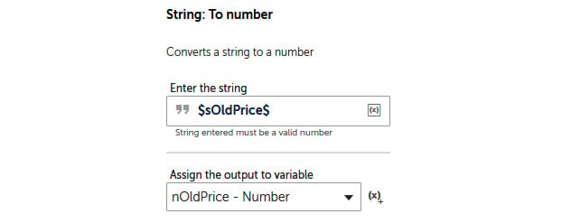
    

20. Click on **Save**.

21. To add a 10% price increase, we will multiply the old price by 1.1
    and assign this to the new price **Number** variable. We can do this
    by dragging the **Calc** action from the **NumberUtils** package
    just below line **24**, ensuring it is within the **Loop** action on
    line **21**.

22. Set the following properties for the **NumberUtils: Calc** action on
    line **25**:

    **Expression to be calculated**: `$nOldPrice$ * 1.1`

    **Calculated Expression**: **nNewPrice - Number**

    The properties window should look like this:

    
    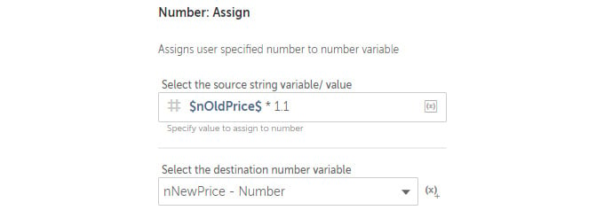
    

23. Click on **Save**.

24. Since we will be updating our XML file, the new price needs to be
    converted into a **String**. You can do this by dragging the **To
    string** action from the **Number** package just below line **25**,
    ensuring it is within the **Loop** action on line **21**.

25. Set the following properties for the **Number: To string** action on
    line **26**:

    **Enter a number**: `$nNewPrice$`

    **Enter number of digits after decimal**: `2`

    **Assign the output to variable**: **nNewPrice -- String**

    The properties window should look like this:

    
    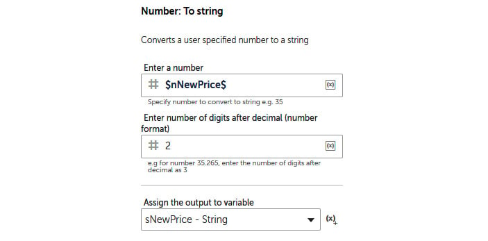
    

26. Click on **Save**.

27. We are now ready to update our node. We do this in exactly the same
    way we update a single node. We have our record number saved to a
    **String** variable, as well as the updated price. Apply the update
    by dragging the **Update node** action from the **XML** package just
    below line **26**, ensuring it is within the **Loop** action on line
    **21**.

28. Set the following properties for the **XML: Update node** action on
    line **27**:

    **Session name**: `XML_data`

    **XPath expression**: `book[$sRecordNum$]/price`

    **New value**: `$sNewPrice$`

    The properties window should look like this:

    
    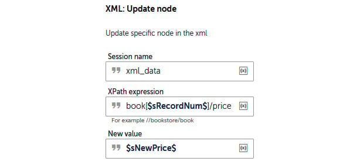
    

29. Click on **Save**.

30. Next, we\'ll add a message box, as we did previously, but this time
    we will set a close timer so that the message box will close itself
    once a certain amount of time has passed. This will mean you won\'t
    have to click on the **Close** button to continue. To add a
    **Message box** action, drag this action just below line **27**,
    ensuring it remains within the **Loop** action on line **21**.

31. Set the following properties for the **Message Box** action on line
    **28**:

    **Enter the message box window title**:
    `Updating Multiple Nodes`

    **Enter the message to display**:
    `Record Number: $sRecordNum$`

    `Old Price: $sOldPrice$`

    `New Price: $sNewPrice$`

    **Close message box after**: *Checked*

    **Seconds**: `5`

    The properties window should look like this:

    
    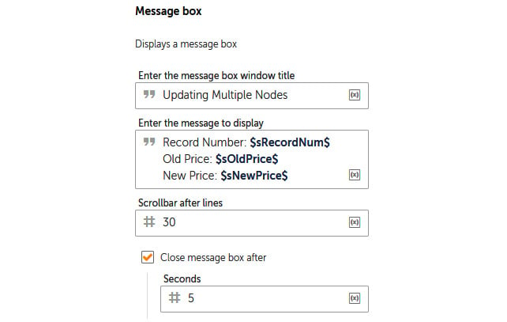
    

32. Click on **Save**.

33. Now that we\'ve completed the loop, all we have to do is save the
    updates back to our sample file. This only needs to be done once all
    the prices have been updated so that this can take place outside the
    loop. To save all the updates, drag the **Save session data** action
    from the **XML** package just below line **28**, ensuring it remains
    within the **Step** action on line **19** but also outside the
    **Loop** action on line **21** (it may help to collapse the **Loop**
    action by using the collapse arrow on the **Loop** action on line
    **21**).

34. Set the following properties for the **XML: Save session data**
    action on line **29**:

    **Session name**: `xml_data`

    **Write XML data**: *Checked*

    **File path**:
    `C:\Hands-On-RPA-with-AA-Sample-Data\Chapter10_SampleFile.xml`

    **Overwrite**: *Checked*

    **Assign the output to variable**: **sXML\_DataStream**

    The properties window should look like this:

    
    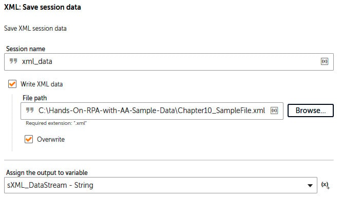
    

35. Click on **Save**.

Great job! With that, you have learned how to update multiple nodes
within an XML data stream and save the results back to an XML file. Your
**Step** action should look like this in the
development interface:

Go ahead and run your bot. Once you\'ve done this, check your prices --
they should have all had a 10% price increase. Now, you can collapse the
last **Step** action we created on line **19**. Your development
interface for the complete bot should look like this:

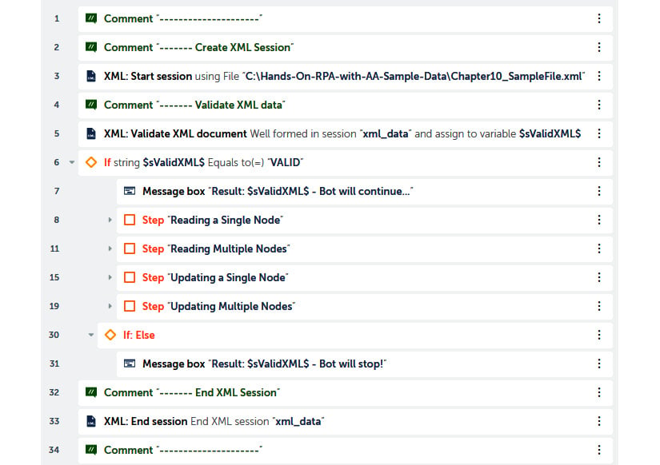

You\'re making great progress! Let\'s keep this
pace going. Since XML data streams are data sources, we may need to add
additional nodes or fields, especially if we are dynamically building
the XML data steam. In the next section, you will learn how to insert
nodes into our sample XML file.

Inserting XML nodes 
===================

In some cases, we may need insert additional nodes
into our XML file. In this section, we will explore how to achieve this
with Automation Anywhere. Now that you\'re more familiar with the
**XML** package, you\'ve probably guessed that to perform any XML
action, you need to specify the session, **Node**, and **Action**. When
inserting a node, the same principle applies. In this walk-through, we
will be creating a new node for all the records in our sample XML file.
The node we\'ll be inserting will be named `format` and will
be assigned the `Paperback` value. We will start by created a
new **Step** action, as we did previously.

Let\'s start this walk-through by executing the following steps:

1.  Add a **Step** action to line **30**, ensuring it is aligned with
    the previous **Step** action on line **19**.

2.  Set the **Title** property of this **Step** action on line **30** to
    `Inserting a Node`. Your development interface should look
    like this:

    
    
    

3.  Click on **Save**.

4.  To insert a new node called `format` and assign it a value
    of `Paperback`, drag the **Insert node** action from the
    **XML** package just below line **30**, ensuring it is within the
    **Step** action we have just created.

5.  Set the following properties for the **XML:
    Insert node** action on line **31**:

    **Session name**: `xml_data`

    **XPath Expression**: `book`

    **Node name**: `format`

    **Node value**: `Paperback`

    **If node name is present then**: **Insert it anyways**

    **Insert node location**: **End of child nodes**

    The properties window should look like this:

    
    
    

    There may be instances where you may want to
    just insert a node for a specific record. To do this, simply specify
    the record number when setting the **XPath Expression** property, as
    follows:

    
    
    

6.  Click on **Save**.

7.  As we\'ve done previously, we need to save this insert in our sample
    file. Drag the **Save session data** action from the **XML** package
    just below line **31**, ensuring it is within the **Step** action on
    line **30**.

8.  Set the following properties for the **XML:
    Save session data** action on line **32**:

    **Session name**: `xml_data`

    **Write XML data**: *Checked*

    **File path**:
    `C:\Hands-On-RPA-with-AA-Sample-Data\Chapter10_SampleFile.xml`

    **Overwrite**: *Checked*

    **Assign the output to variable**: **sXML\_DataStream - String**

    The properties window should look like this:

    
    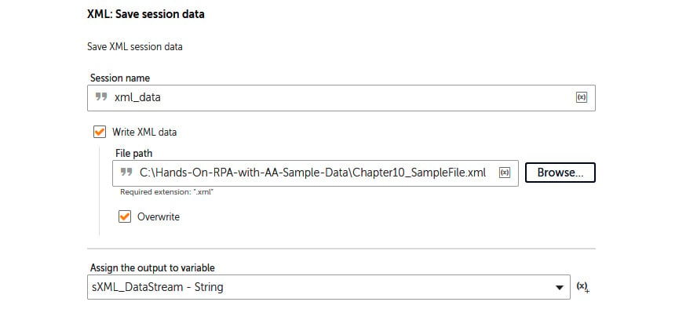
    

9.  Click on **Save**.

10. Also like we did previously, we must add a message box so that we
    can see what the bot is doing. Add a **Message box** action just
    below line **32**, ensuring it remains within the **Step** action on
    line **30**.

11. Set the following properties for the **Message Box** action on line
    **32**:

    **Enter the message box window title**: `Inserting a Node`

    **Enter the message to display**:
    `Node Inserted: format, value Paperback`

    The properties window should look like this:

    
    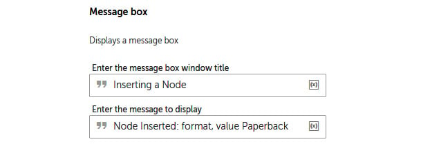
    

12. Click on **Save**.

Your **Step** action should look like this in the
development interface:

Now, run the bot; you may want to disable all the previous steps for
this. Once the bot has completed the task at hand, have a look at the
sample XML file. It should now have a new node `format` for
each record. This node should have the `Paperback` value
assigned to it. Now that you have learned how to insert nodes into an
XML file, in the next section, we will learn how to delete
`format` nodes from XML files.

Deleting XML nodes 
==================

Now that we\'ve learned how to insert nodes, it is
only fair that we have a walk-through on how to delete nodes. We
inserted the `format` node in the previous section. Just for
fun, we will be deleting it in this section. Since we will be deleting
it for all records, we will only be specifying the node as
`book/format`. If we wanted to delete the node for a specific
record only, we would specify this as `book[2]/format`.

Let\'s start this walk-through by executing the following steps:

1.  Add a **Step** action on line **34**, ensuring it is aligned with
    the previous **Step** action on line **30**.

2.  Set the **Title** property of the **Step** action on line **34** to
    `Delete a Node`. Your development interface should look
    like this:

    
    
    

3.  Click on **Save**.

4.  To delete the `format` node, drag the **Delete node**
    action from the **XML** package just below line **34**, ensuring it
    is within the **Step** action on line **34**.

5.  Set the following properties for the **XML: Delete node** action on
    line **35**:

    **Session name**: `xml_data`

    **XPath Expression**: `book/format`

    The properties window should look like this:

    
    
    

    In cases where you need to delete a node for a specific record, just
    specify the record number when setting the **XPath Expression**
    property, as shown in the following screenshot:

    
    
    

6.  Click on **Save**.

7.  As you may have guessed, we need to save the XML file. So, drag the
    **Save session data** action from the **XML** package just below
    line **35**, ensuring it remains within the **Step** action on line
    **34**.

8.  Set the following properties for the **XML:
    Save session data** action on line **36**:

    **Session name**: `xml_data`

    **Write XML data**: *Checked*

    **File path**:
    `C:\Hands-On-RPA-with-AA-Sample-Data\Chapter10_SampleFile.xml`

    **Overwrite**: *Checked*

    **Assign the output to variable**: **sXML\_DataStream - String**

    The properties window should look like this:

    
    
    

9.  Click on **Save**.

10. To add a message box so that we can check the file at this point,
    add a **Message box** action just below line **36**, ensuring it
    remains within the **Step** action on line **34**.

11. Set the following properties for the **Message box** action on line
    **37**:

    **Enter the message box window title**: `Deleting a Node`

    **Enter the message to display**:
    `Node Deleted: format, value Paperback`

    The properties window should look like this:

    
    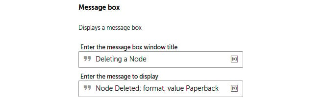
    

12. Click on **Save**.

    Your **Step** action should look like this in the development
    interface:

Now, collapse all these steps and run the bot. It should successfully
delete the `format` node. You will need to check the XML file
while the bot is waiting for a message box response. With that, we have
covered pretty much all the actions we can use when working with the
data within an XML file.

For those of you who use XPath functions to query XML data streams, in
the next section, we will look at how to execute XPath functions.

Executing XPath functions 
=========================

For those of you who use XPath functions, we will
be running a simple XPath function in this walk-through. We want to know
how many records are in our sample XML file. To get this information, we
can run the `count(//book)` XPath function. We will also need
a variable to assign the results of our function. All the results that
are returned from an XPath function are saved as a string. In this
walk-through, you will learn how easy it is to run XPath functions using
Automation Anywhere.

Let\'s start this walk-through by executing the following steps:

1.  To save the results of our XPath function, create a
    `String` type variable called `sBookCount`.

2.  Add a **Step** action on line **38**, ensuring it is aligned with
    the previous **Step** action on line **34**.

3.  Set the **Title** property of this **Step** action on line **38** to
    `Execute XPath Function`.

    Your development interface should look like this:

    
    
    

4.  Click on **Save**.

5.  To execute our XPath function, drag the **Execute XPath function**
    action from the **XML** package just below line **38**, ensuring it
    is within the **Step** action on line **38**.

6.  Set the following properties for the **XML: Execute XPath function**
    action on line **39**:

    **Session name**: `xml_data`

    **XPath Expression**: `count(//book)`

    **Assign the output to variable**: **sBookCount - String**

    The properties window should look like this:

    
    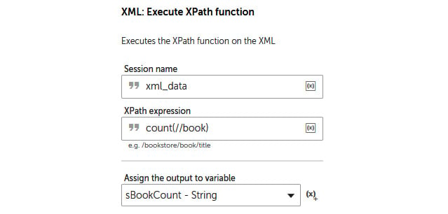
    

7.  Click on **Save**.

8.  Now, we need to add a message box so that we can view the results of
    our XPath function. Add a **Message box** action just below line
    **39**, ensuring it remains within the **Step** action on line
    **38**.

9.  Set the following properties for the **Message Box** action on line
    **40**:

    **Enter the message box window title**:
    `Execute XPath Function`

    **Enter the message to display**:
    `Number of Books: $sBookCount$`

    The properties window should look like this:

    
    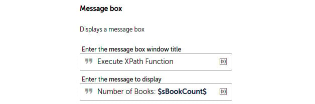
    
10. Click on **Save**.

    Your **Step** action should look like this in the development
    interface:

Now, for the final time, run the bot. You should get a result of
`5`. There are five book records in our sample XML file.
Collapse all the steps; your development interface should look like
this:

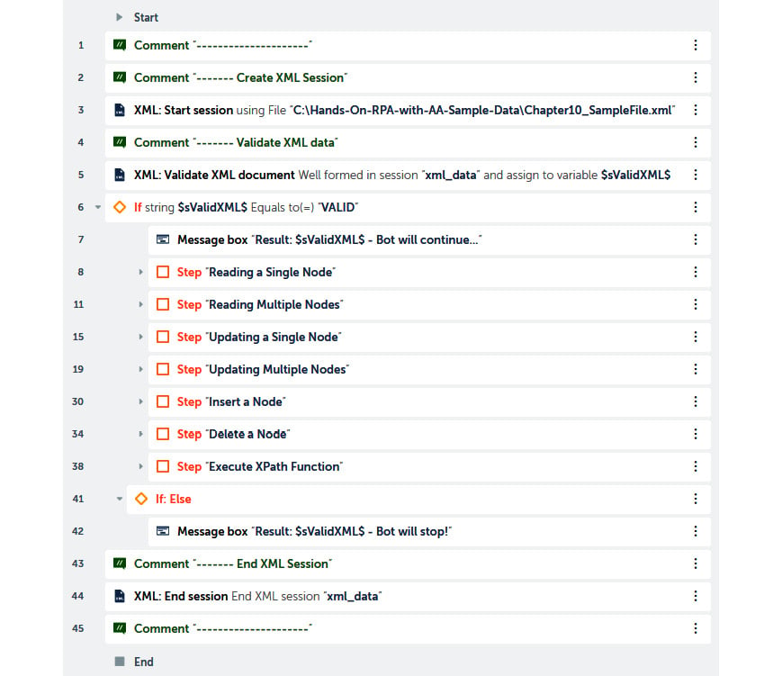

That is fantastic work! This bot demonstrates all
the different actions that are available for XML data streams.
Hopefully, you are now confident with dealing with XML data streams in
whatever scenario comes your way. You should also be able to appreciate
the relevance and importance of using **Step** actions. We have broken
our bot down into multiple stages to help you understand the logical
workflow of the different tasks being implemented.

Summary 
=======

This has been another hands-on lab. We have covered every action
that is available in the XML package and learned some great skills. This
lab\'s walk-throughs have taken you through a multitude of
exercises, including reading single and multiple nodes from XML data
streams. You also learned how to update single and multiple nodes within
XML files. Furthermore, you\'ve learned how to insert and delete nodes
and values from XML files. Apart from this, we built our bot so that it
executes XPath functions that return results. Since many applications
typically utilize the XML format, understanding how to work with these
files can help us discover many of the automation opportunities that are
available to us. Creating your own XML files can also be a good way to
store metadata for your bots.

In the next lab, we will learn how to apply RPA to Excel tasks. We
will cover the basics of opening, closing, and saving workbooks. We will
also be reading and updating data in Excel worksheets. We will also
cover reading and setting formulas, as well as how to run macros in our
macro-enabled workbooks.
