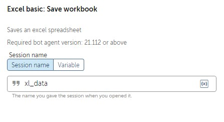
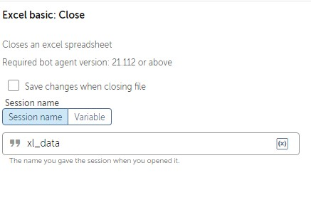
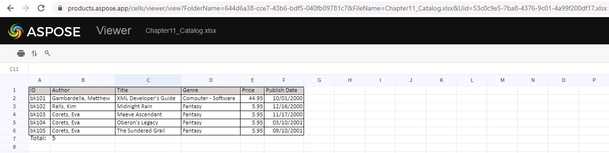

Lab 11: Automating Excel 
========================

In this lab, we will cover the following:

-   Opening, closing, and saving Excel workbooks
-   Reading and writing data within Excel worksheets

Technical requirements 
======================

In order to install the Automation Anywhere Bot agent, the following
requirements are necessary:

-   Web browser: Google Chrome
-   You must have completed registration for Automation Anywhere 
    Community Edition
-   You must have logged on successfully to Automation Anywhere 
    Community Edition
-   A successfully registered local device
-   Successfully downloaded sample data from GitHub

Opening, closing, and saving Excel workbooks 
============================================

The first thing we need to learn about Excel is how to open, close, and
save workbooks. So, we\'ll start off with a simple walk-through. You
will open an Excel workbook, save it, and close it. For this
walk-through, we will use the sample workbook
`Chapter11_Catalog.xlsx` from the GitHub repository.

Let\'s start this walk-through by executing the following steps:

1.  Log into **Control Room**.

2.  Create a new bot and call it `Lab 11 – Excel Basic` in
    the folder `\Bot\`.

3.  As always, we begin by adding some comments to use as a template for
    our bot. Add a new **Comment** action as
    `"---------------------"` on line **1** and click on
    **Save**.

4.  Add a new **Comment** action as
    `"------- Open Excel Worksheet"` on line **2** and click
    on **Save**.

5.  Add a new **Comment** action as
    `"------- Save Excel Worksheet"` on line **3** and click
    on **Save**.

6.  Add a new **Comment**
    action as
    `"------- Close Excel Worksheet"` on
    line **4** and click on **Save**.

7.  Add a new **Comment** action as `"---------------------"`
    on line **5** and click on **Save**. Our initial development
    interface should look like this:

    
    

8.  To open the workbook, drag the **Excel basic: Open** action just
    below line **2**.

9.  Set the following properties for the **Excel basic: Open** action on
    line **3**:

    **File path**: **Desktop file** -
    `C:\Hands-On-RPA-with-AA-Sample-Data\Chapter11_Catalog.xlsx`

    **Specific sheet name**: *Checked* - `Catalog`

    **Open in**: **Read-write mode**

    **Sheet contains a header**: *Checked*

    Select **Create Excel session** > `Local session`

    **Session name**: `xl_data`

    The properties should look like this:

    
    
    

10. Click on **Save**.

11. To save the workbook, drag the **Excel basic: Save workbook** action
    just below line **4**.

12. Set the following properties for the **Excel basic: Save workbook**
    action on line **5**:

    **Session name**: `xl_data`

    The properties should look like this:

    
    

13. Click on **Save**.

14. To close the workbook, drag the **Excel basic: Close** action just
    below line **6**.

15. Set the following properties for the **Excel basic: Close** action
    on line **7**:

    **Session name**: `xl_data`

    **Save changes when closing file**: *Unchecked*

    The properties should look like this:

    
    
    

16. Click on **Save**.

You could choose to save the
workbook when closing it by checking the **Save
changes when closing file** box. In some cases, you may need to save
your workbook intermittently without closing. In these instances, the
**Excel basic: Save workbook** action should be used.

We have looked at the basics---opening, saving, and closing an Excel
workbook. Your development window should look like this:

Now that we can open a workbook, the next stage is
to learn how to read data
from an Excel worksheet.

Reading and writing data within Excel worksheets 
================================================

Working with data using Excel is a key part of
most business roles. Having the ability to
automate tasks using Excel can free substantial time from our daily
routine. The following lab will look at reading datasets from
Excel followed by writing data to Excel. Like the previous lab, we
will be adding new steps at each stage to make our bot more structured.

Reading from Excel worksheets 
-----------------------------

Data in Excel is usually presented as a table,
which means it consists of a fixed set of columns with each row as a
record or transaction. The sample data file has a worksheet named
`Catalog`. The dataset looks like this:

**Note**: You can open excel spreadsheet `Chapter11_Catalog.xlsx` online using below website:

Excel Viewer Online: `https://products.aspose.app/cells/viewer`

In this walk-through, we want our bot to read each record and show the
`Title` and `Price` in a message box. To read the
record, we need a `Record` type variable, which will be named
`recBook`. Once a record is assigned to a `Record`
type variable, it is accessed using an index. The
index is zero-based so the first column is identified as index
`0`. In this case, the `Title` is the third column,
giving it an index of `2`, and the `Price` is the
fifth column, making it have an index value of `4`. We will
continue to build on our bot that we have already created.

Let\'s start this walk-through by executing the following steps:

1.  Create a `Record` type variable called
    `recBook`.

2.  Add a **Step** action just below line **3.**

3.  Set the **Title** property of the **Step** on line **4** as
    `Read Worksheet Records`.

4.  Click on **Save**.

    Your development interface should look like this:

    
    
    

5.  The `Catalog` worksheet has already been specified when we
    opened the workbook. To loop through each row from the dataset, add
    a **Loop** action just below line number **4** ensuring it remains
    within the **Step** on line **4**.

6.  Set the following properties for the **Loop**
    action on line **5**:

    **Loop Type\***: **For each row in worksheet**

    
    
    

    **Session name**: `xl_data`

    **Loop through**: **All rows**

    **Assign the current value to this variable**: **recBook - Record**

    The properties should look like this:

    
    
    

7.  Click on **Save**.

8.  That\'s all there is to it. All that\'s left is to create a message
    box to display the book `Title` and `Price`. Add
    a **Message box** action just below line **5**, ensuring it remains
    within the **Loop** on line **5**.

9.  Set the following properties for the **Message box** action on line
    **6**:

    **Enter the message box window title**:
    `Reading Excel Worksheet`

    **Enter the message to display**:
    `$recBook[2]$ - Price: $recBook[4]$`

    **Close message box after**: *Checked*

    **Seconds**: `4`

    The properties should look like this:

    
    
    

10. Click on **Save**, the development interface for this section should
    look like this:

You are now ready to test your bot. Go ahead and run it. It should read
each record from the `Catalog` worksheet, displaying the
`Title` and `Price`. 

Now that we can read from an
Excel worksheet, naturally, we also need to know how to write data back
to a spreadsheet. In the next section, we will
learn how to insert values into our Excel worksheet. As inserting values
into Excel can be a common task we do manually, knowing how to automate
this can be a valuable skill to have.

Writing to Excel worksheets 
---------------------------

In this walk-through, you will learn how to write
to Excel. We will continue building on our current bot. We know our
dataset consists of a list of books. The task of our bot is to write the
total number of books at the bottom of the list. To achieve this, we
will need two `Number` type variables: one to store the number
of records, and another to store the row to write the results to. As
there is a header row in our dataset, the first available blank row will
be `number of records + 2`. For each `Number` type
variable, a `String` will also be needed as output can only be
a string variable. As we are looping through the dataset, we will add an
**Increment** action to get the number of records.

Let\'s start this walk-through by executing the following steps:

1.  Create two `Number` type variables called
    `numRecCount` and `numResultRow`.

2.  Create two `String` type variables called
    `strRecCount` and `strResultRow`.

3.  To use an increment to get the number of records, add the **Number:
    Increment** action just below line **5**, ensuring it remains within
    the **Loop** on line **5**.

4.  Set the following properties for the **Number: Increment** action on
    line **6**:

    **Enter number**: `$numRecCount$`

    **Enter increment value**: `1`

    **Assign the output to variable**: **numRecCount - Number**

    The properties should look like this:

    
    
    

5.  Click on **Save**. The development interface for the **Loop** should
    look like this:

    
    
    

6.  Add a **Step** action just below line **7**, ensuring it is not
    indented within the **Loop** on line **5**.

7.  Set the **Title** property of this **Step** on
    line **8** as `Write to Excel`.

    Click on **Save** and collapse the **Step** on line **4**.

    Your development interface should look like this:

    
    
    

8.  To get the output row, we know it\'s
    `number of records + 2`; add the **Number: Assign** action
    just below line **8**, ensuring it remains within the **Step** on
    line **8**.

9.  Set the following properties for the **Number: Assign** action on
    line **9**:

    **Select the source string variable/ value**:
    `$numRecCount$ + 2`

    **Select the destination number variable**: **numResultRow**

    The properties should look like this:

    
    
    

10. Click on **Save**.

11. Now we have the output row and the records count, they both need to
    be converted to a `String` variable type. Add the
    **Number: To string** action just below line **9**, ensuring it
    remains within the **Step** on line **8**.

12. Set the following properties for the **Number: To string** action on
    line **10**:

    **Enter a number**: `$numRecCount$`

    **Enter number of digits after decimal**: `0`

    **Assign the output to variable**: **strRecCount**

    The properties should look like this:

    
    
    

13. Click on **Save**.

14. Do the same for the output row by adding another **Number: To
    string** action just below line **10**, ensuring it remains within
    the **Step** on line **8**.

15. Set the following properties for the **Number: To string** action on
    line **11**:

    **Enter a number**: `$numResultRow$`

    **Enter number of digits after decimal**: `0`

    **Assign the output to variable**: **strResultRow**

    The properties should look like this:

    
    
    

16. Click on **Save**.

17. To write this back to our worksheet, let\'s put the text
    `Total:` in column `A` at the end of our list.
    Add the **Excel basic: Set cell** action just below line **11**,
    ensuring it remains within the **Step** on line **8**.

18. Set the following properties for the **Excel basic: Set cell**
    action on line **12**:

    **Session name**: `xl_data`

    **Use**: **Specific cell** -- `A$strResultRow$`

    **Value to set**: `Total:`

    The properties should look like this:

    
    
    

19. Click on **Save**.

20. Finally, to write the record count to our worksheet in column
    `B`, add the **Excel basic: Set cell** action just below
    line **12**, ensuring it remains within the **Step** on line **8**.

21. Set the following properties for the **Excel basic: Set cell**
    action on line **13**:

    **Session name**: `xl_data`

    **Use**: **Specific cell** -- `B$strResultRow$`

    **Value to set**: `$strRecCount$`

    The properties should look like this:

    
    
    

22. Click on **Save**. The development interface
    should look like this:

All done, which is great. You can go ahead and run your bot. Your bot
should display the book title and price for every record. Once the bot
has completed, open the sample workbook. It should now also contain a
total count, as shown in the following screenshot:

Summary 
=======

The lab will have
given you the opportunity to build three individual bots all performing
different tasks. You should be confident with opening, closing, and
saving Excel documents, as well as reading and writing to them.

The next lab continues with Microsoft applications. In this case, we
will be looking at Microsoft Word. You will learn how to create and edit
documents. You will build a role-based bot that will include working
with Excel to generate Word documents.
