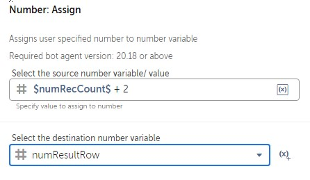
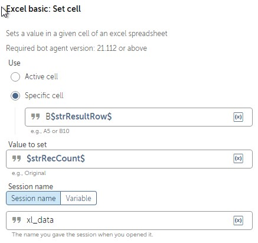
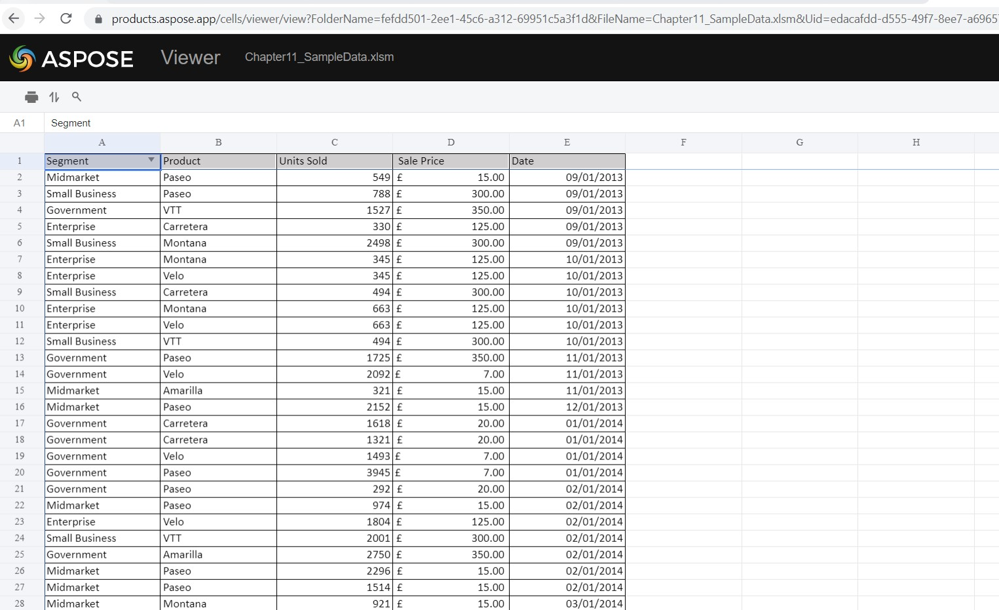
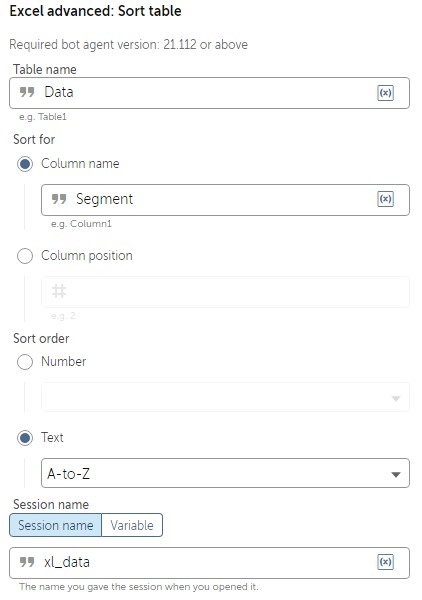

Lab 11: Automating Excel 
========================

In this lab, we will cover the following:

-   Opening, closing, and saving Excel workbooks
-   Reading and writing data within Excel worksheets
-   Working with data in Excel
-   Running macros

We will be taking the same approach as the previous lab, with a
number of walk-throughs exploring the different Excel actions. As
before, we will be building our bots with multiple steps to help us keep
things structured. We will be using the following packages:

The basic Excel package works with files with the `.xlsx`
extension only, whereas the advanced package works with Excel files with
extensions of `.xlsx`, `.xls`, `.xlsm`,
`.xlsb`, and `.csv`. As we progress through this
lab, we will be using both packages, and you will learn about the
different actions available from each one. We will start by creating a
bot that opens, saves, and closes an Excel workbook. For this, we will
be using the Excel basic package and the sample file that is part of the
GitHub repository that was downloaded previously.

Technical requirements 
======================

In order to install the Automation Anywhere Bot agent, the following
requirements are necessary:

-   Windows operating system version 7 or higher
-   A processor with a minimum speed of 3 GHz
-   A minimum of 4 GB RAM
-   At least 100 MB hard disk space
-   Web browser: Google Chrome
-   A minimum screen resolution of 1024\*768
-   An internet connection with a minimum speed of 10 Mbps
-   You must have completed registration for Automation Anywhere 
    Community Edition
-   You must have logged on successfully to Automation Anywhere 
    Community Edition
-   A successfully registered local device
-   Successfully downloaded sample data from GitHub

Opening, closing, and saving Excel workbooks 
============================================

The first thing we need to learn about Excel is how to open, close, and
save workbooks. So, we\'ll start off with a simple walk-through. You
will open an Excel workbook, save it, and close it. For this
walk-through, we will use the sample workbook
`Chapter11_Catalog.xlsx` from the GitHub repository.

Let\'s start this walk-through by executing the following steps:

1.  Log into **Control Room**.

2.  Create a new bot and call it `Lab 11 – Excel Basic` in
    the folder `\Bot\`.

3.  As always, we begin by adding some comments to use as a template for
    our bot. Add a new **Comment** action as
    `"---------------------"` on line **1** and click on
    **Save**.

4.  Add a new **Comment** action as
    `"------- Open Excel Worksheet"` on line **2** and click
    on **Save**.

5.  Add a new **Comment** action as
    `"------- Save Excel Worksheet"` on line **3** and click
    on **Save**.

6.  Add a new **Comment**
    action as
    `"------- Close Excel Worksheet"` on
    line **4** and click on **Save**.

7.  Add a new **Comment** action as `"---------------------"`
    on line **5** and click on **Save**. Our initial development
    interface should look like this:

    
    
    

8.  To open the workbook, drag the **Excel basic: Open** action just
    below line **2**.

9.  Set the following properties for the **Excel basic: Open** action on
    line **3**:

    **Session name**: `xl_data`

    **File path**: **Desktop file** -
    `C:\Hands-On-RPA-with-AA-Sample-Data\Chapter11_Catalog.xlsx`

    **Specific sheet name**: *Checked* - `Catalog`

    **Open in**: **Read-write mode**

    **Sheet contains a header**: *Checked*

    The properties should look like this:

    
    
    

10. Click on **Save**.

11. To save the workbook, drag the **Excel basic: Save workbook** action
    just below line **4**.

12. Set the following properties for the **Excel basic: Save workbook**
    action on line **5**:

    **Session name**: `xl_data`

    The properties should
    look like this:

    
    
    

13. Click on **Save**.

14. To close the workbook, drag the **Excel basic: Close** action just
    below line **6**.

15. Set the following properties for the **Excel basic: Close** action
    on line **7**:

    **Session name**: `xl_data`

    **Save changes when closing file**: *Unchecked*

    The properties should look like this:

    
    
    

16. Click on **Save**.

You could choose to save the
workbook when closing it by checking the **Save
changes when closing file** box. In some cases, you may need to save
your workbook intermittently without closing. In these instances, the
**Excel basic: Save workbook** action should be used.

We have looked at the basics---opening, saving, and closing an Excel
workbook. Your development window should look like this:

Now that we can open a workbook, the next stage is
to learn how to read data
from an Excel worksheet.

Reading and writing data within Excel worksheets 
================================================

Working with data using Excel is a key part of
most business roles. Having the ability to
automate tasks using Excel can free substantial time from our daily
routine. The following walk-throughs will look at reading datasets from
Excel followed by writing data to Excel. Like the previous lab, we
will be adding new steps at each stage to make our bot more structured.

Reading from Excel worksheets 
-----------------------------

Data in Excel is usually presented as a table,
which means it consists of a fixed set of columns with each row as a
record or transaction. The sample data file has a worksheet named
`Catalog`. The dataset looks like this:

In this walk-through, we want our bot to read each record and show the
`Title` and `Price` in a message box. To read the
record, we need a `Record` type variable, which will be named
`recBook`. Once a record is assigned to a `Record`
type variable, it is accessed using an index. The
index is zero-based so the first column is identified as index
`0`. In this case, the `Title` is the third column,
giving it an index of `2`, and the `Price` is the
fifth column, making it have an index value of `4`. We will
continue to build on our bot that we have already created.

Let\'s start this walk-through by executing the following steps:

1.  Create a `Record` type variable called
    `recBook`.

2.  Add a **Step** action just below line **3.**

3.  Set the **Title** property of the **Step** on line **4** as
    `Read Worksheet Records`.

4.  Click on **Save**.

    Your development interface should look like this:

    
    
    

5.  The `Catalog` worksheet has already been specified when we
    opened the workbook. To loop through each row from the dataset, add
    a **Loop** action just below line number **4** ensuring it remains
    within the **Step** on line **4**.

6.  Set the following properties for the **Loop**
    action on line **5**:

    **Loop Type\***: **For each row in worksheet**

    
    
    

    **Session name**: `xl_data`

    **Loop through**: **All rows**

    **Assign the current value to this variable**: **recBook - Record**

    The properties should look like this:

    
    
    

7.  Click on **Save**.

8.  That\'s all there is to it. All that\'s left is to create a message
    box to display the book `Title` and `Price`. Add
    a **Message box** action just below line **5**, ensuring it remains
    within the **Loop** on line **5**.

9.  Set the following properties for the **Message box** action on line
    **6**:

    **Enter the message box window title**:
    `Reading Excel Worksheet`

    **Enter the message to display**:
    `$recBook[2]$ - Price: $recBook[4]$`

    **Close message box after**: *Checked*

    **Seconds**: `4`

    The properties should look like this:

    
    
    

10. Click on **Save**, the development interface for this section should
    look like this:

You are now ready to test your bot. Go ahead and run it. It should read
each record from the `Catalog` worksheet, displaying the
`Title` and `Price`. Now that we can read from an
Excel worksheet, naturally, we also need to know how to write data back
to a spreadsheet. In the next section, we will
learn how to insert values into our Excel worksheet. As inserting values
into Excel can be a common task we do manually, knowing how to automate
this can be a valuable skill to have.

Writing to Excel worksheets 
---------------------------

In this walk-through, you will learn how to write
to Excel. We will continue building on our current bot. We know our
dataset consists of a list of books. The task of our bot is to write the
total number of books at the bottom of the list. To achieve this, we
will need two `Number` type variables: one to store the number
of records, and another to store the row to write the results to. As
there is a header row in our dataset, the first available blank row will
be `number of records + 2`. For each `Number` type
variable, a `String` will also be needed as output can only be
a string variable. As we are looping through the dataset, we will add an
**Increment** action to get the number of records.

Let\'s start this walk-through by executing the following steps:

1.  Create two `Number` type variables called
    `numRecCount` and `numResultRow`.

2.  Create two `String` type variables called
    `strRecCount` and `strResultRow`.

3.  To use an increment to get the number of records, add the **Number:
    Increment** action just below line **5**, ensuring it remains within
    the **Loop** on line **5**.

4.  Set the following properties for the **Number: Increment** action on
    line **6**:

    **Enter number**: `$numRecCount$`

    **Enter increment value**: `1`

    **Assign the output to variable**: **numRecCount - Number**

    The properties should look like this:

    
    
    

5.  Click on **Save**. The development interface for the **Loop** should
    look like this:

    
    
    

6.  Add a **Step** action just below line **7**, ensuring it is not
    indented within the **Loop** on line **5**.

7.  Set the **Title** property of this **Step** on
    line **8** as `Write to Excel`.

    Click on **Save** and collapse the **Step** on line **4**.

    Your development interface should look like this:

    
    
    

8.  To get the output row, we know it\'s
    `number of records + 2`; add the **Number: Assign** action
    just below line **8**, ensuring it remains within the **Step** on
    line **8**.

9.  Set the following properties for the **Number: Assign** action on
    line **9**:

    **Select the source string variable/ value**:
    `$numRecCount$ + 2`

    **Select the destination number variable**: **numResultRow -
    Number**

    The properties should look like this:

    
    
    

10. Click on **Save**.

11. Now we have the output row and the records count, they both need to
    be converted to a `String` variable type. Add the
    **Number: To string** action just below line **9**, ensuring it
    remains within the **Step** on line **8**.

12. Set the following properties for the **Number: To string** action on
    line **10**:

    **Enter a number**: `$numRecCount$`

    **Enter number of digits after decimal**: `0`

    **Assign the output to variable**: **strRecCount - String**

    The properties should look like this:

    
    
    

13. Click on **Save**.

14. Do the same for the output row by adding another **Number: To
    string** action just below line **10**, ensuring it remains within
    the **Step** on line **8**.

15. Set the following properties for the **Number: To string** action on
    line **11**:

    **Enter a number**: `$numResultRow$`

    **Enter number of digits after decimal**: `0`

    **Assign the output to variable**: **strResultRow - String**

    The properties should look like this:

    
    
    

16. Click on **Save**.

17. To write this back to our worksheet, let\'s put the text
    `Total:` in column `A` at the end of our list.
    Add the **Excel basic: Set cell** action just below line **11**,
    ensuring it remains within the **Step** on line **8**.

18. Set the following properties for the **Excel basic: Set cell**
    action on line **12**:

    **Session name**: `xl_data`

    **Use**: **Specific cell** -- `A$strResultRow$`

    **Value to set**: `Total:`

    The properties should look like this:

    
    
    

19. Click on **Save**.

20. Finally, to write the record count to our worksheet in column
    `B`, add the **Excel basic: Set cell** action just below
    line **12**, ensuring it remains within the **Step** on line **8**.

21. Set the following properties for the **Excel basic: Set cell**
    action on line **13**:

    **Session name**: `xl_data`

    **Use**: **Specific cell** -- `B$strResultRow$`

    **Value to set**: `$strRecCount$`

    The properties should look like this:

    
    
    

22. Click on **Save**. The development interface
    should look like this:

All done, which is great. You can go ahead and run your bot. Your bot
should display the book title and price for every record. Once the bot
has completed, open the sample workbook. It should now also contain a
total count, as shown in the following screenshot:

You should now be comfortable with reading and
writing to Excel. This is just the start of how you can automate Excel
using Automation Anywhere. As mentioned earlier, there are two Excel
packages available with Automation Anywhere. We have so far been looking
at the Excel basic package. In the next section, we\'ll move onto the
Excel advanced package and discover what other Excel tasks can be
automated. We\'ll start by looking at manipulating data within
worksheets, such as by inserting columns and formulas as well as sorting
data.

Working with data in Excel 
==========================

In the previous section, we looked at the basics
of Excel automation, such as opening, reading, writing, saving, and
closing Excel workbooks. In this section, we will explore the Automation
Anywhere Excel advanced package. The walk-through will involve building
a bot that performs a specific role. The bot will replace a manual task
that involves updating an Excel spreadsheet. The file used is available
as part of the GitHub repository `Chapter11_SampleData.xlsm`:

This file contains a data table of sales achieved by a fictitious
organization. In order to automate the file, we perform the following
steps:

1.  Open the Excel file `Chapter11_SampleData.xlsm`.
2.  Insert a new column after column `4`
    and call it `Amount` on the worksheet `Extract`.
3.  Add a formula in the new column to calculate the sales amount
    (`Units Sold` \* `Sale Price`).
4.  Sort the data table by the `Segment` column in ascending
    order.
5.  In the last row, add an `Amount` column and sum the
    `total value` of orders.
6.  Save and close the workbook.

Let\'s start this walk-through by executing the following steps:

1.  Log into **Control Room**.

2.  Create a new bot and call it `Lab 11 – Excel Advanced`
    in the `\Bot\` folder.

3.  Starting with the comments, add a new **Comment** action as
    `"---------------------"` on line **1** and click on
    **Save**.

4.  Add a new **Comment** action as
    `"------- Open Excel Worksheet"` on line **2** and click
    on **Save**.

5.  Add a new **Comment** action as
    `"------- Inserting a Column"` on line **3** and click on
    **Save**.

6.  Add a new **Comment** action as
    `"------- Setting Cell Formula"` on line **4** and click
    on **Save**.

7.  Add a new **Comment** action as `"------- Sorting Data"`
    on line **5** and click on **Save**.

8.  Add a new **Comment** action as
    `"------- Finding Empty Cell"` on line **6** and click on
    **Save**.

9.  Add a new **Comment** action as
    `"------- Save & Close Excel"` on line **7** and click on
    **Save**.

10. Add a new **Comment** action as `"---------------------"`
    on line **8** and click on **Save**. Our development interface
    should look like this:

    
    
    

11. To open the workbook, drag the **Excel advanced: Open** action just
    below line **2**.

12. Set the following properties for **Excel
    advanced: Open** action on line **3**:

    **Session name**: `xl_data`

    **File path**: **Desktop file** -
    `C:\Hands-On-RPA-with-AA-Sample-Data\Chapter11_SampleData.xlsm`

    **Specific sheet name**: *Checked* - `Extract`

    **Open in**: **Read-write mode**

    **Sheet contains a header**: *Checked*

    The properties should look like this:

    
    
    

13. Click on **Save**.

The bot will now have the file open, ready to start processing. The
first task is to insert a column.

Inserting a column 
------------------

We need to add a new column and call it
`Amount`. This will be column `E`, which is the
sixth column in our data table. The data table in the sample worksheet
is named `Data`:

1.  To insert a new column as column `5` called
    `Amount`, drag the **Excel advanced: Insert table column**
    action just below line **4**.

2.  Set the following properties for the **Excel advanced: Insert table
    column** action on line **5**:

    **Session name**: `xl_data`

    **Table name**: `Data`

    **Column name**: `Amount`

    **Column position**: `5`

    The properties should look like this:

    
    
    

3.  Click on **Save**.

The instruction to add the new column is now complete. We\'ll move on to
the next task -- setting a formula in the new
column.

Setting a cell formula 
----------------------

Now that there is a column called
`Amount` (column `E`), it needs to be populated. The
value of this column is to be set as `Units Sold` \*
`Sale Price`. We know the first row with data is
`2`, making the initial cell `E2`:

1.  To set the formula in cell `E2`, add the **Excel advanced:
    Set cell formula** action just below line **6**.

2.  Set the following properties for the **Excel advanced: Set cell
    formula** action on line **7**:

    **Session name**: `xl_data`

    **Set cell formula for**: **Specific cell** -- `E2`

    **Enter formula for specific cell**:
    `=[@[Units Sold]]*[@[Sale Price]]`

    The properties should look like this:

    
    
    

3.  Click on **Save**.

This formula will populate itself for each record
within the data table. As we are automating a specific manual task, the
next step in our criteria is to sort the data table.

Sorting data 
------------

A part of the requirement is to sort the data
table by the `Segment` column (column `A`). This
should be sorted in ascending order:

1.  To sort the data table, add the **Excel advanced: Sort table**
    action just below line **8**.

2.  Set the following properties for the **Excel advanced: Sort table**
    action on line **9**:

    **Session name**: `xl_data`

    **Table name**: `Data`

    **Sort for**: **Column name** - `Segment`

    **Sort order**: **Text** - **A-to-Z**

    The properties should look like this:

    
    
    

3.  Click on **Save**.

The data table should now be sorted as required. The next step is to add
the total sum of sales at the end of the data
table.

Finding empty cells 
-------------------

To add the sum of the `Amount` column,
we need to identify which cell to enter this sum formula into. We can
get this by identifying the first empty row, which would be the target
row for our sum. We already know the column is `E` as we
created this earlier. A `String` type variable will be needed
to store the cell address:

1.  Create a `String` type variable and call it
    `strTotalCell`.

2.  To get the first empty cell in column `E`, add the **Excel
    advanced: Find next empty cell** action just below line **10**.

3.  Set the following properties for the **Excel advanced: Find next
    empty cell** action on line **11**:

    **Session name**: `xl_data`

    **Transverse by**: **column**

    **Start from**: **specific cell**

    **Cell address**: `E1`

    **Assign the output to variable**: **strTotalCell - String**

    The properties should look like this:

    
    
    

4.  Click on **Save**.

5.  Now we have the cell address for the total sales amount, we can add
    the sum formula by dragging the **Excel advanced: Set cell formula**
    action just below line **11**.

6.  Set the following properties for the **Excel advanced: Set cell
    formula** action on line **12**:

    **Session name**: `xl_data`

    **Set cell formula for**: **Specific cell** --
    `$strTotalCell$`

    **Enter formula for specific cell**: `=SUM(Data[Amount])`

    The properties should look like this:

    
    
    

7.  Click on **Save**.

Great -- you have now instructed your bot to calculate the total sum of
sales and to set this value in the last row of the data table. All that
is left to do is to close our workbook.

Saving and closing the workbook 
-------------------------------

The last task for the bot to perform is to save
and close our worksheet. As the workbook was
opened using the **Excel Advanced** package, it needs to be closed with
it too:

1.  To save and close the workbook, drag the **Excel advanced: Close**
    action just below line **13**.

2.  Set the following properties for the **Excel advanced: Close**
    action on line **14**:

    **Session name**: `xl_data`

    **Save changes when closing file**: *Checked*

    The properties should look like this:

    
    
    

3.  Click on **Save**.

Our bot is now complete and should be good to go and perform our task to
completion. We have looked at some of the more advanced actions
available for Excel. This has included actions such as inserting columns
and setting formulas. Your development window should look like this:

That\'s all done; time to run your bot. Your bot
should perform all the tasks seamlessly and edit
the sample file by inserting a new column and populating it with a
formula. It should also add the sum at the bottom of the data table.
Once you have executed the bot, open the sample file. It should look
like this:

Hopefully, you will now be confident with performing numerous Excel
tasks using Automation Anywhere. A key feature of Excel is having the
ability to create and run macros. As macros are
used widely in business, Automation Anywhere can
also be used to trigger Excel macros. In the next section, you will
learn how to run macros. This will be ideal if you are automating a
manual process that involves running Excel macros.

Running macros 
==============

In this section, we will learn about running Excel
macros. The sample file has a macro called
`procFilterSegment`. This macro will filter the
`Segment` column by the given argument. In the following
walk-through, the bot will open the sample workbook in read-only mode
and run this macro. We will send an `Enterprise` argument to
the macro. This should result in the bot applying a filter of
`Enterprise` to the `Segment` column.

Let\'s start this walk-through by executing the following steps:

1.  Log into **Control Room**.

2.  Create a new bot and call it `Chapter11 – Excel Macro` in
    the `\Bot\` folder.

3.  Starting with the comments, add a new **Comment** action as
    `"---------------------"` on line **1** and click on
    **Save**.

4.  Add a new **Comment** action as
    `"------- Open Excel Worksheet"` on line **2** and click
    on **Save**.

5.  Add a new **Comment** action as `"------- Run Macro"` on
    line **3** and click on **Save**.

6.  Add a new **Comment** action as `"---------------------"`
    on line **4** and click on **Save**. Our
    development interface should look like this:

    
    
    

7.  To open the workbook, drag the **Excel advanced: Open** action just
    below line number **2**.

8.  Set the following properties for the **Excel advanced: Open** action
    on line **3**:

    **Session name**: `xl_data`

    **File path**: **Desktop file** -
    `C:\Hands-On-RPA-with-AA-Sample-Data\Chapter11_SampleData.xlsm`

    **Specific sheet name**: *Checked* -- `Extract`

    **Open in**: **Read-only mode**

    **Sheet contains a header**: *Checked*

    The properties should look like this:

    
    
    

9.  Click on **Save**.

10. To run the macro `procFilterSegment` and pass an argument
    with it, drag the **Excel advanced: Run macro** action just below
    line **4**.

11. Set the following properties for the **Excel advanced: Run macro**
    action on line **5**:

    **Session name**: `xl_data`

    **Macro name**: `procFilterSegment`

    **Macro arguments**: `Enterprise`

    The properties should look like this:

    
    
    

12. Click on **Save**. The development interface
    should look like this:

It\'s testing time again; try running your bot. You will find it passes
the argument through to the macro that applies the filter to the
`Segment` column. Now you should be confident
with using Automation Anywhere to automate your
Excel-based manual tasks.

Summary 
=======

A wide selection of actions from both the Excel basic and advanced
package has been covered in this lab. The walk-throughs will have
given you the opportunity to build three individual bots all performing
different tasks. You should be confident with opening, closing, and
saving Excel documents, as well as reading and writing to them. The
skills gained should also include working with data within Excel
documents, such as sorting, inserting columns, adding formulas, as well
as running macros.

The next lab continues with Microsoft applications. In this case, we
will be looking at Microsoft Word. You will learn how to create and edit
documents. You will build a role-based bot that will include working
with Excel to generate Word documents.
