Lab 12: Automation Using Word 
========================================================

In this lab, we will continue working with applications as we learn
about how tasks with Word can be automated. This lab will take a
different approach: we will build a bot that performs a complete user
role. This role involves automation with Excel and Word working
together. The walk-through is designed to mimic a real-life business
role scenario. We will be using the following packages:

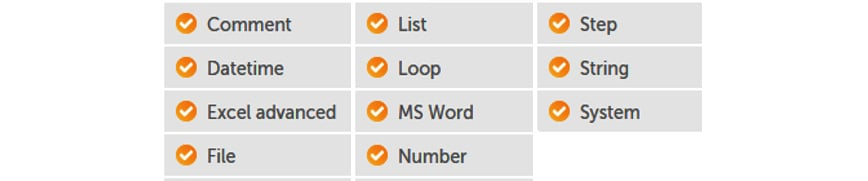

This lab will take you through a fictitious user role. The role is
based in a finance company within the loans approval department. The
walk-through will allow you to understand how to apply Excel and Word
automation in a real-life scenario. We will build a bot that performs
the current manual process end to end.

In this lab, we will cover the following topics:

-   Understanding the manual process
-   Creating new Word documents
-   Inserting text in Word documents
-   Inserting paragraphs in Word documents
-   Replacing text in Word documents

Technical requirements 
======================

In order to install the Automation Anywhere Bot agent, the following
requirements are necessary:

-   Google Chrome
-   Completed registration with Automation Anywhere  Community
    Edition
-   Successful login to Automation Anywhere  Community Edition
-   A successfully registered local device
-   Successfully downloaded sample data from GitHub

Understanding the manual process 
================================

As this walk-through will take you through a
business role, it is essential that we understand the manual process
that needs to be automated. The current manual process for the user is
as follows:

1.  An administrator receives an Excel workbook on a daily basis. This
    document contains a list of clients whose loans have been approved.
2.  The administrator is tasked with creating a confirmation letter
    using Word for each client on the Excel worksheet and saving the
    document with the client\'s reference number as the filename.
3.  A Word document is provided as a template, but two additional
    paragraphs have to be inserted: one has the company telephone number
    and the other is the signatory.
4.  The administrator also has to date the letter with the system date.
5.  The administrator also inserts the loan details at specific
    placeholders in the Word document.

The files used for this walk-through are available
in the GitHub repository. The Word template file is
`Chapter12_Template.docx`, and the Excel source data file is
`Chapter12_LoanData.xlsx`. The column names in the Excel
worksheet are also the names of the placeholders in the Word template
document. To automate this task, we\'ll map the process for our bot.

From this role specification, the process for our bot is shown in the
following figure:

Now that we know what our bot needs to perform, we
can start building it. We will start by adding the comments by breaking
the process down into three sections: *reading the source data*,
*creating the output letter*, and finally, *updating the output letter*.
We will also use the **Step** action to further break the process down
into subsections.

Let\'s start this walk-through by executing the following steps:

1.  Log in to **Control Room**.

2.  Create a new bot and call it
    `Lab 12 – Word Automation` in the `\Bot\`
    folder.

3.  Add a new **Comment** action as `"---------------------"`
    on line **1** and click on **Save**.

4.  Add a new **Comment** action as
    `"------- Read source data"` on line **2** and click on
    **Save**.

5.  Add a new **Comment** action as
    `"------- Create output letter"` on line **3** and click
    on **Save**.

6.  Add a new **Comment** action as
    `"------- Update output letter"` on line **4** and click
    on **Save**.

7.  Add a new **Comment** action as `"---------------------"`
    on line 5 and click on **Save**. Your initial
    development interface should look like this:

    
    
    

8.  To replicate the process map, add a step just below line **2** and
    set the **Title** property to `Open Excel Workbook`, and
    click on **Save**.

9.  Add a step just below line **3**, ensuring it is aligned with the
    previous step, set the **Title** property to
    `Get Column Names`, and click on **Save**.

10. Add a step just below line **4**, ensuring it is aligned with the
    previous step, set the **Title** property to
    `Read each loan record`, and click on **Save**.

11. Drag the **Comment** actions on lines **6** and **7** so that they
    are indented within the step on line **5** and click on **Save**.

12. Add a step just below line **6**, ensuring it is aligned with the
    **Comment** action on line **6**, set the **Title** property to
    `Create new word document`, and click on **Save**.

13. Add a step just below line **8**, ensuring it is aligned with the
    **Comment** action on line **7**, set the **Title** property to
    `Insert Date`, and click on **Save**.

14. Add a step just below line **9**, ensuring it is aligned with the
    previous step, set the **Title** property to
    `Add Paragraphs`, and click on **Save**.

15. Add a step just below line **10**, ensuring it
    is aligned with the previous step, set the **Title** property to
    `Replace placeholders with values`, and click on **Save**.

16. Add a step just below line **11**, ensuring it is aligned with the
    step on line **5**, set the **Title** property to
    `Close Excel Workbook`, and click on **Save**. The
    development interface should look like this:

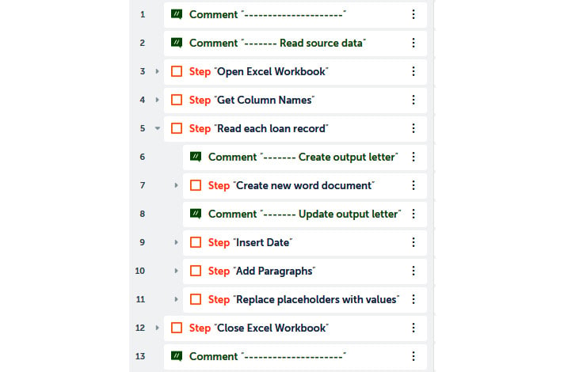

Looking good, we now have our bot design built.
There are a number of steps that need to be built for this bot, so
having a skeleton design ensures the bot aligns with the specification
throughout the build process.

In the next section, we can start with the first task of the bot, which
is to start reading the source data.

Reading the source data 
-----------------------

The source data is stored in the
`Chapter12_LoanData.xlsx` file, which has a worksheet called
`Approved`. The data looks as shown in the following
screenshot:

You will notice the column names are within square brackets. The reason
for this is that they also act as the placeholder text within the Word
template file. This ensures that only the specified placeholders are
updated in the output Word letter. This is achieved using a **Replace**
action; the column name text in the letter is replaced by the values
derived from the Excel worksheet. In the next section, we will start by
opening the source data worksheet.

### Opening the workbook

As we have already covered Excel worksheets, this
should be pretty easy. In this instance, we will be using the Excel
advanced package, as we will need actions such as **Read row**, which is
only available in this package.

Let\'s continue the walk-through to build our bot by executing the given
steps:

1.  To open the source data workbook, add the **Excel advanced: Open**
    action just below line **3**, ensuring it is within the step on line
    **3**.

2.  Set the following properties for the **Excel advanced: Open** action
    on line **4**:

    **Session name**: `xl_data`

    **File path**: **Desktop file** --
    `C:\Hands-On-RPA-with-AA-Sample-Data\Chapter12_LoanData.xlsx`

    **Specific sheet name**: *Checked* -- `Approved`

    **Open in**: **Read-only mode**

    **Sheet contains a header**: *Checked*

    The properties should look like this:

    
    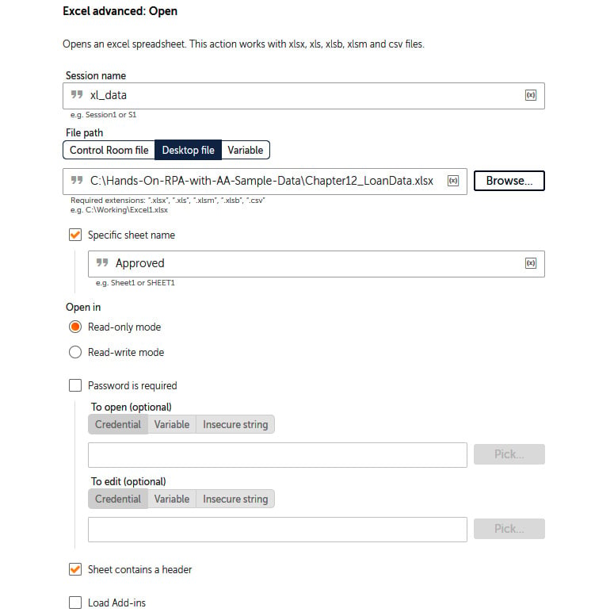
    

3.  Click on **Save**.

You should be a dab hand at opening Excel documents as you\'ve done it a
few times now.

As the column headers are also the placeholder names, we will need to
save them to a variable. This takes us to the next section, where we
will read all the column names and assign them to
a variable.

### Getting column names

The column names are all in the first row of the
`Approved` worksheet. The ideal data type to use to store a
range is a `List` type variable. To get the column names, we
will create a `List` type variable and assign the first row to
it. Each value from the `List` type variable can then be
accessed via the index number. The action to read a complete row is only
available in the Excel advanced package, which is why this was used to
open our worksheet:

1.  Create a `List` type variable to store our column names
    and name it `lstColumns`.

2.  To read the entire first row to our `List` type variable,
    add the **Excel advanced: Read row** action just below line **5**,
    ensuring it is within the step on line **5**.

3.  Set the following properties for the **Excel advanced: Read row**
    action on line **6**:

    **Session name**: `xl_data`

    **Cell option**: **From specific cell**

    **Cell address**: `A1`

    **Read full row**: *Checked*

    **Read option**: **Read cell value**

    **Assign the output to variable**: **lstColumns -- List of Strings**

    The properties should look like this:

    
    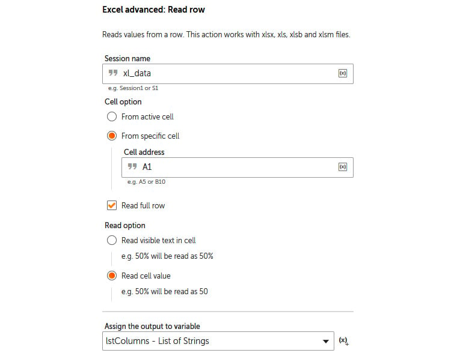
    

4.  Click on **Save**. The development interface
    for this section should look like this:

The bot is set to open the source worksheet. Once it is open, it needs
to read the data. The data should be read one record at a time. For each
record, the bot will process the loan approval by
creating the Word letter, before moving on to the
next record.

### Reading the loan records

To read each row from our worksheet, a **Loop**
action needs to be added. A `Record` type variable will also
be required to store the row values. Just like with the `List`
type variable, the values can be accessed via an index number:

1.  Create a `Record` type variable to store our Excel loan
    record and name it `recLoan`.

2.  To read each row, we use a loop by adding the **Loop** action just
    below line **7**, ensuring it is within the step on line **7**.

3.  Set the following properties for the **Loop** action on line **8**:

    **Iterator**: **For each row in worksheet** (*Excel advanced*)

    **Session name**: `xl_data`

    **Loop through**: **All rows**

    **Read option**: **Read cell value**

    **Assign the current value to this variable**: **recLoan - Record**

    The properties should look like this:

    
    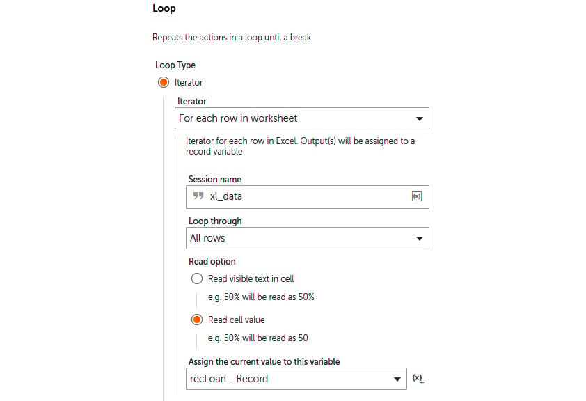
    

4.  Click on **Save**.

5.  Creating and updating the Word document needs
    to be performed for each row in Excel. To achieve this, drag lines
    **9** to **14** so that they are within the **Loop** action just
    created on line **8**.

6.  Click on **Save**. The development interface for this section should
    look like this:

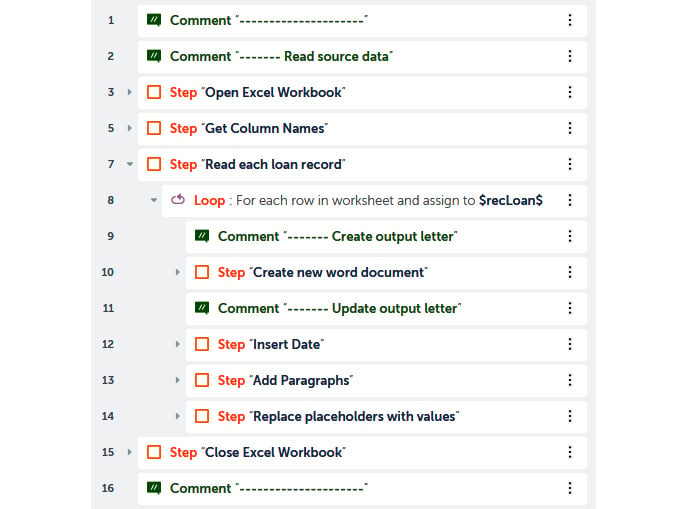

The interaction with Excel is now complete. The
bot reads the column names and loops through each data row. The column
names are assigned to a `List` variable and the data row to a
`Record` type variable.

The next section is to start working with Word. The first task is to
create our Word document from the given template. As we have this
template, our approach is to just copy this file and name it
`Reference number` from our Excel worksheet.

Creating an output letter 
-------------------------

We have a Word document named
`Chapter12_Template.docx` to use as a template. The document
looks as shown in the following figure:

The placeholders are clearly identified as they
are wrapped within square brackets. These match the related column names
from the Excel worksheet. The bot needs to create a new Word document
using the template file and save it as `Reference number`,
which is the first column in the Excel data. As the data has a
zero-based index, the first column will be identified with an index of
`0`. As we will be making further updates to the new Word
document, it makes sense to store the file path and name to a variable;
a `String` type will be needed for this.

Let\'s continue with creating our Word document by following the given
steps:

1.  Create a `String` type variable to store the file path and
    name of the new Word letter. Name it `strLoanLetter`.

2.  To assign the new filename as the reference for our record, add the
    **String: Assign** action just below line **10**, ensuring it is
    within the step on line **10**.

3.  Set the following properties for the **String: Assign** action on
    line **11**:

    **Select the source string variable(s)/value**:
    `C:\Hands-On-RPA-with-AA-Sample-Data\Chapter12_$recLoan[0]$.docx`

    **Select the destination string variable**: **strLoanLetter -
    String**

    The properties should look like this:

    
    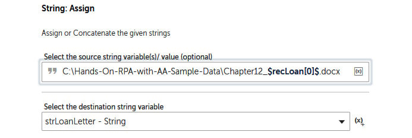
    

4.  Click on **Save**.

5.  The best way to create the new file is to make a copy of the
    template file. We do this by adding the **File: Copy** action just
    below line **11**, ensuring it is within the step on line **10**.

6.  Set the following properties for the **File: Copy** action on line
    **12**:

    **Source file**:
    `C:\Hands-On-RPA-with-AA-Sample-Data\Chapter12_Template.docx`

    **Destination file/folder**: `$strLoanLetter$`

    **Overwrite existing files**: *Checked*

    The properties should look like this:

    
    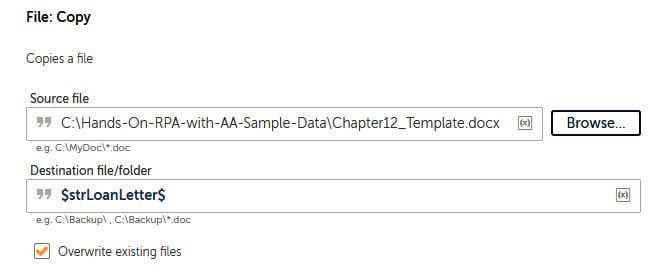
    

7.  Click on **Save**.

    A new Word document should now be created and
    named as the reference number for each specific record. The
    development interface for this section should look like this:

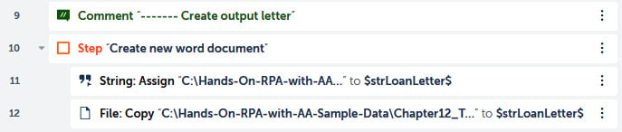

Great progress! We are now ready to move on to the next section. We have
a new Word letter; it now needs to be edited and
updated. The first update is to add the system date to the letter.

Updating the output letter 
--------------------------

Updating the letter includes adding the date.
There is a bookmark called `bmDate` for the date\'s location
in the Word letter. After inserting the date, the bot is tasked with
adding a couple of paragraphs. One has the contact telephone and office
opening times. The other is the signatory footer for the letter. In the
next section, we start by inserting the date.

### Inserting text

The system date can be retrieved from the system
variable called `Date`. This variable is in
`Datetime` format, so it will need to be converted into a
`String` type in order for us to insert it. For this, a
`String` type variable will be needed. Let\'s continue
building our bot further and insert the date by following the given
steps:

1.  Create a `String` type variable to store the system date.
    Name this variable `strDate`.

2.  To assign the system date to our variable, add the **Datetime: To
    string** action just below line **14**, ensuring it is within the
    step on line **14**.

3.  Set the following properties for the **Datetime: To string** action
    on line **15**:

    **Source date and time variable**: **System:Date - Datetime**

    **Select date time format**: **Custom format** -- **d MMM YYYY**

    **Assign the output to a variable**: **strDate - String**

    The properties should look like this:

    
    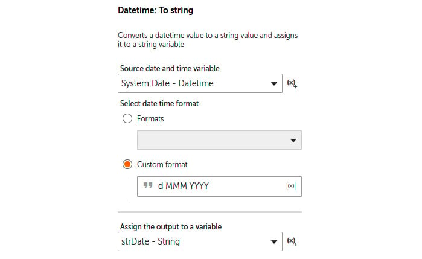
    

4.  Click on **Save**.

5.  We now have our system date assigned to a
    variable. To insert this into the `bmDate` bookmark in the
    Word letter, add the **MS Word: Insert Text** action just below line
    **15**, ensuring it is within the step on line **14**.

6.  Set the following properties for the **MS Word: Insert Text** action
    on line **16**:

    **Select the Word document**: **Desktop file** --
    `$strLoanLetter$`

    **Enter Bookmark Name**: `bmDate`

    **Enter Text to be Inserted at Bookmark position**:
    `$strDate$`

    The properties should look like this:

    
    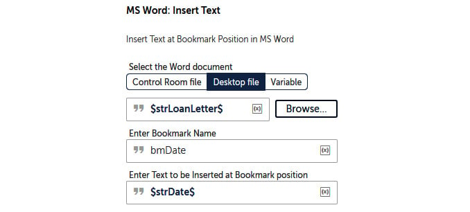
    

7.  Click on **Save**. The development interface
    for this section should look like this:

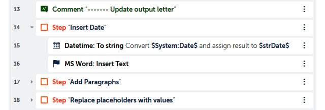

The bot will now insert the system date at the correct location. The
walk-through will now continue with updating the Word letter. In the
next section, we will look at adding the contact
details and signatory paragraphs to our Word
letter.

### Adding paragraphs

We have just inserted the date in the previous
section. To insert text, a predefined bookmark needs to be present
within the target document. Now, we will move on to adding paragraphs.
The paragraphs are appended to the target document, so no location
information is needed. Only the content of the paragraph and the target
file are needed. In our scenario, the office opening times and number
and the signatory details need to be added as paragraphs. The paragraphs
that need to be added to our loan approval letter are as follows:

There are six paragraphs that need to be inserted into the loan approval
letter. Each red block contains the contents of each paragraph. A blank
paragraph will result in a carriage return in our letter.

Let\'s continue with adding paragraphs to our bot by following these
steps:

1.  To add the first paragraph, add the **MS Word: Add Paragraph**
    action just below line **17**, ensuring it is within the step on
    line **17**.

2.  Set the following properties for the **MS Word: Add Paragraph**
    action on line **18**:

    **Select the Word document**: **Desktop file** --
    `$strLoanLetter$`

    **Please write paragraph or select variable**:
    `Please check that all the details are correct and if you wish to proceed, please contact our pre-approval customer service office on 0800 000 0000. Lines are open Monday to Friday 9:00 – 17:00`.

    The properties should look like this:

    
    
    

3.  Click on **Save**.

4.  Adding the second paragraph works pretty much the same as the first.
    Add the **MS Word: Add Paragraph** action just below line **18**,
    ensuring it is within the step on line **17**.

5.  Set the following properties for the **MS Word: Add Paragraph**
    action on line **19**:

    **Select the Word document**: **Desktop file** --
    `$strLoanLetter$`

    **Please write paragraph or select variable**: (*add a few spaces
    only*)

6.  Click on **Save**.

7.  Add the third paragraph by adding another **MS Word: Add Paragraph**
    action just below line **19**, ensuring it is within the step on
    line **17**.

8.  Set the following properties for the **MS Word: Add Paragraph**
    action on line **20**:

    **Select the Word document**: **Desktop file** --
    `$strLoanLetter$`

    **Please write paragraph or select variable**:
    `Yours sincerely,`

9.  Click on **Save**.

10. Add the fourth paragraph by adding another
    **MS Word: Add Paragraph** action just below line **20**, ensuring
    it is within the step on line **17**.

11. Set the following properties for the **MS Word: Add Paragraph**
    action on line **21**:

    **Select the Word document**: **Desktop file** --
    `$strLoanLetter$`

    **Please write paragraph or select variable**: (*add a few spaces
    only*)

12. Click on **Save**.

13. Add the fifth paragraph by adding another **MS Word: Add Paragraph**
    action just below line **21**, ensuring it is within the step on
    line **17**.

14. Set the following properties for the **MS Word: Add Paragraph**
    action on line **22**:

    **Select the Word document**: **Desktop file** --
    `$strLoanLetter$`

    **Please write paragraph or select variable**:
    `Jack Money`

15. Click on **Save**.

16. Add the last paragraph by adding another **MS Word: Add Paragraph**
    action just below line **22**, ensuring it is within the step on
    line **17**.

17. Set the following properties for the **MS Word: Add Paragraph**
    action on line **23**:

    **Select the Word document**: **Desktop file** --
    `$strLoanLetter$`

    **Please write paragraph or select variable**:
    `Loans Approval Manager`

18. Click on **Save**. Your development interface
    for this section should look like this:

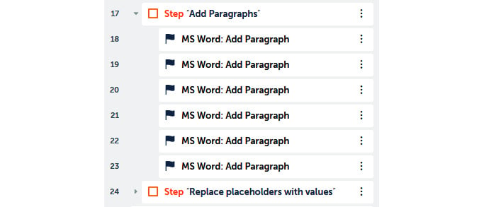

All the paragraphs are added -- great work. There is one more Word
action that we will look at; this is replacing text. The final and most
crucial update we need to make to our loan\'s approval letter is to put
the actual client and loan details in. In the next section, we will
learn how to apply the **Replace Text** action using Automation
Anywhere. This would have been a pretty time-consuming and tedious task
to perform manually, so automating this will
definitely help the administrator perform their role more effectively.

### Replacing text

All the placeholders within the loan approvals
letter need to be replaced with data from our source worksheet. The
column names that are stored in our `lstColumns`
`List` variable will be used as our placeholder text. The
actual value to replace the placeholder is assigned to our
`recLoan Record` type variable. A **Loop** action will be
needed to iterate through the list of column names. In order to iterate
through the loop, we will need a `Number` type variable to be
deployed as the index. Two further `String` type variables
will be needed for storing the current column name and current value.

Let\'s continue building our bot to replace the placeholder text with
actual values from the data worksheet:

1.  Create a `Number` type variable called
    `numColumnIndex` to be used as our index.

2.  Create two `String` type variables for the value and
    placeholder text. Call them `strPlaceHolder` and
    `strValue`.

3.  Before we add our loop, we will have to initialize our index to
    `-1` so that we can increment it as it loops through each
    column. Do this by adding the **Number: Assign** action just below
    line **24**, ensuring it is within the step on line **24**.

4.  Set the following properties for the **Number: Assign** action on
    line **25**:

    **Select the source string variable/ value**: `-1`

    **Select the destination number variable**: **numColumnIndex -
    Number**

    The properties should look like this:

    
    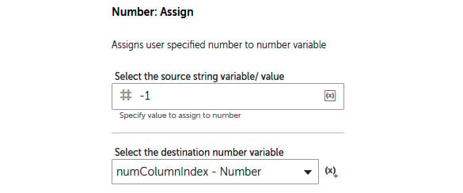
    

5.  Click on **Save**.

6.  To loop through each item in the record and
    assign it to the `strValue` variable, add the **Loop**
    action just below line **25**, ensuring it is within the step on
    line **24**.

7.  Set the following properties for the **Loop** action on line **26**:

    **Iterator**: **For each value in record**

    **Record variable**: **recLoan - Record**

    **Assign the current value to this variable**: **strValue - String**

    The properties should look like this:

    
    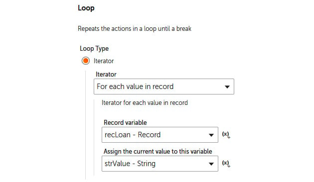
    

8.  Click on **Save**.

9.  Now, to start processing each value, we need
    to increment the index by `1`. Let\'s do this by adding
    the **Number: Increment** action just below line **26**, ensuring it
    is within the **Loop** action on line **26**.

10. Set the following properties for the **Number: Increment** action on
    line **26**:

    **Enter number**: `$numColumnIndex$`

    **Enter increment value**: `1`

    **Assign the output to variable**: **numColumnIndex - Number**

    The properties should look like this:

    
    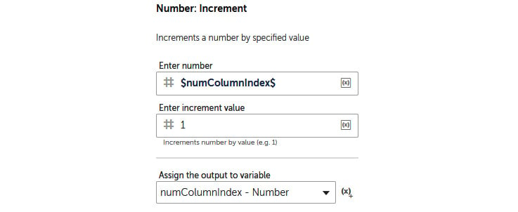
    

11. Click on **Save**.

12. To assign our placeholder variable with the
    current column name from our `List` variable, add the
    **List: Get item** action just below line **27**, ensuring it is
    within the **Loop** action on line **26**.

13. Set the following properties for the **List: Get item** action on
    line **28**:

    **List variable**: **lstColumns - List**

    **Index number**: `$numColumnIndex$`

    **Assign the output to variable**: **strPlaceHolder - String**

    The properties should look like this:

    
    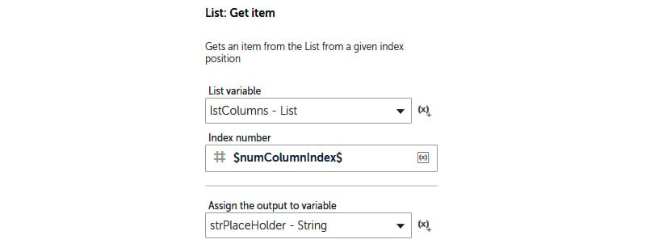
    

14. Click on **Save**.

15. The actual replacing of the placeholder text
    with the `strValue` variable is done by adding the **MS
    Word: Replace Text** action just below line **28**, ensuring it is
    within the **Loop** action on line number **26**.

16. Set the following properties for the **MS Word: Replace Text**
    action on line **29**:

    **Select the Word document**: **Desktop file** --
    `$strLoanLetter$`

    **Enter Text to be replaced**: `$strPlaceHolder$`

    **Enter new Text**: `$strValue$`

    The properties should look like this:

    
    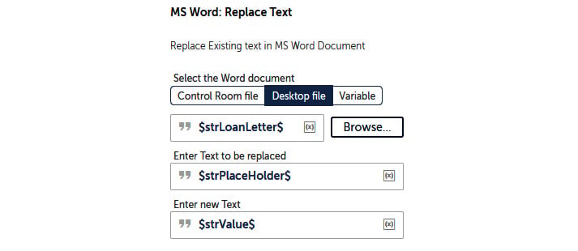
    

17. Click on **Save**.

18. The final task is to close the session that we opened at the start.
    Add the **Excel advanced: Close** action just below line **30**,
    ensuring it is within the step on line **30**.

19. Set the following properties for the **Excel advanced: Close**
    action on line **31**:

    **Session name**: `xl_data`

    **Save changes when closing file**: *Unchecked*

    The properties should look like this:

    
    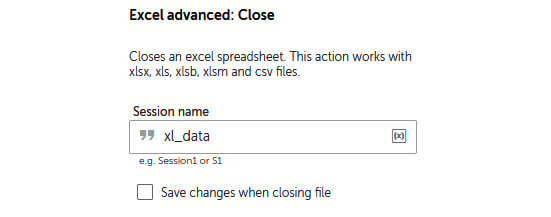
    

20. Click on **Save**.

That\'s it, you can relax now, as it\'s all done.
Your bot is now complete. The development interface for the last section
should look like this:

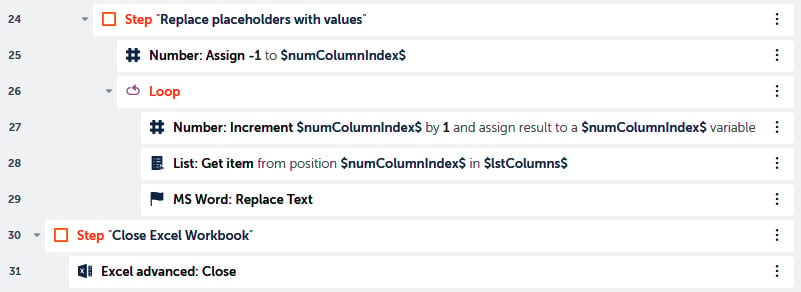

You must be itching to test your bot. When you run the bot, it will
create five Word documents in the repository folder. Each file will be a
letter in Word with client and loan details from the loan data
worksheet.

Summary 
=======

In this lab, we learned how Automation Anywhere can be used to
automate tasks using Word. We learned how to add paragraphs, insert text
using bookmarks, and replace text. The bot that we built in this lab
has also shown us how Excel and Word can be used together to fully
automate a business role end to end. All this automation provides a more
effective way to perform the same task without the risk of errors and
also increases efficiency as it reduces the manual effort involved.

We will continue working with automating applications in the next
lab. We will be learning all about using email. You will learn how
to connect to mailboxes, read emails, and reply to emails, as well as
how to create and send emails. This is not all; you will also learn how
to work with email folders and attachments.
