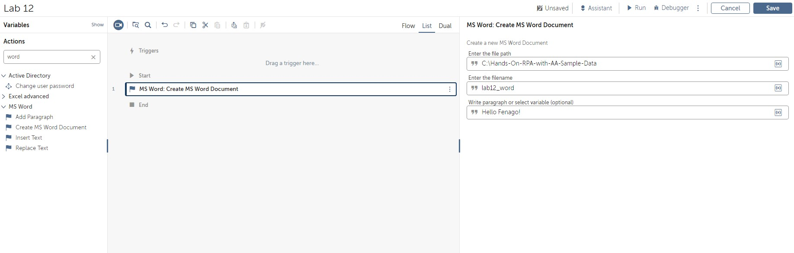
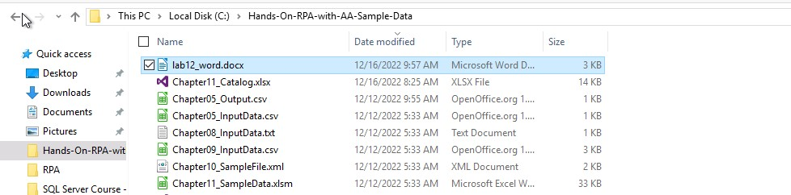
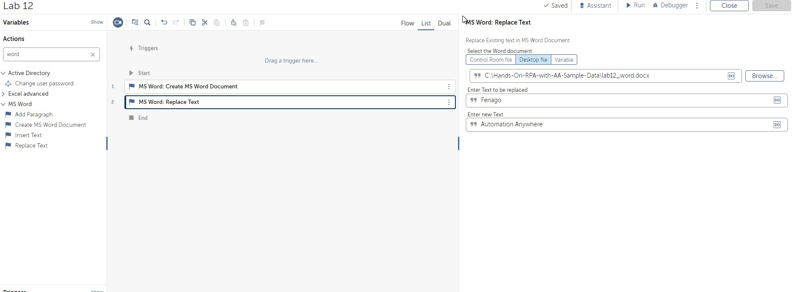
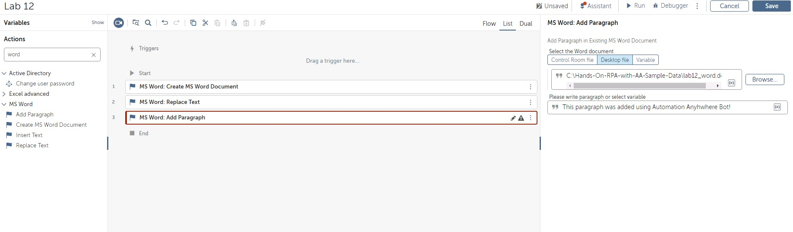
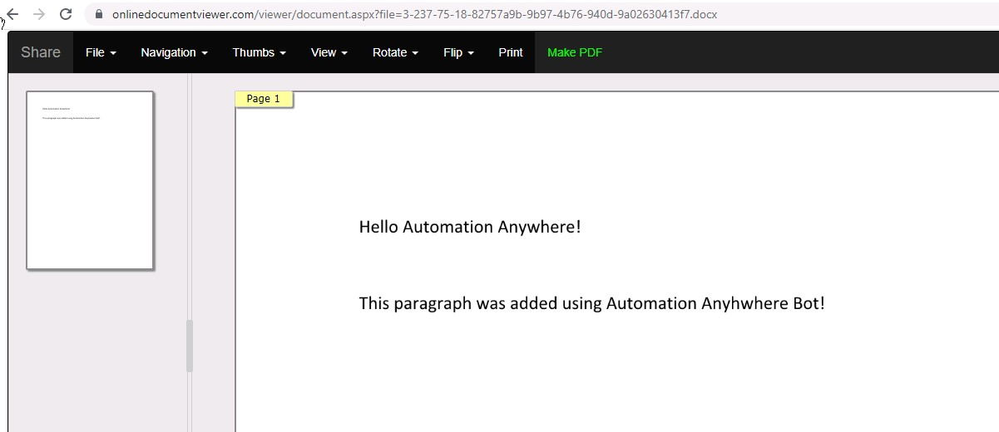

Lab 12: Automation Using Word 
=============================

In this lab, we will continue working with applications as we learn
about how tasks with Word can be automated.
In this lab, we will cover the following topics:

-   Creating new Word documents
-   Replacing text in Word documents
-   Inserting paragraphs in Word documents

Technical requirements 
======================

In order to install the Automation Anywhere Bot agent, the following
requirements are necessary:

-   Google Chrome
-   Completed registration with Automation Anywhere  Community
    Edition
-   Successful login to Automation Anywhere  Community Edition
-   A successfully registered local device
-   Successfully downloaded sample data from GitHub

Let\'s start this walk-through by executing the following steps:

1.  Log in to **Control Room**.

2.  Create a new bot and call it
    `Lab 12 – Word Automation` in the `\Bot\`
    folder.

3.  Add a new **Comment** action as `"---------------------"`
    on line **1** and click on **Save**.

4.  Add a new **Comment** action as
    `"------- Creating MS Word Document"` on line **2** and click on
    **Save**.

5.  Add a new **Comment** action as
    `"------- Replacing Text"` on line **3** and click
    on **Save**.

6.  Add a new **Comment** action as
    `"------- Inserting Paragraph"` on line **4** and click
    on **Save**.

7.  Add a new **Comment** action as `"---------------------"` on line 5 and click on **Save**.

8.  Set the following properties for the **MS Word: Creating MS Word Document** action:

    **Enter the file path**: `C:\Hands-On-RPA-with-AA-Sample-Data`

    **Enter the filename**: `lab12_word`

    **Write paragraph**: `Hello Fenago!`

    The properties should look like this:

    

9. Click on **Save**.

10. Run the bot and confirm that new word document was created:

    

    You can open and view document content online: `https://onlinedocumentviewer.com/blog/online-word-document-viewer.aspx`

11.  Set the following properties for the **MS Word: Replace Text** action:

    

12. Click on **Save**.

13. Set the following properties for the **MS Word: Add Paragraph** action:

14. Click on **Save**.

    

All done, which is great. You can go ahead and run your bot.. Once the bot
has completed, open the word document online. It should now also contain new paragraph as shown in the following screenshot:

You can open and view document content online: `https://onlinedocumentviewer.com/blog/online-word-document-viewer.aspx`