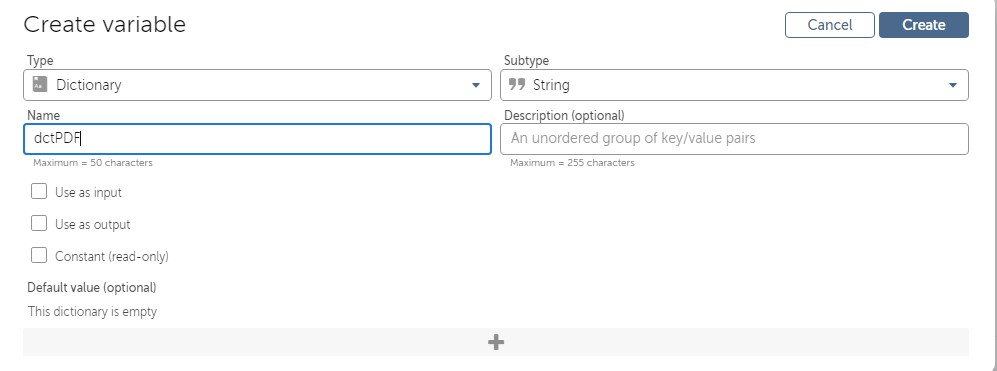

Lab 14: Working with PDF Files 
===============================

In this lab, we will be using the following packages:

In this lab, we will cover the following topics:

-   Extracting text and images
-   Splitting and merging documents
-   Encrypting and decrypting documents
-   Using the PDF dictionary

Technical requirements 
======================

In order to install Automation Anywhere Bot agent, the following
requirements are necessary:

-   Google Chrome
-   Completed registration with Automation Anywhere  Community
    Edition
-   Successful log-on to Automation Anywhere  Community Edition
-   A successfully registered local device
-   Successfully downloaded sample data from GitHub

Extracting text and images 
==========================

In this section, we will look at how to extract
any text from a PDF file and save it to a text file. The
walk-through will also show how a PDF can be saved
as an image file.

Extracting text from a PDF file 
-------------------------------

When working with PDF files, we often have to read the text contained
within them in order to process the text. A good
example would be extracting
the text from an invoice in PDF format. This text
includes product information, including a description, the quantity, and
the costs. As part of a business role, you may then validate the
information before posting it to a purchase ledger. In the following
walk-through, you will extract the text from the
`Chapter14_Letter.pdf` sample PDF file. You may remember this
file; it\'s one of the sample loan letters used in *Lab 12*,
*Automation Using Word*. You will begin by adding the comments as usual.

Let\'s start this walk-through by executing the following steps:

1.  Log in to **Control Room**.

2.  Create a new bot in the `\Bot\` folder and call it
    `Chapter14 – PDF Files`.

3.  Add a new **Comment** action as `"---------------------"`
    on line **1**, and click on **Save**.

4.  Add a new **Comment** action as `"------- Extract Text"`
    on line **2**, and click on **Save**.

5.  Add a new **Comment** action as `"---------------------"`
    on line **3**, and click on **Save**. Your initial development
    interface should look as in the following screenshot:
    
    
    
6.  To extract all the text from our PDF file, add the **PDF: Extract
    text** action just below line **2** so that you can start to set the
    properties.

7.  Firstly, we need to specify the PDF file that will be used. To do
    this, set the following property for the **PDF: Extract text**
    action on line **3**:

    **PDF path**: **Desktop file** --
    `C:\Hands-On-RPA-with-AA-Sample-Data\Chapter14_Letter.pdf`

    As this file is not password-protected, no
    credentials are needed. If it was, then you would also need to enter
    the password.

    The property should look as in the following
    screenshot:

    
    
    

8.  Click on **Save**.

9.  Continue setting the properties. Next, specify the page range and
    format of the text required. To do this, set the following
    properties for the **PDF: Extract text** action on line **3**:

    **Text type**: **Plain text** (*Structured text would keep the
    layout -- that is, tabs and spaces*)

    **Page range**: **All pages**

    The properties should look as in the following screenshot:

    
    
    

10. Click on **Save**.

11. The final property to set is to specify the
    output text file. To do this, set the
    following properties for the **PDF: Extract text** action on line
    **3**:

    **Export data to text file**:
    `C:\Hands-On-RPA-with-AA-Sample-Data\Chapter14_Letter.txt`

    **Overwrite files with the same name**: *Checked*

    The properties should look as in the following screenshot:

    
    
    

12. Click on **Save**. The development interface for this section should
    look as in the following screenshot:

That\'s all there is to it. You can run the bot to
test it. Once it has completed processing, a text
file called `Chapter14_Letter.txt` will be generated,
containing all the text from the PDF file. The output file should look
as in the following screenshot:

Now you know how to extract the text from a PDF
file. The output file is now ready to start any
processing using the string manipulation actions. We will continue with
our bot and start to look at how to extract an image from a PDF file.

Extracting an image from a PDF file 
-----------------------------------

In this section, you will learn how to extract an image from a PDF file.
This action will export the specific page(s) as an
image file. For this example, we will be using the
`Chapter14_Chart.pdf` file. The example PDF file consists of
a flowchart, which will be exported as a JPEG
file. Like always, let\'s begin by adding our comments:

1.  Add a new **Comment** action just below line **3**,
    `"------- Extract Image"`, and click on **Save**.

2.  To extract the PDF file as an image, add the **PDF: Extract image**
    action just below line **4** so that you can start to set the
    properties.

3.  Firstly, we need to specify the PDF file that will be used. To do
    this, set the following property for the **PDF: Extract image**
    action on line **5**:

    **PDF path**: **Desktop file** --
    `C:\Hands-On-RPA-with-AA-Sample-Data\Chapter14_Chart.pdf`

    Like before, this file is not password-protected, so no credentials
    are needed.

    The properties should look as in the following screenshot:

    
    
    

4.  Click on **Save**.

5.  Continue setting the properties. Next, specify
    the page range and the format of the image
    file. To do this, set the following properties for the **PDF:
    Extract image** action on line **5**:

    **Page range**: **All pages**

    **Type of image to be converted to**: **JPEG**

    **JPEG quality**: `100`

    The properties should look as in the following screenshot:

    
    
    

6.  Click on **Save**.

7.  The next properties to set are to specify the
    output folder for the image file. To do this,
    set the following properties for the **PDF:
    Extract image** action on line **5**:

    **Folder path**: `C:\Hands-On-RPA-with-AA-Sample-Data`

    **File prefix**: `Chapter14_Chart`

    **Overwrite files with the same name**: *Checked*

    The properties should look as in the following screenshot:

    
    
    

8.  Click on **Save**.

9.  Finally, we need to specify the image
    resolution and the color for the output file. To do this, set the
    following properties for the **PDF: Extract image** action on line
    **5**:

    **X Resolution(dpi)**: `200`

    **Y Resolution(dpi)**: `200`

    **Image output**: **Color**

    **Color property**: **True color (32 bits)**

    The properties should look as in the following
    screenshot:

    
    
    

10. Click on **Save**. The development interface
    for this section should look as in the
    following screenshot:

The extraction of an image is complete. Again, you can run the bot. When
it\'s finished processing, you will have an output image file called
`Chapter14_Chart_1.jpeg`. This file consists of the contents
from the original PDF file. The output file should look as in the
following screenshot:

This walk-through has taught you how to extract an
image from a PDF file. You have learned that the
format can be modified, including the resolution and the file format. In
the next section, you will learn how to split and merge PDF documents.

Splitting and merging documents 
===============================

In this section, you will learn how to manipulate
PDF files by means of splitting an existing file
into multiple files and merging multiple files into a single PDF
document. The walk-through will use the `Chapter14_Games.pdf`
file, which is part of the GitHub repository.

Splitting a PDF file 
--------------------

The `Chapter14_Games.pdf` sample file that we will use is an
eight-page document summarizing the contents of a
book about retro arcade games. For this walk-through, the bot is tasked
with splitting this document into eight separate PDF files, each file
consisting of one page. Like always, let\'s begin by adding our
comments:

1.  Add a new **Comment** action just below line **5**,
    `"------- Split File"`, and click on **Save**.

2.  To split the PDF file, add the **PDF: Split document** action just
    below line **6** so that you can start to set the properties.

3.  Firstly, we need to specify the PDF file that will be used. To do
    this, set the following property for the **PDF: Split document**
    action on line **7**:

    **PDF path**: **Desktop file** --
    `C:\Hands-On-RPA-with-AA-Sample-Data\Chapter14_Games.pdf`

    Like before, this file is not password-protected, so no credentials
    are needed.

    The property should look as in the following
    screenshot:

    
    
    

4.  Click on **Save**.

5.  Continue setting the properties. Next, we need to specify how the
    document is to be split. A number of options are available. In this
    case, we want to split it at each page. To do this, set the
    following property for the **PDF: Split document** action on line
    **7**:

    **Output file creation options**: **Number of pages per extracted
    PDF** -- `1`

    The property should look as in the following screenshot:

    
    
    

6.  Click on **Save**.

7.  The final properties to set are to specify the
    output folder and the filename prefix. To do this, set the following
    properties for the **PDF: Split document** action on line **7**:

    **Folder path**: `C:\Hands-On-RPA-with-AA-Sample-Data`

    **File prefix**: `Chapter14_GamesSplit`

    **Overwrite files with the same name**: *Checked*

    The properties should look as in the following screenshot:

    
    
    

8.  Click on **Save**. The development interface for this section should
    look as in the following screenshot:

Right! You can go ahead and run your bot now. That was pretty
straightforward, wasn\'t it? The original PDF file
should be split into eight individual PDF
documents, each with an increment counter suffix. All the newly created
PDF files should be visible in the **File Explorer**:

Awesome work! You have the skills to split a PDF document now. This can
be a very useful action when automating tasks while working with PDF
files. We will continue manipulating documents; in the next section, you
will learn how to merge multiple PDF files into a single document.

Merging multiple PDF files 
--------------------------

In this section, we will look at how to merge
multiple files. It\'s a good job that we have just learned how to split
a file, as now we have eight individual files to work with. For this
walk-through, you will configure your bot to merge all eight
`Chapter14_GamesSplit` files into a single PDF file. Like
always, let\'s begin by adding our comments:

1.  Add a new **Comment** action just below line **7**,
    `"------- Merge Files"`, and click on **Save**.

2.  To merge multiple PDF files, add the **PDF: Merge documents** action
    just below line **8**, so you can start to set the properties.

3.  We need to specify the individual PDF files that we want merging
    together. To do this, click on the **Add PDF document** button from
    the properties of the **PDF: Merge documents** action on line **9**:

    
    
    

4.  The **Add PDF document** dialog box will appear. Here, you can
    specify the first document for merging. To do
    this, set the following properties in the **Add PDF document**
    dialog box:

    **PDF path**: **Desktop file** --
    `C:\Hands-On-RPA-with-AA-Sample-Data\Chapter14_GamesSplit_1.pdf`

    **Pages**: **All pages**

    Like before, this file is not password protected, so no credentials
    are needed.

    The properties should look as in the following screenshot:

    
    
    

5.  Click on **Add**.

6.  Repeat *steps 3* to *5* for each of the
    following seven documents:

    `C:\Hands-On-RPA-with-AA-Sample-Data\Chapter14_GamesSplit_2.pdf`

    `C:\Hands-On-RPA-with-AA-Sample-Data\Chapter14_GamesSplit_3.pdf`

    `C:\Hands-On-RPA-with-AA-Sample-Data\Chapter14_GamesSplit_4.pdf`

    `C:\Hands-On-RPA-with-AA-Sample-Data\Chapter14_GamesSplit_5.pdf`

    `C:\Hands-On-RPA-with-AA-Sample-Data\Chapter14_GamesSplit_6.pdf`

    `C:\Hands-On-RPA-with-AA-Sample-Data\Chapter14_GamesSplit_7.pdf`

    `C:\Hands-On-RPA-with-AA-Sample-Data\Chapter14_GamesSplit_8.pdf`

7.  Click on **Save**. The **PDF: Merge documents** properties should
    look as in the following screenshot:

    
    
    

8.  The final properties to set are to specify the
    single output file. To do this, set the following properties for the
    **PDF: Merge documents** action on line **9**:

    **Output file path**:
    `C:\Hands-On-RPA-with-AA-Sample-Data\Chapter14_GamesMerged.pdf`

    **Overwrite existing file**: *Checked*

    The properties should look as in the following screenshot:

    
    
    

9.  Click on **Save**. The development interface for this section should
    look as in the following screenshot:

You are once again ready to test your bot. When your bot has finished,
you should notice that a new PDF file, called
`Chapter14_GamesMerged.pdf`, has been generated. This file is
the result of all eight `GamesSplit` files being
merged into a single file.

Fantastic work, you should now be able to confidently split and merge
PDF documents. In the next section, we will take a look at PDF file
security, specifically the encryption and decryption of files.

Encrypting and decrypting documents 
===================================

Encrypted PDF files are widely used to protect sensitive data. Having
the ability to automate encryption and decryption
can be a key feature to aid automating manual
tasks. In the following section, you will learn
how to encrypt and decrypt PDF files using RPA. For this walk-through,
we will be using the existing `Chapter14_Games.pdf` file from
the GitHub repository.

Encrypting a PDF file 
---------------------

We will use our `Chapter14_Games.pdf` file and apply
encryption to this document. Automation Anywhere
allows you to apply one of the industry-standard
encryption algorithms from RC4 40-bit, RC4 128-bit, or AES 128-bit. Like
always, let\'s begin by adding our comments.

Let\'s start this walk-through by executing the following steps:

1.  Add a new **Comment** action just below line **9**,
    `"------- Encrypt PDF File"`, and click on **Save**.

2.  To encrypt our PDF file, add the **PDF: Encrypt document** action
    just below line **10** so that you can start to set the properties.

3.  Firstly, we need to specify the PDF file that will be used. To do
    this, set the following property for the **PDF: Encrypt document**
    action on line **11**:

    **PDF path**: **Desktop file** --
    `C:\Hands-On-RPA-with-AA-Sample-Data\Chapter14_Games.pdf`

    The property should look as in the following screenshot:

    
    
    

4.  Click on **Save**.

5.  Next, we need to specify the password. There is an option of
    applying up to two passwords for your document. This includes a user
    password and an owner password. At least one of these must be set.
    We will apply a password to the **User password** property. To do
    this, set the following property for the **PDF: Encrypt document**
    action on line **11**:

    **User password (optional)**: **Insecure string** --
    `Password`

    The property should look as in the following screenshot:

    
    
    

6.  Click on **Save**.

7.  Next, we need to specify which permissions the
    password applies to; for this example, we will apply permissions to
    all. To do this, set the following property for the **PDF: Encrypt
    document** action on line **11**:

    **User Permissions to Apply**: *Check all options*

    The property should look as in the following screenshot:

    
    
    

8.  Click on **Save**.

9.  Now, we need to specify the level of
    encryption we want. For this example, we will apply RC4 128-bit
    encryption. To apply this to all, set the following property for the
    **PDF: Encrypt document** action on line **11**:

    **Encryption level**: **AES 128-bit**

    The property should look as in the following screenshot:

    
    
    

10. Click on **Save**.

11. Finally, we need to specify the filename of
    the encrypted output file. To do this, set the following properties
    for the **PDF: Encrypt document** action on line **11**:

    **Save encrypted PDF as**:
    `C:\Hands-On-RPA-with-AA-Sample-Data\Chapter14_GamesEncrypt.pdf`

    **Overwrite files with the same name**: *Checked*

    The properties should look as in the following screenshot:

    
    
    

12. Click on **Save**. The development interface
    for this section should look as in the following screenshot:

Go ahead and run the bot. The bot will generate a file named
`Chapter14_GamesEncrypt.pdf`, which is password protected and
encrypted. Try to open this file. It should prompt you for a password.
We have set this to be `Password`. This leads us to the next
section, where you will learn how to decrypt a PDF file.

Decrypting PDF files 
--------------------

We will continue with the bot by configuring it to decrypt a PDF file.
It\'s quite handy that in the previous section an
encrypted file was created. We can use this as our
source file to decrypt. Like always, let\'s begin by adding our
comments:

1.  Add a new **Comment** action just below line **11**,
    `"------- Decrypt PDF File"`, and click on **Save**.

2.  To decrypt the encrypted `Chapter14_GamesEncrypt.pdf`
    file, add the **PDF: Decrypt document** action just below line
    **12** so that you can start to set the properties.

3.  Firstly, we need to specify the PDF file that will be used. To do
    this, set the following property for the **PDF: Decrypt document**
    action on line **13**:

    **PDF path**: **Desktop file** --
    `C:\Hands-On-RPA-with-AA-Sample-Data\Chapter14_GamesEncrypt.pdf`

    The property should look as in the following screenshot:

    
    
    

4.  Click on **Save**.

5.  Next, we need to specify the password. In the previous section, we
    set the password to be `Password`. To set this for
    decryption, set the following property for the **PDF: Decrypt
    document** action on line **13**:

    **User/Owner password (optional)**: **Insecure string** --
    `Password`

    The property should look as in the following screenshot:

    
    
    

6.  Click on **Save**.

7.  Finally, we need to specify the output
    decrypted filename. To do this to all, set the following properties
    for the **PDF: Decrypt document** action on line **13**:

    **Save the decrypted PDF as**:
    `C:\Hands-On-RPA-with-AA-Sample-Data\Chapter14_GamesDecrypt.pdf`

    **Overwrite files with the same name**: *Checked*

    The properties should look as in the following screenshot:

    
    
    

8.  Click on **Save**. The development interface for this section should
    look as in the following screenshot:

You have successfully configured your bot to decrypt a PDF encrypted
file. Run the bot and you will notice a new file
created named `Chapter14_GamesDecrypt.pdf`. This file is now
decrypted. If you try and open it, it should just open without asking
for any passwords.

One other thing to learn about the automation of PDF documents is that
there may be instances where you need actual document properties. We
will explore how to get these in the next section when we look at the
PDF dictionary.

Using the PDF dictionary 
========================

As you have been progressing through the lab, you may have
noticed an additional property at the bottom of
the properties pane for all the actions referring to the
`Dictionary` variable. Automation Anywhere has a pre-built
`Dictionary` type variable for PDF documents. For each PDF
document your bot reads, the `Dictionary` variable will store
the following information:

In the following walk-through, you will modify the last **PDF: Decrypt
document** action on line **13** to assign the dictionary details to a
newly created variable. We can then use a message box to see the
document properties.

Let\'s start this walk-through by executing the following steps:

1.  Firstly, we need a `Dictionary` type variable to store the
    information. Create a `Dictionary` type variable called
    `dctPDF` and set **Type** to be **Dictionary** and
    **Subtype** to be **String**, as follows:

    

2.  To assign the file properties to our newly
    created `Dictionary` variable called `dctPDF`,
    set the following property for the **PDF: Decrypt document** action
    on line **13**:

    **Assign PDF properties to a dictionary variable (optional)**:
    **dctPDF** -- **Dictionary of Strings**

    The properties should look as in the following screenshot:

    
    
    

3.  Click on **Save**.

4.  To view the assigned values, add a **Message
    box** action just below line **13**.

5.  For the **Message box** action on line **14**, set the following
    properties:

    **Enter the message box window title**: `PDF Dictionary`

    **Enter the message to display**:
    `Title: |$dctPDF{pdfTitle}$|`

    `Filename: |$dctPDF{pdfFilename}$|`

    `Subject: |$dctPDF{pdfSubject}$|`

    `Author: |$dctPDF{pdfAuthor}$|`

    The properties should look as in the following screenshot:

    
    
    

6.  Click on **Save**. The complete development
    interface for this lab should look as in the following
    screenshot:

    
    
    

7.  When you are ready, please run the bot. The bot will now display a
    message box containing the document properties. It should look as in
    the following screenshot:

Great work! You can see all the property
information that the bot has extracted from the file. The dictionary can
be applied to all the PDF actions we have worked with, such as
extracting text and images, merging and splitting files, and encrypting
files.

Summary 
=======

In this lab, you have learned how to add automation to your
PDF-related tasks. The lab have enabled you to build a bot
that performs many actions against PDF documents. This has included
extracting text and images from PDF documents, as well as splitting and
merging multiple documents. This lab also demonstrated how to
encrypt and decrypt files and how to get access to the document
properties by using a `Dictionary` type variable.
