Lab 15: Working with Databases 
=========================================================


In this lab, we will be using the following packages:


The walk-throughs in this lab will consist of demonstrating the
different actions within the **Database** package. We will be using some
files from the GitHub repository, which is part of the technical
requirements. A sample each of the Access and SQLite databases are
included in the GitHub repository and both are used as part of the
walk-throughs. It is assumed that you already have a basic understanding
of databases and SQL statements. You will learn how to configure an RPA
bot to execute these statements.

In this lab, we will cover the following topics:

-   Connecting to, and disconnecting from, databases
-   Reading data from databases
-   Updating databases


Technical requirements 
======================


In order to install Automation Anywhere, the following are required:

-   Google Chrome 
-   Completed registration with Automation Anywhere  Community
    Edition
-   Successful logon to Automation Anywhere  Community Edition
-   Successful registration of a local device
-   The successful downloading of sample data from GitHub
-   An installed SQL or Oracle server (optional)
-   Microsoft Access installed (optional)


Connecting to, and disconnecting from, databases 
================================================


When working with databases, the first thing you
would do with most development platforms is to
establish a connection with the database. There are many types of
databases that are used, the most widely used being the following:

-   SQL or Oracle
-   SQLite
-   MS Access

A connection to all of these database types can be
established using a **connection string**, which is also quite often
used for bespoke or propriety databases. Automation Anywhere is designed
to connect to the most common database types by just providing the key
connection details, such as the server/database name and user
credentials. It also provides the means to connect via a connection
string. This removes any restrictions, allowing you to connect to any
type of database for your automation needs.

As with most connections in Automation Anywhere, it uses a session to
identify each connection. The **Database: Connect** action is used to
create a database session. As with all sessions, they need to be closed
once they are no longer required. With databases, a session is closed
using the **Database: Disconnect** action. In the following
walk-throughs, you will learn how to connect to the different types of
databases and create a session. In particular, you will learn how to do
the following:

-   Connect to a SQL/Oracle database
-   Connect to a SQLite database
-   Connect to an Access database
-   Connect using a connection string

As we have done previously, we will be using comments and steps to help
structure all the actions. We will begin by building the initial
skeleton using comments and steps:

Let\'s start this walk-through by performing the following steps:

1.  Log in to **Control Room**.
2.  Create a new bot and call it
    `Chapter15 – Database Automation` in the `\Bot\`
    folder.
3.  Add a new **Comment** action as `"---------------------"`
    on line **1** and click on **Save**.
4.  Add a **Step** just below line **1**, set the **Title** property as
    \"`Connecting to Databases"`, and then click on **Save**.
5.  Add another **Step** just below line **2**,
    ensuring it is within the **Step** on line
    **2**, set the **Title** property as
    \"`Connecting to a SQL/Oracle Database"`, and then click
    on **Save**.
6.  Add another **Step** just below line **3**, ensuring it is within
    the **Step** on line **2**, set the **Title** property as
    \"`Connecting to a SQLite Database"`, and then click on
    **Save**.
7.  Add another **Step** just below line **4**, ensuring it is within
    the **Step** on line **2**, set the **Title** property as
    \"`Connecting to MS Access"`, and then click on **Save**.
8.  Add another **Step** just below line **5**, ensuring it is within
    the **Step** on line **2**, set the **Title** property as
    \"`Connect using Connection String"`, and then click on
    **Save**.
9.  Add a new **Comment** action as `"---------------------"`
    on line **7** and click on **Save**. Your initial development
    interface should look like the following screenshot:


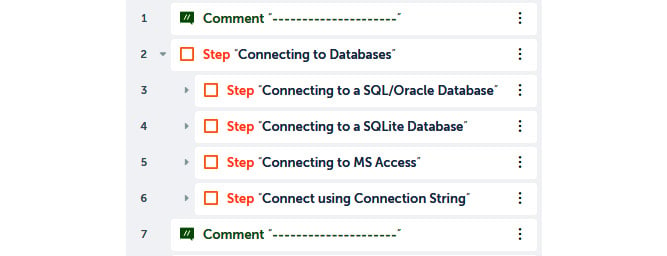


That\'s great! We now have a structure for our
walk-through. The first connection we will look at
is SQL and Oracle databases.


Connecting to a SQL/Oracle database 
-----------------------------------

Two of the most popular enterprise-level database
systems used are SQL Server and Oracle. As a system developer, you quite
regularly need to build functionality that manipulates data stored on
these databases. For SQL Server and Oracle, a few details are needed in
order to establish a connection. These are the server name, database
name, username, and password. In certain cases, you may also need to
know the port number. In the following walk-through, you will learn how
to create a session for a SQL Server and Oracle database.

Let\'s start this walk-through by performing the following steps:

1.  To create our database session, drag the **Database: Connect**
    action just below line **3**, ensuring it is within the **Step** on
    line **3**. You are now ready to start setting the properties.

2.  Firstly, we need to specify the **Session** details. To do this, set
    the following properties for the **Database: Connect** action on
    line **4**:

    **Session name**: `db_Session`

    **Connection mode**: **User defined** (*Default is used for
    connection strings only*)

    The properties should look like the following screenshot:

    
    
    


3.  Click on **Save**.

4.  The next part is to specify the type of database we wish to create
    the session for. To do this, set the following properties for the
    **Database: Connect** action on line **4** *(values used are for
    representation only; please use values that are your own server
    settings)*:

    
    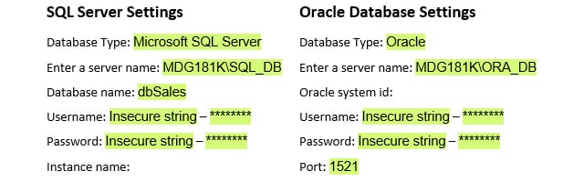
    


    The properties should look like the following
    screenshot:

    
    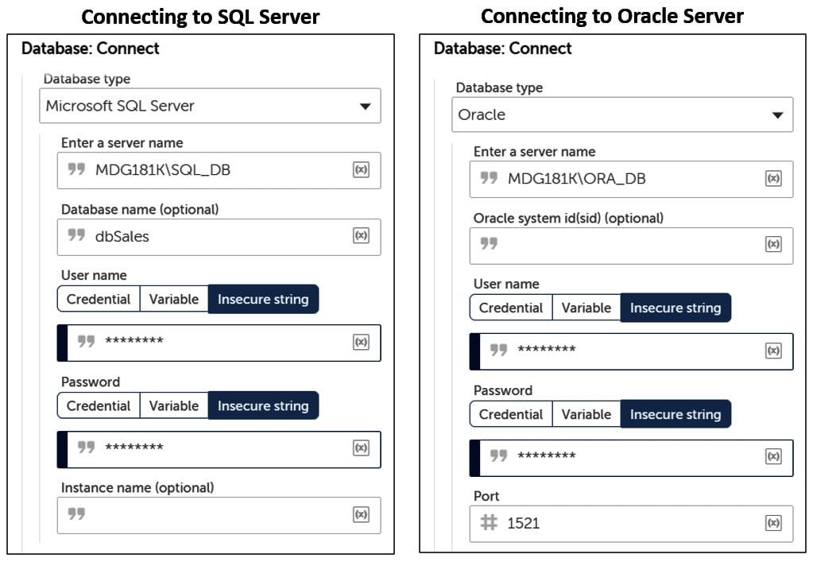
    


5.  Click on **Save**.

6.  The session is now created. Once you have finished, you will need to
    disconnect from the database server. To do this, add the **Database:
    Disconnect** action just below line **4**, ensuring it is aligned to
    the **Database: Connect** action on line **4**.

7.  Set the following property for the **Database: Disconnect** action
    on line **5**:

    **Session name**: `db_Session`

    The property should look like the following screenshot:

    
    
    


8.  Click on **Save**. Your development interface
    for this section should look like the following screenshot:


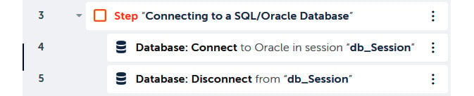


That\'s how we create a session to a SQL and Oracle database server. The
example given here in the walk-through will only work when you use your
own server and user credentials. If you don\'t have a SQL or Oracle
server to connect to, you can always disable the **Step** action from
line **3**. We will continue with connecting to a SQLite database in the
next section. A sample SQLite database is included in the GitHub
repository for the next walk-through. This database file is called
`Chapter15_SQLite.db`.


Connecting to a SQLite database 
-------------------------------

Another lightweight database platform is
**SQLite**. This is not an enterprise-level platform, but still proves
to be a robust lightweight database. The following walk-through will
show how to connect to a SQLite database. A sample database called
`Chapter15_SQLite.db` is available as part of the GitHub
repository.

Let\'s start this walk-through by performing the following steps:

1.  To create the SQLite database session, drag the **Database:
    Connect** action just below line **6**, ensuring it is within the
    **Step** on line **6**. You are now ready to start setting the
    properties.

2.  Firstly, we need to specify the session
    details. To do this, set the following properties for the
    **Database: Connect** action on line **7**:

    **Session name**: `db_SqLite`

    **Connection mode**: **User defined** (*Default is used for
    connection strings only*)

    The properties should look like the following screenshot:

    
    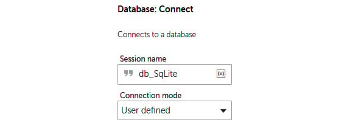
    


3.  Click on **Save**.

4.  The next part is to specify the type of database and location of the
    file. To do this, set the following properties for the **Database:
    Connect** action on line **7**:

    **Database type**: **SqLite**

    **Database file path**: **Desktop file** --
    `C:\Hands-On-RPA-with-AA-Sample-Data\Chapter15_SQLite.db`

    The properties should look like the following screenshot:

    
    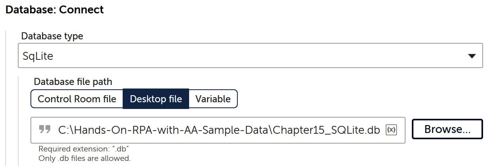
    


5.  Click on **Save**.

6.  The SQLite database session is now created. To disconnect, add the
    **Database: Disconnect** action just below line **7**, ensuring it
    is aligned to the **Database: Connect** action on line **7**.

7.  Set the following property for the **Database: Disconnect** action
    on line **8**:

    **Session name**: `db_SqLite`

    The property should look like the following screenshot:

    
    
    


8.  Click on **Save**. Your development interface
    for this section should look like the following screenshot:


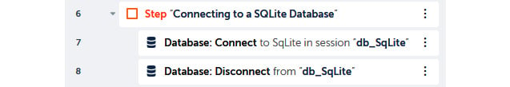


All done! You can run the bot to test it. It won\'t actually do anything
visible, but we know it establishes a connection with our SQLite
database and then disconnects.

Later in this lab, you will learn how to read data after creating a
session. Continuing with connecting with databases, we move on to Access
databases in the next section.


Connecting to an Access database 
--------------------------------

Microsoft Access is part of the Microsoft Office
suite and is a very popular database platform. A sample database,
`Chapter15_Access.accdb`, is included in the GitHub
repository. We will be connecting to this for the following
walk-through.

Let\'s start this walk-through by performing the following steps:

1.  To create the Access database session, drag the **Database:
    Connect** action just below line **9**, ensuring it is within the
    **Step** on line **9**. You are now ready to start setting the
    properties.

2.  We first need to specify the session details. To do this, set the
    following properties for the **Database: Connect** action on line
    **10**:

    **Session name**: `db_Access`

    **Connection mode**: **User defined** (*Default is used for
    connection strings only*)

    The properties should look like the following
    screenshot:

    
    
    


3.  Click on **Save**.

4.  The next part is to specify the type of database and the location of
    the file. To do this, set the following properties for the
    **Database: Connect** action on line **7**:

    **Database type**: **Microsoft Access**

    **Database file path**: **Desktop file** --
    `C:\Hands-On-RPA-with-AA-Sample-Data\Chapter15_Access.accdb`

    The properties should look like the following screenshot:

    
    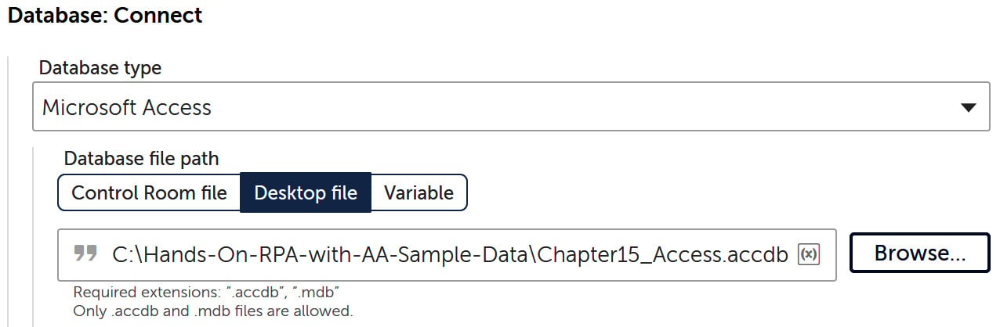
    


5.  Click on **Save**.

6.  We now have to add the **Database: Disconnect** action. To do this,
    add the **Database: Disconnect** action just below line **10**,
    ensuring it is aligned to the **Database: Connect** action on line
    **10**.

7.  Set the following property for the **Database: Disconnect** action
    on line **11**:

    **Session name**: `db_Access`

    The property should look like the following screenshot:

    
    
    


8.  Click on **Save**. Your development interface for this section
    should look like the following screenshot:


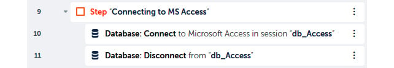


Now you know how easily a database connection can
be established to a Microsoft Access database. In the next section, you
will learn how to connect to a database using a connection string.


Connecting using a connection string 
------------------------------------

A connection string can be used to connect to
all of the databases we have already looked at. It
is commonly used by developers as a standard method of connecting to
databases. Some bespoke and proprietary software vendors may provide a
connection string to allow connectivity to a backend data store for
their application.

In the next walk-through, we will use a connection string to establish a
session. We will connect to an Excel worksheet using a database
connection string. This also works as an alternative way to work with
Excel spreadsheets. When using Excel as a database, the workbook
represents the database and the worksheet represents the database
tables. For this walk-through, we will use a connection string to create
a session with the `Chapter12_LoanData.xlsx` file.

Let\'s start this walk-through by performing the following steps:

1.  To connect using a connection string, drag the **Database: Connect**
    action just below line **12**, ensuring it is within the **Step** on
    line **12**. You are now ready to start setting the properties.

2.  Firstly, we need to specify the session details. To do this, set the
    following properties for the **Database: Connect** action on line
    **13**:

    **Session name**: `db_ConStr`

    **Connection mode**: **Default**

    The properties should look like the following screenshot:

    
    
    


3.  Click on **Save**.

4.  The next part is to specify the
    connection string. To create a connection to
    the `Chapter12_LoanData.xlsx` file, we will need to add
    this within the connection string. To do this, set the following
    property for the **Database: Connect** action on line **13**:

    **Connection string**:
    `Provider=Microsoft.ACE.OLEDB.12.0;Data Source=C:\Hands-On-RPA-with-AA-Sample-Data\Chapter12_LoanData.xlsx;Extended Properties="Excel 12.0 Xml;HDR=YES;IMEX=1";`

    The property should look like the following screenshot:

    
    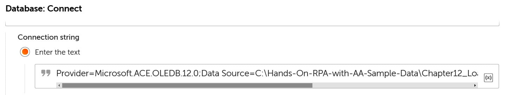
    


5.  Click on **Save**.

6.  We now have to add the **Database:
    Disconnect** action. To do this, add the
    **Database: Disconnect** action just below line **13**, ensuring it
    is aligned to the **Database: Connect** action on line **13**.

7.  Set the following property for the **Database: Disconnect** action
    on line **14**:

    **Session name**: `db_ConStr`

    The property should look like the following screenshot:

    
    
    


8.  Click on **Save**. Your development interface for this section
    should look like the following screenshot:


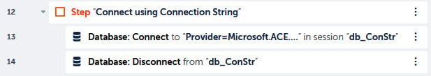


Great work! You should now feel comfortable with establishing a database
connection to different types of databases. Once
we have created a session, we want to work with
the data from our database. In the next section, you will learn how to
read data from databases.


Reading data from databases 
===========================


Naturally, the next stage is to access the data
from our database. In this section, you will learn how to execute a SQL
`Select` statement to retrieve data. A `Select`
statement is commonly used among most databases.

Before we move on to the next section, let\'s disable our actions from
the previous section. To do this, just click on the three dots on line
**2**, select the **Disable** action, and then click on **Save**. This
is designed to ensure that it doesn\'t interfere as we proceed with
reading the data.

To read data, we will need to create a `Record` type variable
to store each record. In the following walk-through, you will run an
aggregated `Select` statement against the sample Microsoft
Access database in the GitHub repository. This Access database has a
table called `tblSales`, and the structure of the table is
shown in the following screenshot:


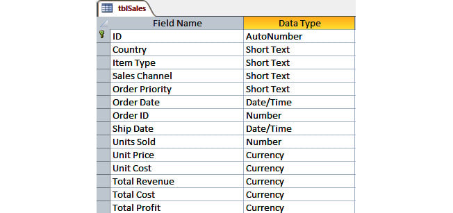


For this walk-through, we will configure our bot
to do the following:

-   `Group by` the `Item Type` field
-   `Count` the total `Item Type` records for each
    group
-   `Sum` the `Units Sold` values for each group
-   `Sum` the `Total Profit` values for each group

To achieve this, we will run the following SQL statement:


```
SELECT [Item Type] As Type, Count([Item Type]) as Orders, Sum([Units Sold]) as Quantity, Sum([Total Profit]) as Profit FROM tblSales GROUP BY [Item Type] ORDER BY [Item Type]Copy
```


The bot will run the statement and retrieve the results in a CSV file as
well as displaying a **Message box** for each record returned.

Let\'s start this walk-through by performing the following steps:

1.  To keep our bot organized, let\'s begin by adding a new **Step**
    just below line **14** and setting the **Title** property to
    **Reading from Databases**.

2.  Keeping up with tidy scene, it would make sense to collapse the
    **Step** in line **2**. Your development interface should look like
    the following screenshot:

    
    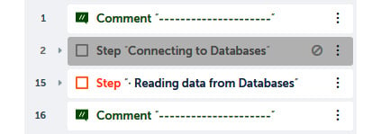
    


3.  Click on **Save**.

4.  As we will be reading records, we will need a
    `Record` type variable. Create a `Record` type
    variable and call it `recData`.

5.  We are now ready to create our connection. Drag the **Database:
    Connect** action just below line **15**, ensuring it is within the
    **Step** on line **15**.

6.  To create our connection, set the following properties for the
    **Database: Connect** action on line **16**:

    **Session name**: `db_Access`

    **Connection mode**: **User defined**

    **Database type**: **Microsoft Access**

    **Database file path**: **Desktop file** --
    `C:\Hands-On-RPA-with-AA-Sample-Data\Chapter15_Access.accdb`

    The properties should look like the following screenshot:

    
    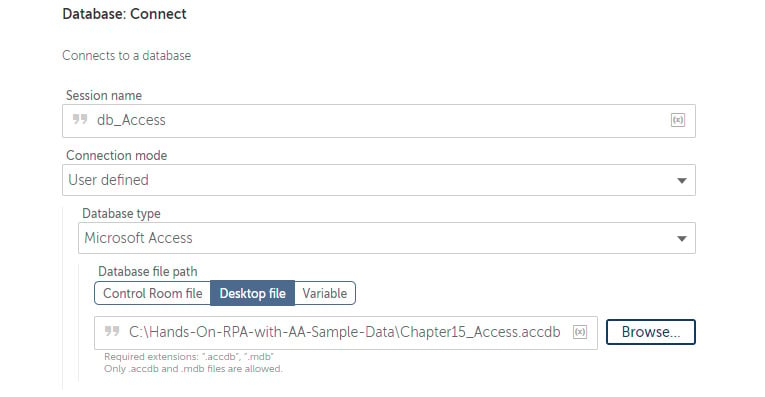
    


7.  Click on **Save**.

8.  Next, we add the action to read the data using
    the SQL statement and send the results to a CSV file. To do this,
    add the **Database: Read** action just below line **16**, ensuring
    it is aligned to the **Database: Connect** action on line **16**.

9.  Set the following properties for the **Database: Read** action on
    line **17**:

    **Session name**: `db_Access`

    **Enter SELECT Statement**:
    `SELECT [Item Type] As Type, Count([Item Type]) as Orders, Sum([Units Sold]) as Quantity, Sum([Total Profit]) as Profit FROM tblSales GROUP BY [Item Type] ORDER BY [Item Type]`

    **Export data to CSV**: **Desktop file** --
    `C:\Hands-On-RPA-with-AA-Sample-Data\Chapter15_Sales.csv`

    **Export data with header**: *Checked*

    **When saving**: **Overwrite existing file**

    The properties should look like the following
    screenshot:

    
    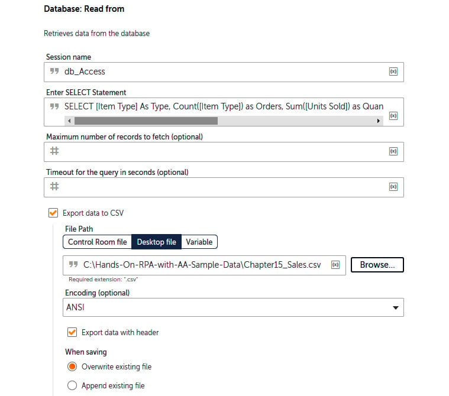
    


10. Click on **Save**.

11. At this point, the bot would have retrieved the full dataset from
    the SQL statement. As we want to see the data for each record, we
    will add a loop to iterate through our dataset. To do this, drag the
    **Loop** action just below line **17**, ensuring it is aligned to
    the **Database: Connect** action on line **16**.

12. Set the following properties for the **Loop** action on line **18**:

    **Loop Type**: **Iterator**

    **Iterator**: **For each row in a SQL query dataset**

    **Session name**: `db_Access`

    **Assign the current row to this variable**: **recData - Record**

    The properties should look like the following
    screenshot:

    
    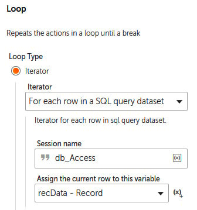
    


13. Click on **Save**.

14. We will also add a **Message box** so that we can see each record as
    the bot iterates through the dataset. To do this, add the **Message
    box** action just below line **18**, ensuring it is within the
    **Loop** action on line **18**.

15. Set the following properties for the **Message
    box** action on line **19**:

    **Enter the message box window title**:
    `Reading a SQL Dataset`

    **Enter the message to display**: `Type: |$recData[0]$|`

    `Orders: |$recData[1]$|`

    `Quantity: |$recData[2]$|`

    `Profit: |$recData[3]$|`

    **Scrollbar after lines**: `30` (*default value*)

    **Close message box after**: *Checked*

    **Seconds**: `5`

    The properties should look like the following screenshot:

    
    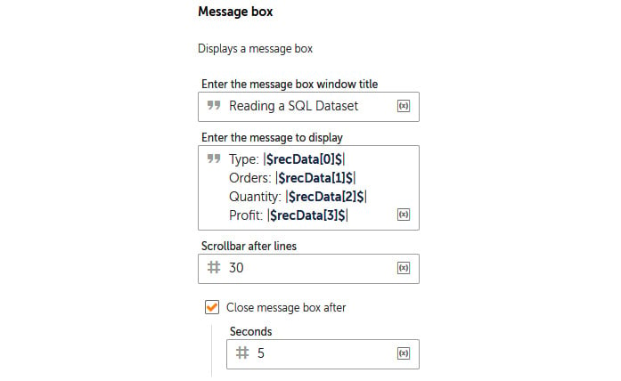
    


16. Click on **Save**.

17. The only action remaining is to add the
    **Database: Disconnect** action. To do this, add the **Database:
    Disconnect** action just below line **19**, ensuring it is aligned
    to the **Database: Connect** action on line **16** and not inside
    the **Loop** action on line **18**.

18. Set the following property for the **Database: Disconnect** action
    on line **20**:

    **Session name**: `db_Access`

    The property should look like the following screenshot:

    
    
    


19. Click on **Save**. Your development interface
    for this section should look like the following screenshot:


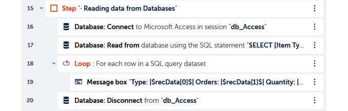


That\'s how we retrieve and read data from a database. No matter how you
have created your session, the preceding walk-through will work on all
database types. Go ahead and run your bot. You should get a **Message
box** for each record retrieved. A CSV file,
`Chapter15_Sales.csv`, will also be generated with results.
This output file should look like the following screenshot:


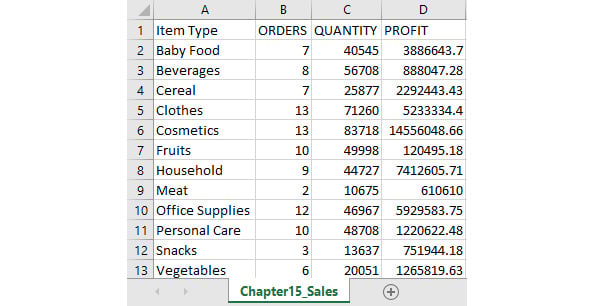


Just out of curiosity, if you want to try reading
data from the SQLite database or from an Excel workbook using a
connection string, you can use the following connections and SQL
statements to retrieve your dataset:

**SQL statement to retrieve data using the Excel connection string used
earlier:**


```
Connection string: SELECT * FROM [Approved$$]
SQL Statement: SELECT * FROM [Approved$$]Copy
```


The output CSV file should look like this:


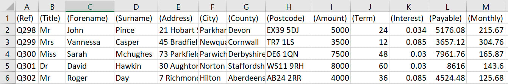


**SQL statement to retrieve data from the sample SQLite database:**


```
Connection string: SqLite Database - Chapter15_SQLite.db
SQL Statement: SELECT * FROM playlistsCopy
```


The output CSV file should look like this:


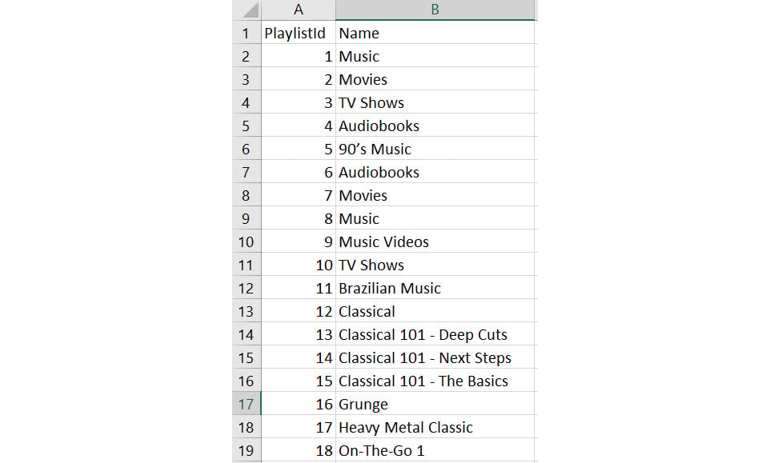


Now that you know everything about retrieving data, let\'s make things
more interesting. In the next section, you will learn how to run action
queries against your database. This is updating records, inserting new
records, and deleting records.


Updating databases 
==================


You have done a great job so far, but now we will
actually start editing the data in our databases. You will learn how to
execute the following types of SQL statements:

-   `Insert`
-   `Update`
-   `Delete`

When working with databases, understanding how to update specific
records, delete specific records, and append new records is essential.
For the walk-throughs, we will continue working with the sample Access
database. Instead of creating a connection for each statement type, it
makes sense to just connect once for all of them as we\'re using the
same database. We will begin by building the initial skeleton using the
**Step** action.

Let\'s start this walk-through by performing the following steps:

1.  Add a **Step** just below line **20**, set the **Title** property as
    `Updating to Databases`, and then
    click on **Save**.

2.  Again, we will add our connection to the Access database, dragging
    the **Database: Connect** action just below line **21**, ensuring it
    is within the **Step** action on line **21**.

3.  As you\'ve done previously, set the following properties for the
    **Database: Connect** action on line **22**:

    **Session name**: `db_Access`

    **Connection mode**: **User defined**

    **Database type**: **Microsoft Access**

    **Database file path**: **Desktop file** --
    `C:\Hands-On-RPA-with-AA-Sample-Data\Chapter15_Access.accdb`

    The properties should look like the following screenshot:

    
    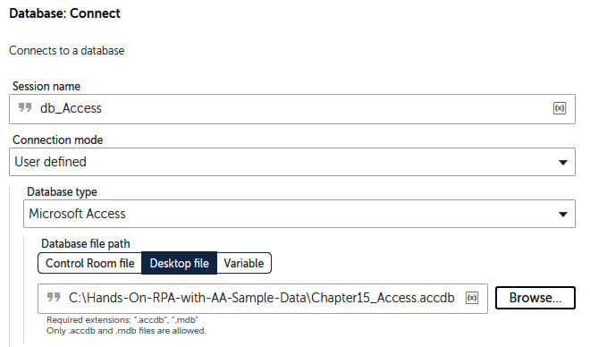
    


4.  Click on **Save**.

5.  Add another **Step** just below line **22**, ensuring it is within
    the previous **Step** on line **21**, set the **Title** property as
    \"`Inserting data - INSERT Statement"`,
    and then click on **Save**.

6.  Add another **Step** just below line **23**, ensuring it is aligned
    to the **Step** on line **23**, set the **Title** property as
    \"`Updating data - UPDATE Statement"`, and then click on
    **Save**.

7.  Add another **Step** just below line **24**, ensuring it is aligned
    to the **Step** on line **24**, set the **Title** property as
    \"`Deleting data - DELETE Statement"`, and then click on
    **Save**.

8.  Finally, add the **Database: Disconnect** action just below line
    **25**, ensuring it is aligned to the **Database: Connect** action
    on line **22** and not inside the **Step** on line **25**.

9.  Set the following property for the **Database: Disconnect** action
    on line **26**:

    **Session name**: `db_Access`

    The property should look like the following screenshot:

    
    
    


10. Click on **Save**. Your development interface for this section
    should look like the following screenshot:


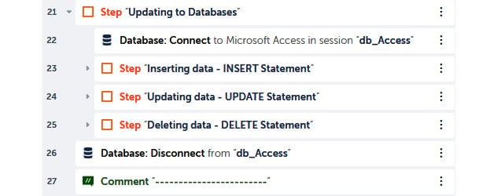


That\'s great! We now have a structure for our walk-through. We have a
single connection and a single disconnect action. While the bot has the
session open to the Access database, we can add the three different
types of action statements. We will start with inserting data.


Inserting data 
--------------

The Access database,
`Chapter15_Access.accdb`, has a table called
`tblTypes`. This table consists of all the product types sold.
There is only one field in this table, called `ItemType`.
Currently, there are 12 records in this table, as you can see:


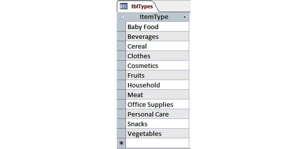


In the walk-through, our bot will insert a new type of product,
`Electrical`. This will bring the total record count to 13. To
insert this new record, the SQL statement would be as follows:


```
INSERT INTO tblTypes (ItemType) VALUES 'Electrical';Copy
```


Let\'s start this walk-through by performing the following steps:

1.  To add this `Insert` SQL statement, add the **Database:
    Insert/Update/Delete** action just below line **23**, ensuring it is
    inside **Step** on line **23**.

2.  Set the following properties for the **Database:
    Insert/Update/Delete** action on line **24**:

    **Session name**: `db_Access`

    **Statement**:
    `INSERT INTO tblTypes (ItemType) VALUES 'Electrical';`

    The properties should look like the following
    screenshot:

    
    
    


3.  Click on **Save**.

With the first SQL statement done, this will invoke the bot to add a new
record in the `tblTypes` table. We will run the bot once all
three statements are done. Let\'s now move on to the next one, where you
will learn how to execute an **Update** SQL statement.


Updating data 
-------------

For this walk-through, we will continue working
with the `tblTypes` table. One item in the table is
`Fruits`. We will configure our bot to update this value to
`Fresh Fruits`. The SQL statement to apply this update would
be as follows:


```
UPDATE tblTypes SET ItemType = "Fresh Fruits" WHERE ItemType = "Fruits"Copy
```


Let\'s start this walk-through by performing the following steps:

1.  To add this `Update` SQL statement, add the **Database:
    Insert/Update/Delete** action just below line **25**, ensuring it is
    inside the **step** on line **25**.

2.  Set the following properties for the **Database:
    Insert/Update/Delete** action on line **26**:

    **Session name**: `db_Access`

    **Statement**:
    `UPDATE tblTypes SET ItemType = "Fresh Fruits" WHERE ItemType = "Fruits"`

    The properties should look like the following screenshot:

    
    
    


3.  Click on **Save**.

Thus, the second SQL statement is done. This will update the
`Fruits` value to `Fresh Fruits` in the
`tblTypes` table. There is now one more
SQL statement to do, and that\'s the `Delete` statement.


Deleting data 
-------------

This is the final walk-through for this lab;
you will learn how to apply a `Delete` SQL statement. Again,
we will work on the same table, `tblTypes`. In this example,
we want the bot to delete the record where the `ItemType`
value is `Cereal`. The SQL statement to apply this
`Delete` statement would be as follows:


```
DELETE FROM tblTypes WHERE ItemType ="Cereal";Copy
```


Let\'s start this walk-through by performing the following steps:

1.  To add this `Delete` SQL statement, add the **Database:
    Insert/Update/Delete** action just below line **27**, ensuring it is
    inside the **step** on line **27**.

2.  Set the following properties for the **Database:
    Insert/Update/Delete** action on line **28**:

    **Session name**: `db_Access`

    **Statement**:
    `DELETE FROM tblTypes WHERE ItemType ="Cereal";`

    The properties should look like the following screenshot:

    
    
    


3.  Click on **Save**. The development interface
    for this entire section should look like the following screenshot:


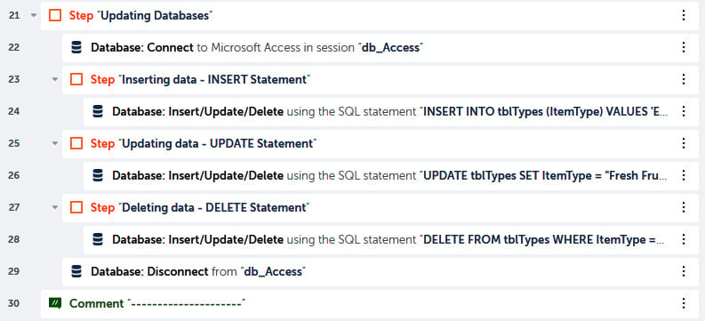


That\'s the final SQL statement! You now know how to automate all three
of the SQL action queries. This will allow you to add RPA automation to
your database-related manual tasks. Go ahead and run the bot. After the
bot has completed, the `ItemTypes` table should
be looking like this:


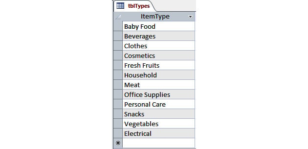


You can see that a new record with the value `Electrical` has
been inserted, the `Fruits` value has been updated to
`Fresh Fruits`, and the record with the `Cereal`
value has been deleted.


Summary 
=======


This lab has taken you into the world of automation with databases.
As you worked through the different walk-throughs, you have learned how
to connect to various types of databases, including using specific
connection strings. The lab showed you how to connect to Excel as a
database. Aside from connecting, you have acquired the skills needed to
read, update, insert, and delete data from your databases. All this
automation will help reduce the time you spend on manual tasks daily.

In the next lab, we will move away from working with applications
and start taking a look at building more efficient and robust bots. You
will start by looking at how to build modular-based bots. You will learn
how to create taskbots that are reusable and how to pass parameters
between multiple taskbots.
