Lab 16: Building Modular Bots and Sub-Tasks 
===========================================

In this lab, we will be using the following packages:


The walk-throughs will take you through designing your sub-bots. This
will result in building multiple bots that communicate with each other.
You will also learn how to achieve this by passing parameters between
them.

In this lab, we will cover the following:

-   Designing modular task bots
-   Running sub-task bots
-   Passing variables between main and sub-task bots
-   A working example walk-through


Technical requirements 
======================


In order to install the Automation Anywhere Bot agent, you\'ll need the
following:

-   Google Chrome
-   A completed registration with Automation Anywhere  Community
    Edition
-   A successful login to Automation Anywhere  Community Edition
-   A successfully registered local device
-   Successfully downloaded sample data from GitHub


Designing modular task bots 
===========================


For this lab, we will take a fictitious
scenario where you are a bot developer tasked with building a bot. The
walk-throughs will guide you from initial design to modular design right
through to actually building the bot. In a nutshell, the task for your
bot is this:

*Extracting all the tables and data from a specific SQLite database to a
new Excel workbook. The workbook should consist of a worksheet for each
table in the SQLite database.*

The following additional details are also given:

-   The local repository location is
    `C:\Hands-On-RPA-with-AA-Sample-Data\`.
-   The Excel spreadsheet should be named `Output.xlsx` and
    saved in the local repository folder. If this file already exists,
    it should be deleted and a new one should be created.
-   The SQLite database file is available in the GitHub repository; it
    is named `Chapter15_SQLite.db`.
-   Only the system tables should be extracted -- system tables are
    prefixed with `sqlite_`.
-   A new worksheet should be created for each table.
-   Each worksheet should be named as its respective source table name.
-   Only the first 20 records should be extracted for each table as this
    is only a prototype.

From the given specification, we have a concept of what actions the bot
should perform. As we now have an understanding of databases and Excel,
we can start by drafting an initial design. This
should look as shown in the following figure:


This design would serve its purpose and perform the task according to
the specification. The drawback is that the bot would only work for the
specified SQLite database. If a similar bot was needed to extract data
to Excel from a different database, you would have to create a new bot.
There really isn\'t any part of the design that could be extracted and
reused without modification. If we built a skeleton of this design using
Automation Anywhere with steps and comments, it would look something
like this:


Taking the initial design, we can start breaking
it down into smaller sub-tasks for our bot to perform. The idea is to
create sub-bots that can be run from a main bot. Each sub-bot should be
designed so it can be reused if needed by other bots in the future.

Looking at our scenario, we can break this down into one main task bot
and three sub-bots. The three sub-task bots would perform independent
tasks. These would be similar to the ones shown in the following figure:


With these three sub-task bots, our main task bot
would be like the controller bot. It would run the sub-task bots in the
correct order so the bot performs the complete process without any
issues. The main task bot design would be as shown in the following
figure:


You should now have a much clearer idea of how to build modular bots.
This example demonstrates how you can break a single bot into multiple
smaller bots, where each bot performs a reusable
task. The sub-bots are like building blocks ready to be utilized as and
when needed. In the next section, we will look at how you can run these
sub-task bots from within your main task bot.


Running sub-task bots 
=====================


For our given scenario, the main task bot runs
three sub-task bots. To run a sub-task bot from within your main task
bot, you need to use the **Task Bot** package. This package contains
actions such as **Pause**, **Run**, and **Stop**. The **Run** action
will run another task. The configuration of this action includes the
following:

-   Specifying the location of the task bot
-   Specifying any input variables
-   Specifying the repeatable status of the task

When a sub-task is actioned, Automation Anywhere will run that task, and
once it\'s completed, it returns back to the main task and continues
from the next line. Later on in this lab, there is a walk-through
that will take you through building our bot for this scenario. You will
build your sub-tasks and the main task. This will give you the practical
knowledge of applying the **Task bot: Run** action. Often you will need
to pass parameters to sub-tasks. In the next section, we will have a
look at passing variables between main and
sub-task bots.


Passing variables between main and sub-task-bots 
================================================


We want each sub-task to work independently, but
to do so they will need certain information. For example, the first
sub-bot that creates the Excel workbook will need to know the full file
path. This will allow it to delete the file if it exists and create a
new one. So, the bot can perform this task for any given file path. Each
sub-task can also output values; these always take the form of a
`Dictionary` type variable. The name of the variable that is
outputted is used as the key for this output dictionary. Whenever a
variable is created, you will have noticed the **Use as input** and
**Use as output** settings:


These settings define whether this variable will be provided as an input
value and/or it will be outputted as part of the `Dictionary`
variable to the calling task. The inputs and outputs for each task
should be as follows.


Sub-task 1 -- Create a new Excel workbook 
-----------------------------------------

This task will need the following inputs
and outputs:

-   **Inputs**: From the main task, the Excel file path as a
    `String` type variable -- `strFile_OutputXL`
-   **Outputs**: None


Sub-task 2 -- Get the non-system table names from a SQLite database 
-------------------------------------------------------------------

This task will need the
following inputs and outputs:

-   **Inputs**: From the main task, the SQLite database path as a
    `String` type variable -- `strFile_SqLiteDB`
-   **Outputs**: To the main task, all the table names separated by a
    comma and stored as a single `String` type variable --
    `strTableNames`


Sub-task 3 -- Copy the table data to Excel 
------------------------------------------

This task will need the following inputs and
outputs:

-   **Inputs**: From the main task, a SQLite database path as a
    `String` type variable -- `strFile_SqLiteDB`

    From the main task, an Excel file path as a `String` type
    variable -- `strFile_OutputXL`

    From the main task, the maximum number of records to extract as a
    `Number` type variable -- `numMaxRecords`

    From the main task, the table name as a `String` type
    variable -- `strTableNames`

-   **Outputs**: None


Main task -- Export the SQLite database tables to Excel 
-------------------------------------------------------

This task will need the
following inputs and
outputs:

-   **Inputs**: None

-   **Outputs**: The SQLite database path as a `String` type
    variable -- `strFile_SqLiteDB`

    The Excel file path as a `String` type variable --
    `strFile_OutputXL`

    The maximum number of records to extract as a `Number`
    type variable -- `numMaxRecords`

    The table name as a `String` type variable --
    `strTableNames`

This clearly outlines the communication of variables between the tasks.
We can see what inputs are needed for each task and what values will be
outputted. We have a complete picture of what our main and sub-tasks
should look like. In the next section, we can start actually building
our modular bot.


Working example walk-through 
============================


You will now start building the modular task bot
as described in our scenario. We have got the main and sub-bot designs
to guide us. We will build four bots in total -- one main task bot and
three sub-task bots. For this scenario, we will use the sample
`Chapter15_SQLite.db` database and will limit the records for
each table to 20. Firstly, let\'s give our bots some names; we will name
them as follows:

-   `Chapter16_Sub_CreateNewExcel`
-   `Chapter16_Sub_GetSqLiteTableNames`
-   `Chapter16_Sub_CopySqLiteTableToExcel`
-   `Chapter16_Main_SqLiteToExcel`

It always makes sense to start with the sub-tasks first. This will
enable us to build the main task quickly as we bolt the smaller
sub-tasks together. We will start the walk-through with the first
sub-task bot, `Chapter16_Sub_CreateNewExcel`.


Building a bot -- Chapter16\_Sub\_CreateNewExcel 
------------------------------------------------

This bot takes an Excel file path input and checks whether it exists. If
it does, then this file is deleted and a new file is created.

Let\'s start this walk-through by executing the following steps:

1.  Log in to **Control Room**.

2.  Create a new bot and call it
    `Chapter16_Sub_CreateNewExcel` in the `\Bot\`
    folder.

3.  Create a `String` type variable called
    `strFile_OutputXL` and set the following
    property:

    **Use as input**: *Checked*.

4.  Click on **Create**.

5.  Add a new **Comment** action as `"---------------------"`
    on line **1** and click on **Save**.

6.  Add a new **Comment** action as
    `"** Inputs: strFile_OutputXL"` on line **2** and click on
    **Save**.

7.  Add a new **Comment** action as `"---------------------"`
    on line **3** and click on **Save**.

8.  Add a new **Comment** action as
    `"-------- Check if file exists"` on line **4** and click
    on **Save**.

9.  To check whether the Excel file exists, add the **If** action just
    below line **4**.

10. Set the following properties for the **If** action on line **5**:

    **Condition**: **File exists**

    **File path**: `$strFile_OutputXL$`

    **How long you would like to wait for this condition to be true?**:
    `0`

    The properties should look as shown in the
    following figure:

    
    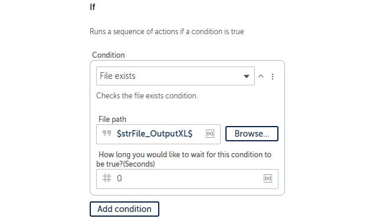
    


11. Click on **Save**.

12. Add a new **Comment** action just below line **5** as
    `"-------- Delete if file exists"`, ensuring that it is
    within the **If** action on line **5**.

13. Click on **Save**.

14. To delete the file, add the **File: Delete** action just below line
    **6**, ensuring that it is within the **If** action on line **5**.

15. Set the following properties for the **File: Delete** action on line
    **7**:

    **File**: `$strFile_OutputXL$`

    The properties should look as shown in the following figure:

    
    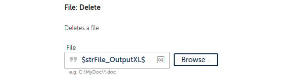
    


16. Click on **Save**.

17. Add a new **Comment** action just below line **7** as
    `"-------- Create new file"`, ensuring that it is not
    within the **If** action on line **5**.

18. Click on **Save**.

19. To create the Excel file, add the **Excel advanced: Create
    workbook** action just below line **8**.

20. Set the following properties for **Excel advanced: Create workbook**
    action on line **9**:

    **Session name**: `xl_Session`

    **File path**: `$strFile_OutputXL$`

    The properties should look as shown in the following figure:

    
    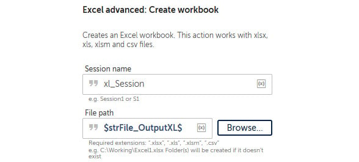
    


21. Click on **Save**.

22. To close the Excel session, add the **Excel advanced: Close** action
    just below line **9**.

23. Set the following properties for the **Excel advanced: Close**
    action on line **10**:

    **Session name**: `xl_Session`

    **Save changes when closing file**: *Checked*

    The properties should look as shown in the following figure:

    
    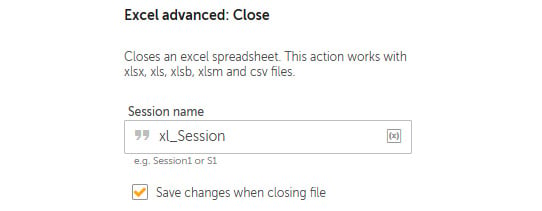
    


24. Click on **Save**.

25. Add a new **Comment** action just below line **10** as
    `"---------------------"` and click on **Save**. The
    development interface should look as shown in the following figure:


Great work! You have built your first sub-task
bot. Whenever you need to delete an existing Excel workbook and create a
new one, this bot will perform the task for you. Let\'s move on to the
second sub-task bot for getting the table names from the SQLite
database.


Building a bot -- Chapter16\_Sub\_GetSqLiteTableNames 
-----------------------------------------------------

This bot connects to a SQLite database and then runs a SQL statement to
get all the non-system table names. The statement we are using is as
follows:


```
SELECT name FROM sqlite_master WHERE type='table' and name Not Like 'sqlite%';Copy
```


The bot will then loop through all the records, appending the value to a
string while separating them with a comma. This string will be the
output variable. We will begin by creating the variables and adding the
comments.

Let\'s start this walk-through; follow the steps given here:

1.  Log in to **Control Room**.

2.  Create a new bot and call it
    `Chapter16_Sub_GetSqLiteTableNames` in the
    `\Bot\` folder.

3.  Create a `String` type variable
    called `strTableNames` and set the following property:

    **Use as output**: *Checked*

4.  Click on **Save**.

5.  Create a `String` type variable called
    `strFile_SqLiteDB` and set the following property:

    **Use as input**: *Checked*

6.  Click on **Save**.

7.  Create a `Record` type variable called
    `recTableName` and click on **Save**.

8.  Create a `Number` type variable called
    `numCounter` and click on **Save**.

9.  Add a new **Comment** action as `"---------------------"`
    on line **1** and click on **Save**.

10. Add a new **Comment** action as
    `"** Inputs: strFile_SqLiteDB"` on line **2** and click on
    **Save**.

11. Add a new **Comment** action as
    `"** Outputs: strTableNames"` on line **3** and click on
    **Save**.

12. Add a new **Comment** action as `"---------------------"`
    on line **4** and click on **Save**.

13. Add a new **Comment** action as
    `"-------- Initialize variables"` on line **5** and click
    on **Save**.

14. Add a new **Comment** action as
    `"--------- Get table names"` on line **6** and click on
    **Save**.

15. Add a new **Comment** action as
    `"-------- Create comma separated string"` on line **7**
    and click on **Save**.

16. Add a new **Comment** action as `"---------------------"`
    on line **8** and click on **Save**; your
    initial development interface should look like the following figure:

    
    
    


17. Firstly, we must initialize the output variable by adding the
    **String: Assign** action just below line **5**.

18. Set the following properties for **String: Assign** action on line
    **6**:

    **Select the source string variable(s) value (optional)**: *(null)*

    **Select the destination string variable**: **strTableNames -
    String**

    The properties should look as shown in the following figure:

    
    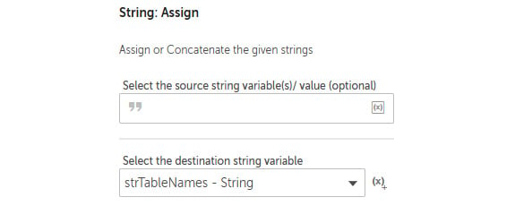
    


19. Click on **Save**.

20. Next, we initialize our `numCounter` variable by adding
    the **Number: Assign** action just below line **6**.

21. Set the following properties for the **Number: Assign** action on
    line **7**:

    **Select the source string variable/ value**: `0`

    **Select the destination number variable**: **numCounter - Number**

    The properties should look as shown in the following figure:

    
    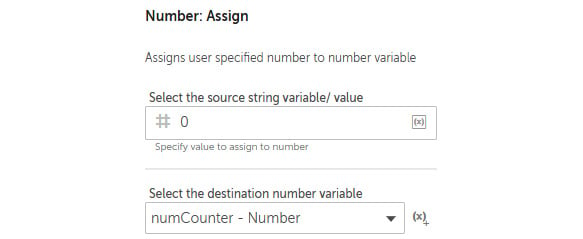
    


22. Click on **Save**. This section of the
    development interface should look as shown in the following figure:

    
    
    


23. Now we can start working with the SQLite database; first, to
    establish a connection, drag the **Database: Connect** action just
    below line **8**. You are now ready to start setting the properties.

24. Set the following properties for the **Database: Connect** action on
    line **9**:

    **Session name**: `db_SqLite`

    **Connection mode**: **User defined**

    **Database type**: **SqLite**

    **Database file path**: **Desktop file** --
    `$strFile_SqLiteDB$`

    The properties should look as shown in the
    following figure:

    
    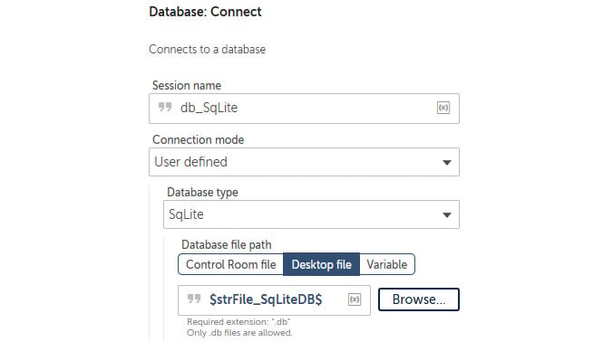
    


25. Click on **Save**.

26. To run the SQL statement to get the table names, add the **Database:
    Read from** action just below line **9**.

27. Set the following properties for the **Database: Read from** action
    on line **10**:

    **Session name**: `db_SqLite`

    **Enter SELECT Statement**:
    `SELECT name FROM sqlite_master WHERE type='table' and name Not Like 'sqlite%';`

    The properties should look as shown in the
    following figure:

    
    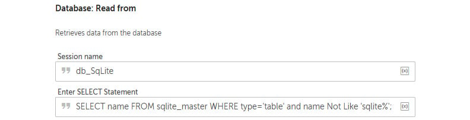
    


28. Click on **Save**; this section of the development interface should
    look as shown in the following figure:

    
    
    


29. The bot needs to loop through the resulting dataset and create a
    comma-separated string. To do this, we start by adding the **Loop**
    action; drag the **Loop** action just below line **11**.

30. Set the following properties for the **Loop** action on line **12**:

    **Loop Type**: **Iterator**

    **Iterator**: **For each row in a SQL query dataset**

    **Session name**: `db_SqLite`

    **Assign the current row to this variable**: **recTableName --
    Record**

    The properties should look as shown in the
    following figure:

    
    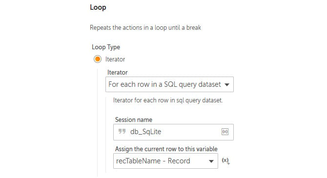
    


31. Click on **Save**.

32. As the bot is now in the **Loop** action, the counter needs to be
    incremented by adding the **Number: Increment** action just below
    line **12**, ensuring that it is within the **Loop** action on line
    **12**.

33. Set the following properties for the **Number: Increment** action on
    line **13**:

    **Enter number**: `$numCounter$`

    **Enter increment value**: `1`

    **Assign the output to variable**: **numCounter - Number**

    The properties should look as shown in the
    following figure:

    
    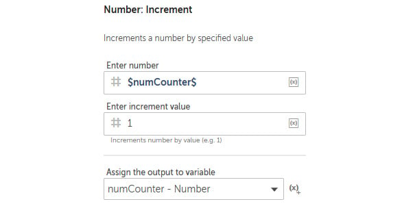
    


34. Click on **Save**.

35. As we build the comma-separated string, we must ensure that no comma
    is added before the first value. To do this, add the **If** action
    just below line **13**, ensuring that it is within the **Loop**
    action on line **12**.

36. Set the following properties for the **If** action on line **14**:

    **Condition**: **Number condition**

    **Source value**: `$numCounter$`

    **Operator**: **Equals to (=)**

    **Target value**: `1`

    The properties should look as shown in the
    following figure:

    
    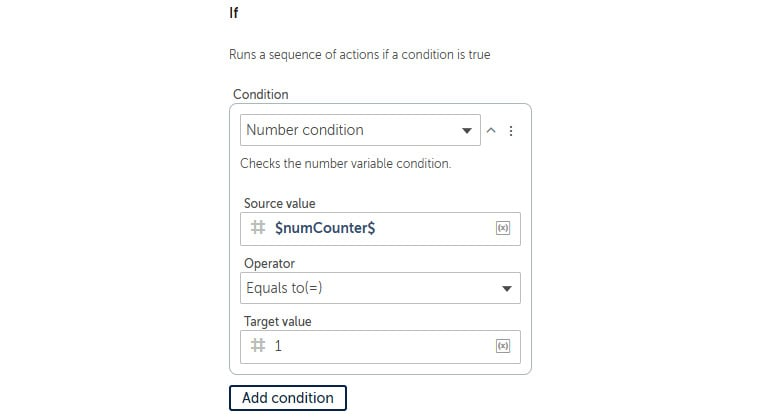
    


37. Click on **Save**.

38. Here, we assign the first value to the output string by adding the
    **String: Assign** action just below line **14**, ensuring that it
    is within the **If** action on line **14**.

39. Set the following properties for the **String: Assign** action on
    line **15**:

    **Select the source string variable value**:
    `$recTableName[0]$`

    **Select the destination string variable**: **strTableNames -
    String**

    The properties should look as shown in the
    following figure:

    
    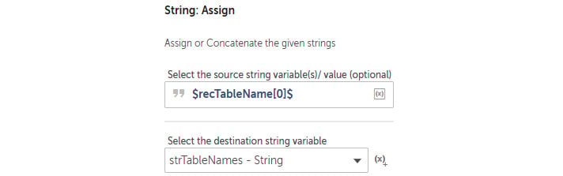
    


40. Click on **Save**.

41. To add all the table names following the first record, add the **If:
    Else** action just below line **15**, ensuring that it is within the
    **If** action on line **14**, and then click on **Save**.

42. Continue to add the comma-separated values to the output string by
    adding the **String: Assign** action just below line **16**,
    ensuring that it is within the **If: Else** action on line **16**.

43. Set the following properties for the **String: Assign** action on
    line **17**:

    **Select the source string variable value**:
    `$strTableNames $, $recTableName[0]$`

    **Select the destination string variable**: **strTableNames -
    String**

    The properties should look as shown in the
    following figure:

    
    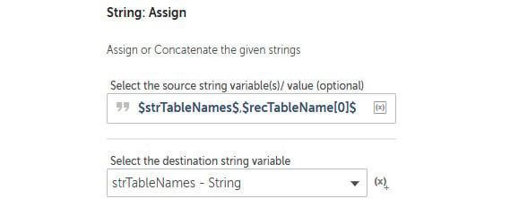
    


44. Click on **Save**.

45. We can now close the session by adding the **Database: Disconnect**
    action just below line **17**, ensuring that it is not within the
    **Loop** action on line **12**.

46. Set the following properties for the **Database: Disconnect** action
    on line **18**:

    **Session name**: `db_SqLite`

    The properties should look as shown in the following figure:

    
    
    


47. Click on **Save**; the development interface for this section should
    look as shown in the following figure:


Good job! That\'s the second sub-bot built. This bot will extract all
the non-system tables from any SQLite database. It just needs the
database file path. The output should be a comma-separated string.

Next, we move on to the last sub-task bot; this is where the bot needs
to produce the output data and file.


Building a bot -- Chapter16\_Sub\_CopySqLiteTableToExcel 
--------------------------------------------------------

Here, the bot is given an Excel workbook, a SQLite database, and a table
name. From this, the bot needs to connect to the database and extract
data from the given table. It should then output all that data to a new
worksheet on the given workbook. The SQL query that we will be using to
get all the data is as follows:


```
Select * from $strTableName$Copy
```


This bot will be broken down into two sections: the first will get the
data, and the second will output the data. We will
begin by creating the variables and adding some steps.

Let\'s start this walk-through by executing the following steps:

1.  Log in to **Control Room**.

2.  Create a new bot and call it
    `Chapter16_Sub_CopySqLiteTableToExcel` in the
    `\Bot\` folder.

3.  Create a `Table` type variable called
    `tblTableData` and click on **Save**.

4.  Create a `String` type variable called
    `strTableName` and set the following property:

    **Use as input**: *Checked*.

5.  Click on **Save**.

6.  Create a `String` type variable called
    `strFile_SqLiteDB` and set the following property:

    **Use as input**: *Checked*.

7.  Click on **Save**.

8.  Create a `String` type variable called
    `strFile_OutputXL` and set the following property:

    **Use as input**: *Checked*.

9.  Click on **Save**.

10. Create a `Number` type variable called
    `numMaxRecords` and set the following property:

    **Use as input**: *Checked*.

11. Click on **Save**.

12. Add a new **Comment** action as `"---------------------"`
    on line **1** and click on **Save**.

13. Add a new **Comment** action as
    `"** Inputs: numMaxRecords, strFile_OutputXL, strFile_SqLiteDB, strTableName"`
    on line **2** and click on **Save**.

14. Add a new **Comment** action as
    `"---------------------"` on line **3** and click on
    **Save**.

15. Add a new **Comment** action as
    `"-------- Initialize variables"` on line **4** and click
    on **Save**.

16. Add a **Step** just below line **4**, set the **Title** property as
    **Retrieve data from table**, and click on **Save**.

17. Add another **Step** just below line **5**, set the **Title**
    property as **Output data to workbook**, and click on **Save**.

18. Add a new **Comment** action on line 7 as,
    \"`-------------`\" and click on **Save**; your initial
    development interface should look as shown in the following figure:

    
    
    


19. To initialize our `Table` variable, add the **Data Table:
    Clear content** action just below line **4**.

20. Set the following properties for the **Data
    Table: Clear content** action on line **5**:

    **Data table name**: **tblTableData - Table**

    The properties should look as shown in the following figure:

    
    
    


21. Click on **Save**; the development interface for this section should
    look as shown in the following figure:

    
    
    


22. To establish the database connection, drag the **Database: Connect**
    action just below line **6**, ensuring that it is within the
    **Step** on line **6**.

23. Set the following properties for the **Database: Connect** action on
    line **7**:

    **Session name**: `db_SqLite`

    **Connection mode**: **User defined**

    **Database type**: **SqLite**

    **Database file path**: **Desktop file** --
    `$strFile_SqLiteDB$`

    The properties should look as shown in the
    following figure:

    
    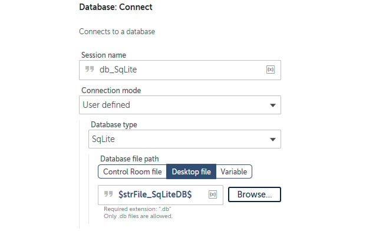
    


24. Click on **Save**.

25. Now we can configure the bot to extract the
    table data to a `Table` type variable. To do this, add the
    **Database: Export to data table** action just below line **7**,
    ensuring that it is within the **Step** on line **6**.

26. Set the following properties for the **Database: Export to data
    table** action on line **8**:

    **Session name**: `db_SqLite`

    **Enter SELECT Statement**: `Select * from $strTableName$`

    **Maximum number of records to fetch (optional)**:
    `$numMaxRecords$`

    **Assigned to**: **tblTableData - Table**

    The properties should look as shown in the following figure:

    
    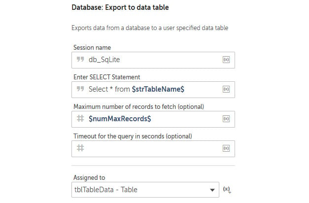
    


27. Now that the bot has this data assigned to a
    `Table` type variable, we can close the session by adding
    the **Database: Disconnect** action just below line **8**, ensuring
    that it is within the **Step** on line **6**.

28. Set the following properties for the **Database: Disconnect** action
    on line **9**:

    **Session name**: `db_SqLite`

    The properties should look as shown in the following figure:

    
    
    


29. Click on **Save**; the development interface for this section should
    look as shown in the following figure:

    
    
    


30. That\'s the first section done. We now have
    our dataset; to output it to our Excel workbook, we will begin by
    creating an Excel session. Add the **Excel advanced: Open** action
    just below line **10**, ensuring that it is within the **Step** on
    line **10**.

31. Set the following properties for the **Excel advanced: Open** action
    on line **11**:

    **Session name**: `xl_Session`

    **File path**: **Desktop file** - `$strFile_OutputXL$`

    **Open in**: **Read-write mode**

    The properties should look as shown in the following figure:

    
    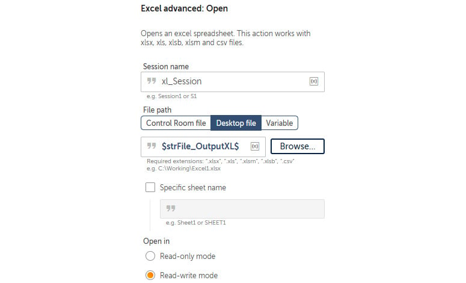
    


32. Click on **Save**.

33. To create the output worksheet, add the **Excel advanced: Create
    worksheet** action just below line **11**, ensuring that it is
    within the **Step** on line **10**.

34. Set the following properties for the **Excel advanced: Create
    worksheet** action on line **12**:

    **Session name**: `xl_Session`

    **Create sheet by**: **Name** -- `$strTableName$`

    The properties should look as shown in the following figure:

    
    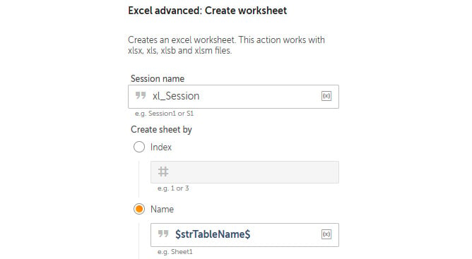
    


35. Click on **Save**.

36. To output the table data to this worksheet, add the **Excel
    advanced: Write from data table** action just below line **12**,
    ensuring that it is within the **Step** on line **10**.

37. Set the following properties for the **Excel advanced: Write from
    data table** action on line **13**:

    **Session name**: `xl_Session`

    **Enter data table variable**: **tblTableData - Table**

    **Enter worksheet name**: **Specific worksheet** --
    `$strTableName$`

    **Specify the first cell**: `A1`

    The properties should look as shown in the
    following figure:

    
    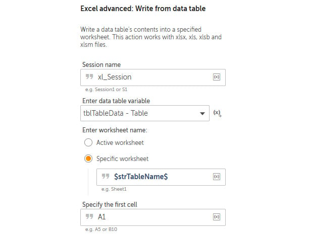
    


38. Click on **Save**.

39. Finally, we need to close the Excel session. Add the **Excel
    advanced: Close** action just below line **13**, ensuring that it is
    within the **Step** on line **10**.

40. Set the following properties for the **Excel advanced: Close**
    action on line **14**:

    **Session name**: `xl_Session`

    **Save changes when closing file**: *Checked*

    The properties should look as shown in the
    following figure:

    
    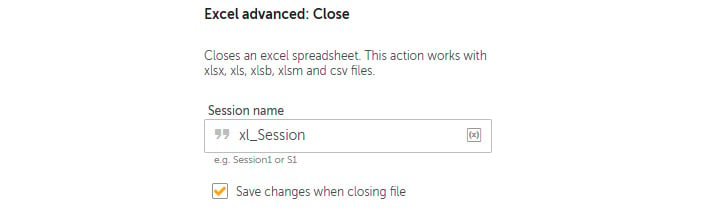
    


41. Click on **Save**, the development interface for this section should
    look as shown in the following figure:


Awesome progress! All the sub-bots are now built. All we need to do now
is to build the main bot so we can complete our
bot. In the next section, you will build the main bot and run the
sub-bots from within this main bot.


Building a bot -- Chapter16\_Main\_SqLiteToExcel 
------------------------------------------------

You are now ready to integrate all these smaller bots to perform the
overall task. We want our bot to run the first sub-bot, followed by the
second sub-bot. We then need to take the output from the second sub-bot
and split the comma-separated string into a list. The bot will then
iterate through this list while running the third bot. You will get the
practical experience of passing and receiving variables from these bots
as we build. We will begin by creating the
variables and adding some steps.

Let\'s start this walk-through by executing the following steps:

1.  Log in to **Control Room**.

2.  Create a new bot and call it
    `Chapter16_Main_SqLiteToExcel` in the `\Bot\`
    folder.

3.  Create a `String` type variable called
    `strTableName` and set the following property:

    **Use as output**: *Checked*.

4.  Click on **Save**.

5.  Create a `String` type variable called
    `strFile_SqLiteDB` and set the following property:

    **Use as output**: *Checked*.

6.  Click on **Save**.

7.  Create a `String` type variable called
    `strFile_OutputXL` and set the following property:

    **Use as output**: *Checked*.

8.  Click on **Save**.

9.  Create a `Number` type variable
    called `numMaxRecords` and set the following property:

    **Use as output**: *Checked*.

10. Click on **Save**.

11. Create a `List` type variable called
    `lstTableNames` and click on **Save**.

12. Create a `Dictionary` type variable with a subtype of
    `String`, name it `dctTableNames`, and click on
    **Save**.

13. Add a new **Comment** action as `"---------------------"`
    on line **1** and click on **Save**.

14. Add a new **Comment** action as
    `"** outputs: numMaxRecords, strFile_OutputXL, strFile_SqLiteDB, strTableName"`
    on line **2** and click on Save.

15. Add a new **Comment** action as `"---------------------"`
    on line **3** and click on **Save**.

16. Add a new **Comment** action as
    `"-------- Initialize variables"` on line **4** and click
    on **Save**.

17. Add a step just below line **4**, set the **Title** property as
    **Create Output Workbook**, and click on **Save**.

18. Add another step just below line **5**, set
    the **Title** property as
    `Get table names from SqLite database`, and click on
    **Save**.

19. Add another step just below line **6**, set the **Title** property
    as `Output to Excel`, and click on **Save**.

20. Add a new **Comment** action as `"---------------------"`
    on line **8** and click on **Save**. Your initial development
    interface should look as shown in the following figure:

    
    
    


21. As we did before, we\'ll initialize the variables first. Add the
    **String: Assign** action just below line **4**.

22. Set the following properties for the **String: Assign** action on
    line **5**:

    **Select the source string variable value**:
    `C:\Hands-On-RPA-with-AA-Sample-Data\Chapter16_Output.xlsx`

    **Select the destination string variable**: **strFile\_OutputXL -
    String**

    The properties should look as shown in the
    following figure:

    
    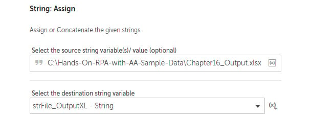
    


23. Click on **Save**.

24. Continue initializing variables; add the **String: Assign** action
    just below line **5**.

25. Set the following properties for the **String: Assign** action on
    line **6**:

    **Select the source string variable value**:
    `C:\Hands-On-RPA-with-AA-Sample-Data\ Chapter15_SQLite.db `

    **Select the destination string variable**: **strFile\_SqLiteDB -
    String**

    The properties should look as shown in the following figure:

    
    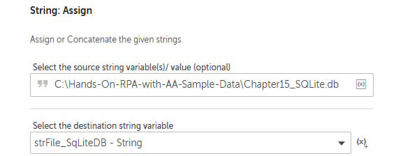
    


26. Click on **Save**.

27. Continue initializing variables; add the **Number: Assign** action
    just below line **6**.

28. Set the following properties for the **Number: Assign** action on
    line **7**:

    **Select the source string variable value**: `20`

    **Select the destination string variable**: **numMaxRecords -
    Number**

    The properties should look as shown in the following figure:

    
    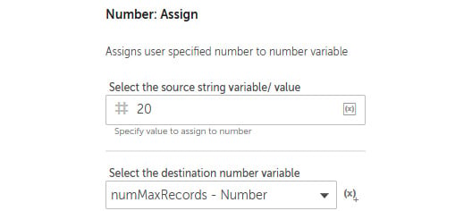
    


29. Click on **Save**; this section of the
    development interface should look as shown in the following figure:

    
    
    


30. Now we can configure the bot to run our first sub-bot and pass the
    `strFile_OutputXL` variable as a parameter. To do this,
    add the **Task Bot: Run** action just below line **8**, ensuring
    that it is within the **Step** on line **8**.

31. Set the following properties for the **Task Bot: Run** action on
    line **9**:

    **Task Bot to run**: **Control Room file** --
    `Bots\Chapter16_Sub_CreateNewExcel`

    **Input values**: **Set strFile\_OutputXL**: *Checked* -
    `$strFile_OutputXL$`

    **Do not repeat**: *Selected*

    The properties should look as shown in the
    following figure:

    
    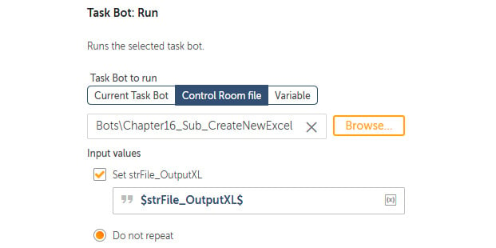
    


32. Click on **Save**; this section of the development interface should
    look as shown in the following figure:

    
    
    


33. Now it is time to call the second sub-task bot. To do this, add the
    **Task Bot: Run** action just below line **10**, ensuring that it is
    within the **Step** on line **10**.

34. Set the following properties for the **Task Bot: Run** action on
    line **11**:

    **Task Bot to run**: **Control Room file** --
    `Bots\Chapter16_Sub_GetSqLiteTableNames`

    **Input values**: **Set strFile\_SqLiteDB**: *Checked* -
    `$strFile_SqLiteDB$`

    **Do not repeat**: *Selected*

    **Assign the output to variable (optional)**: **dctTableNames --
    Dictionary of Strings**

    The properties should look as shown in the
    following figure:

    
    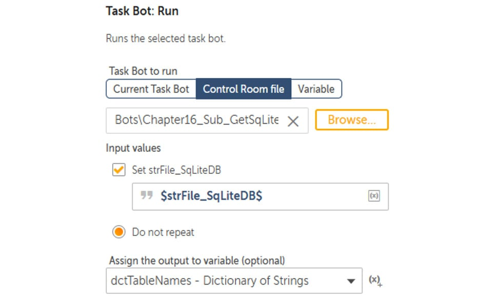
    


35. Click on **Save**; this section of the development interface should
    look as shown in the following figure:

    
    
    


36. The second sub-task bot will return a comma-separated string
    containing the table names from our database. To process this, the
    string will need to be assigned to a `List` type variable;
    to do so, we add the **String: Split** action just below line
    **13**, ensuring that it is within the **Step** on line **12**.

37. Set the following properties for the **String:
    Split** action on line **13**:

    **Source string**: `$dctTableNames{strTableNames}$`

    **Delimiter**: `,` *(comma)*

    **Delimiter is**: **Not case sensitive**

    **Split into substrings**: **All possible**

    **Assign the output to a list variable**: **lstTableNames -- List of
    Strings**

    The properties should look as shown in the following figure:

    
    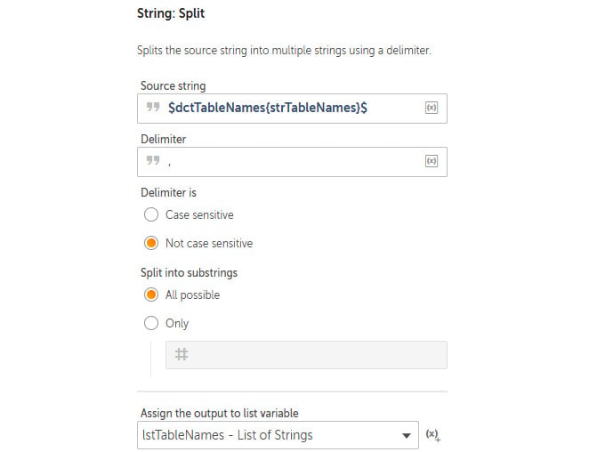
    


38. Click on **Save**.

39. Next, we will loop through the table name list and pass this value
    with the database and output file to the final sub-task bot. To add
    the loop, drag the **Loop** action just below line **13**, ensuring
    that it is within the **Step** on line **12**.

40. Set the following properties for the **Loop** action on line **14**:

    **Loop Type**: **Iterator**

    **Iterator**: **For each item in the list**

    **List**: **lstTableNames - List**

    **For**: **All items in the list**

    **Assign the current value to variable**: **strTableName -- String**

    The properties should look as shown in the
    following figure:

    
    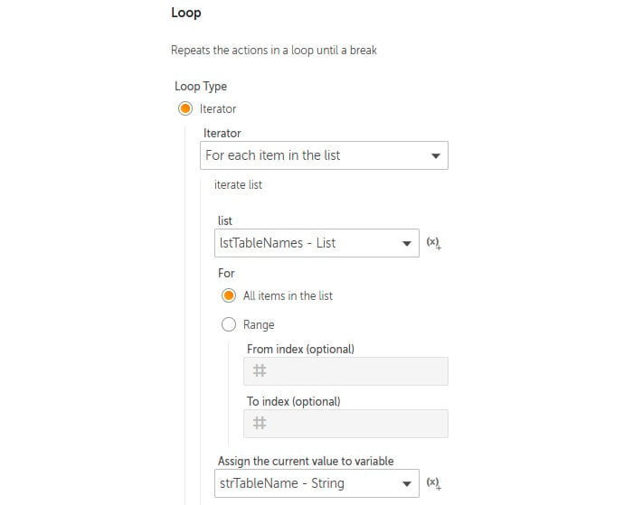
    


41. Click on **Save**.

42. To send these parameters to the final sub-task bot and run it, add
    the **Task Bot: Run** action just below line **14**, ensuring that
    it is within the loop on line **14**.

43. Set the following properties for the **Task Bot: Run** action on
    line **15**:

    **Task Bot to run**: **Control Room file** --
    `Bots\Chapter16_Sub_CopySqLiteTableToExcel`

    **Input values**: **Set strFile\_OutputXL**: *Checked* --
    `$strFile_OutputXL$`

    **Set strFile\_SqLiteDB**: *Checked* --
    `$strFile_SqLiteDB$`

    **Set strTableName**: *Checked* -- `$strTableName$`

    **Set numMaxRecords**: *Checked* -- `$numMaxRecords$`

    **Do not repeat**: *Selected*

    The properties should look as shown in the
    following figure:

    
    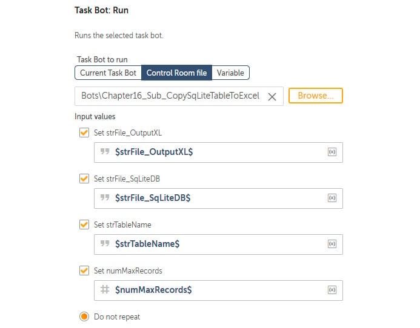
    


44. Click on **Save**. This section of the development interface should
    look as shown in the following figure:


Go ahead and run your main bot. It will run the
sub-bots and perform the whole process, and the sub-task bots can be
reused if needed. The output file should have multiple worksheets
containing 20 records from each table. It should look like this:


That\'s all complete. You have done some fantastic
work and have made great progress. You\'ve just built a modular bot that
runs three separate sub-task bots.


Summary 
=======


There has been a lot covered in this lab, giving you the skills
needed to understand and design modular bots. Taking this approach will
be a stepping stone to having your own library of smaller sub-bots. This
saves you from a lot of redevelopment effort, especially when automating
larger and complete processes. You have learned how to run a sub-bot
from within a bot, as well as how to pass parameters between these bots.
The real-life scenario walk-through provided practical experience of how
this actually works in the real world.

In the next lab, we will be looking beyond Automation Anywhere. You
will learn how to use external scripts, including VBScript and Python
scripts, to enhance the functionality of your bots. You will also
discover how to pass parameters between your scripts and your bot,
opening up even more automation possibilities.
