Lab 3: Overview of Automation Anywhere Control Room 
==============================================================================

In this lab, we go greater into detail about the **Control Room**
interface. Each section is explored, giving you hands-on experience with
the interface. You will learn about the dashboard, monitoring bot
activity, setting application credentials, device management, and user
management.

As part of the cloud-based infrastructure, all actions are now done via
the **Control Room** interface. We will look at this in more detail. It
is key that you can confidently navigate through the **Control Room**
interface. This interface is your single platform to design, build, and
manage your RPA solution. We will cover the following sections of
**Control Room** in this lab:

-   Exploring the home screen
-   Understanding the dashboard
-   Viewing RPA activity
-   Managing bots
-   Managing **My Devices**
-   Managing user administration

Technical requirements 
======================

The following requirements are necessary:

-   Google Chrome
-   Logged on successfully to Automation Anywhere Community Edition
-   A successfully registered local device

Exploring the Explore screen 
============================

The explore screen is the first interface presented
to you when you initially log on to **Control Room**. You will notice shortcuts to some of the exciting features available for you to explore:

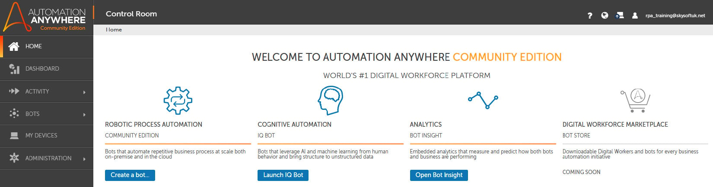

Getting familiar with the **Control Room** interface is important so
that you have a clearer understanding of how to best utilize all its
features. We will explore all sections of **Control Room**. The next
section is the dashboard, which shows more
information on the status of your activity and bots.

Understanding the Homepage 
===========================

The dashboard acts as the information and metrics
section. It is split into two main sections: the top section contains a
few shortcuts, while the bottom section shows bot metric data, as shown
in the following screenshot:

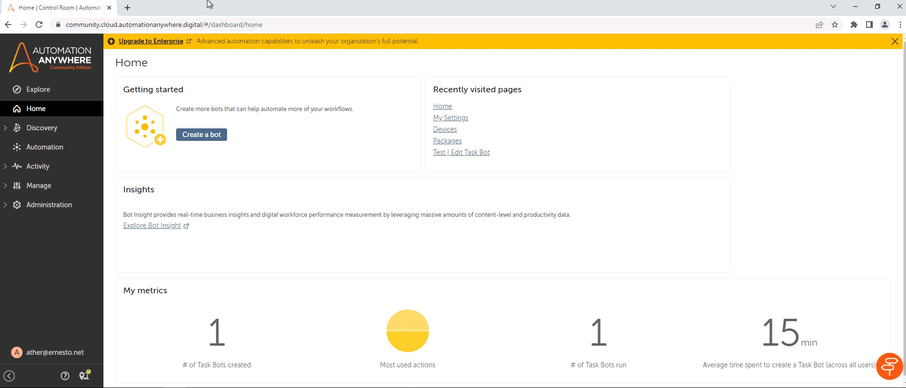

The available shortcuts on the dashboard are as follows:

-   Creating a new bot
-   Launching bot insights
-   Your recently visited pages

The metrics will display the number of bots you have created, data on
the success and failures of these bots, as well as performance-related
data. Other metric data is also available through bot insights,
including return on investment analysis, transactions processed in terms
of volumes and speed, and the efficiency of bots,
to name a few. As we have not built any bots yet, the metrics data will
be sparse.

The dashboard displays aggregated data for a period of time. We can view
the activity of individual bots in the next section. The **Activity**
section goes into a more granular level of detail about the metrics.

Viewing RPA activity 
====================

The **Activity** section shows the current and
historic status of your bots and devices. This is in the form of a list.
By clicking on the **ACTIVITY** option from the menu pane, you will see
the following interface:

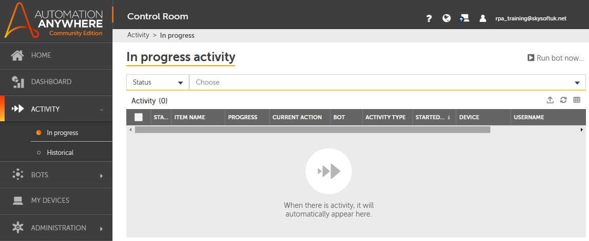

You can quickly identify which bot is running on which device. A device
is the desktop that bots are deployed to. In *Lab 2*,
*Installing Automation Anywhere*, we went through how to add, register,
and connect your local device.

There are two sub-sections to the **Activity** page, showing **In
progress** and **Historical**:

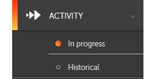

Both of these sub-sections display a list of your
bots or devices. The **In progress** list shows the bots that are
currently active, and the **Historical** screen lists bots with a
completed status. It displays all bots and all devices that are managed
within **Control Room**.

A number of options are available through the icons on the right, just
above the activity list:

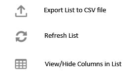

This list can be configured to show/hide different columns. A number of
columns are available, including **STATUS**, **CURRENT ACTION**,
**BOT**, **ACTIVITY TYPE**, **START TIME**, **USERNAME**, and
**DEVICE**, to name a few.

For the purpose of routine management reporting or further analysis, the
list can be exported as a CSV file. You can modify the columns you wish
to view or export. Here, you can see all the columns that are available.
Each one can be set to be visible or hidden:

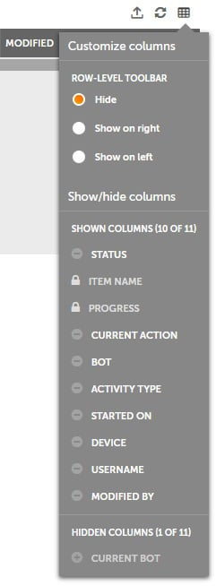

You can also search and apply a filter to the list of bots or devices.
The search and filter functions are available in the top part of each
sub-section, as shown in the following screenshot:

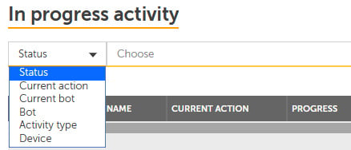

So far, all the sections we\'ve seen really come
into force once you have built and deployed some bots. They help monitor
and manage your bots and deployment.

The next section we will look at is **BOTS**. This section concentrates
more on bot development.

Managing bots 
=============

Bot management and deployment are performed in
this section. The **BOTS** section is one of the key sections when it comes to
building and managing bots.

My bots 
-------

All your bots are visible here. They are presented
via folders and files related to your bots. Automation Anywhere 
uses a pre-defined file structure, the root folder being
`Bots`. This folder structure is an exclusive storage area for
your account. Within the root folder, you can create new folders, the
standard practice being to create a folder for each individual bot or a
bot category.

Click on `Automation` from the left menu. As you can see, the folder structure is displayed
on the left pane and the contents on the right:

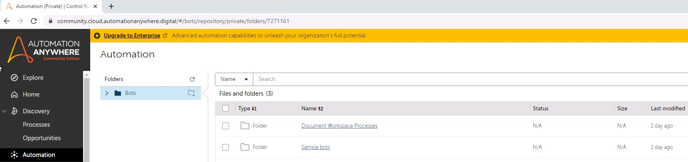

There are a few options available for each file and folder within this
interface, as shown in the following screenshot:

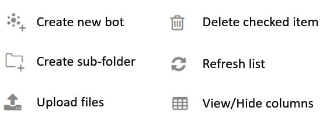

There is also a search facility available to help
find your bot files more easily.

As you build your bots, you may need to access secure desktop or web
applications that need log-in credentials. The next sub-section
describes a feature used to manage these credentials.

Credentials 
-----------

The **Credentials** sub-section has three tabs. These are **MY
CREDENTIALS**, **LOCKERS**, and **CREDENTIAL REQUESTS**. All
credentials are created under the **CREDENTIALS** tab.

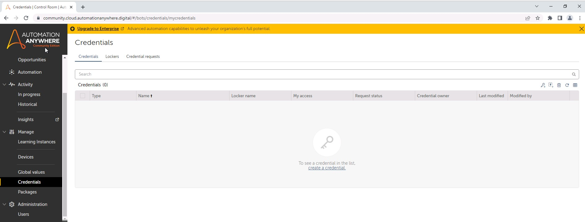

When we build a bot, it performs a series of actions. Automation
Anywhere has hundreds of these actions available. They are
all categorized into groups that are known as **packages**.

Packages 
--------

A package is essentially a group of actions
available to build the tasks you want to perform. This list can be
customized to view or hide columns as needed. A **Search** facility is
also available to help find the required package, as shown in the
following screenshot:

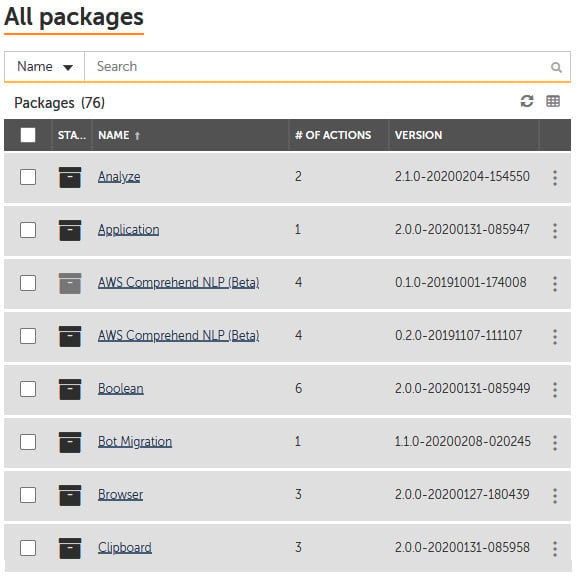

Each package may have several versions. These can be managed, allowing
specific versions to be used for each bot. From the preceding package
list, you can see how many actions each package consists of. You will
see the following options for each package:

-   **Versions available**
-   **Actions available**
-   **Iterators available**

As new actions are added or old ones are
superseded, any version of a particular package can be used. The version
is selected via the drop-down version selection menu in the top pane.

The following screenshot shows the **Email** package as an example. The
package details show the package version at the top, followed by actions
and iterators:

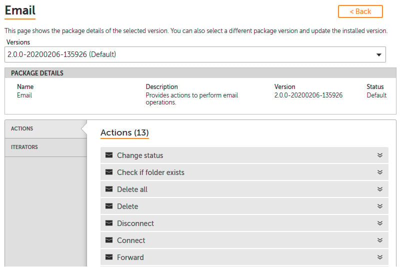

You can see the list of actions that the bot can use when working with
email automation. This is a comprehensive list, including actions such
as **Change status**, **Delete**, **Forward**, **Reply**, **Send**, and
so on.

In the following screenshot, we can see that an iterator is also
available to help with our bot:

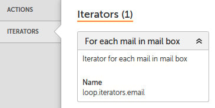

This means a pre-defined function is available
that will loop through a specified mailbox. As packages are updated and
new ones available, this will be presented here in the **Packages**
sub-section. This is all done automatically, as Automation Anywhere is a
cloud-based application.

Once bots are built, they need to be deployed to a device. In the next
section, we will look at **My devices**.

Managing your devices 
=====================

Building bots aside, we need to deploy them to
desktops. These can come in the form of laptops, desktop machines,
virtual machines, and so on. In this section, all your devices are
listed. Every device that needs to be deployed should be on this list.
By selecting the **DEVICES** option from the menu pane, you will see
the following interface:

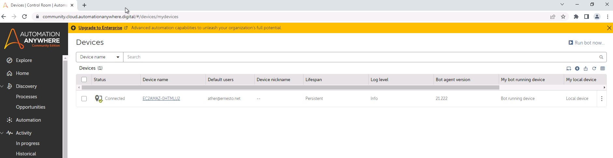

To set this up, a device needs to be installed with a Bot agent and
registered and connected to the control room.

In the previous lab, we went through the
process of setting a device up and connecting it to the **Control Room**. All your devices that are available on the network can be set up
in the same way.

After your devices are set up, the users need to be set up and
configured. User setup is done through the administration section.

Managing user administration 
============================

This is the centralized location where all users
are set up. You can set the type of user, as well as allocate the type
of license for them. By selecting **Users** from the **ADMINISTRATION**
option on the menu pane, you will see the following interface:

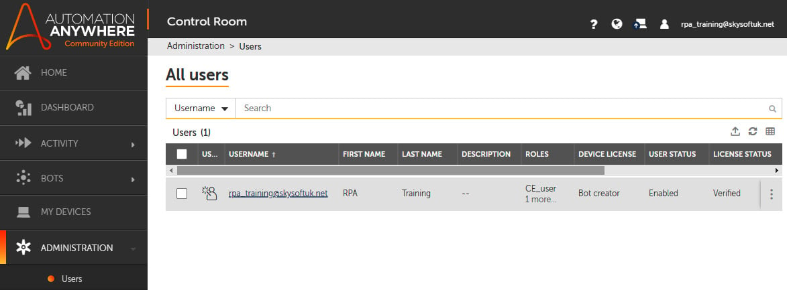

The easy-to-use intuitive interface of Automation Anywhere **Control
Room** makes managing bots, devices, and users very easy.

Summary 
=======

You should now be comfortable with Automation Anywhere\'s user
interface, having a clearer understanding of all the configurations
needed to design and support your bot. You will understand why features
such as security, reusability, and a simple interface make Automation
Anywhere an award-winning RPA tool and one of the industry leaders. You
should now have an overview of the **Control Room** interface and its
features.

In the next lab, we will look at the development interface. You will
learn how to navigate the hundreds of actions available, as well as the
different methods available to build a bot. Automation Anywhere provides
a graphical interface to map out a process as well as a
drag-and-drop-based option. These are the three methods for building and
designing a bot: *Flow*, *List*, and *Dual*. You will also understand
bot packages in more detail, as well as dependencies and properties.

All this will set you up to start building your first working bot using
Automation Anywhere .
