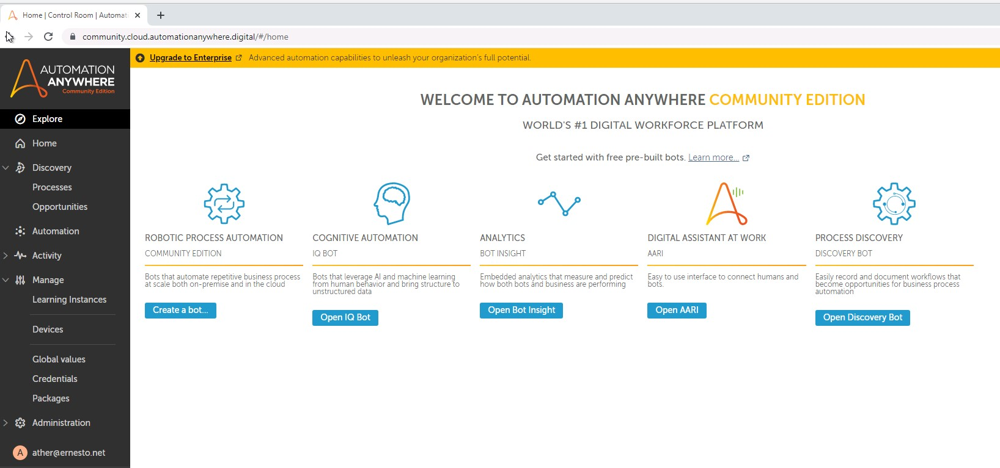
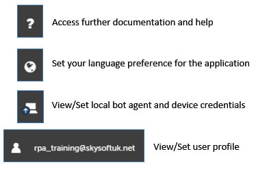
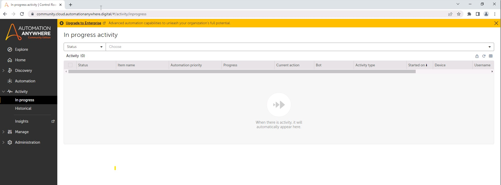
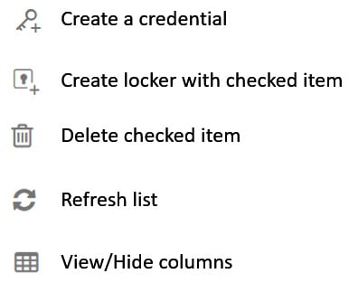
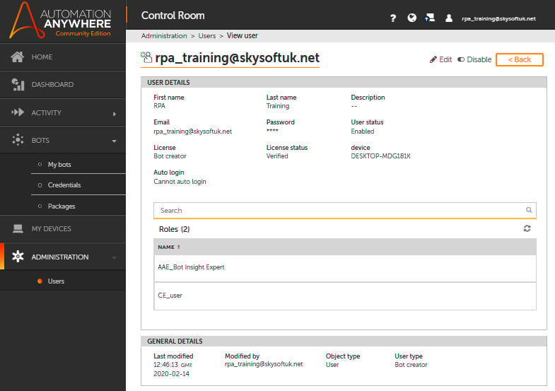

Lab 3: Overview of Automation Anywhere Control Room 
==============================================================================

Understanding the **Control Room** interface is key when building,
deploying, and managing bots. **Control Room** is used to perform all
these tasks. It has a very *easy-to-use* intuitive interface. The
interface is designed with a pane on the left-hand side used as a
navigation bar, which lists the main sections and sub-sections of the
control room. The main desktop area has all the functionality and
features for each section.

In the previous lab, you learned how to connect your device to the
control room and get ready to start building bots. Before we actually
build a bot, it is important that you have a clear understanding of the
user interface.

In this lab, we go greater into detail about the **Control Room**
interface. Each section is explored, giving you hands-on experience with
the interface. You will learn about the dashboard, monitoring bot
activity, setting application credentials, device management, and user
management.

As part of the cloud-based infrastructure, all actions are now done via
the **Control Room** interface. We will look at this in more detail. It
is key that you can confidently navigate through the **Control Room**
interface. This interface is your single platform to design, build, and
manage your RPA solution. We will cover the following sections of
**Control Room** in this lab:

-   Exploring the home screen
-   Understanding the dashboard
-   Viewing RPA activity
-   Managing bots
-   Managing **My Devices**
-   Managing user administration

Technical requirements 
======================

In order to install Automation Anywhere  Community Edition, the
following requirements are necessary:

-   Windows operating system version 7 or higher
-   A processor with a minimum speed of 3 GHz
-   Minimum of 4 GB RAM
-   At least 100 MB hard disk space
-   Internet Explorer v10 or higher OR Chrome v49 or higher
-   A minimum screen resolution of 1024\*768
-   An internet connection with a minimum speed of 10 Mb/sec
-   Completed registration with Automation Anywhere  Community
    Edition
-   Logged on successfully to Automation Anywhere  Community
    Edition
-   A successfully registered local device

Exploring the home screen 
=========================

The home screen is the first interface presented
to you when you initially log on to **Control
Room**. You will notice shortcuts to some of the exciting features
available for you to explore:

There are a number of options and information available in the top-right
panel. These are as follows:

The main navigation menu is on the left-hand side of the home
screen. This will take you into the different
sections of **Control Room**. We will explore each section further in
this lab.

On the main window of the home screen, there are four shortcuts
available. These are for the following:

-   **Create a Bot**: Launches the interface to quickly get you started
    in building your bots
-   **Launch IQ Bot**: Launches the artificial intelligence and machine
    learning tool
-   **Open Bot Insight**: Launches the data collection and analysis tool
-   **BotStore**: When available, this will launch the platform to
    market and sell your bots to a wide consumer marketplace.

The home screen serves as the landing screen when you log on to the new
Automation Anywhere platform. It provides you with an introduction to
the features available to support your bot production and management.

Getting familiar with the **Control Room** interface is important so
that you have a clearer understanding of how to best utilize all its
features. We will explore all sections of **Control Room**. The next
section is the dashboard, which shows more
information on the status of your activity and bots.

Understanding the dashboard 
===========================

The dashboard acts as the information and metrics
section. It is split into two main sections: the top section contains a
few shortcuts, while the bottom section shows bot metric data, as shown
in the following screenshot:

The available shortcuts on the dashboard are as follows:

-   Creating a new bot
-   Launching bot insights
-   Your recently visited pages

The metrics will display the number of bots you have created, data on
the success and failures of these bots, as well as performance-related
data. Other metric data is also available through bot insights,
including return on investment analysis, transactions processed in terms
of volumes and speed, and the efficiency of bots,
to name a few. As we have not built any bots yet, the metrics data will
be sparse.

The dashboard displays aggregated data for a period of time. We can view
the activity of individual bots in the next section. The **Activity**
section goes into a more granular level of detail about the metrics.

Viewing RPA activity 
====================

The **Activity** section shows the current and
historic status of your bots and devices. This is in the form of a list.
By clicking on the **ACTIVITY** option from the menu pane, you will see
the following interface:

You can quickly identify which bot is running on which device. A device
is the desktop that bots are deployed to. In *Lab 2*,
*Installing Automation Anywhere*, we went through how to add, register,
and connect your local device.

There are two sub-sections to the **Activity** page, showing **In
progress** and **Historical**:

Both of these sub-sections display a list of your
bots or devices. The **In progress** list shows the bots that are
currently active, and the **Historical** screen lists bots with a
completed status. It displays all bots and all devices that are managed
within **Control Room**.

A number of options are available through the icons on the right, just
above the activity list:

This list can be configured to show/hide different columns. A number of
columns are available, including **STATUS**, **CURRENT ACTION**,
**BOT**, **ACTIVITY TYPE**, **START TIME**, **USERNAME**, and
**DEVICE**, to name a few.

For the purpose of routine management reporting or further analysis, the
list can be exported as a CSV file. You can modify the columns you wish
to view or export. Here, you can see all the columns that are available.
Each one can be set to be visible or hidden:

You can also search and apply a filter to the list of bots or devices.
The search and filter functions are available in the top part of each
sub-section, as shown in the following screenshot:

So far, all the sections we\'ve seen really come
into force once you have built and deployed some bots. They help monitor
and manage your bots and deployment.

The next section we will look at is **BOTS**. This section concentrates
more on bot development.

Managing bots 
=============

Bot management and deployment are performed in
this section. This is broken down into four sub-sections, which are
accessible from the main menu pane on the left:

The **BOTS** section is one of the key sections when it comes to
building and managing bots. We will look further
into each sub-section in greater detail.

My bots 
-------

All your bots are visible here. They are presented
via folders and files related to your bots. Automation Anywhere 
uses a pre-defined file structure, the root folder being
`Bots`. This folder structure is an exclusive storage area for
your account. Within the root folder, you can create new folders, the
standard practice being to create a folder for each individual bot or a
bot category.

As you can see, the folder structure is displayed
on the left pane and the contents on the right:

There are a few options available for each file and folder within this
interface, as shown in the following screenshot:

There is also a search facility available to help
find your bot files more easily.

As you build your bots, you may need to access secure desktop or web
applications that need log-in credentials. The next sub-section
describes a feature used to manage these credentials.

Credentials 
-----------

For any application that requires credentials, it
is recommended not to store these credentials within your task bots. For
added security, all credentials should be secured in **Automation
Anywhere\'s Credential Vault**. To achieve this, the following steps
should be executed:

1.  Create a credential with the required attributes; that is, a
    username/password.
2.  Add this credential to a locker.
3.  Grant the bot access to the locker.

The bot can now get this specific credential to access the application.

The **Credentials** sub-section has three tabs. These are **MY
CREDENTIALS**, **MY LOCKERS**, and **CREDENTIAL REQUESTS**. All
credentials are created under the **MY CREDENTIALS** tab. These can be
grouped and stored within lockers. Grouping can be done for applications
or a specific category. For example, a single application may need
multiple credentials for various tasks. In this case, you would create
individual credentials and put them all in one locker. The final
**CREDENTIAL REQUESTS** tab is an informative tab showing all the
requests that have been made for any credentials. You can see in the
following screenshot the **Credentials** interface showing the three
different tabs:

The options available for credentials are shown in
the following screenshot:

When we build a bot, it performs a series of actions. Automation
Anywhere has hundreds of these actions available. They are
all categorized into groups that are known as
**packages**.

Global values 
-------------

**Global values** is a way to configure constant
values that can be used multiple times by multiple bots. This feature is
not available with the Community version that we are using.

Packages 
--------

A package is essentially a group of actions
available to build the tasks you want to perform. This list can be
customized to view or hide columns as needed. A **Search** facility is
also available to help find the required package, as shown in the
following screenshot:

Each package may have several versions. These can be managed, allowing
specific versions to be used for each bot. From the preceding package
list, you can see how many actions each package consists of. You will
see the following options for each package:

-   **Versions available**
-   **Actions available**
-   **Iterators available**

As new actions are added or old ones are
superseded, any version of a particular package can be used. The version
is selected via the drop-down version selection menu in the top pane.

The following screenshot shows the **Email** package as an example. The
package details show the package version at the top, followed by actions
and iterators:

You can see the list of actions that the bot can use when working with
email automation. This is a comprehensive list, including actions such
as **Change status**, **Delete**, **Forward**, **Reply**, **Send**, and
so on.

In the following screenshot, we can see that an iterator is also
available to help with our bot:

This means a pre-defined function is available
that will loop through a specified mailbox. As packages are updated and
new ones available, this will be presented here in the **Packages**
sub-section. This is all done automatically, as Automation Anywhere is a
cloud-based application.

Once bots are built, they need to be deployed to a device. In the next
section, we will look at **My devices**.

Managing your devices 
=====================

Building bots aside, we need to deploy them to
desktops. These can come in the form of laptops, desktop machines,
virtual machines, and so on. In this section, all your devices are
listed. Every device that needs to be deployed should be on this list.
By selecting the **MY DEVICES** option from the menu pane, you will see
the following interface:

To set this up, a device needs to be installed with a Bot agent and
registered and connected to the control room.

In the previous lab, we went through the
process of setting a device up and connecting it to the **Control
Room**. All your devices that are available on the network can be set up
in the same way.

After your devices are set up, the users need to be set up and
configured. User setup is done through the administration section.

Managing user administration 
============================

This is the centralized location where all users
are set up. You can set the type of user, as well as allocate the type
of license for them. By selecting **Users** from the **ADMINISTRATION**
option on the menu pane, you will see the following interface:

Each user can be configured and roles can be
allocated. By selecting or creating a user, you can configure all the
details shown in the following screenshot:

All users are managed here. You can assign a specific role to a user,
such as Bot agent (Bot agents have no access to the underlying code but
can only run a bot), bot creator, and custom-defined roles. Also,
a different device can be allocated to each user.

The easy-to-use intuitive interface of Automation Anywhere **Control
Room** makes managing bots, devices, and users very easy.

Summary 
=======

You should now be comfortable with Automation Anywhere\'s user
interface, having a clearer understanding of all the configurations
needed to design and support your bot. You will understand why features
such as security, reusability, and a simple interface make Automation
Anywhere an award-winning RPA tool and one of the industry leaders. You
should now have an overview of the **Control Room** interface and its
features.

In the next lab, we will look at the development interface. You will
learn how to navigate the hundreds of actions available, as well as the
different methods available to build a bot. Automation Anywhere provides
a graphical interface to map out a process as well as a
drag-and-drop-based option. These are the three methods for building and
designing a bot: *Flow*, *List*, and *Dual*. You will also understand
bot packages in more detail, as well as dependencies and properties.

All this will set you up to start building your first working bot using
Automation Anywhere .
