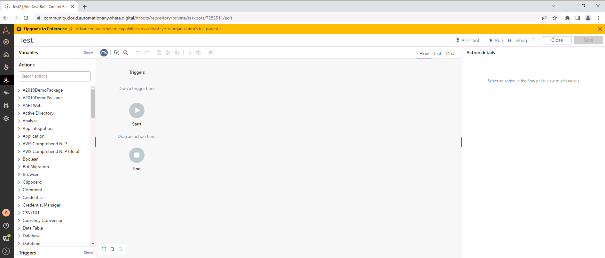
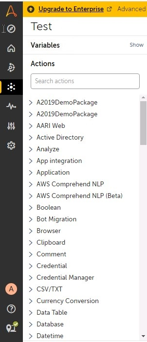

Lab 4: Overview of the Automation Anywhere Development Interface 
===========================================================================================

In this lab, we will cover the following topics:

-   Bot development interface
-   What can a bot do?
-   Programming techniques using Automation Anywhere
-   Variables and triggers
-   Debugging and dependencies

Technical requirements 
======================

In order to install the Automation Anywhere Bot agent, the following is
required:

-   Web browser: Google Chrome
-   Completed registration with Automation Anywhere  Community Edition
-   Successful logon to Automation Anywhere  Community Edition
-   Successful registration of a local device

Bot development interface 
=========================

The development interface is where all the magic
happens. This is where bots are created, edited, and debugged. In order
to look at what it has to offer, you need to start by creating a new
bot. Let\'s dive straight into creating a bot so that we can explore the
development interface.

Creating a new bot 
------------------

There are a number of shortcuts available to
create a new bot. The following steps will guide you through the process
of creating a new bot:

1.  Log in to the **Control Room**.

2.  Navigate to the **Automation** section.

3.  Select the **My bots** sub-section:
    
    

4.  Click on the **Create a bot** icon from the
    icon options in the top-right corner:

    

5.  The following bot properties dialog is presented:
 
    
    
6.  Set the following properties for your bot:

    **Name**: `Test`

    **Description (optional)**: `Test Bot`

    **Folder**: `\Bots\`

7.  Click on the **Create & edit** button. This will open the
    development interface:

    
    

Great! You have now created a new bot and have
access to the full development interface. So, what\'s the next step? In
the next section, we will look at what functionality is available. You
will learn about some of the key tasks your bot will be able to
automate.

What can a bot do? 
==================

We are now ready to start looking at what
functionality Automation Anywhere offers as regards bot development.
There are hundreds of actions available to help automate your tasks. All
the options are listed on the left pane. These actions are grouped into
categories known as **packages**. Each package is
a collection of individual actions. Here you can see the list pane
showing all the available packages:

Programming techniques using Automation Anywhere 
================================================

Building tasks for your bot using Automation
Anywhere is comparatively easier than other
scripting languages, such as VBScript, JavaScript, or Python. To make a
bot perform a task, you give it a list of actions. These actions are
executed in a sequential manner. To put it simply, the bot will run
through a list of actions. These actions, put together, become a task.
The complete list is what makes a taskbot.

There are three different ways to visualize your bot actions. These are
Flow, List, and Dual. The default view is Flow when you initially create
a bot. You can switch between the three ways by selecting the desired
tab located on the top pane of the interface, as shown in the following
screenshot:

Let\'s explore the three views in more detail. Before we do this, we
will add a simple action for the bot to perform. We will add a message
box; the following steps will walk you through the process of adding a
message box action:

1.  Select the **List** view from the view selection tab at the top and
    expand the **Message box** package:

    
    
    

2.  Drag and drop the **Message box** action to the development pane,
    between **Start** and **End**:

    
    
    

3.  You will now see your first action set for your bot along with the
    properties pane on the right.

4.  This action needs to be configured by setting its attributes and
    properties. The properties available will vary depending on the type
    of action.

5.  Set the following properties for the **Message box** action:

    
    
    

6.  As this action is the first instruction for your bot, it is set as
    instruction number 1. Every action you set will have a number. This
    is also referred to as a line number.

7.  You can collapse the properties pane when you are not using it. Just
    hover over and click the collapse icon to hide it:

You have now created a bot that will perform a very basic task of
displaying a **Message box**. We can take a look at the different views
available to help us build our functionality further.

List view 
---------

You have used this so far to add the **Message
box** action. In this view, all actions are listed, similar to a script.
The line number provides the logical workflow of the task:

You can also see the same task represented
graphically. This is effected by using the **Flow** view.

Flow view 
---------

The **Flow** view shows your task actions as a
flowchart. As you can see, this provides a more visual process flow of
how your bot works through the workflow. The line numbers are omitted as
they are not necessary:

You can change the size of the flow diagram using
the sizing options on the bottom left. These options are as follows:

An alternative view is the **Dual** view. This is a combination of both
the **List** and **Flow** views.

Dual view 
---------

You are shown both views here side by side. This
gives the best of both worlds. The views are totally synchronized with
one another. If you select an action on either view, it will also be
selected in the other view. This makes navigation and editing much
easier:

By selecting any action on any view, the properties window will appear
on the left to edit. To add actions while using the **Flow** view
independently or in **Dual**, you simply drag and drop the action to the
required position.

Whenever you want to execute a bot, it needs to be saved. A bot will
always be executed from the last saved version.
Let\'s test our bot so far:

1.  Click on the **Save** button in the top-right pane:

    
    
    

2.  Click on **Run** to execute the bot.

3.  While the bot is executing, a progress window will appear in the
    bottom-left corner. This shows what line number the bot is currently
    running. This progress window gives a real-time view of what action
    is being performed. It is useful for testing and debugging your bot:

    
    
    

4.  The **Message Box** should be displayed as your bot runs the action:

    
    
    

5.  Click on the **Close** button in **Message Box**. Once the bot has
    completed, you will be presented with the
    following:

Congratulations on building a simple bot and running it successfully! In
the next section, we will be looking at variables and triggers. These
are essential to any type of development.

Variables and triggers 
======================

As we build more functionalities, we will need to understand how to use
the basics of programming. One of the key elements of programming is
assigning and reading variables. Automation Anywhere  can handle a
variety of variable types, including numeric, string, list, array, date,
and Boolean. We will demonstrate how to create, assign, and read a
variable through the
following walk-through:

1.  Click on **Show** for the **Variables** tab from the option pane on
    the left:

    
    
    

2.  Click on the **+** icon to create a new variable:

    
    
    

3.  This will launch the **Create variable**
    dialog box:

    
    
    

4.  You will notice from the **Type** variable drop-down list all the
    different data types that are available for your variables:

    
    
    

5.  Set the following properties to create a new
    variable:

    **Name**: `strName`

    **Type**: **String**

    **Default Value**: *(Enter your name)*

    The **Create variable** dialog box should look similar to this:

    
    
    

6.  Click on **Create** and then click on
    **Save**.

7.  Select the **Message box** action on line **1** that we created
    earlier so the properties can be updated to include the
    `strName` variable value:

    
    
    

8.  Modify the following property value:

    **Enter the message to display**: `Hello $strName$`

9.  The property value should look like this:

    
    
    

10. Click on **Save**.

11. Now, let\'s run the bot by clicking on **Run**. You should get a
    **Message Box** with your name:

You have successfully created a `String` type variable and
assigned your name to it. The value was read by the bot and output to a
**Message Box**.

We will now take a look at triggers. Once a bot is built, we may need to
execute it when a specific event occurs. This is often when a specific
file or folder is created, deleted, or modified. We will create a
trigger, setting our bot to run when a specific file is modified.
Perform the following steps to create this
trigger:

1.  Create the following folder: `C:\RPA\`.

2.  Create a text file in this folder called
    `TriggerFile.txt`. We now have a file that can be used to
    initiate a trigger.

3.  Click on **Show** on the **Triggers** tab from the option pane on
    the left:
 
    
    

4.  Expand the **Files & folders** trigger group:

    
    

5.  To create a new file trigger, select and drag the **File trigger**
    option to the **Triggers** section in your development window. Your
    interface should look like this:

    
    
    

6.  Set the following properties for the new
    **Files & folders: File trigger**:

    **File**: `C:\RPA\TriggerFile.txt`

    **Start the bot when the file is...**: **modified**

    The trigger properties should look similar to this:

    
    
    

7.  Click on **Save**.

8.  To run the bot with triggers, click on **Run**
    and, from the dropdown, select **Run with triggers**:

    
    
    

9.  The bot will be deployed to your device. It will then wait for the
    trigger event to be true. This is known as listening for triggers.
    The following message box should appear as it listens for the
    trigger:

    
    
    

10. Open, edit, and save the
    `TriggerFile.txt` trigger file that we created. You will
    notice the bot start and execute once you have saved the file:

You can `Stop` the bot now.

Great! You have now successfully added a trigger to your bot. You can
add multiple triggers if required. In the next section, we will be
taking a look at debugging and assigning dependencies to your bots.

Debugging and dependencies 
==========================

Once we have built a bot, it needs to be tested. Being able to identify
the root cause of any issue requires good troubleshooting skills. In
order to help us troubleshoot, Automation Anywhere has
a debugging tool. It allows you to go through each
line one by one, so you can examine the taskbot status in more detail
before moving on to the next line.

We will need to edit our current bot so that it flows end to end with no
user interactions. Also, we need to add a few more actions as it only
has one action at the moment. To make the message box automatically
close without waiting for a user response, we can set a duration that we
would like the message to be displayed for before it closes. To do this,
perform the following steps:

1.  Navigate to the properties of our **Message box** action on line
    **1** and update the following properties:

    
    
    

2.  Click on **Save**.

3.  We need to add more actions, so we will copy and paste the existing
    message box action three times. To do this, click on the three dots
    on the action line **1** and select the **Copy action** option:

    
    
    

4.  Click on the three dots on the action line
    **1** again, and this time select **Paste after action**:

    
    
    

5.  Repeat step *4* two more times. The development interface should
    look like this:

    
    
    

6.  Click on **Save** and run the bot without triggers by selecting
    **Run now**. The bot should go through the series of message boxes
    without any intervention from you.

7.  Switch to debug mode by clicking on **Debug**
    from the top-right menu:

    
    
    

8.  Once in debug mode, you can run the bot from the start icon above
    the development window, as shown in the following screenshot:

    
    
    

9.  Again, the bot will run through all the message boxes without your
    intervention.

10. To help with debugging, we will add a breakpoint. A *breakpoint* is
    a flag on an action line that instructs the bot to pause. While it
    is paused, we can examine variable values. We will add
    a breakpoint to the **Message box action** on
    line **3**. To do this, select **Enable
    breakpoint** from the action line options:

    
    
    

11. Click on **Save**.

12. Now run the bot and you will notice the bot pause at the breakpoint
    action:

    
    
    

13. The breakpoint also allows you to view any
    values assigned variables during runtime:

    
    
    

14. To continue, just click on the play button at the top. The bot will
    carry on executing to the next action.

15. Once the bot has completed, we can exit debug mode by clicking on
    **Exit debug** to take you back to the normal development interface:

    
    
    

16. The breakpoint will still be enabled even when the bot is not in
    debug mode. Remember to disable this. This can
    be done from the **Disable breakpoint** line option:

You should now have a clearer understanding of how
to work with debugging your bot. Another element that may apply to your
bot is dependencies. There may be certain files that need to be in place
in order for your bot to perform its tasks successfully. These files are
described as dependencies as the bot is dependent on them.

The following steps will walk through how to navigate to the dependency
interface:

1.  From the bot properties options menu in the
    top-right corner of the screen, select **Dependencies**:

    
    
    

2.  The **Dependencies** interface is split into two sections -- file
    selection on the left and selected files on the right. To select a
    file as a dependent file, you would navigate to it using the folder
    structure. Then, add it to the list on the right:

Once all dependencies are set, you can navigate
back to the editor from the top-left icon. You should now be confident
in using the different areas of the development interface and be
comfortable in creating new bots and setting variables and triggers.

Summary 
=======

You should now be comfortable with the Automation Anywhere development
interface. We have gone through creating a simple bot. You have created
variables and triggers for your bot. In addition, you have also acquired
some hands-on experience of using the debugging tool for Automation
Anywhere. Having created your initial bot and gotten an overview of all
the other actions available, you must be keen to start implementing more
complex actions in your bot. You have also gained knowledge of how to
use the different views while building a bot. Apply the view that works
best for you.

In the next lab, we will build a bot using a number of more complex
actions. You will learn about working with data and files. This is just
the start of your RPA development experience. It will use a practical
step-by-step process to guide you. By the end, you will be confident in
using Automation Anywhere to start building your bots.
