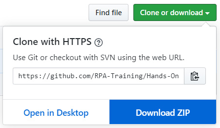
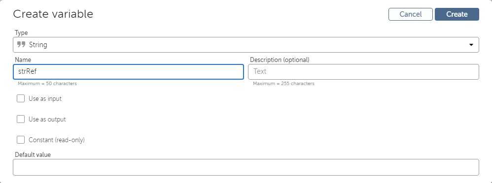
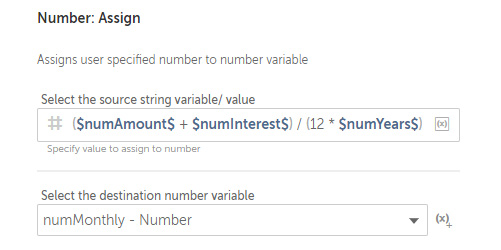

Lab 5: Building Your First Bot 
==============================

By the end of this lab, you will have built your own RPA fully
functioning bot. You will have learned how to take a user story and
build a bot specification. With regard to bot functions, you will know
how to make a bot perform actions such as reading and writing CSV files
and performing calculations.

In this lab, we will cover the following topics:

-   Downloading sample data from GitHub
-   Understanding your automation task
-   Creating and reading a CSV file
-   Performing basic arithmetic calculations
-   Appending records to a CSV file

Technical requirements 
======================

In order to install Automation Anywhere  Bot agent, the following
is required:

-   Google Chrome 
-   Completed registration with Automation Anywhere  Community
    Edition
-   Successful login to Automation Anywhere  Community Edition
-   Successful registration of a local device

Downloading sample data from GitHub 
===================================

Download the whole file structure to your root
folder. I use my `C:\` drive as my root folder. The course will
be referring to this folder to help identify the location of files that
will be needed. You do not need a GitHub account to download the
repository.

To download the complete repository needed for this course, perform the
following steps:

1.  Navigate to the GitHub repository from your web browser using the
    following link:
    <https://github.com/fenago/automation-anywhere-course>:

    
    

2.  To download, click on the green **Clone or download** button. This
    will open a small dialog box, and then click on **Download ZIP**:

    

3.  This will begin the downloading of the compressed
    `automation-anywhere-course-main.zip` file.

4.  Once the ZIP file has been downloaded, extract it all to your root
    folder. If you use `C:\` as your root folder, you will
    have the following path:
    `C:\automation-anywhere-course-main\`.

5. **Important!** Rename folder name to `Hands-On-RPA-with-AA-Sample-Data`.

  
    
6.  Close the GitHub page.

You will now have the sample data file needed for
your first bot. Before we build the bot, it is
important that you understand the manual task that is to be automated.
In the next section, we will get a good understanding of the steps we
will need to automate for our bot.

Understanding your automation task 
==================================

The purpose of using software robots is to make our life easier by
freeing up valuable time. In this section, we will
outline the manual process that will be used for
our first bot. Mapping a step-by-step process of the manual task is
known as a user story. This bot will execute the process end to end
automatically. We will start by drafting a quick user story of this
task.

This bot is based on a manual task performed by John, who works within a
loans department of a finance company. The process executes as follows:

1.  John creates a new empty CSV file called
    `Chapter05_Output.csv`.
2.  A daily CSV file is available on a shared drive,
    `Chapter05_Input.csv`.
3.  John will open this file and read each record. This record has the
    following fields: `Reference`, `Amount`,
    `Years`, and `Interest`.
4.  John calculates the monthly payment by using the following formula:
    *(Amount + Interest)/ (Years x 12)*.
5.  John adds a record for each calculation in the new
    `Chapter05_Output.csv` file containing the following
    fields: `Reference` and `Monthly Payment`.
6.  The process ends.

This user story will be used as a process design for our bot. We can
break this down to create a logical specification
as follows using pseudocode. Pseudocode is used
when you identify the logical steps of a process using simple plain
English:

1.  Create a new `Chapter05_Output.CSV` file.
2.  Open the existing `Chapter05_Input.CSV` file.
3.  Loop through all the records in the `Chapter05_Input.CSV`
    file.
4.  Read the entire record to variables.
5.  Calculate `Monthly Payment` using *(Amount + Interest)/
    (Years x 12)*.
6.  Add the new record to the `Chapter05_Output.CSV` file.
7.  End looping.
8.  Close the `Chapter05_Input.CSV` file.

In the next section, we will start building the bot. As we now have a
design, we can start by building each step as a building block.

Creating your first bot 
=======================

You will now start to build your first bot. Just follow the step-by-step
instructions to guide you through the process. We know the tasks that
the bot needs to perform. Before we apply this, it\'s always good
practice to build a skeleton of the whole task
using comments. This ensures that we won\'t miss any crucial
functionality out and also acts as a template for all the actions.

Let\'s start by creating a new bot in **List** view:

1.  Log in to **Control Room**.

2.  Create a new bot and call it `Lab 5 - FirstBot` in the
    `\Bot\` folder.

3.  Add a **Comment** action as line **1**; we will use this as our bot
    description comment.

    

4.  Set the **Comment** property\'s text as
    `"Task: Calculate Monthly Loan Payment to new CSV File"`.

5.  Click on **Save**. The development interface should look like this:

    
    
    

6.  Add a new **Comment** action as `"Create output csv file"`
    on line **2** and click on **Save**.

7.  Add a new **Comment** action as `"Open csv file"` on line
    **3** and click on **Save**.

8.  Add a new **Comment** action as `"Loop through records"`
    on line **4** and click on **Save**.

9.  Add a new **Comment** action as
    `"Read record to variables"` on line **5** and click on
    **Save**.

10. Add a new **Comment** action as `"Calculate values"` on
    line **6** and click on **Save**.

11. Add a new **Comment** action as
    `"Add new record to output file"` on line **7** and click
    on **Save**.

12. Add a new **Comment** action as `"End Looping"` on line
    **8** and click on **Save**.

13. Add a new **Comment** action as `"Close csv file"` on line
    **9** and click on **Save**.

    Your bot should look something like this:

The bot doesn\'t actually do anything yet, but we have used comments as
a kind of map of what we need to develop and its sequence. The comments
also make the bot more readable when it comes to understanding and
troubleshooting.

Before we start to add any more actions, let\'s
have a look at the structure our bot will take. From the specification,
we can break the complete task down into sub-sections. This would look
as follows:

1.  Creating bot variables
2.  Creating a CSV file
3.  Opening and closing a CSV file
4.  Looping through rows in a CSV file
5.  Reading record values
6.  Performing basic arithmetic calculations
7.  Adding records to a CSV file

In the next section, we will start by creating the variables we need for
our bot.

Creating bot variables 
----------------------

As we have a good understanding of the task for our bot, we are in a
good position. This means that we can create all
the variables our bot needs before we actually apply any further
actions. A good design will always mean most, if not all, of the
variables can be created initially.

When the CSV file is read, we will need variables to store the
following: `Reference` (`string`),
`Amount` (`number`), and `Years`
(`number`). These values will be read from each record. A
record is a row within the CSV file, so another variable will be needed
to store this record. The data type used for this is called a
`Record` in Automation Anywhere. We will also need variables
to calculate and store `Monthly Payment` (`number`).

To create the variables, perform the following steps:

1.  Click on the **Show** option for the **Variables** tab from the
    option pane on the left:

    
    
    

2.  Click on the **+** icon to create a variable:
 
    
    
    The **Create variable** dialog will appear. Give your new variable
    the name `strRef`, set it as a `String` type,
    and then click on **Create**:
    
    

3.  Create another new variable named `numAmount` as the
    `Number` type.

4.  Create another new variable named `numYears` as the
    `Number` type.

5.  Create another new variable named `numInterest` as the
    `Number` type.

6.  Create another new variable named `numMonthly` as the
    `Number` type.

7.  Create another new variable named `strMonthly` as the
    `String` type.

8.  Create another new variable named `recLoan` as the
    `Record` type.

    You should now have created the following seven variables:

All the required variables have now been created.
We are ready to start giving the bot instructions
to perform actions. Automation Anywhere uses
**packages**, which are groups of actions. Each action is an instruction
telling the bot to do something. In the next section, we will start
building the actions for our bot.

Creating and reading a CSV file 
-------------------------------

From our comments, we can see that the first action the bot performs is
to create an output CSV file. This is the file
that will have `Reference Number` and
`Monthly Payment`. A new record will be appended to this file
every time new values are calculated. We create this file first because
the bot will be in a loop when it is processing
each record. The file only needs to be created
once and we can add the headers in when we create it.

In this scenario, we can use the **Log to file**
action as we will not be reading the output file, just creating and
appending to it. This is the simplest action to achieve what we require.

To create the CSV file with headers, perform the following steps:

1.  Drag the **Log to file** action just below line number **2**.

    Your bot development interface in **List** view should look like
    this:

    

2.  Set the following
    properties for the **Log to file** action
    on line **3**:

    **File path**:
    `C:\Hands-On-RPA-with-AA-Sample-Data\Chapter05_Output.csv`

    **Enter text to log**: `Reference, Monthly Amount`

    **When logging**: **Overwrite existing log file**

    The action properties dialog should look like
    this:

    
    
    

3.  Click on **Save**.

That\'s great! Your bot should now create a new
CSV file with headers ready to have new records
added. To test the bot, you can run it. Upon completion, the bot should
create the `Chapter05_Output.csv` file.

Now we know how to create a simple CSV/text file.
This can be used for creating a process log as
well as a data file, as we have done in this instance. The next section
is about opening and closing a CSV file.

Opening and closing a CSV file 
------------------------------

From the design, we know we need to open the input
CSV file. This is a file with some sample data and
is available from GitHub. You should have the sample
data already downloaded from GitHub and in your
root folder. I am using the `C:\` drive as
my root folder. You need to refer to the folder to
which you downloaded the sample data.

To get the bot to open and close a specified CSV file with headers,
perform the following steps:

1.  Drag the **CSV/TXT: Open** action just below line **4**.

2.  Drag the **CSV/TXT: Close** action just below line number **11**.

    Your bot development interface in **List** view should look like
    this:

    
    
    

3.  Set the following properties for the **CSV/TXT: Open** action on
    line **5**:

    **Session name**: `InputData`

    **File path**: **Desktop file** --
    `C:\Hands-On-RPA-with-AA-Sample-Data\Chapter05_InputData.csv`

    **Contains header**: *Checked*

    **Delimiter**: **Comma**

    **Trim leading spaces**: *Checked*

    **Trim trailing spaces**: *Checked*

    The action properties dialog should look like this:

    
    
    

4.  Click on **Save** or use
    the shortcut, *Ctrl* + *S*.

5.  Set the following property for the **CSV/TXT: Close** action on line
    **12**:

    **Session name**: `InputData`

6.  Click on **Save**.

    Your bot development
    interface in **List** view should look like
    this:

Your bot so far will now create the output CSV
file. Then it will open the input CSV file that
has the sample data. It will also close the input file once it\'s
finished with it.

Looping through rows in a CSV file 
----------------------------------

Apart from opening and closing the input, it\'s not doing anything else
with it. The bot needs to loop through each row in
the sample data input file. Whenever you need to
read from an external file, whether it\'s CSV, text, or Excel, a
connection is created when this file is opened.
The term used for this connection is **Session**.
In this instance, we have called our session `InputData`. We
will need to refer to this whenever we are working with the
`Chapter05_InputData.csv` file:

To loop through the input CSV file, perform the following steps:

1.  Drag the **Loop** action just below line **6**.

2.  Set the following properties for the **Loop** action on line **7**:

    **Loop Type**: **Iterator**

    **Iterator**: **For each row in CSV/TXT**

    **Session name**: `InputData`

    **Assign the current row to this variable**: **recLoan - Record**

    The action properties dialog should look like this:

    
    
    

3.  Click on **Save**.

4.  Select the comments on lines **8**, **9**, and
    **10** (you select multiple actions by keeping
    the *Shift* key pressed) and drag them
    directly under line **7**, ensuring they are within the **Loop**
    action on line **7**.

5.  Click on **Save**.

6.  Your comments will now be indented within the loop.

    Your bot development interface should look like this:

The bot will now loop through every row in the
input CSV file. The next stage
will be to start reading the values for each
record.

Reading record values 
---------------------

Each record we read is assigned to the variable
called `recLoan`. We can work directly
with the record values or we can assign them to variables. In our case,
we will be reading the record and assigning the values to individual
variables.

To read and assign the record value to variables, perform the following
steps:

1.  Drag the **String: Assign** action just below line **8**, ensuring
    it is within the **Loop** action on line **7**.

2.  Set the following properties for the **String: Assign** action on
    line **9**:

    **Select the source string variable(s)/ value (optional)**:
    `$recLoan[0]$` (you can also use the *F2* keyboard
    shortcut to select a variable)

    **Select the destination string variable**: **strRef - String**

    The properties should look like the following screenshot:

    
    
    

3.  Click on **Save**.

4.  Drag the **Number: Assign** action just below line **9**, ensuring
    it is within the **Loop** action on line **7**.

5.  Set the following properties for the **Number:
    Assign** action on line **10**:

    **Select the source string variable/value**:
    `$recLoan[1]$`

    **Select the destination number variable**: **numAmount - Number**

    The properties should look like the following screenshot:

    
    
    

6.  Click on **Save**.

7.  Drag another **Number: Assign** action just below line number
    **10**, ensuring it is within the **Loop** action on line **7**.

8.  Set the following properties for the **Number: Assign** action on
    line **11**:

    **Select the source string variable/value**:
    `$recLoan[2]$`

    **Select the destination number variable**: **numYears - Number**

    The properties should look like the following screenshot:

    
    
    

9.  Click on **Save**.

10. Drag another **Number: Assign** action just
    below line **11**, ensuring it is within the **Loop** action on line
    **7**.

11. Set the following properties for the **Number:
    Assign** action on line **12**:

    **Select the source string variable/value**:
    `$recLoan[3]$`

    **Select the destination number variable**: **numInterest - Number**

    The properties should look like the following screenshot:

    
    
    

12. Click on **Save**. Your bot development
    interface in **List** view should look like
    this:

The bot has all the values it needs from each
record. The next step is to calculate
`Monthly Payment`, and we will see how to do that in the next
section.

Performing basic arithmetic calculations 
========================================

We need to add actions to enable the bot to
calculate `Monthly Payment`. We know the formula is *(Amount +
Interest)/ (Years x 12)*.

We have all the values needed to perform this calculation already
assigned to variables. For your bot to calculate this, perform the
following steps:

1.  Drag the **Number: Assign** action just below line **13**, ensuring
    it is within the **Loop** action on line **7**.

2.  Set the following properties for the **Number: Assign** action on
    line **14**:

    **Select the source string variable/value**:
    `($numAmount$ + $numInterest$)/(12 * $numYears$)`

    **Select the destination number variable**: **numMonthly - Number**

    The action properties dialog should look like
    this:

    
    
    

3.  Click on **Save**.

We are near the end now; you\'re doing really well! The next step is to
write the results to the output CSV file we created earlier.

Appending records to a CSV file 
===============================

We often need to add records or even logs to a CSV
file. In this scenario, we will be writing the
calculated results to a CSV file. Each row that we calculated will be a
separate row in the output CSV file.

Your first bot has already been able to perform the following tasks:

1.  Create a CSV file.
2.  Read records from a CSV file.
3.  Perform calculations for each row in the CSV file.

We have all the information that needs to be added to the output file.
Before we actually add this, we will need to convert the
`numMonthly` variable to a string. This is because we cannot
output a numeric value as a string to the output CSV file.

To convert this variable and add the record to our
output CSV file, perform the following steps:

1.  Drag the **Number: To string** action just below line **15**,
    ensuring it is within the **Loop** action on line **7**.

2.  Set the following properties for the **String: Assign** action on
    line **16**:

    **Enter a number**: `$numMonthly$`

    **Enter number of digits after decimal**: `2`

    **Assign the output to variable**: **strMonthly - String**

    The action properties dialog should look like this:

    
    
    

3.  Click on **Save**.

4.  Drag the **Log to file** action just below line **16**, ensuring it
    is within the **Loop** action on line **7**.

5.  From the action properties pane, set the
    following values:

    **File path**:
    `C:\Hands-On-RPA-with-AA-Sample-Data\Chapter05_Output.csv`

    **Enter text to log**: `$strRef$, $strMonthly$`

    **When logging**: **Append to existing log file**

    The action properties dialog should look like this:
 
    

6.  Click on **Save**.

7.  This completes your first bot. The complete
    list of actions in the development window should look like this:

You have done some great work. Go ahead and run
your first bot. Your first bot should create the
output CSV file containing the calculated `Monthly Payments`.
The output file should look like this in Excel:

Summary 
=======

You have built your first bot using Automation Anywhere. You are now a
lot closer to becoming an RPA developer, having gained some valuable
knowledge with the help of a real-life business process. You should be
very comfortable with using actions to make your bot perform tasks. We
have already looked at comma-separated files, in other words, reading,
creating, and appending. You will have also increased your knowledge in
terms of the use of variables, including strings, numbers, and even
records.

You should now be comfortable with building and running bots. We just
need to explore more actions that can be automated. In the next lab,
we will expand further on the Automation Anywhere actions. We will take
a closer look at variables. You will be building a bot that uses
different types of variables, from Boolean to dates. As well as creating
variables, you will also gain some insight into performing calculations
with dates and numbers. We will also look at prompts, message boxes, and
using comments. Other useful elements in the next lab include
disabling/enabling actions and converting data types.

Again, congratulations on building your first fully functional
Automation Anywhere bot!!
