Lab 6: Introducing Variables in Automation Anywhere
====================================================

In this lab, we will cover the following topics:

-   Working with different variable types
-   Using message boxes and prompts
-   Converting data types

Technical requirements 
======================

In order to install the Automation Anywhere Bot agent, the following is
required:

-   Google Chrome 
-   Completed registration with Automation Anywhere  Community
    Edition
-   Successful logon to Automation Anywhere  Community Edition
-   Successful registration of a local device
-   The successful downloading of sample data from GitHub

Working with different variable types 
=====================================

In the following section, we will take a walk-through of each variable
type. This walk-through will show how to create, assign, use, and output
each variable type. Although the process is similar for all variable
types, they all use different Automation Anywhere packages. This will
give you a clearer understanding of how to implement different data
types using Automation Anywhere. We will be using comments and message
boxes throughout the walk-throughs. This will also
get you familiar with using comments to map out the process and message
boxes to check each stage of the bot.

Using the String variable type 
------------------------------

In the walk-through that we will look at next, we will be performing the
following tasks:

1.  Creating three `String` variables --
    `strFirstName`, `strSurname`, and
    `strFullname`
2.  Assigning values to `strFirstName` and
    `strSurname`
3.  Merging both variables together and assigning them to
    `strFullname`
4.  Showing the value of `strFullname` in a **Message box**

Let\'s start this walk-through by executing the following steps:

1.  Log in to the **Control Room**.

2.  Create a new bot and call it `Lab 6 - Variables` in
    the `\Bot\` folder.

3.  Expand the **Variables** pane from the options on the left and
    select **+** to create a new variable:

    
    
    

4.  The **Create variable** dialog will appear. Call this variable
    `strFirstName` and set it as a `String` type.
    Once the details are entered, click on **Create**. The dialog should
    look like this:

    
    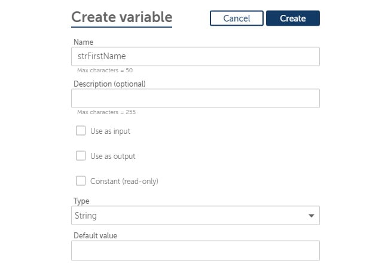
    

    You can give a description if you want. This is useful when you have
    multiple variables and the variable name does not clearly describe
    what it will be used for.

    The **Constant (read-only)** checkbox is used to indicate a constant
    variable, one that is read only. This is very useful as reference
    data.

    The **input** and **output** checkboxes relate to passing and
    receiving these variables between taskbots. We will cover this in
    more detail at a later stage.

    You can also give this variable a **Default value**. This assigns it
    a value for the first time it is accessed.

5.  Create another new variable named `strSurname` as a
    `String` type.

6.  Create another new variable named `strFullname` as a
    `String` type.

    Your variable list should appear as follows:

    
    
    

7.  Now that we have our variables, let\'s start by adding some comments
    to form the template guide for our bot. Expand the **Actions** pane
    from the options on the left.

8.  Add a **Comment** action as line **1**.

9.  Set the **Comment** properties text as
    `"String Variables"` and click on **Save**.

10. Add a new **Comment** action as `"Merge variables"` on
    line **2** and click on **Save**.

11. Add a new **Comment** action as `"Show Output"` on line
    **3** and click on **Save**.

12. Add a new **Comment** action as `"---------------------"`
    on line **4** and click on **Save**. Your bot should now look like
    this:

    
    
    

13. From the `String` package, drag the **Assign** action
    under line **1**.

14. Set the following properties for the **String:
    Assign** action on line **2**:

    **Select the source string variable(s)/ value (optional)**:
    `John`

    **Select the destination string variable**: **strFirstName -
    String**

    The action properties dialog should look like this:

    
    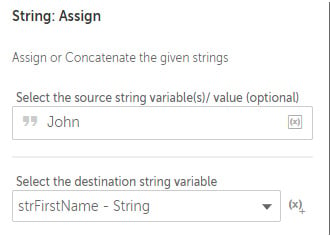
    

15. Click on **Save**.

16. Drag the **String: Assign** action just below line number **2**.

17. Set the following properties for the **String: Assign** action on
    line **3**:

    **Select the source string variable(s)/ value (optional)**:
    `Smith`

    **Select the destination string variable**: **strSurname - String**

    The action properties dialog should look like
    this:

    
    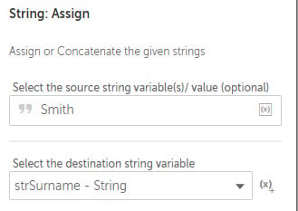
    

18. Click on **Save**.

19. Now we will merge the values of the `strFirstName` and
    `strSurname` variables and assign the results to the
    `strFullname` variable. Drag the **String: Assign** action
    just below line **4**.

20. Set the following properties for the **String: Assign** action on
    line **5**:

    **Select the source string variable(s)/ value (optional)**:
    `$strFirstName$ $strSurname$`

    **Select the destination string variable**: **strFullname - String**

    The action properties dialog should look like this:

    
    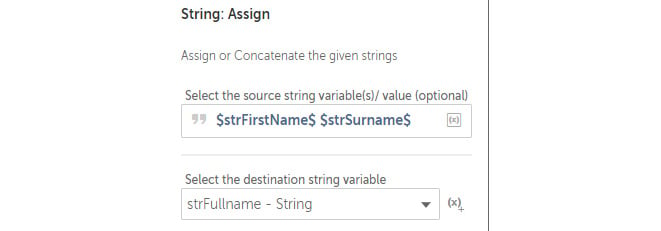
    

21. Click on **Save**.

22. To view the **strFullname** variable, add the **Message box** action
    just below line **6**.

23. Set the following properties for the **Message box** action on line
    **7**:

    **Enter the message box window title**: `Merged variables`

    **Enter the message to display**: `$strFullname$`

    The action properties dialog should look like this:

    
    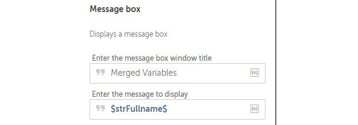
    

24. Click on **Save**. The development interface
    should look something like this:

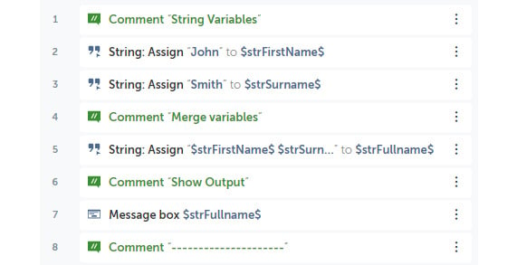

In this walk-through, you have learned how to create **String** type
variables and assign values to all of them. We also looked at how to
merge the values of two variables and assign them to a single variable.

In the next walk-through, we will look at different data type variables,
starting with the `Datetime` data type.

Using the Datetime variable type 
--------------------------------

In this walk-through, we will be performing the following tasks:

1.  Creating two `Datetime` variables --
    `dteChristmas` and `dteChristmasPlus2Weeks`
2.  Creating a `String` variable, `strDate`, to
    store the output for the message box
3.  Adding 2 weeks to the `dteChristmas` variable and
    assigning the result to `dteChristmasPlus2Weeks`
4.  Showing the value of `dteChristmasPlus2Weeks` in a
    **Message box**

Let\'s start this walk-through by executing the following steps:

1.  While still working on the same bot as before, expand the
    **Variables** pane from the options on the left and select **+** to
    create a new variable.

2.  The **Create variable** dialog will appear. Set the following
    values:

    **Name**: `dteChristmas`

    **Type**: **Datetime**

    **Default value**: `12/25/2019 12:00 AM`

    The dialog should look like this:

    
    
    

3.  Click on **Create**.

4.  Create another **Datetime** type variable, set the values as
    follows, and then click on **Create**:

    **Name**: `dteChristmasPlus2Weeks`

    **Type**: **Datetime**

    **Default value**: *(Leave blank)*

5.  Create a `String` type variable called `strDate`
    and then click on **Save**.

6.  Now that we have our variables, we start by adding some comments to
    form the template guide for our bot. Add the **Comment** action as
    line **9**, set the comment property as
    `"Datetime Variables"`, and then click on **Save**.

7.  Add a new **Comment** action as `"Add 2 Weeks to Date"` on
    line **10** and click on **Save**.

8.  Add a new **Comment** action as `"Show Output"` on line
    **11** and click on **Save**.

9.  Add a new **Comment** action as `"---------------------"`
    on line **12** and click on **Save**. Your bot
    should look like this:

    
    
    

10. To add 2 weeks to the `dteChristmas` variable, add the
    **Datetime: Add** action just below line **10**.

11. Set the following properties for the **Datetime: Add** action on
    line **11**:

    **Source date and time variable**: **dteChristmas - Datetime**

    **Time value to add**: `2`

    **Time unit to add**: **Weeks**

    **Assign the output to a variable**: **dteChristmasPlus2Weeks -
    Datetime**

    The **Datetime: Add** action properties should look like this:

    
    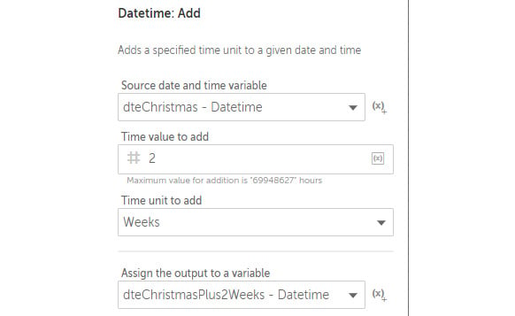
    

12. Click on **Save**.

13. To view the `dteChristmasPlus2Weeks` variable in a message
    box, it needs to be converted to a `String` variable. To
    do this, add the **Datetime: To string** action just below line
    **12**.

14. Set the following properties for the **Datetime: To string** action
    on line **13**:

    **Source date and time variable**: **dteChristmasPlus2Weeks -
    Datetime**

    **Select date time format**: **Custom format** --
    `DD MM YYYY`

    **Assign the output to a variable**: **strDate - String**

    The action properties should look like this:

    
    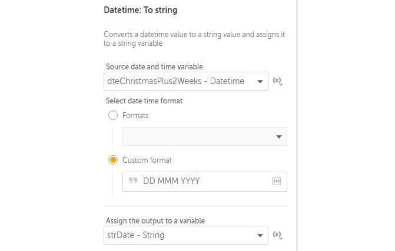
    

15. Click on **Save**.

16. To view the results, add the **Message box** action just below line
    **13**.

17. Set the following properties for the **Message box** action on line
    **14**:

    **Enter the message box window title**: **Datetime variables**

    **Enter the message to display**: `$strDate$`

    The action properties dialog should look like this:

    
    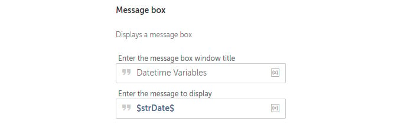
    

18. Click on **Save**. The development interface
    should look something like this:

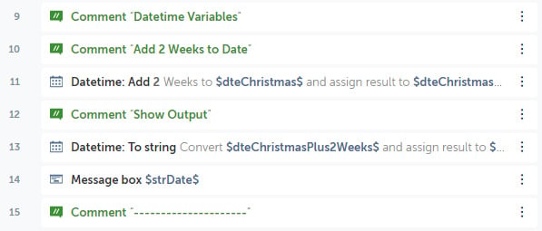

In this walk-through, you have created two `Datetime` type
variables and assigned a value to one of them. The walk-through also
demonstrated how to add a time period to a `Datetime` type
variable as well as converting it to a `String` variable.

In the next walk-through, we will look at another
data type variable, the `Boolean` data type.

Using the Boolean variable type 
-------------------------------

In the next walk-through, we will be performing the following tasks:

1.  Creating a `Boolean` variable -- `blnLeapYear`
2.  Creating a `String` variable, `strLeapYear`, to
    store the output for the message box
3.  Setting the `blnLeapYear` variable to `True`
4.  Inverting the value of the `blnLeapYear` variable
5.  Converting the value of `blnLeapYear` to a
    `String` variable and assigning it to
    `strLeapYear`
6.  Showing the value of `strLeapYear` in a **Message box**

Let\'s start this walk-through by executing the following steps:

1.  While continuing to work on the same bot as previously, expand the
    **Variables** pane from the options on the left and select **+** to
    create a new variable.

2.  The **Create variable** dialog will appear. Set the following
    values:

    **Name**: `blnLeapYear`

    **Type**: **Boolean**

    **Default value**: **True**

    The dialog should look like this:

    
    
    

3.  Click on **Create**.

4.  Create a **String** type variable called
    `strLeapYear` and click on **Save**.

5.  Now that we have our variables, we start by adding some comments to
    form the template guide for our bot. Add the **Comment** action as
    line **16**, set the comment property as
    `"Boolean Variables"`, and click on **Save**.

6.  Add another **Comment** action as `"Assign Boolean Value"`
    as line **17** and click on **Save**.

7.  Add another **Comment** action as `"Invert Boolean Value"`
    as line **18** and click on **Save**.

8.  Add another **Comment** action as `"Show Output"` as line
    **19** and click on **Save**.

9.  Add another **Comment** action as
    `"---------------------"` as line **20** and click
    on **Save**. Your bot should look like this:

    
    
    

10. To assign a `True` value to the `blnLeapYear`
    variable, from the **Boolean** package, drag the **Assign** action
    just below line **17**.

11. Set the following properties for the **Boolean: Assign** action on
    line **18**:

    **Select the source Boolean variable/ value**: **Constant values**

    **Constant values**: **True**

    **Select the destination Boolean variable**: **blnLeapYear -
    Boolean**

    The action properties should look like this:

    
    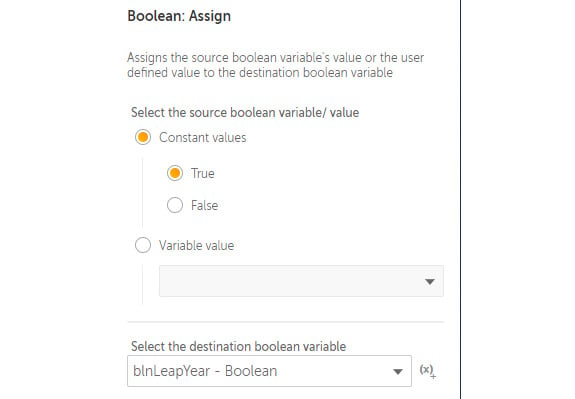
    

12. Click on **Save**.

13. To invert the value of the `blnLeapYear` variable, from
    the **Boolean** package, drag the **Invert** action just below line
    **19**.

14. Set the following properties for the **Boolean: Invert** action on
    line **20**:

    **Select the Boolean variable to be inverted**: **Variable**

    **Value**: `$blnLeapYear$`

    **Assign the output**: **blnLeapYear - Boolean**

    The Boolean: Invert action properties should look like this:

    
    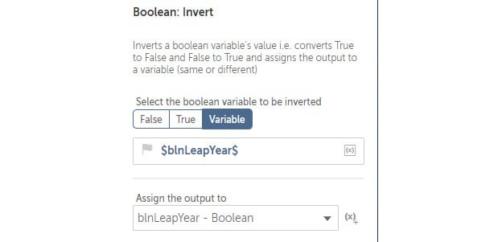
    

15. Click on **Save**.

16. To convert `blnLeapYear` to a `String` variable,
    add the **Boolean: To string** action just below line **21**.

17. Set the following properties for the **Boolean: To string** action
    on line **22**:

    **Select Boolean variable**: **blnLeapYear - Boolean**

    **Select the string variable to store the result**: **strLeapYear -
    String**

    The action properties should look like this:

    
    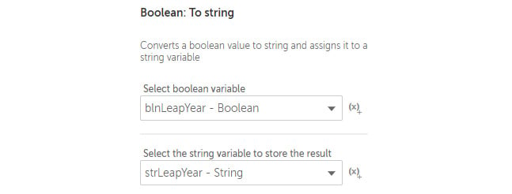
    

18. Click on **Save**.

19. To view the results, add the **Message box** action just below line
    **22**.

20. Set the following properties for the **Message box** action on line
    **23**:

    **Enter the message box window title**:
    `Boolean variables`

    **Enter the message to display**: `$strLeapYear$`

    The action properties dialog should look like this:

    
    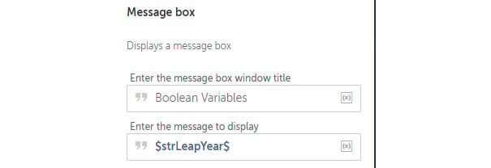
    

21. Click on **Save**. The development interface should look something
    like this:

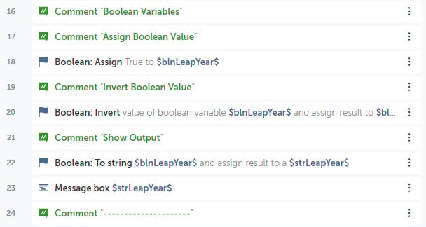

In this walk-through, you have created a
`Boolean` variable and assigned a `True` value to
it. Then this value was inverted using Automation Anywhere actions and
the results shown in a message box.

The next variable type we will explore is the `Number`
variable, probably one of the most commonly used data types.

Using the Number variable type 
------------------------------

In this walk-through, we will be performing the following tasks:

1.  Creating two `Number` variables -- `numRandom`
    and `numResult`
2.  Creating a `String` variable, `strResult`, to
    store the output for the message box
3.  Assigning a random number between `1` and `100`
    to the `numRandom` variable
4.  Applying a formula, *(Random/2) + 25*, and assigning the results to
    `numResult`
5.  Converting the value of `numResult` to a
    `String` variable and assigning it to
    `strResult`
6.  Showing the value of `strResult` in a **Message box**

Let\'s start this walk-through by performing the
following tasks:

1.  While still working on the same bot as before, create a
    `Number` type variable called `numRandom` and
    click on **Save**.

2.  Create another `Number` type variable called
    `numResult` and click on **Save**.

3.  Create a `String` type variable called
    `strResult` and click on **Save**.

4.  Now that we have our variables, we start by adding some comments to
    form the template guide for our bot. Add the **Comment** action on
    line **25**, set the comment property as
    `"Number Variables"`, and click on **Save**.

5.  Add another **Comment** action as `"Assign Random Value"`
    as line **26** and click on **Save**.

6.  Add another **Comment** action as `"Apply Formula"` as
    line **27** and click on **Save**.

7.  Add another **Comment** action as `"Show Output"` as line
    **28** and click on **Save**.

8.  Add another **Comment** action as
    `"---------------------"` as line **29** and click on
    **Save**. Your bot should look like this:

    
    
    

9.  To assign a random number to the
    `numRandom` variable from the **Number** package, drag the
    **Random** action just below line **26**.

10. Set the following properties for the **Number: Random** action on
    line **27**:

    **Beginning of range**: `1`

    **End of range**: `100`

    **Save the outcome to a number variable**: **numRandom - Number**

    The action properties should look like this:

    
    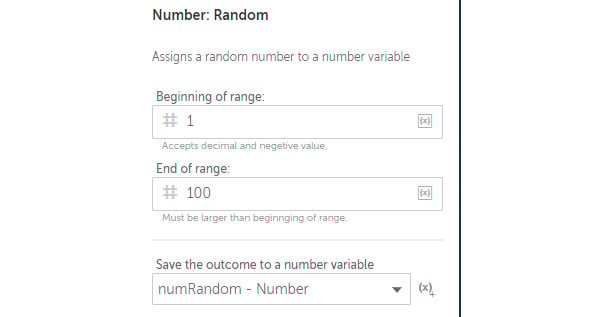
    

11. Click on **Save**.

12. To apply the formula *(Random/2) + 25* and
    save the outcome to the `numResult` variable, add the
    **Number: Assign** action just below line **28**.

13. Set the following properties for the **Number: Assign** action on
    line **29**:

    **Select the source string variable**:
    `($numRandom$/2) + 25`

    **Select the destination number variable**: **numResult - Number**

    The action properties should look like this:

    
    
    

14. Click on **Save**.

15. To convert `numResult` to a
    `String` variable, add the **Number: To string** action
    just below line **30**.

16. Set the following properties for the **Number: To string** action on
    line **31**:

    **Enter a number**: `$numResult$`

    **Enter number of digits after decimal**: `2`

    **Assign the output to variable**: `strResult - String`

    The action properties should look like this:

    
    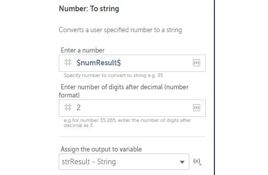
    

17. Click on **Save**.

18. To view the results, add the **Message box** action just below line
    **31**.

19. Set the following properties for the **Message box** action on line
    **32**:

    **Enter the message box window title**: `Number variables`

    **Enter the message to display**: `$strResult$`

    The action properties dialog should look like this:

    
    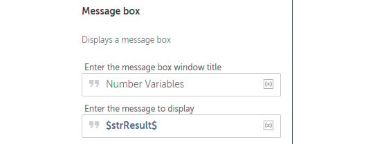
    

20. Click on **Save**, and the development
    interface should look something like this:

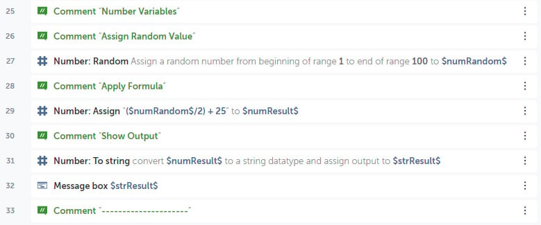

You should now have a clear understanding of how to create new variables
as well as assign and re-assign values. There are more variable types
available, such as `Window`, `File`, and
`Record`. Covering the most common variables will give you a
good start on your journey to becoming a bot developer. In the
walk-throughs so far, you should now be comfortable with using the
`String`, `Datetime`, `Boolean`, and
`Number` variables. We will cover some of the other variables
in the forthcoming chapters.

Using message boxes and prompts 
===============================

Our bot so far dealt
with four types of variables -- `String`,
`Datetime`, `Boolean`, and `Number`. They
have values assigned to them using the assign action or are set as
default values. We will now go through and modify our bot. Instead of
assigning values using actions, we will replace this with actions from
the **Prompt** package. As well as using the **Prompt** package, you
will learn how to disable and enable actions for your bot.

In this walk-through, we will be performing the following tasks:

1.  Disabling **Assign** actions from the bot
2.  Adding **Prompt** actions for capturing `strFirstName` and
    `strSurname`
3.  Outputting results as **Message box**

Let\'s start this walk-through by performing the following steps:

1.  Continuing with the same bot as before, to disable an action, you
    will notice the three vertical dots at the end of every action line
    in the development interface. Clicking on this will show the options
    menus. This gives you a number of editing options for that bot
    action line.

2.  Select the options menu for line **2**:

    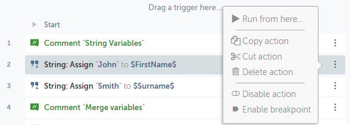
    

3.  From the options, select **Disable action**.

4.  Repeat steps *2* and *3* for line **3**.

5.  Values are no longer assigned to the `strFirstName` and
    `strSurname` variables as these actions have been
    disabled. To prompt for a value for the `strFirstName`
    variable, from the **Prompt** package, drag the **For value** action
    just below line **2**.

6.  Set the following properties for the **Prompt: For value** action on
    line **3**:

    **Prompt window caption**: `Prompt for String`

    **Prompt message**: `Enter Firstname:`

    **Assign the value to a variable**: **strFirstName - String**

    The action properties should look like this:

    
    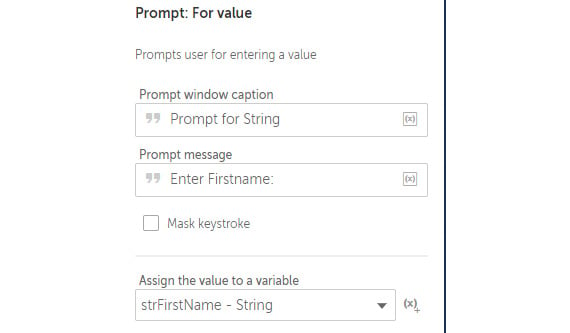
    
7.  Click on **Save**.

8.  Add another **Prompt: For value**
    action just below line **4**.

9.  Set the following properties for the **String: Assign** action on
    line **5**:

    **Prompt window caption**: `Prompt for String`

    **Prompt message**: `Enter Surname:`

    **Assign the value to a variable**: **strSurname - String**

10. Click on **Save**.

You have disabled actions and created some prompts to get the name
values assigned to our variables. The **Message Box** that\'s already in
place on line **9** will output the merged variable values. The
development interface should look something like this:

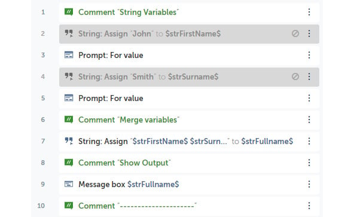

Converting data types 
=====================

Let\'s look at the data conversions performed by the current bot. The
first data conversion the bot performs is
converting a `Datetime` data type to a `String` data
type. Take a look at line **15** from the development interface:

The next data conversion performed is from a `Boolean` data
type to a `String` data type. This is demonstrated on line
**24** of the development interface:

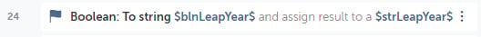

Finally, the bot converts a `Number` data type to a
`String` data type. This is on line `33` of the
development interface:

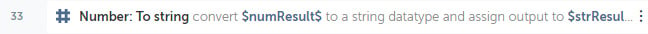

Whenever a data type is converted, two variables are required. The first
is the original value that needs to be converted, and the other is the
target variable. The target variable should always be the same as target
data type.

Go ahead and run your bot. It should have prompts, message boxes, and
all the variable conversions and calculations. You have done a great job
so far. Being able to create and work with variables of different types
is an essential skill for all developers. Your knowledge of not
only creating and assigning, but also converting,
data types is a great start to building your confidence with Automation
Anywhere.

In the next lab, we will expand further on the packages. In
particular, you will learn how to launch and navigate around desktop and
web applications. We will also explore the use of automation with Excel
and email applications.
