Lab 7: Interacting with Applications 
===============================================================

Hopefully, you will be feeling confident about using Automation Anywhere
by now. The walk-throughs so far should have given you an opportunity to
create and run bots. These may be relatively basic bots, but with each
walk-through, we are expanding our knowledge of additional packages.
Each Automation Anywhere package and its actions open up more operations
that you can automate. Following the walk-throughs gives you hands-on
experience, allowing you to add value to your RPA development skills.

There are many tasks that we perform as part of our daily routines at
work. These tasks will almost always include working with web-based and
desktop applications. Being able to automate tasks that interact with
web and desktop applications are key skills that any RPA developer ought
to possess.

We have already covered the basics of using Automation Anywhere, so now
get ready for some more serious automation. Having a clear understanding
of creating and assigning different variable types, we can now start
utilizing these skills further to build bots that interact with
applications.

This lab will look at working with web-based and desktop
applications. We will be building bots that mimic human interaction. You
will learn how to navigate, select, and update applications using
keystroke simulation, as well as by clicking and selecting elements
within these applications.

In this lab, we will cover the following topics:

-   Automating web applications
-   Automating desktop applications
-   Simulating keystrokes

By the end of this lab, you will have the skills needed to build
bots that can launch applications, navigate through various application
interfaces, interact with buttons and checkboxes, and read and enter
data. This lab will be using the following packages:

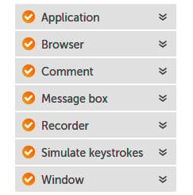

You will be building two bots in this lab. The first will be based
on web applications, and the second on desktop applications. The
walk-throughs will guide you step by step, enabling you to have bots
that launch your application and navigate through them just as a human
would.

Technical requirements 
======================

In order to install the Automation Anywhere Bot agent, the following is
required:

-   Windows OS version 7 or higher
-   A processor with a minimum speed of 3 GHz
-   A minimum of 4 GB RAM
-   At least 100 MB of hard disk space
-   Google Chrome
-   Completed registration with Automation Anywhere  Community
    Edition
-   Successful logon to Automation Anywhere  Community Edition
-   Successful registration of a local device
-   The successful downloading of sample data from GitHub

Automating web applications 
===========================

During a normal working day, we will use web applications to carry out
our daily tasks. These applications may be in the
public domain, such as search engines, or intranet-based applications
specific to your organization. There is a shift of desktop applications
moving to cloud-based web applications. The use of web applications is
increasing in business circles.

In the following walk-through, we will be working with a web
application. It\'s a very simple website. We will be navigating to a
specific page by looking for a particular tab. The walk-through will
then fill a simple online form and conclude by clicking the **Send**
button on the form.

In this walk-through, we will be performing the following tasks:

1.  Launching the [http://skysoftuk.net](http://skysoftuk.net/) website
2.  Clicking on the **CONTACT** tab to navigate to the contact page
3.  Completing the **Name**, **Email**, and **Message** fields on the
    form
4.  Clicking the **Send** button

Let\'s start this walk-through by executing the following steps:

1.  Log in to the **Control Room**.

2.  Create a new bot and call it `Lab 7 - Web Apps` in the
    `\Bot\` folder.

3.  As always, we begin by adding some comments to use as a template for
    our bot, add a new **Comment** action on line **1**, set the value
    to `"---------------------"`, and click on **Save**.

4.  Add a new **Comment** action as `"Launch Website"` on line
    **2** and click on **Save**.

5.  Add a new **Comment** action as
    `"Navigate to Contact Page"` on line **3** and click on
    **Save**.

6.  Add a new **Comment** action as `"Fill on-line form"` on
    line **4** and click on **Save**.

7.  Add a new **Comment** action as `"Click on Send"` on line
    **5** and click on **Save**.

8.  Add a new **Comment** action as `"---------------------"`
    on line **6** and click on **Save**. Your bot should look like this:

    
    
    

9.  We can now start to add some functionality.
    The first thing we want the bot to do is launch the browser and go
    to our web page. From the **Browser** package, drag the **Launch
    website** action under line **2**.

10. Set the following properties for the **Browser: Launch website**
    action on line **3**:
    -   **URL**: `http://skysoftuk.net/`

    -   **Browser**: **Google Chrome**

        The **Browser: Launch website** action properties should look
        like this:

1.  Click on **Save**.

2.  Now it gets really interesting. We will instruct the bot to look for
    the **CONTACT** tab and then click on it. Currently, the bot will
    not be able to capture the **CONTACT** tab
    because the web page isn\'t actually open.
    Manually open another session of Chrome and navigate to
    <http://skysoftuk.net/>. The bot is now ready to capture the
    **CONTACT** tab.

3.  From the **Recorder** package, drag the **Capture** action under
    line **4**.

    When Automation Anywhere captures an object,
    the properties are in six sections:

    **Object detail** -- This tells the bot where to look for the
    object.

    **Preview** -- This is a visual display of what the object looks
    like.

    **Object properties** -- These list all the attributes for that
    object; the attributes used to identify the object are checked.

    **Action** -- This tells the bot how to interact with the object.

    **Wait for control** -- This tells the bot to wait for a specific
    duration for the object. This shows how many seconds to continue
    looking for the object before moving on to the next line.

    **Assign the output to variable** -- This is always of the
    `string` type and will assign any value from the control
    to this variable. It is useful when reading
    values from an application.

4.  Firstly, we need to tell the bot where to look for the object. For
    our **Browser: Launch website** action on line
    **5**, set the **Object detail** property to **Window**, and then
    click the refresh icon, as shown in the following screenshot:

    
    
    

5.  The drop-down list will show all windows that are currently open.
    Select **Home - Google Chrome**. The **Recorder: Capture** action
    properties should look like this:

    
    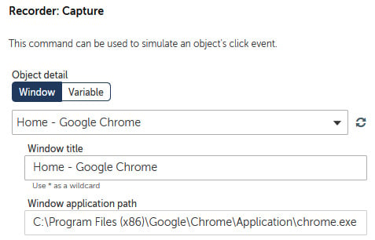
    

6.  To capture the **CONTACT** tab, click on
    **Capture object**.

7.  The SkySoft web page should appear. Hover your mouse on the web
    page, and Automation Anywhere will look for all the objects on the
    page. It highlights what it has found with a red border. Move your
    mouse until you get the red border around the **CONTACT** tab. The
    capture screen should look like this:

    
    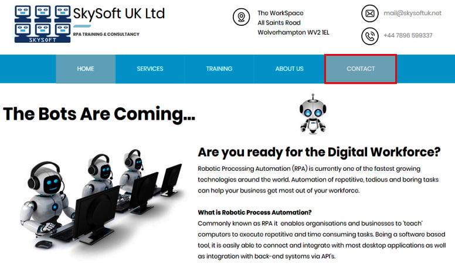
    

8.  Once the correct object has been identified
    with the red border, click to select it. Once clicked, the bot will
    capture all the attributes it needs. You will see the selected
    object in the preview section of the properties. It should look
    something like this:

    
    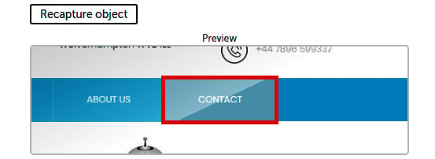
    

    If you didn\'t manage to capture the correct
    object, you can always recapture again to try and get it. It can be
    tricky with some applications and may take a few attempts. It is
    also a best practice to have your browser zoom set to 100%.

9.  The next step is to look at the attributes used to identify the
    object. If we collapse the **Object properties** list, you will see
    only the checked attributes used to identify the object. The
    properties should look like this:

    
    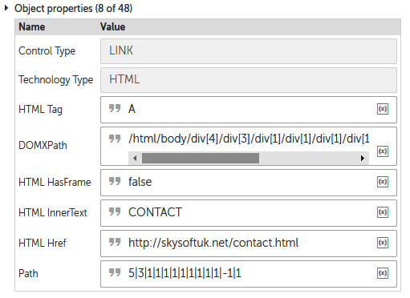
    

    These attributes can be modified if needed.
    Variables can also be used as values. This is useful when you are
    working with interfaces that are very similar in build with only a
    few attribute differences.

10. Now that the bot has found the **CONTACT** tab, the next step is to
    get the bot to click on it. This is where we set the **Action**
    property. This should be set to **Click**, as shown here:

    
    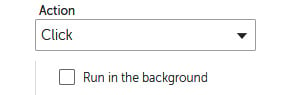
    

11. Click on **Save**.

12. We have set the first bot interaction with the website. The
    development interface for this step should look like this:

    
    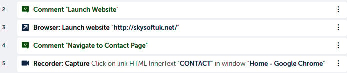
    

    At this stage, we are only building the
    instructions for what we want the bot to perform. As the bot hasn\'t
    yet been executed, it hasn\'t actually done anything. The next step
    is to fill in the form on the **CONTACT** page. The bot itself
    hasn\'t actually clicked on the **CONTACT** tab, so we will do this
    manually.

13. Manually click on the **CONTACT** tab on the *skysoftuk.net*
    website. The web page should look like this:

    
    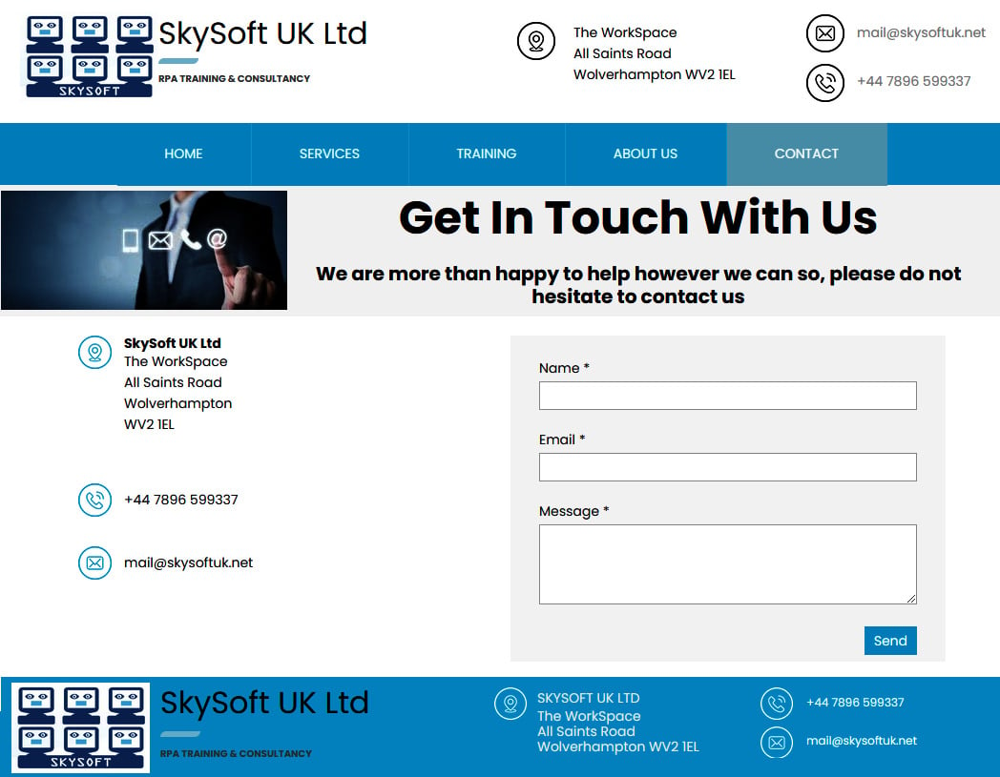
    

14. There are three items we need to fill in on
    the form: **Name**, **Email**, and **Message**. Starting with
    **Name**, as we did before, add a new **Recorder: Capture** action
    just below line **6**.

15. For the **Recorder: Capture** action on line **7**, set the **Object
    detail** properties to **Window**.

16. Refresh the windows drop-down list and select **Contact - Google
    Chrome**. The action properties should look like this:

    
    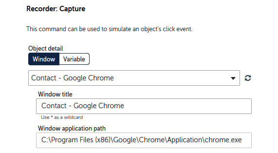
    

17. To capture the **Name** textbox, click on
    **Capture object**.

18. When the `Contact` web page appears, hover the mouse over
    the **Name** textbox until it has a red border around it, as shown
    in the following screenshot:

    
    
    

19. Click in the red border to capture it. Once captured, check the
    preview to ensure that the correct object has been captured, as
    shown in the following screenshot:

    
    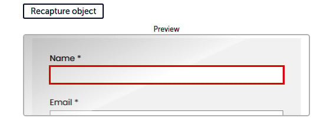
    

20. This time we want to populate the textbox with your name. Set the
    following properties for the **Recorder: Capture** action on line
    **7**:

    **Action**: **Set text**

    **Keystrokes**: **Enter keystrokes here or use the on-screen
    keyboard**

    **Value**: *(Enter your name)*

    The properties should look like the following
    screenshot:

    
    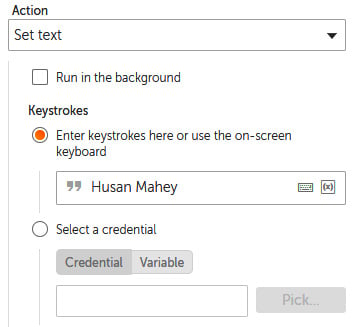
    

21. Click on **Save**.

22. To do the same for the **Email** textbox, add another **Recorder:
    Capture** action just below line **7**.

23. For the **Recorder: Capture** action on line **8**, set the **Object
    detail** properties to **Window**.

24. Refresh the windows drop-down list and select **Contact - Google
    Chrome**.

25. To capture the **Email** textbox, click on **Capture object**.

26. When the `Contact` web page appears, hover the mouse over
    the **Email** textbox until it has a red border around it, as shown
    in the following screenshot:

    
    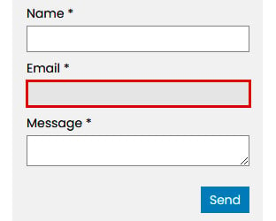
    

27. Click in the red border to capture it. Once
    captured, check the preview to ensure the correct object has been
    captured.

28. This time we want to populate the textbox with your email address.
    Set the following properties for the **Recorder: Capture** action on
    line **8**:

    **Action**: **Set text**

    **Keystrokes**: **Enter keystrokes here or use the on-screen
    keyboard**

    **Value**: *(Enter your email address)*

    The properties should look similar to the following screenshot:

    
    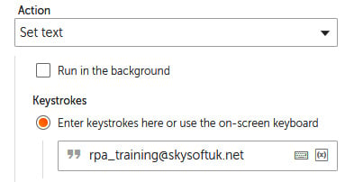
    

29. Click on **Save**.

30. To do the same for the **Message** textbox,
    add another **Recorder: Capture** action just below line **8** and
    set its **Object detail** properties to **Window**.

31. Refresh the windows drop-down list and select **Contact - Google
    Chrome**.

32. To capture the **Message** textbox, as before, click on **Capture
    object**.

33. When the `Contact` web page appears, hover the mouse over
    the **Message** textbox until it has a red border around it, as
    shown in the following screenshot:

    
    
    

34. Click in the red border to capture it. Once
    captured, check the preview to ensure that the correct object has
    been captured.

35. This time we want to populate the textbox with your email address.
    Set the following properties for the **Recorder: Capture** action on
    line **9**:

    **Action**: **Set text**

    **Keystrokes**: **Enter keystrokes here or use the on-screen
    keyboard**

    **Value**:
    `Having lots of fun learning Automation Anywhere`

    The properties should look similar to the following screenshot:

    
    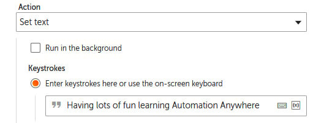
    

36. Click on **Save**. Your development interface for this section
    should look like this:

    
    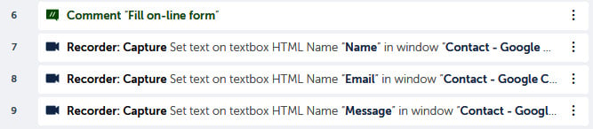
    

37. Nearly there! There is just one more object to
    capture. This time we want the bot to click on the **Send** button.
    To do this, add another **Recorder: Capture** action just below line
    **10** and set the **Object details** property to **Window**.

38. Refresh the windows drop-down list and select **Contact - Google
    Chrome**.

39. To capture the **Send** button, just like before, click on the
    **Capture** object.

40. When the `Contact` web page appears, hover the mouse over
    the **Send** button until it has a red border around it, as shown in
    the following screenshot:

    
    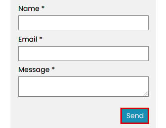
    

41. Click in the red border to capture it. Once captured, check the
    preview to ensure that the correct object has
    been captured.

42. This time we want the bot to click the button. To do this, set the
    following properties for the **Recorder: Capture** action on line
    **11**:

    **Action**: **Click**

    The properties should look similar to the following screenshot:

    
    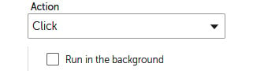
    

43. Click on **Save**.

44. We can now close the Google Chrome session with the *skysoftuk.net*
    website.

45. Finally, a **Message** box action appears just below line **11** to
    let us know the bot has finished running the task.

46. Set the message to display something like
    `"Bot has sent email successfully"`.

47. Click on **Save**. The development interface for this section should
    look like this:

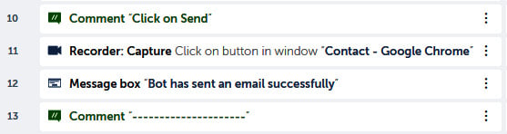

Great work! You have completed the walk-through. Feel free to run the
bot and test it. It should launch the website,
fill in the online form, and click on the send button. Remember to
ensure the browser is closed before running your bot.

In the next section, we will expand what we have already learned, moving
from automating web applications to working with desktop applications.
We will also be learning how to simulate keystrokes to run tasks on
desktop applications.

Automating desktop applications 
===============================

In the previous section, we learned to use
Automation Anywhere with browser-based applications. Our tasks are also
most likely to include desktop applications. In principle, the
automation of desktop applications is the same as web applications. We
have already used the **Recorder** package and, in particular, the
**Capture** action. The **Capture** action is also used with desktop
applications. As with web applications, you have to identify the window,
followed by what object to capture, and finally an action to tell the
bot what to do with it.

You will be exposed to working with a desktop application, in particular
Notepad. I am assuming we all have Notepad on our desktops. We will use
the capture action as well as keystroke simulation to perform tasks.
These are very useful actions when building an RPA solution as they work
in the same way a human interacts with interfaces. Humans interact with
interfaces by using keyboards and by clicking or selecting objects on
the screen.

In the following walk-through, we will build a bot that will navigate to
the SkySoft website and extract some text. The bot will then open a
notepad and enter the extracted text. Then we will save the text file
using keystrokes and the capture actions.

In this walk-through, we will be performing the following tasks:

1.  Launching the [http://skysoftuk.net](http://skysoftuk.net/) website
2.  Extracting a paragraph of text and assigning it to a variable
3.  Opening the Notepad application
4.  Entering the extracted text into Notepad
5.  Saving the Notepad text file using keystroke simulation
6.  Closing the Notepad application

Let\'s start this walk-through by executing the following steps:

1.  Log in to the **Control Room**.

2.  Create a new bot and call it `Lab 7 - Desktop Apps` in
    the `\Bot\` folder.

3.  As always, we begin by adding some comments to use as a template for
    our bot. Add a new **Comment** action as line number 1, set the
    value to `"---------------------"`, and click on **Save**.

4.  Add a new **Comment** action as `"Launch Website"` on line
    **2** and click on **Save**.

5.  Add a new **Comment** action as `"Capture text"` on line
    **3** and click on **Save**.

6.  Add a new **Comment** action as `"Open notepad"` on line
    **4** and click on **Save**.

7.  Add a new **Comment** action as `"Enter text in notepad"`
    on line **5** and click on **Save**.

8.  Add a new **Comment** action as `"Save text file"` on line
    **6** and click on **Save**.

9.  Add a new **Comment** action as `"Close notepad"` on line
    **7** and click on **Save**.

10. Add a new **Comment** action as `"---------------------"`
    on line **8** and click on **Save**. Your bot should look like this:

    
    
    

11. We need to start by launching the website as we did before. Add the
    **Browser: Launch website** action under line **2**.

12. Set the following properties for the
    **Browser: Launch website** action on line **3**:

    **URL**: `http://skysoftuk.net/`

    **Browser**: **Google Browser**

    The **Browser: Launch website** action properties should look like
    this:

    
    
    

13. Click on **Save**.

14. As before, we need to ensure that the website
    is available to capture anything. Manually open another session of
    Chrome and navigate to <http://skysoftuk.net/>.

15. To extract some text from an object, the object needs to be
    captured. To do this, add a new **Recorder: Capture** action just
    below line **4**.

16. For the **Recorder: Capture** action on line **5**, set the **Object
    detail** properties to **Window**.

17. Refresh the windows drop-down list and select **Home - Google
    Chrome**. The action properties should look like this:

    
    
    

18. To capture the second paragraph on the
    **HOME** web page, click on the **Capture** object.

19. When the **HOME** web page appears, hover the mouse over the second
    paragraph until it has a red border around it, as shown in the
    following screenshot:

    
    
    

20. Click in the red border to capture it. Once
    captured, check the preview to ensure that the correct object has
    been captured.

21. As we want to extract the text, we need to identify which property
    contains this. If we look through the object properties, we can
    identify the correct property. Once identified, make a note of it.
    When I captured this, the text was in the **HTML InnerText**
    property, as you can see in the following screenshot:

    
    
    

22. When you capture the paragraph, you may not necessarily see the text
    in the same attribute. In some cases, it may be in the **Name**
    attribute, as shown in the following screenshot:

    
    
    

23. This time we want the bot to extract the text from this object and
    assign it to the default variable called
    `prompt-assignment`. To do this, set the following
    properties for the **Recorder: Capture** action on line **5**:

    **Action**: **Get property**

    **Property name**: `HTML InnerText` (if your property was
    **Name**, then set as **Name**)

    **Assign the output to variable**: **prompt-assignment - String**

    The properties should look similar to the following screenshot:

    
    
    

24. Click on **Save**. Your development interface should look something
    like this:

The first stage of our bot is now complete. Great
work! The bot extracts the text from the second paragraph on the
*skysoftuk.net* website. The text is assigned to a variable. Next, our
bot will open Notepad and enter the extracted text.

Working with Notepad 
--------------------

As Notepad is available on pretty much all desktops, it makes sense to
use it to demonstrate how to automate
applications. With any desktop application, we interact by clicking and
typing in one way or another.

Clicking controls aspects such as buttons, checkboxes, and drop-down
lists. As you have already seen, using the **Recorder: Capture** action
is ideal for this type of interaction. It is flexible enough to be
applied to all types of applications. We will continue our walk-through
as follows:

1.  To open Notepad, add the **Application: Open program/file** action
    just below line **6**.

2.  Set the following properties for the **Application: Open
    program/file** action on line **7**:

    **Location of the program/file**:
    `C:\Windows\System32\notepad.exe` (just using Notepad will
    also work)

    The properties should look similar to the following screenshot:

    
    
    

3.  Click on **Save**.

4.  As before, we are writing the instructions for our bot. It hasn\'t
    actually been executed. We now need to enter our text into Notepad.
    Open Notepad manually so that we can capture the pane for our text.

5.  To enter the contents of our variable into Notepad, we need to
    capture the entry pane. For this, add a new **Recorder: Capture**
    action just below line **8**.

6.  For the **Recorder: Capture** action on line **9**, set the **Object
    detail** property to **Window**.

7.  Refresh the windows drop-down list and select
    **Untitled - Notepad**. The action properties should look like this:

    
    
    

8.  To capture the text entry pane, click on **Capture object**.

9.  When Notepad appears, hover the mouse over the text entry pane until
    it has a red border around it, as follows:

    
    
    

10. Click in the red border to capture it. Once captured, check the
    preview to ensure that the correct object has been captured.

11. We want to enter the contents of our variable
    in this pane. Set the following properties for the **Recorder:
    Capture** action on line **9**:

    **Action**: **Set text**

    **Keystrokes**: `$prompt-assignment$`

    The properties should look similar to the following screenshot:

    
    
    

12. Click on **Save**. Your development interface
    should look something like this:

You should now be getting pretty good at using the capture action of
Automation Anywhere. This is a very useful action. It\'s what tends to
make the difference between traditional programming languages and RPA
development, allowing the ability to quickly and easily interact with
any web or desktop objects.

In the next stage, we will introduce keystroke simulation. Again, we can
automate tasks by replicating keystrokes to perform a task. This can be
useful when capturing objects may be difficult or this
option may not be available.

Simulating keystrokes 
=====================

We have our text in Notepad now and it is ready to be saved as a file.
We can use the recorder package to capture the
menu items and save the file. To demonstrate how to simulate keystrokes,
you will not be using the capture action to save the file. We will
continue with our walk-through, demonstrating how to achieve this by
using the **Simulate Keystrokes** action instead. As before, the bot
hasn\'t actually executed any actions yet; we need to replicate this
manually. So let\'s copy and paste the text from the second paragraph
into Notepad. Notepad should look like this:

If we wanted to save the file in Notepad using just keystrokes, we would
need to identify the keystroke sequence. By inspecting the menu options,
we can identify that the sequence to bring up the **Save As** dialog is
*Ctrl* + *Shift* + *S* or *Alt* then *F* then *A*.

We have now established the keystroke sequence needed for our bot to
trigger the **Save As** dialog. Observe the following walk-through to
implement this:

1.  Add the **Simulate Keystrokes** action under line **10**.

2.  For the **Simulate Keystrokes** action on line **11**, set the
    **Select window** property to **Window**.

3.  Refresh the windows drop-down list and select **\*Untitled -
    Notepad**. The action properties should look like this:

    
    
    

4.  Click on **Save**.

5.  To assign the keystroke sequence of *Alt* + *F* + *A*, set the
    **Keystrokes** property to **Enter keystrokes here or use the
    on-screen keyboard**.

6.  Click on the keyboard icon, as shown in the following screenshot:

    
    
    

7.  The keyboard will appear with all the special keys. Any alphanumeric
    keys can just be typed in the desired case. Select the sequence
    *Alt* + *F* + *A*. This property should look like this:

    
    
    

8.  Click on **Save**.

9.  Manually select **Save As** from Notepad to
    launch the **Save As** dialog. Here we want to enter the file path
    and click on the **Save** button. As we are doing this using
    keystrokes, we can see that the keystroke sequence to navigate to
    the file path textbox is *Alt* + *n*, and for the **Save** button
    it\'s *Alt* + *S*. *Alt* can be entered using the action keystrokes
    keyboard and *n* and *S* just by using your workstation keyboard. We
    can see the required shortcuts in the following screenshot:

    
    
    

10. To navigate to the **File name** textbox, add
    another **Simulate Keystrokes** action just below line **11**.

11. For the **Simulate Keystrokes** action on line **12**, set the
    **Select window** property to **Window**.

12. Refresh the windows drop-down list and select **Save As**. The
    action properties should look like this:

    
    
    

13. Click on **Save**.

14. To assign the keystroke sequence of *Alt* +
    *n*, set the **Keystrokes** property to **Enter keystrokes here or
    use the on-screen keyboard**.

15. Once the keyboard appears, select the sequence *Alt* + *n*. This
    property should look like this:

    
    
    

16. Click on **Save**.

17. To enter the file path of
    `C:\Hands-On-RPA-with-AA-Sample-Data\Chapter07.txt`, add
    another **Simulate Keystrokes** action just below line **12**.

18. For the **Simulate Keystrokes** action on line **13**, set the
    **Select window** property to **Window**.

19. Refresh the windows drop-down list and select **Save As**.

20. Click on **Save**.

21. To assign the file path, set the **Keystrokes** property to **Enter
    keystrokes here or use the on-screen keyboard**.

22. Once the keyboard appears, enter
    `C:\Hands-On-RPA-with-AA-Sample-Data\Chapter07.txt`, as
    shown in the following screenshot:

    
    
    

23. Click on **Save**.

24. To initiate the **Save** button using *Alt* + *S*, add another
    **Simulate Keystrokes** action just below line **13**.

25. For the **Simulate Keystrokes** action on line **14**, set the
    **Select window** property to **Window**.

26. Refresh the windows drop-down list and select **Save As**.

27. Click on **Save**.

28. To assign the keystroke sequence of *Alt* + *S*, set the
    **Keystrokes** property to **Enter keystrokes here or use the
    on-screen keyboard**.

29. Once the keyboard appears, select the sequence *Alt* + *S*. This
    property should look like this:

    
    
    

30. Click on **Save**. Your development interface
    for this section should look something like this:

    
    
    

31. Manually save the Notepad file, as it would have been saved at this
    point if the bot was processing the task.

32. All that\'s left now is to close Notepad. To do this, add the
    **Window: Close** action so that it\'s just below line **15**.

33. For the **Window: Close** action on line **16**, set the **Select
    window** property to **Window**.

34. Refresh the windows drop-down list and select
    `Chapter07.txt - Notepad`. The properties should look like
    this:

    
    
    

35. Click on **Save**.

    The bot is now complete. Close all websites apart from the **Control
    Room** and also close Notepad. Your complete development interface
    should look like this:

The time has come to test your bot. Before you do,
remember to delete the `Chapter07.txt` file as the bot will
create this. It should launch the website, extract the text, and then
create and save a text file using Notepad. You
have learned a lot of valuable skills in this walk-through. Recorder and
keystrokes are vital actions used in most automation tasks.

Summary 
=======

This lab has covered some key elements of implementing RPA in
relation to your daily tasks. Understanding how to interact with web and
desktop applications is what we humans do. All the tasks that we perform
while sitting in front of a computer involve interacting with an
application of some sort. This interaction may involve selecting or
clicking on objects as well as entering inputs using the keyboard.

The walk-throughs in this lab have given you the practical knowledge
to enable you to create bots that navigate through applications, as well
as read and enter text. You will be confident with capturing objects
such as textboxes and drop-down lists, as well as tabs and buttons. Your
journey to becoming an RPA developer is truly underway.

You are doing great work and will continue building
on this in the next lab, where we will explore how to perform string
manipulation. This includes creating and looping through
`List` type variables when working with strings. There will be
a number of different data transformation and parsing actions that we
will look at -- include, replace, substrings, extract, and trim, and we
will use regular expressions to find string patterns.
