Lab 7: Interacting with Applications 
====================================

In this lab, we will cover the following topics:

-   Automating web applications
-   Simulating keystrokes

Technical requirements 
======================

In order to install the Automation Anywhere Bot agent, the following is
required:

-   Google Chrome
-   Completed registration with Automation Anywhere  Community
    Edition
-   Successful logon to Automation Anywhere  Community Edition
-   Successful registration of a local device
-   The successful downloading of sample data from GitHub

Automating web applications 
===========================

In this walk-through, we will be performing the following tasks:

1.  Launching the [https://google.com](https://google.com) website
2.  Enter text in Google search bar.
4.  Clicking the **Enter** button

Let\'s start this walk-through by executing the following steps:

1.  Log in to the **Control Room**.

2.  Create a new bot and call it `Lab 7 - Web Apps` in the
    `\Bot\` folder.

3.  As always, we begin by adding some comments to use as a template for
    our bot, add a new **Comment** action on line **1**, set the value
    to `"---------------------"`, and click on **Save**.

4.  Add a new **Comment** action as `"Open"` on line
    **2** and click on **Save**.

5.  Add a new **Comment** action as
    `"Search Automation Anywhere Demo"` on line **3** and click on
    **Save**.

6.  Add a new **Comment** action as `"Enter Send"` on
    line **4** and click on **Save**.

8.  Add a new **Comment** action as `"---------------------"`
    on line **6** and click on **Save**.

9.  We can now start to add some functionality.
    The first thing we want the bot to do is launch the browser and go
    to our web page. From the **Browser** package, drag the **Open** action under line **2**.

10. Set the following properties for the **Browser: Open**
    action on line **3**:
    -   **URL**: `https://google.com`
    -   **Browser**: **Google Chrome**

        The **Browser: Open** action properties should look like this:

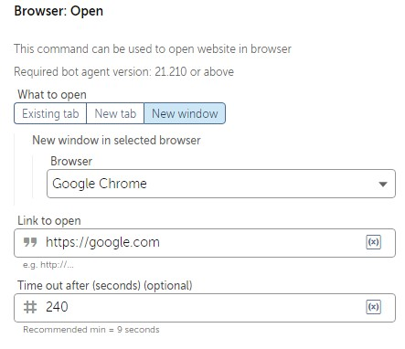

1.  Click on **Save**.

2. Open `https://google.com` in google chrome.

3.  From the **Recorder** package, drag the **Capture** action.

    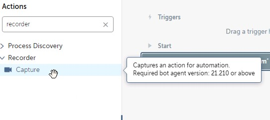

4.  Firstly, we need to tell the bot where to look for the object. Set the **Object detail**  property to **Browser**, and then click the refresh icon, as shown in the following screenshot:

    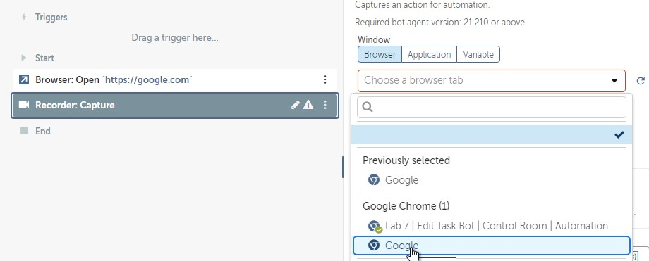

6.  To capture the search bar, click on **Capture object**.

    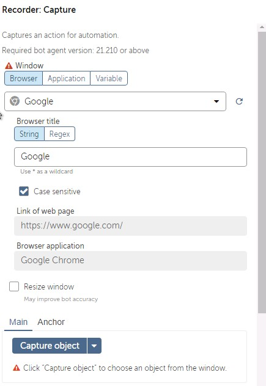

7.  The web page should appear. Hover your mouse on the web
    page, and Automation Anywhere will look for all the objects on the
    page. It highlights what it has found with a red border. Move your
    mouse until you get the red border around the **Search Bar** . The
    capture screen should look like this:
    
    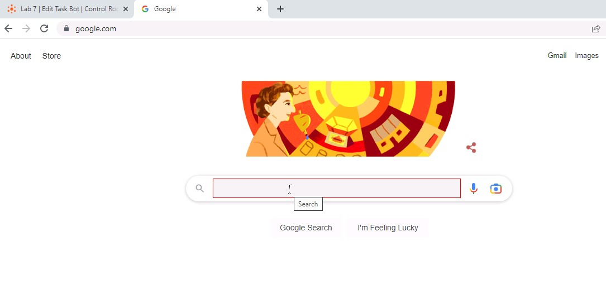

8.  Once the correct object has been identified
    with the red border, click to select it. Once clicked, the bot will
    capture all the attributes it needs.

9. This time we want to populate the textbox. Set the
    following properties for the **Recorder: Capture** action:

    **Action**: **Set text**

    **Keystrokes**: **Enter keystrokes here or use the on-screen keyboard**

    **Value**: *Automation Anywhere demo*

    The properties should look like the following screenshot:

    
    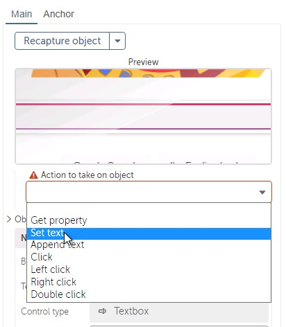
    

    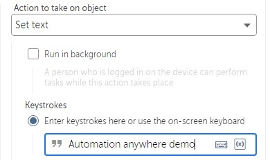

10. Click on **Save**.

11. From the **Simulate keystrokes** package, drag the **Simulate keystrokes** action.

    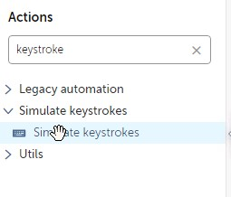

12. Firstly, we need to tell the bot where to look for the object. Set the **Object detail**  property to **Browser**, and then click the refresh icon, as shown in the following screenshot:

    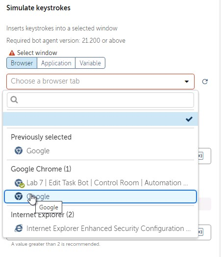

12. Click `Insert ketstroke` and select **Enter**:

    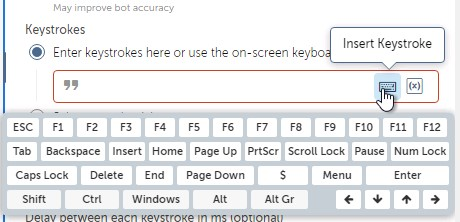

13. Click on **Save**.

    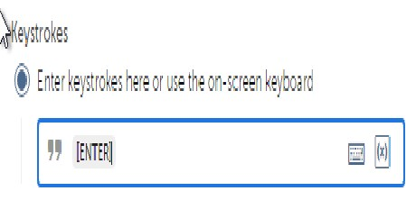

14. Run the bot. You will get following output:

    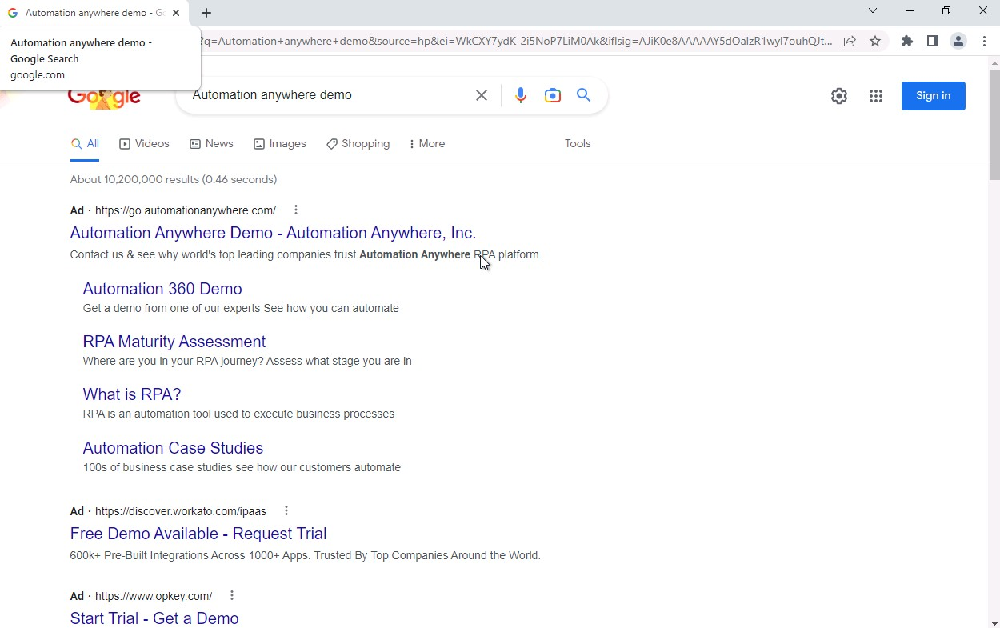

