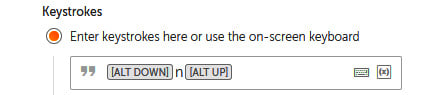

Lab 7: Interacting with Applications 
====================================

In this lab, we will cover the following topics:

-   Automating web applications
-   Automating desktop applications
-   Simulating keystrokes

You will be building two bots in this lab. The first will be based
on web applications, and the second on desktop applications. The
walk-throughs will guide you step by step, enabling you to have bots
that launch your application and navigate through them just as a human
would.

Technical requirements 
======================

In order to install the Automation Anywhere Bot agent, the following is
required:

-   Google Chrome
-   Completed registration with Automation Anywhere  Community
    Edition
-   Successful logon to Automation Anywhere  Community Edition
-   Successful registration of a local device
-   The successful downloading of sample data from GitHub

Automating web applications 
===========================

In this walk-through, we will be performing the following tasks:

1.  Launching the [https://google.com](https://google.com) website
2.  Enter text in Google search bar.
4.  Clicking the **Enter** button

Let\'s start this walk-through by executing the following steps:

1.  Log in to the **Control Room**.

2.  Create a new bot and call it `Lab 7 - Web Apps` in the
    `\Bot\` folder.

3.  As always, we begin by adding some comments to use as a template for
    our bot, add a new **Comment** action on line **1**, set the value
    to `"---------------------"`, and click on **Save**.

4.  Add a new **Comment** action as `"Open"` on line
    **2** and click on **Save**.

5.  Add a new **Comment** action as
    `"Search Automation Anywhere Demo"` on line **3** and click on
    **Save**.

6.  Add a new **Comment** action as `"Enter Send"` on
    line **4** and click on **Save**.

8.  Add a new **Comment** action as `"---------------------"`
    on line **6** and click on **Save**.

9.  We can now start to add some functionality.
    The first thing we want the bot to do is launch the browser and go
    to our web page. From the **Browser** package, drag the **Open** action under line **2**.

10. Set the following properties for the **Browser: Open**
    action on line **3**:
    -   **URL**: `https://google.com`
    -   **Browser**: **Google Chrome**

        The **Browser: Open** action properties should look like this:

1.  Click on **Save**.

2. Open `https://google.com` in google chrome.

3.  From the **Recorder** package, drag the **Capture** action.

    

4.  Firstly, we need to tell the bot where to look for the object. Set the **Object detail**  property to **Browser**, and then click the refresh icon, as shown in the following screenshot:

    

6.  To capture the search bar, click on **Capture object**.

    

7.  The web page should appear. Hover your mouse on the web
    page, and Automation Anywhere will look for all the objects on the
    page. It highlights what it has found with a red border. Move your
    mouse until you get the red border around the **Search Bar** . The
    capture screen should look like this:
    
    

8.  Once the correct object has been identified
    with the red border, click to select it. Once clicked, the bot will
    capture all the attributes it needs.

9. This time we want to populate the textbox. Set the
    following properties for the **Recorder: Capture** action:

    **Action**: **Set text**

    **Keystrokes**: **Enter keystrokes here or use the on-screen keyboard**

    **Value**: *Automation Anywhere demo*

    The properties should look like the following screenshot:

    
    
    

    

10. Click on **Save**.

11. From the **Simulate keystrokes** package, drag the **Simulate keystrokes** action.

    

12. Firstly, we need to tell the bot where to look for the object. Set the **Object detail**  property to **Browser**, and then click the refresh icon, as shown in the following screenshot:

    

12. Click `Insert ketstroke` and select **Enter**:

    

13. Click on **Save**.

    

14. Run the bot. You will get following output:

    

Automating desktop applications 
===============================

In the previous section, we learned to use
Automation Anywhere with browser-based applications. Our tasks are also
most likely to include desktop applications. In principle, the
automation of desktop applications is the same as web applications. We
have already used the **Recorder** package and, in particular, the
**Capture** action. The **Capture** action is also used with desktop
applications. As with web applications, you have to identify the window,
followed by what object to capture, and finally an action to tell the
bot what to do with it.

You will be exposed to working with a desktop application, in particular
Notepad. I am assuming we all have Notepad on our desktops. We will use
the capture action as well as keystroke simulation to perform tasks.
These are very useful actions when building an RPA solution as they work
in the same way a human interacts with interfaces. Humans interact with
interfaces by using keyboards and by clicking or selecting objects on
the screen.

In the following walk-through, we will build a bot that will navigate to
the SkySoft website and extract some text. The bot will then open a
notepad and enter the extracted text. Then we will save the text file
using keystrokes and the capture actions.

In this walk-through, we will be performing the following tasks:

1.  Launching the [http://skysoftuk.net](https://google.com) website
2.  Extracting a paragraph of text and assigning it to a variable
3.  Opening the Notepad application
4.  Entering the extracted text into Notepad
5.  Saving the Notepad text file using keystroke simulation
6.  Closing the Notepad application

Let\'s start this walk-through by executing the following steps:

1.  Log in to the **Control Room**.

2.  Create a new bot and call it `Lab 7 - Desktop Apps` in
    the `\Bot\` folder.

3.  As always, we begin by adding some comments to use as a template for
    our bot. Add a new **Comment** action as line number 1, set the
    value to `"---------------------"`, and click on **Save**.

4.  Add a new **Comment** action as `"Open"` on line
    **2** and click on **Save**.

5.  Add a new **Comment** action as `"Capture text"` on line
    **3** and click on **Save**.

6.  Add a new **Comment** action as `"Open notepad"` on line
    **4** and click on **Save**.

7.  Add a new **Comment** action as `"Enter text in notepad"`
    on line **5** and click on **Save**.

8.  Add a new **Comment** action as `"Save text file"` on line
    **6** and click on **Save**.

9.  Add a new **Comment** action as `"Close notepad"` on line
    **7** and click on **Save**.

10. Add a new **Comment** action as `"---------------------"`
    on line **8** and click on **Save**. Your bot should look like this:

    
    
    

11. We need to start by launching the website as we did before. Add the
    **Browser: Open** action under line **2**.

12. Set the following properties for the
    **Browser: Open** action on line **3**:

    **URL**: `https://google.com`

    **Browser**: **Google Browser**

    The **Browser: Open** action properties should look like
    this:

    
    
    

13. Click on **Save**.

14. As before, we need to ensure that the website
    is available to capture anything. Manually open another session of
    Chrome and navigate to <https://google.com>.

15. To extract some text from an object, the object needs to be
    captured. To do this, add a new **Recorder: Capture** action just
    below line **4**.

16. For the **Recorder: Capture** action on line **5**, set the **Object
    detail** properties to **Window**.

17. Refresh the windows drop-down list and select **Home - Google
    Chrome**. The action properties should look like this:

    
    
    

18. To capture the second paragraph on the
    **HOME** web page, click on the **Capture** object.

19. When the **HOME** web page appears, hover the mouse over the second
    paragraph until it has a red border around it, as shown in the
    following screenshot:

    
    
    

20. Click in the red border to capture it. Once
    captured, check the preview to ensure that the correct object has
    been captured.

21. As we want to extract the text, we need to identify which property
    contains this. If we look through the object properties, we can
    identify the correct property. Once identified, make a note of it.
    When I captured this, the text was in the **HTML InnerText**
    property, as you can see in the following screenshot:

    
    
    

22. When you capture the paragraph, you may not necessarily see the text
    in the same attribute. In some cases, it may be in the **Name**
    attribute, as shown in the following screenshot:

    
    
    

23. This time we want the bot to extract the text from this object and
    assign it to the default variable called
    `prompt-assignment`. To do this, set the following
    properties for the **Recorder: Capture** action on line **5**:

    **Action**: **Get property**

    **Property name**: `HTML InnerText` (if your property was
    **Name**, then set as **Name**)

    **Assign the output to variable**: **prompt-assignment - String**

    The properties should look similar to the following screenshot:

    
    
    

24. Click on **Save**. Your development interface should look something
    like this:

The first stage of our bot is now complete. Great
work! The bot extracts the text from the second paragraph on the
*skysoftuk.net* website. The text is assigned to a variable. Next, our
bot will open Notepad and enter the extracted text.

Working with Notepad 
--------------------

As Notepad is available on pretty much all desktops, it makes sense to
use it to demonstrate how to automate
applications. With any desktop application, we interact by clicking and
typing in one way or another.

Clicking controls aspects such as buttons, checkboxes, and drop-down
lists. As you have already seen, using the **Recorder: Capture** action
is ideal for this type of interaction. It is flexible enough to be
applied to all types of applications. We will continue our walk-through
as follows:

1.  To open Notepad, add the **Application: Open program/file** action
    just below line **6**.

2.  Set the following properties for the **Application: Open
    program/file** action on line **7**:

    **Location of the program/file**:
    `C:\Windows\System32\notepad.exe` (just using Notepad will
    also work)

    The properties should look similar to the following screenshot:

    
    
    

3.  Click on **Save**.

4.  As before, we are writing the instructions for our bot. It hasn\'t
    actually been executed. We now need to enter our text into Notepad.
    Open Notepad manually so that we can capture the pane for our text.

5.  To enter the contents of our variable into Notepad, we need to
    capture the entry pane. For this, add a new **Recorder: Capture**
    action just below line **8**.

6.  For the **Recorder: Capture** action on line **9**, set the **Object
    detail** property to **Window**.

7.  Refresh the windows drop-down list and select
    **Untitled - Notepad**. The action properties should look like this:

    
    
    

8.  To capture the text entry pane, click on **Capture object**.

9.  When Notepad appears, hover the mouse over the text entry pane until
    it has a red border around it, as follows:

    
    
    

10. Click in the red border to capture it. Once captured, check the
    preview to ensure that the correct object has been captured.

11. We want to enter the contents of our variable
    in this pane. Set the following properties for the **Recorder:
    Capture** action on line **9**:

    **Action**: **Set text**

    **Keystrokes**: `$prompt-assignment$`

    The properties should look similar to the following screenshot:

    
    
    

12. Click on **Save**. Your development interface
    should look something like this:

You should now be getting pretty good at using the capture action of
Automation Anywhere. This is a very useful action. It\'s what tends to
make the difference between traditional programming languages and RPA
development, allowing the ability to quickly and easily interact with
any web or desktop objects.

In the next stage, we will introduce keystroke simulation. Again, we can
automate tasks by replicating keystrokes to perform a task. This can be
useful when capturing objects may be difficult or this
option may not be available.

Simulating keystrokes 
=====================

We have our text in Notepad now and it is ready to be saved as a file.
We can use the recorder package to capture the
menu items and save the file. To demonstrate how to simulate keystrokes,
you will not be using the capture action to save the file. We will
continue with our walk-through, demonstrating how to achieve this by
using the **Simulate Keystrokes** action instead. As before, the bot
hasn\'t actually executed any actions yet; we need to replicate this
manually. So let\'s copy and paste the text from the second paragraph
into Notepad. Notepad should look like this:

If we wanted to save the file in Notepad using just keystrokes, we would
need to identify the keystroke sequence. By inspecting the menu options,
we can identify that the sequence to bring up the **Save As** dialog is
*Ctrl* + *Shift* + *S* or *Alt* then *F* then *A*.

We have now established the keystroke sequence needed for our bot to
trigger the **Save As** dialog. Observe the following walk-through to
implement this:

1.  Add the **Simulate Keystrokes** action under line **10**.

2.  For the **Simulate Keystrokes** action on line **11**, set the
    **Select window** property to **Window**.

3.  Refresh the windows drop-down list and select **\*Untitled -
    Notepad**. The action properties should look like this:

    
    
    

4.  Click on **Save**.

5.  To assign the keystroke sequence of *Alt* + *F* + *A*, set the
    **Keystrokes** property to **Enter keystrokes here or use the
    on-screen keyboard**.

6.  Click on the keyboard icon, as shown in the following screenshot:

    
    
    

7.  The keyboard will appear with all the special keys. Any alphanumeric
    keys can just be typed in the desired case. Select the sequence
    *Alt* + *F* + *A*. This property should look like this:

    
    
    

8.  Click on **Save**.

9.  Manually select **Save As** from Notepad to
    launch the **Save As** dialog. Here we want to enter the file path
    and click on the **Save** button. As we are doing this using
    keystrokes, we can see that the keystroke sequence to navigate to
    the file path textbox is *Alt* + *n*, and for the **Save** button
    it\'s *Alt* + *S*. *Alt* can be entered using the action keystrokes
    keyboard and *n* and *S* just by using your workstation keyboard. We
    can see the required shortcuts in the following screenshot:

    
    
    

10. To navigate to the **File name** textbox, add
    another **Simulate Keystrokes** action just below line **11**.

11. For the **Simulate Keystrokes** action on line **12**, set the
    **Select window** property to **Window**.

12. Refresh the windows drop-down list and select **Save As**. The
    action properties should look like this:

    
    
    

13. Click on **Save**.

14. To assign the keystroke sequence of *Alt* +
    *n*, set the **Keystrokes** property to **Enter keystrokes here or
    use the on-screen keyboard**.

15. Once the keyboard appears, select the sequence *Alt* + *n*. This
    property should look like this:

    
    
    

16. Click on **Save**.

17. To enter the file path of
    `C:\Hands-On-RPA-with-AA-Sample-Data\Chapter07.txt`, add
    another **Simulate Keystrokes** action just below line **12**.

18. For the **Simulate Keystrokes** action on line **13**, set the
    **Select window** property to **Window**.

19. Refresh the windows drop-down list and select **Save As**.

20. Click on **Save**.

21. To assign the file path, set the **Keystrokes** property to **Enter
    keystrokes here or use the on-screen keyboard**.

22. Once the keyboard appears, enter
    `C:\Hands-On-RPA-with-AA-Sample-Data\Chapter07.txt`, as
    shown in the following screenshot:

    
    
    

23. Click on **Save**.

24. To initiate the **Save** button using *Alt* + *S*, add another
    **Simulate Keystrokes** action just below line **13**.

25. For the **Simulate Keystrokes** action on line **14**, set the
    **Select window** property to **Window**.

26. Refresh the windows drop-down list and select **Save As**.

27. Click on **Save**.

28. To assign the keystroke sequence of *Alt* + *S*, set the
    **Keystrokes** property to **Enter keystrokes here or use the
    on-screen keyboard**.

29. Once the keyboard appears, select the sequence *Alt* + *S*. This
    property should look like this:

    
    
    

30. Click on **Save**. Your development interface
    for this section should look something like this:

    
    
    

31. Manually save the Notepad file, as it would have been saved at this
    point if the bot was processing the task.

32. All that\'s left now is to close Notepad. To do this, add the
    **Window: Close** action so that it\'s just below line **15**.

33. For the **Window: Close** action on line **16**, set the **Select
    window** property to **Window**.

34. Refresh the windows drop-down list and select
    `Chapter07.txt - Notepad`. The properties should look like
    this:

    
    
    

35. Click on **Save**.

    The bot is now complete. Close all websites apart from the **Control
    Room** and also close Notepad. Your complete development interface
    should look like this:

The time has come to test your bot. Before you do,
remember to delete the `Chapter07.txt` file as the bot will
create this. It should launch the website, extract the text, and then
create and save a text file using Notepad. You
have learned a lot of valuable skills in this walk-through. Recorder and
keystrokes are vital actions used in most automation tasks.

Summary 
=======

This lab has covered some key elements of implementing RPA in
relation to your daily tasks. Understanding how to interact with web and
desktop applications is what we humans do. All the tasks that we perform
while sitting in front of a computer involve interacting with an
application of some sort. This interaction may involve selecting or
clicking on objects as well as entering inputs using the keyboard.
