Lab 8: String Manipulation and List Variables 
===============================================

In this lab, we will cover the following topics:

-   Manipulating strings
-   Creating and looping through `List` variables
-   Applying simple conditional logic

In this lab, you will be guided by a walk-through so that you can
build a fully functional bot. This will be a bit intensive, but you will
gain some valuable experience in implementing a number of useful
actions. We will be working with a number of Automation Anywhere
packages, some of which you have already used in this course. We will be
using the following packages:


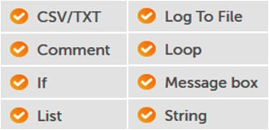


You will be building a single bot to solve a specific problem. As we
progress, we will cover different aspects of manipulating strings. By
the end, you will have a fully functional bot that performs a specific
task. This task will be pretty generic and easy to understand, giving
you further ideas on where you may be able to use RPA to help automate
your current routine tasks.


Technical requirements 
======================


You will need the following in order to install the Automation Anywhere
Bot agent:

-   Google Chrome
-   Completed registration with Automation Anywhere  Community
    Edition
-   Logged on successfully to Automation Anywhere  Community
    Edition
-   A successfully registered local device
-   Successfully downloaded sample data from GitHub


Manipulating strings 
====================

While working through this walk-through, we will look at the following
string manipulation actions:

-   **Replace**
-   **Find**
-   **Substring**
-   **Split**
-   **Trim**
-   **Uppercase**
-   **Lowercase**


This walk-through will cover performing the following tasks:

1.  Reading a single string of names from a text
    file to a `String` variable.
2.  Splitting this string into individual names and placing them in a
    `List` variable.
3.  Looping through the list.
4.  Identifying name counterparts; that is, `Surname` and
    `Forename`.
5.  Formatting the name as (case-sensitive) `Surname`,
    `Forename`.
6.  Checking if there are any middle names and if so, assigning them to
    a `List` type variable.
7.  Looping through the middle names and formatting them so that only
    the initial is capitalized.
8.  Saving the results as a CSV file.

We will break this walk-through into six sections to make it easier to
follow:

-   Section 1 -- Initializing lists and loops
-   Section 2 -- Getting full names
-   Section 3 -- Getting forenames
-   Section 4 -- Getting surnames
-   Section 5 -- Getting middle names
-   Section 6 -- Outputting the results

As always, we will start by adding some comments that will help guide
us. We will begin with just the basic skeleton and add further levels of
detail as we progress.

Let\'s start this walk-through by executing the following steps:

1.  Log into **Control Room**.
2.  Create a new bot and call it
    `Lab 8 - String Manipulation`. Do this inside the
    `\Bot\` folder.
3.  As always, we\'ll begin by adding some
    comments that will be used as a template for our bot. Add a new
    **Comment** action on line **1**, set the value to
    `"---------------------"`, and click on **Save**.
4.  Add a new **Comment** action of
    `"------- Section 1 – Initialize List and Loop"` on line
    **2** and click on **Save**.
5.  Add a new **Comment** action of
    `"------- Section 2 – Get Full name"` on line **3** and
    click on **Save**.
6.  Add a new **Comment** action of
    `"------- Section 3 – Get Forename"` on line **4** and
    click on **Save**.
7.  Add a new **Comment** action of
    `"------- Section 4 – Get Surname"` on line **5** and
    click on **Save**.
8.  Add a new **Comment** action of
    `"------- Section 5 – Get Middle Names"` on line **6** and
    click on **Save**.
9.  Add a new **Comment** action of
    `"------- Section 6 – Output Results"` on line **7** and
    click on **Save**.
10. Add a new **Comment** action of `"---------------------"`
    on line **8** and click on **Save**. Now, your bot should look like
    this:


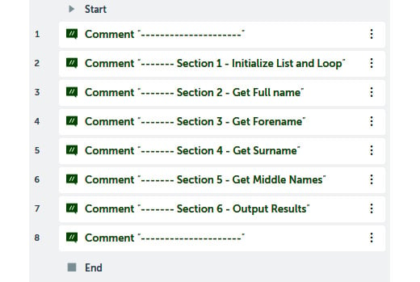


We are now ready to start on our six sections. We
will start with *Section 1 -- Initializing lists and loops*. This will
involve assigning the initial string to all the names. Once this is
done, you will get some experience with using the **Split** action and
creating a simple loop.


Section 1 -- Initializing lists and loops 
-----------------------------------------

First, we need to create our variables; we will
need a `Table` data type variable to read the source text file
and a `List` type variable to assign the table variable values
to. Once in the list, we will also need a `String` type
variable so that we can store each full name from the list. Let\'s get
started:

1.  Create a `Table` type variable called
    `tblSourceText`. The **Create variable** dialog should
    look like this:

    
    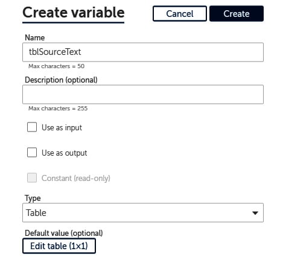
    


2.  This variable will need to be split into a
    `List` type variable. Create a `List` type
    variable called `lstSourceList`. The new variable dialog
    should look like this:

    
    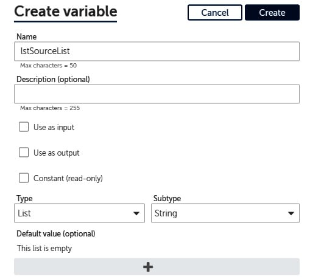
    


3.  To store each full name from the list, create
    a `String` type variable called `strFullName`.
    The initial variable list should look like this:

    
    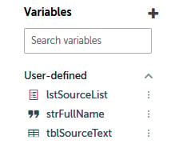
    


4.  The source list of names that we will be using is stored in the
    `Chapter08_InputData.txt` file in our root folder, which
    can be found at `C:\Hands-On-RPA-with-AA-Sample-Data`. The
    content of this file is a single string containing
    the following data:

    
    ```
    "husan lal mahey, priya mahey, sonam mahey, ravinder raj lal mahey, sunita kumari mahey, manisha Mahey" 
    ```
    

    The contents of a text file can be read into a `Table`
    type variable, but first, we must open the text file. To do this,
    add the **CSV/TXT: Open** action just below line **2**.

5.  Set the following properties for the **CSV/TXT: Open** action on
    line **3**:

    **Session name**: `txt_Source`

    **File path**: **Desktop file** --
    `C:\Hands-On-RPA-with-AA-Sample-Data\Chapter08_InputData.txt`

    **Contains header**: *Unchecked*

    **Delimiter**: **Newline**

    The properties should look like this:

    
    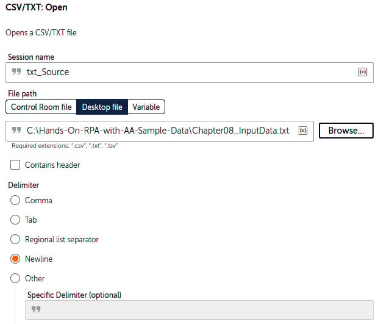
    


6.  Click on **Save**.

7.  To read the contents to a table, add the
    **CSV/TXT: Read** action just below line **3**.

8.  Set the following properties for the **CSV/TXT: Read** action on
    line **4**:

    **Session name**: `txt_Source`

    **Assign value to the variable**: **tblSourceText - Table**

    The properties should look like this:

    
    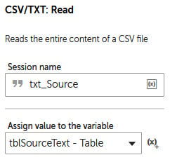
    


9.  Click on **Save**.

10. Finally, we need to close the CSV file session. To do this, add the
    **CSV/TXT: Close** action just below line **4**.

11. Set the following properties for the
    **CSV/TXT: Close** action on line **5**:

    **Session name**: `txt_Source`

    The properties should look like this:

    
    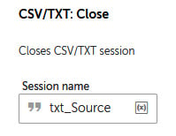
    


12. Click on **Save**.

With that, we have our source data assigned. It gets more interesting
now as we start using some of the string manipulation actions. We\'ll
start with the **Split** action. This action is used to split a
variable by a defined delimiter and assign the
results to a `List` type variable. This is very useful when
working with different grouped data. An example of this would be if a
variable contained a full postal address and you needed to break this
down into subsections such as street, city, and so on. The **Split**
action would be ideal in this scenario.

### Applying the Split action

When a string needs to be separated into a
`List` variable, we can apply the **Split** action. We have
already created our `List` type variable; that is,
`lstSourceList`. To split a variable, it is essential we know
what character to use for the split. Let\'s take a look at our source
string:


```
husan lal mahey, priya mahey, sonam mahey, ravinder raj lal mahey, sunita kumari mahey, manisha mahey
```


Here, we can clearly see that the separator is a comma. We will use this
to identify each item in the list. Let\'s continue with the walk-through
and apply the **Split** action:

1.  To split by a comma and assign to a list, drag the **String: Split**
    action to just below line **5**.

2.  Set the following properties for the **String: Split** action on
    line **6**:

    **Source string**: `$tblSourceText[0][0]$`

    **Delimiter**: `,`

    **Delimiter is**: **Not case sensitive**

    **Split into substrings**: **All possible**

    **Assign the output to list variable**: **lstSourceList -- List of
    Strings**

    The properties should look like this:

    
    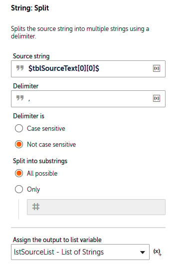
    


3.  Click on **Save**. Your development interface
    for this section should look like this:


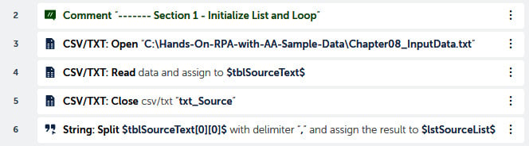


With that, you have successfully applied the
**Spilt** action to split a variable and assign the results to a
`List` variable. This will allow the bot to work with each
name individually within the list. In order to
work through the list, we have to implement a loop. In the next section,
we will introduce you to loops---in particular, looping through lists.
This list is a collection of individual names. We want to process each
individual, and a loop allows you to do this. It effectively loops
through each individual from a list until it reaches the end of the
list.


Looping through lists 
=====================


In this section, we will be looping through the
`lstSourceList` list variable. As we go through the list, a
variable will be needed to store the current name within the list. You
created a variable for this earlier called `strFullName`.

To loop through a list, we must use the **Loop** action. Let\'s continue
with the walk-through and apply the **Loop** action:

1.  Drag the **Loop** action from the **Loop** package just below line
    **6**.

2.  Set the following properties for the **Loop** action on line **7**:

    **Loop Type**: **Iterator**

    **Iterator**: **For each item in the list**

    **list**: **lstSourceList - List**

    **For**: **All items in the list**

    **Assign the current value to variable**: **strFullName - String**

    The properties should look like this:

    
    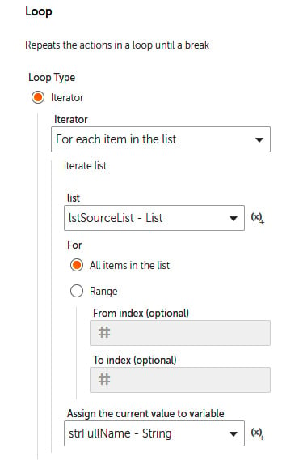
    


3.  Click on **Save**.

4.  All the actions that need to be performed within the loop are
    represented by being indented within the **Loop** action. Let\'s
    align our comments (lines **8** to **12**) so that they are within
    the loop. This can be done by selecting lines **8** to **12**, then
    dragging and dropping these lines just below line **7**, ensuring
    they are inside the loop on line **7**.

5.  Click on **Save**.

6.  Now would be a good idea to check the progress
    of our bot at each section. We can add a message box to show us what
    has been done so far. This is best placed at the output stage. So,
    add a **Message box** action just below line **12** while keeping it
    within the loop on line **7**.

7.  Since we have now split the source text into the
    `strFullName` variable, we can add this value inside our
    **Message box**. Set the following properties for the **Loop**
    action on line **7**:

    **Enter the message box window title**:
    `String Manipulation`

    **Enter the message to display**:
    `Full name: |$strFullName$|` *(note the bars before and
    after the variable. This is so we can clearly identify any white
    characters, such as spaces.)*

    The properties should look like this:

    
    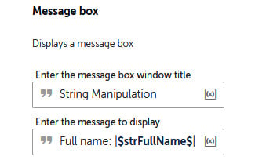
    


8.  Click on **Save**. Your development window for this section should
    look like this:


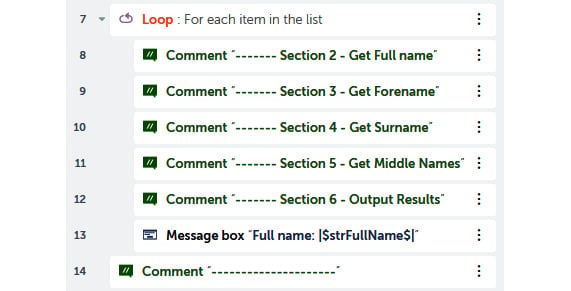


Great! We are now in a position to run the bot and
test what progress we\'ve made so far. The bot should split each
individual name from the initial string and show it in the message box.
With that, you have successfully created a `List` type
variable and built a loop to iterate through the split list. You can go
ahead and run the bot to test it.

In the next section, we will start working with each name by
manipulating and formatting them as required.


Section 2 -- Getting full names 
-------------------------------

We already have the full name of each individual
that\'s been assigned to the `strFullName` variable. However,
this isn\'t how we want this to work. During testing, we can tell there
are spaces in some of the names by looking at the start and end of the
string. These will need to be trimmed. Also, we cannot be sure what case
the string is initially in. Since we need to set its case, it would be
good to set it all as *uppercase* to start with. This way, we\'ll know
for sure what case to work with. We already have our
`strFullName` variable so that we can store the full name, so
a variable won\'t be required.

### Using the Trim action

There is a little bit of formatting we need to do
with the full name, just to ensure our results are as required. The
first action we will assign is the **Trim** action. This action will
remove spaces before and after any string type
variable. When using the **Trim** action, you can specify whether you
wish to trim preceding or trailing spaces or both. Follow this
walk-through to learn how to trim our variable:

1.  Add the **String: Trim** action just below line **8**.

2.  Set the following properties for the **String: Trim** action on line
    **9**:

    **Source String**: `$strFullName$`

    **Trim from the beginning**: *Checked*

    **Trim from the end**: *Checked*

    **Assign the output to variable**: **strFullName - String**

    The properties should look like this:

    
    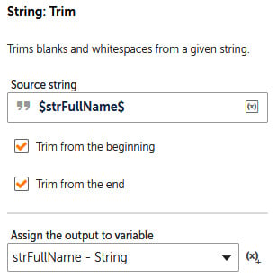
    


3.  Click on **Save**.

We now know that there won\'t be any spaces before and after the full
name. In this instance, this is very important because we can now
confidently identify any forenames, middle names, and
surnames using the space between each name. If we
left the spaces in, this may have caused errors.

The next thing we need to do is convert the full name into uppercase.

### Applying uppercase to a string

When we break the name down into its counterparts,
the required case is specified; for example, **Surname** needs to be in
uppercase and **Forename** in proper case. We do not know what case we
initially get the data in, so it is always a good idea to initialize
this by setting everything to a fixed standard. You then know what
format you are working with. Here, we will convert everything into
uppercase. Execute the following steps to convert the case:

1.  To convert the case, we will use the **String: Uppercase** action by
    dragging it just below line **9**.

2.  Set the following properties for the **String: Uppercase** action on
    line **10**:

    **Source String**: `$strFullName$`

    **Assign the output to variable**: **strFullName - String**

    The properties should look like this:

    
    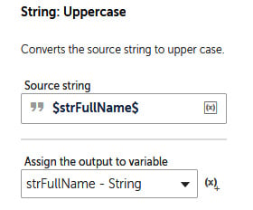
    


3.  Click on **Save**. Your development interface for this section
    should look like this:


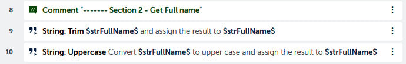


Great work! With that, the first two sections are
now complete. Since we already have the message box, go ahead and run
the bot. The bot should now loop through each name, showing it formatted
without any leading or trailing spaces, as well as it being all in
uppercase.

In the next section, we will continue with more data manipulation by
learning how to extract a forename from a full name. To do this, you
will need to learn how to use the **Extract** and **Substring** actions.


Section 3 -- Getting forenames 
------------------------------

The requirement for the forename is to format it
as proper case. This is where the first letter is capitalized and the
rest are in lowercase. To achieve this, we will need to create two new
variables. The `strForename` variable will be used to store
the resulting forename, while the `strInitial` variable will
be used to store the first letter of the forename. The following steps
will show you how to get the forename:

1.  Create two `String` type variables called
    `strForename` and `strInitial`.

2.  It would be a good idea to add these variables to our message box to
    help us with progress testing. Edit the
    message display property of the message box on line **15** to the
    following:

    
    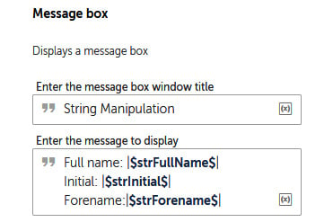
    


3.  Click on **Save**.

To get the forename from the full name, we can use the **Extract**
action. This action allows you to extract part of a string by indicating
its start and end characters. You can also specify which occurrence of a
character to use.

### Using the Extract action

In this section, we will use the **Extract** action
to extract everything up until the first space
from the `strFullName` variable. This will capitalize
the forename for us. You will notice that there
are a lot of options available when using this action. For instance, it
also trims the output, as shown in the following steps:

1.  To extract the forename, add the **String: Extract** action just
    below line **11**.

2.  Set the following properties for the **String: Extract** action on
    line **12**:

    **Source String**: `$strFullName$`

    **Get characters**: **After**

    **(After) End before text**: *(enter a space)*

    (**After) Occurrence**: `1`

    **If no match found, return**: **Empty (null) String**

    **Number of characters to get**: **All**

    **Trim the extracted text**: *Checked*

    **Remove Enter from the Extracted text**: *Checked*

    **Assign the output to variable**: **strForename - String**

    The properties should look like this:

    
    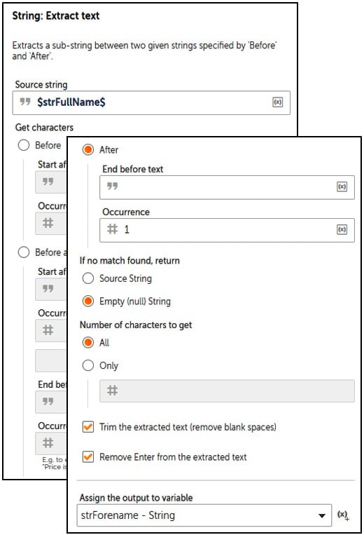
    


3.  Click on **Save**.

Now that we have updated our message box, you can
run the bot to test it. You should get the full name and the forename,
all in uppercase. We will now work with the
forename and format it as proper case. We\'ll achieve this by taking the
first letter from the forename; this will leave the part of the name
that needs to be converted into lowercase. To split the name in such a
way, we will use the **Substring** action.

### Using the Substring action

The **Substring** action allows you to extract a
substring from a given string variable by character location. This is
ideal for our requirement as we know we need the
first letter for the `strInitial` variable. For the rest of
the name, we know we need all the characters starting from the second.
Follow these steps to add the **Substring** action:

1.  To get the first character from the `strForename`
    variable, drag the **String: Substring** action just below line 12.

2.  Set the following properties for the **String: Substring** action on
    line **13**:

    **Source String**: `$strForename$`

    **Start from**: `1`

    **Length**: `1`

    **Assign the output to variable**: `strInitial - String`

    The properties should look like this:

    
    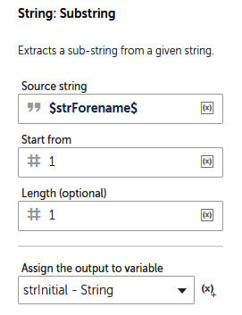
    


3.  Click on **Save**.

4.  To get the rest of the forename (without the
    first letter), add another **String: Substring** action just below
    line **13**.

5.  Set the following properties for the **String: Substring** action on
    line **14**:

    **Source String**: `$strForename$`

    **Start from**: `2`

    **Assign the output to variable**: **strForename - String**

    The properties should look like this:

    
    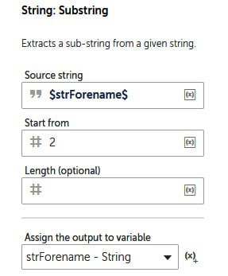
    


6.  Click on **Save**.

    With that, we have split the name. Next, we
    need to convert the forename into lowercase. To do this, we will use
    the **String: Lowercase** action and drag it just below line **14**.

7.  Set the following properties for the **String:
    Lowercase** action on line **15**:

    **Source String**: `$strForename$`

    **Assign the output to variable**: **strForename - String**

    The properties should look like this:

    
    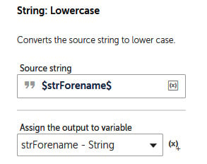
    


8.  Click on **Save**.

9.  Now that we have both parts of the forename,
    we just need to concatenate them. We can do this by adding the
    **String: Assign** action just below line **15**.

10. Set the following properties for the **String: Assign** action on
    line **16**:

    **Select the source string variable**:
    `$strInitial$$strForename$`

    **Select the destination string variable**: **strForename - String**

    The properties should look like this:

    
    
    


11. Click on **Save**.

You are doing great! That\'s *Section 3 -- Getting
forenames* complete. You can run the bot to test
it. You will see that the forename is now correctly formatted as proper
case. The development interface for this section should look this:


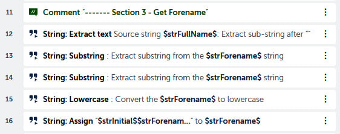


In the next section, we\'ll get the surname and format it in uppercase.
We will get this from our *full name* variable. This is already in
uppercase, so formatting shouldn\'t be a problem. By now, you will have
discovered that there are many different
ways to manipulate strings. In the next section,
we will use the **Find** action to apply regular expressions.


Section 4 -- Getting surnames 
-----------------------------

For the surname, we need the last word from our
full name string. There are many ways to do this. One way would be to
reverse the string using the **Reverse** action and then get the first
word. This would be the surname since the variable has been reversed.
Since Automation Anywhere also allows you to use regular expressions to
find patterns, in this instance, we will be using this method.

### Using the Find action and regular expressions

Automation Anywhere also allows you to apply
regular expressions to find a substring. A regular expression can be
very useful when working with data. It is
essentially a sequence of characters used to find patterns in a string.
To find the character where the last word starts
in a string, we would use `(\w+)$` as the regular expression.
In this section, we will use the **Find** action and apply this regular
expression to get the surname. The only issue is the `$`
character in our regular expression as this is a
reserved character for representing variables. In Automation Anywhere,
you should replace this with `$$` to represent a single US
dollar character. The **String: Find** action will return a numeric
value that represents the location of where the surname starts.

We will need two further variables to get the surname: the
`Number` variable for the location and the `String`
variable to store the surname. The following walk-through will help you
perform this task:

1.  Create a new `Number` variable called `numLoc`
    for the surname location.

2.  Create a new `String` variable called
    `strSurname` for the surname.

3.  Add the **String: Find** action just below line **17**.

4.  Set the following properties for the **String: Find** action on line
    **18**:

    **Source string variable**: `$strFullName$`

    **Find string**: `(\w+)$$`

    **When finding**: **Do not match case**

    **The \"find string\" is**: **A regular expression**

    **Start from**: `1`

    **Assign the output to variable**: **numLoc - Number**

    The properties should look like this:

    
    
    


5.  Click on **Save**.

6.  We now have the location of
    where the surname starts
    from. To get the surname, add the **String: Substring** action just
    below line **18**.

7.  Set the following properties for the **String: Substring** action on
    line **19**:

    **Source String**: `$strFullName$`

    **Start from**: `$numLoc$`

    **Assign the output to variable**: **strSurname - String**

    The properties should look like this:

    
    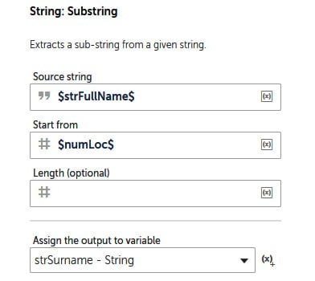
    


8.  Click on **Save**.

9.  Now that the surname has been extracted, add
    it to the final message
    box on line **22**. Edit the message display property of the message
    box so that it includes the following:

    
    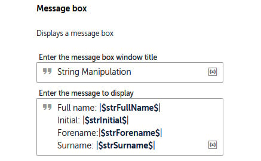
    


10. Click on **Save**.

Great progress! That\'s *Section 4 -- Getting surnames* complete. Run
the bot to test it. We now have
the forename and the surname
in the correct format. The development interface
for this section should look like this:


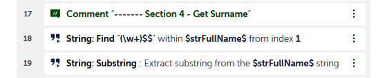


In the next section, we\'ll gather the middle names. The requirement is
to get the initial of each middle name for every individual. Here, you
will learn how to use the **Replace** action, as well
as how to use the **Split** and **Loop** actions
to make a nested loop.


Section 5 -- Getting middle names 
---------------------------------

We have a challenge with the middle names. Any
individual may have none, one, or many middle names. We just don\'t
know! At least with the surname and forename we know that everyone has
one of each. The first stage will be to extract all the middle names as
a string. A new variable will be needed to store all the middle names.
Since we already know the surname and forename, the easiest method would
be to replace these with blanks, thus leaving us with only the middle
names. We can use the **String: Replace** action to achieve this.

### Using the Replace action

Initially, we had the full name,
replaced the forename of the full name with
spaces, and then did the same with the surname. By applying the **Trim**
action, we will get only the middle names. Follow these steps to apply
the **Replace** action:

1.  Create a new **String** variable called `strMiddleNames`
    for storing the middle names.

2.  Add the **String: Replace** action just below line **20**.

3.  Set the following properties for the **String: Replace** action on
    line **21**:

    **Source String**: `$strFullName$`

    **Find string**: `$strForename$`

    **When finding**: **Do not match case**

    **The \"find string\" is**: **Not a regular expression**

    **Start from**: `1`

    **Replace with**: *(enter space)*

    **Assign the output to variable**: **strMiddleNames - String**

    The properties should look like this:

    
    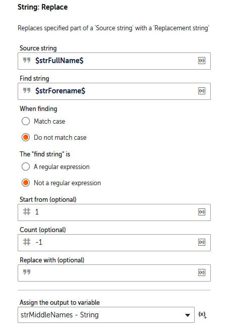
    


4.  Click on **Save**.

5.  That\'s the forename removed. To remove the surname, add another
    **String: Replace** action just below line **21**.

6.  Set the following properties for the **String:
    Replace** action on line **22**:

    **Source String**: `$strMiddleNames$`

    **Find string**: `$strSurname$`

    **When finding**: **Do not match case**

    **The \"find string\" is**: **Not a regular expression**

    **Start from**: `1`

    **Replace with**: *(enter space)*

    **Assign the output to variable**: **strMiddleNames - String**

    The properties should look like this:

    
    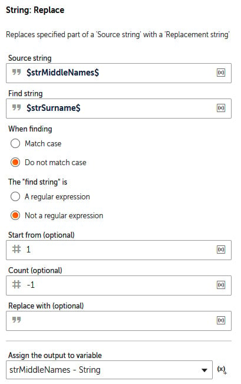
    


7.  Click on **Save**.

8.  Having replaced the forename and surname with
    spaces, we now need to remove these spaces. The best way to do this
    is to use the **String: Trim** action. Add the **String: Trim**
    action just below line **22**.

9.  Set the following properties for the **String: Trim** action on line
    **23**:

    **Source String**: `$strMiddleNames$`

    **Trim from the beginning**: *Checked*

    **Trim from the end**: *Checked*

    **Assign the output to variable**: **strMiddleNames - String**

    The properties should look like this:

    
    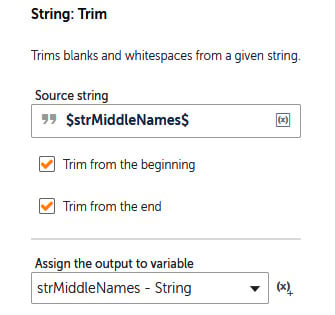
    


10. Click on **Save**.

11. The middle names have now been extracted to
    a variable. Let\'s add this variable to the
    final message box on line **25**. Edit the message display property
    of the **Message box** so that it includes this:

    
    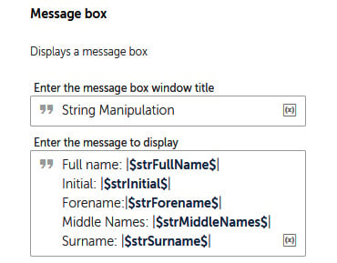
    


12. Click on **Save**.

Go ahead and run the bot to check its progress. We
will now be getting all the middle names too, but they are placed
together as one variable. Our goal is to get the initial of each middle
name. The plan is to append any initials to the
`strInitial` variable, so we will need to ensure it is blank
before we process each individual.

### Assigning a null value to a string

The bot reads each individual\'s middle names into
a single variable, but we don\'t know how many middle names anyone may
have. All the initials for the middle names need to be collated and
assigned to a variable. The best way to do this is to loop through each
middle name and append the initial at each iteration. To remove the risk
of any middle name initials being bought forward from any previous
individual, we should initialize it to null before it gets these
initials. We can use the `strInitial` variable for this as
it\'s already there and we are not using it for anything else. The
following instructions will take you through the steps to achieve this:

1.  To assign a null value to the `strInitial` variable, drag
    the **String: Assign** action just below line **23**.

2.  Set the following properties for the **String: Assign** action on
    line **24**:

    **Select the source string variable**: *(leave empty)*

    **Select the destination string variable**: **strInitial - String**

    The properties should look like this:

    
    
    


3.  Click on **Save**.

You are doing a great job so far. Moving forward,
the bot has to get the initial of each middle name. What we have to be
careful about is that in some cases, there may be no middle names at
all. In order to cope with this, we can use a simple logic condition to
check the contents of our `strMiddleNames` variable.

In the next section, we will learn how to apply a simple **If**
statement as our logical condition. Applying this condition will allow
the bot to get middle names where they exist. If this is not applied, it
may cause our bot to fail when looking for individuals without any
middle names.


Applying a simple logical condition 
===================================


A condition needs to be added to check that the
`strMiddleNames` variable is not empty. There is no point in
trying to get the middle name initials if there are no middle names. The
following instructions will take you through the steps to achieve this:

1.  To assign a simple logical condition, drag the **If** action just
    below line **24**.

2.  Set the following properties for the **If** action on line **25**:

    **Condition**: **String condition**

    **Source value**: `$strMiddleNames$`

    **Operator**: **Not equal to**

    **Target value**: *(leave blank)*

    The properties should look like this:

    
    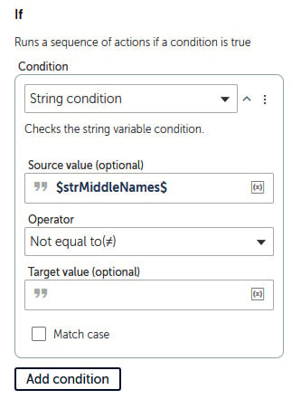
    


3.  Click on **Save**.

All the actions that we want the bot to perform need to be placed
indented within the *If* condition statement, similar to placing actions
for loops. It gets more interesting now: within our middle names\'
variable, there may be one or more middle names. We just don\'t know
this. Since we need to get the initial of each middle name, the best way
to achieve this is to split this variable by using spaces. This will
create a list of every individual middle name. We can then extract the
initial and append it to our `strInitial` variable.

The bot is already processing within a loop, so creating another list to
loop through will give you some great experience
in how to implement a nested loop, which is a loop within another loop.


Implementing a nested loop 
--------------------------

We will be splitting the
`strMiddleNames` variable by any spaces to create a list. For
this to work, we will create a few additional variables. Since the bot
loops through the list, we will need to store the current middle name
and the current initial of that name. We will also need a
`List` type variable to store the list of middle names once
it\'s been split. The following instructions will take you through the
steps to achieve this:

1.  Create a `List` type variable called
    `lstMiddleNames`.

2.  Create two `String` type variables called
    `strCurrentMiddleName` and
    `strCurrentMiddleNameInitial`. Your variables list should
    now look similar to this:

    
    
    


3.  To split the `strMiddleNames` variable into a list, add
    the **String: Split** action just below line **25**, ensuring it is
    within the **If** action on line **25**.

4.  Set the following properties for the **String: Split** action on
    line **26**:

    **Source string**: `$strMiddleNames$`

    **Delimiter**: *(enter a space)*

    **Delimiter is**: **Not case sensitive**

    **Split into substrings**: **All possible**

    **Assign the output to list variable**: **lstMiddleNames - List of
    Strings**

    The properties should look like this:

    
    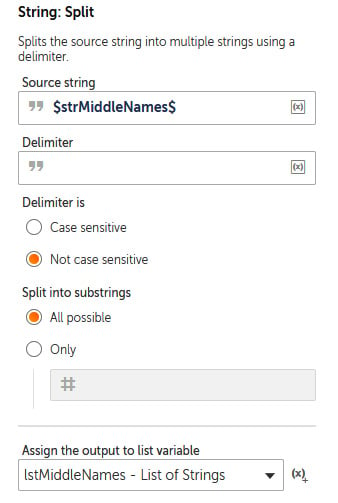
    


5.  Click on **Save**.

6.  Now, we have the middle names in a list. To
    loop through this list, add a **Loop** action just below line
    **26**, ensuring it remains within the **If** statement on line
    **25**.

7.  Set the following properties for the **Loop** action on line **27**:

    **Loop Type**: **Iterator**

    **Iterator**: **For each item in the list**

    **List**: **lstMiddleNames -List**

    **For**: **All items in the list**

    **Assign the current value to variable**: **strCurrentMiddleName -
    String**

    The properties should look like this:

    
    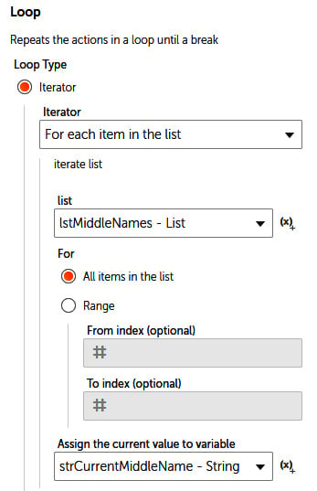
    


8.  Click on **Save**.

We can now manipulate each middle name. This job
has been assigned to the `strCurrentMiddleName` variable. The
requirement is to get the first initial of each middle name. As we did
previously, we will use the **String: Substring** action for this. Once
we have this, we can concatenate it to our initials so far. Let\'s get
started:

1.  To get the first letter of each middle name, add the **String:
    Substring** action just below line **27**, ensuring it is indented
    within the **Loop** action on line **27**.

2.  Set the following properties for the **String: Substring** action on
    line **28**:

    **Source String**: `$strCurrentMiddleName$`

    **Start from**: `1`

    **Length**: `1`

    **Assign the output to variable**: **strCurrentMiddleNameInitial -
    String**

    The properties should look like this:

    
    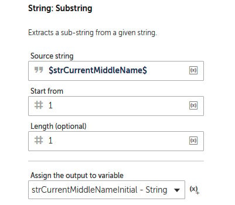
    


3.  Click on **Save**.

4.  To append this to our middle name initials, add the **String:
    Assign** action just below line **28**, ensuring it remains indented
    within the **Loop** action on line **27**.

5.  Set the following properties for the **String:
    Assign** action on line **29**:

    **Select the source string variable(s)/ value (optional)**:
    `$strInitial$$strCurrentMiddleNameInitial$`

    **Select the destination string variable**: **strInitial - String**

    The properties should look like this:

    
    
    


6.  Click on **Save**.

With that, another section is complete. There\'s only one more to go!
Now, you can run your bot. You should now have all the name items as
required; that is, the forename in proper case, the surname in
uppercase, and the middle name initials all together. The development
interface for this section should look like this:


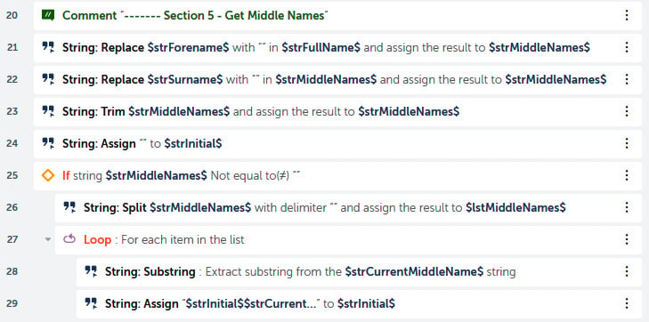


In the next and last section, we will output our
results to a CSV file. We will be appending a new line of names for each
individual to our CSV file. This is best placed to replace our message
box. However, we do need to create the file at the beginning, along with
the required headers. We will be using the **Log to file** action to do
this.


Section 6 -- Outputting the results 
-----------------------------------

A CSV file with headers will need to be created
just before the primary loop as we only want this to be created once.
The record should be added while we\'re within the primary loop so that
it\'s created once per individual. Once we\'ve done this, we will need
to identify the sequence of our name items as required. The output
should be in the following format:


```
Surname in uppercase, Forename in Proper case, Middle name initials in uppercaseCopy
```


So, for the first record, it would look like this:
`MAHEY, Husan L`.

Let\'s get started:

1.  To create the CSV file with headers, add the **Log to file** action
    just below line **2**. This will make this the first action the bot
    performs.

2.  Set the following properties for the **Log to file** action on line
    **3**:

    **File path**:
    `C:\Hands-On-RPA-with-AA-Sample-Data\Chapter08_Output.csv`

    **Enter text to log**: `Surname, Forename/Initials`

    **When logging**: **Overwrite existing log file**

    The properties should look like this:

    
    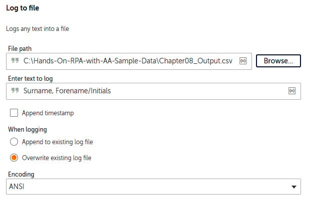
    


3.  Click on **Save**.

4.  To add each individual to our file, add the **Log to file** action
    just below line **31**.

5.  Set the following properties for the **Log to file** action on line
    **32**:

    **File path**:
    `C:\Hands-On-RPA-with-AA-Sample-Data\Chapter08_Output.csv`

    **Enter text to log**:
    `$strSurname$, $strForename$ $strInitial$`

    **When logging**: **Append existing log file**

    The properties should look like this:

    
    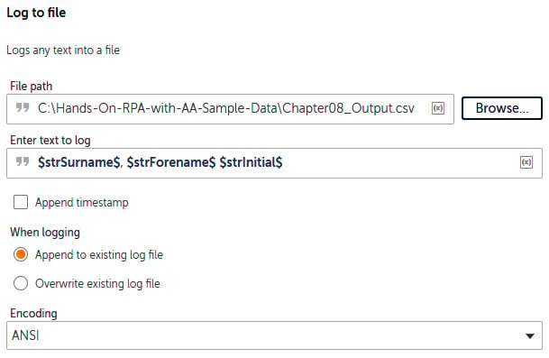
    


6.  Click on **Save**.

7.  Finally, delete the **Message box** action on line **33** and click
    on **Save**.

Congratulations -- you have completed your bot! The development
interface for this final section should look like this:


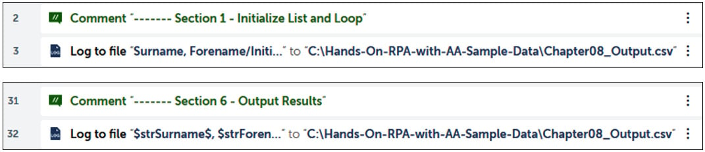


Now, it\'s time to test the bot. When it\'s
executed, you will get the `Chapter08_Output.csv` file at
`C:\Hands-On-RPA-with-AA-Sample-Data\Chapter08_Output.csv`.

The contents should look like this:


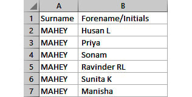


This has been quite an intensive walk-through; we have gone through some
of the most common string manipulation actions. However, you will have
noticed that there are still more actions for you to discover.

Hopefully, you feel a lot more confident with using Automation Anywhere
to automate your routine tasks.


Summary 
=======


Having gone through this walk-through, you have not only gained
experience with how to use string manipulation actions but now also have
an idea of what sort of scenarios they could be best applied to. To
recap, we have covered a number of useful actions, including extracting
a specific substring from a string via locations, extracting a substring
from a string via specific text, finding a specific substring within a
string, replacing parts of a string, converting strings into upper or
lowercase, trimming leading/trailing spaces from strings, using regular
expressions to find string patterns, splitting strings with a specific
delimiter, concatenating strings, creating list variables, looping
through list variables, and finally, understanding simple logical
conditions.

You are now becoming more experienced with building more complex bots.
In the next lab, we will continue to build on this progress by
looking at working with the filesystem. This will include how to move,
delete, and rename files and folders. We will also look at conditional
logic and loops in more detail.
