Lab 9: Working with Conditional Logic, Loops, and the Filesystem 
=================================================================

In this lab, we will cover the following topics:

-   Applying different types of loops
-   Applying logical conditions
-   Working with the filesystem

Like the previous lab, this lab will also take the form a
building a bot, but in this case, you will be building two bots. Both
will be by taking you through a walk-through. This will be a bit
intensive, but you will gain some valuable experience in terms of how to
implement a number of useful actions. This method also puts these
actions into context as they are all working toward a complete task. We
will use the following packages:

For this lab, the two bots we\'ll be building will be automating a
human process. The first process involves reading each record in a CSV
file and then sorting these records into a file management subfolder
system. The second bot will collate files from subfolders, and then
rename and delete files and folders. Progressing through the
walk-throughs will enable you to build your confidence and understanding
of loops, condition statements, and working with the filesystem. By the
end of this lab, you will be able to add rule-based decisions for
your bot, manage files and folders, and build repeating processes by
using loops.

Technical requirements 
======================

You will need the following in order to install Automation Anywhere Bot
agent:

-   Google Chrome
-   Completed registration with Automation Anywhere  Community
    Edition
-   Logged on successfully to Automation Anywhere  Community
    Edition
-   A successfully registered local device
-   Successfully downloaded the sample data from GitHub

Applying different types of loops 
=================================

The majority of business applications work with
data in some capacity or another. The obvious ones are applications that
have a database in the backend. This could include sales ledgers,
customer details, and product data. This data can be large in volume.
Developers often design routines to process large datasets. This
involves processing each individual record from these datasets. To build
this sort of functionality, we use loops.

Being able to build loops is probably a function that\'s included with
all development platforms. Looping is basically having the ability to
repeat an action or actions. Loops can be applied in a number of ways;
the number of times a process is repeated can be fixed, based on a
variable or a number of other conditions. There are many scenarios where
loops are deployed, some of which are as follows:

-   For every email in a particular folder of a mailbox
-   For every row in a table
-   For every file in a folder
-   For each row in a CSV/TXT file
-   For each row in an Excel worksheet
-   Condition-based; that is, loop until a file is created/updated

We have already built bots that loop through CSV files and lists. This
will be explored further when you are introduced to the
`Record` variable type. This is a useful variable type for
storing all the fields for a single record. Our walk-through will
involve looping through the records of a CSV file and also looping
through a list. The bot we\'ll build will be automating a manual process
that involves extracting each record from a daily CSV file and filing it
as an alphabetically grouped file.

In the upcoming walk-through, we will be automating the following manual
task:

1.  The operator receives a daily `.csv` customer file.
2.  Each record from the customer file needs to be appended to a
    corresponding file.
3.  The corresponding file is located in an
    alphabetically grouped naming system.
4.  The groups are made up of the following subfolders:
    `ABCD`, `EFGH`, `IJKL`,
    `MNOP`, `QRST`, `UVWX`, and
    `YZ`.
5.  Use the surname initial to identify which subfolder relates to the
    record.
6.  Check if the subfolder exists -- create it if it doesn\'t.
7.  Check if a corresponding file exists and if not, create a file with
    headers.
8.  Append the customer details to this file.
9.  Move to the next record in the file until all the records have been
    processed.

We will break this walk-through into six sections to make it easier to
follow:

-   Section 1 -- Opening the source file

-   Section 2 -- Looping through each row

-   Section 3 -- Getting the surname initial and identifying the group

-   Section 4 -- Checking or creating a subfolder

    Section 4a -- Creating a subfolder and output file if it doesn\'t
    exist

-   Section 5 -- Updating the output file

-   Section 6 -- Closing the the source file

As always, we will start by adding some comments to guide us. We will
begin with just the basic skeleton and add further levels of detail as
we progress.

Let\'s start this walk-through by executing the following steps:

1.  Log into **Control Room**.
2.  Create a new bot and call it
    `Lab 9 - Loops & Conditions`. Place it in the
    `\Bot\` folder.
3.  As always, we\'ll begin by adding some comments to use as templates
    for our bot. Add a new **Comment** action called
    `"---------------------"` on line **1** and click on
    **Save**.
4.  Add a new **Comment** action called
    `"-------- Section 1 - Open the Source file"` on line
    **2** and click on **Save**.
5.  Add a new **Comment** action called
    `"------- Section 2 - Loop through each row"` on line
    `3` and click on `Save`.
6.  Add a new **Comment** action called
    `"------- Section 3 - Get Surname initial & identify group"`
    on line **4** and click on **Save**.
7.  Add a new **Comment** action called
    `"------- Section 4 - Check if sub folder exists"` on line
    **5** and click on **Save**.
8.  Add a new **Comment** action called
    `"------- Section 4a - Create sub folder & output file if it doesn't exist"`
    on line **6** and click on **Save**.
9.  Add a new **Comment** action called
    `"------- Section 5 - Update output file"` on line **7**
    and click on **Save**.
10. Add a new **Comment** action called
    `"------- Section 6 - Close the Source file"` on line
    **8** and click on **Save**.
11. Add a new **Comment** action called
    `"----------------------"` on line **9** and click on
    **Save**. Our initial development interface should look like this:

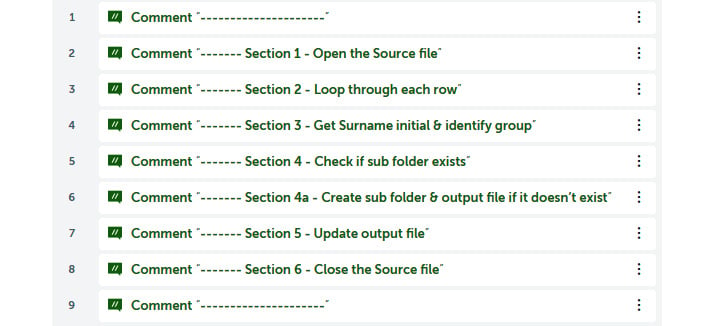

We are now ready to start on our six sections. We
will start with *Section 1 -- Opening the source file*. This file is
available in this course\'s GitHub repository.

Section 1 -- Opening the source file 
------------------------------------

To instruct your bot to open the
`Chapter09_InputData.csv` source file, please execute the
following steps:

1.  Drag the **CSV/TXT: Open** action just below line **2**.

2.  Set the following properties for the **CSV/TXT: Open** action on
    line **3**:

    **Session name**: `Data`

    **File path**: **Desktop file** --
    `C:\Hands-On-RPA-with-AA-Sample-Data\Chapter09_InputData.csv`

    **Contains header**: *Checked*

    **Delimiter**: **Comma**

    **Trim leading spaces**: *Checked*

    **Trim trailing spaces**: *Checked*

    The properties window should look like this:

    
    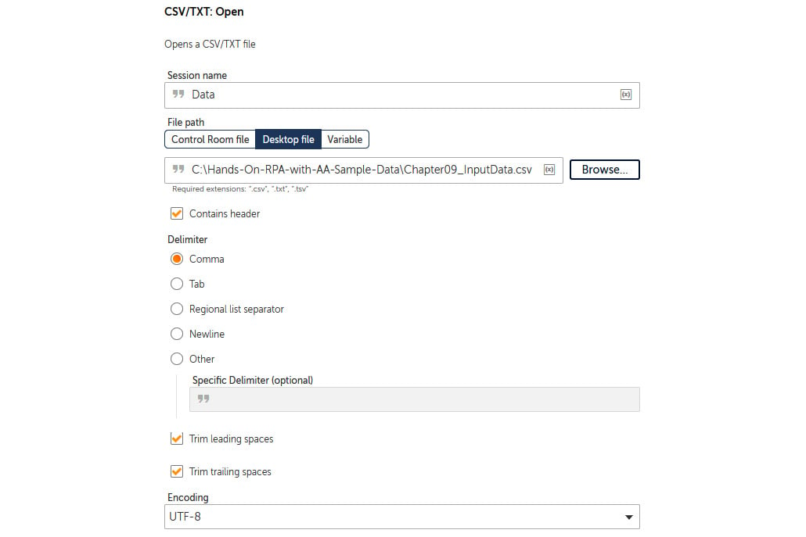
    

3.  Click on **Save**. The development window for this section should
    look like this:

With that, we have instructed our bot to open the
source file. Next, we will create a **Loop**. This loop will go through
the whole file, processing each record. When opening a file, it creates
a session, which is like a connection. This is set as `Data`.
We need to remember this because when we create the loop, we will need
to specify the session. This way, the bot will know what source it needs
to iterate from. There may be scenarios where multiple sources are open
at the same time; having a unique session name for each individual
source stops any sources getting mixed up.

Section 2 -- Looping through each row 
-------------------------------------

As we will be looping through each record, we will
use the `Record` variable type to store the working record.
Follow these steps to create the variable and the loop:

1.  Create a new variable named `recSource` as a
    `Record` type. The **Create variable** dialog should look
    like this:

    
    
    

2.  Drag the **Loop** action just below line **4**.

3.  Set the following properties for the **Loop** action on line **5**:

    **Loop Type**: **Iterator**

    **Iterator**: **For each row in CSV/TXT**

    **Session name**: `Data`

    **Assign the current row to this variable**: **recSource - Record**

    The properties window should look like this:

    
    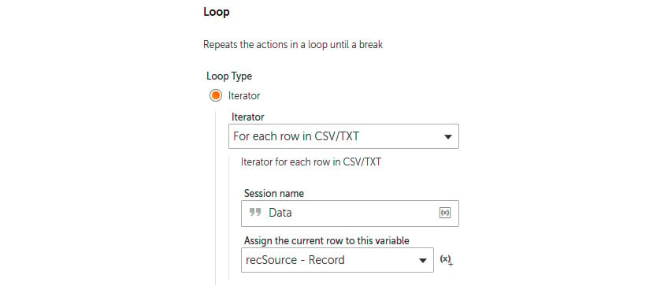
    

4.  Click on **Save**.

5.  The steps *3* to *5* will be performed with
    the loop. Move the comments by dragging and dropping lines **6** to
    **9** so that they are within the **Loop** element on line **5**.
    We\'re doing this so the bot knows which actions are to be repeated.

6.  Click on **Save**. The completed development window should look like
    this:

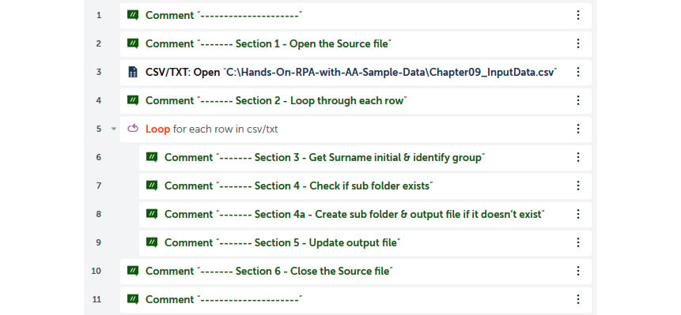

That completes *Section 2 -- Looping through each row*! You seem to be
whizzing through this. So far, our bot will connect to the source file
and loop through each record, assigning it to our `recSource`
variable. Once it has gone through the whole file,
it will close it. Next, we have to get the surname initial and identify
which group the record belongs to. For example, the surname for the
first record is `BOWMAN`. By taking the initial of
`B`, we need to identify the subfolder group. The
`ABCD` subfolder group contains the initial `B`.
This identification process needs to be done for each record.

Section 3 -- Getting the surname initial and identifying the group 
------------------------------------------------------------------

To identify the subfolder group, we need the
surname initial. When data is assigned to a `Record` type
variable, fields can be accessed via the index number. The index is
0-based, so the first field is index `0` and so forth.
From looking at the source file at
`C:\Hands-On-RPA-with-AA-Sample-Data\Chapter09_InputData.csv`,
we can see that the surname is the second field. This would give it an
index of `1`. For this section, we will need a variable to
store the surname initial. As it\'s the reference value that will be
used to identify the subfolder group, let\'s call this
`strRefInitial`. Let\'s get started:

1.  Create a `String` type variable named
    `strRefInitial`.

2.  We know the surname is the second field, so it will be indexed at
    `1`. Drag the **String: Substring** action just below line
    **6**, ensuring it is within the **Loop** element on line **5**.

3.  Set the following properties for the **String: Substring** action on
    line **7**:

    **Source String name**: `$recSource[1]$`

    **Start from**: `1`

    **Length**: `1`

    **Assign the output to variable**: **strRefInitial - String**

    The properties window should look like this:

    
    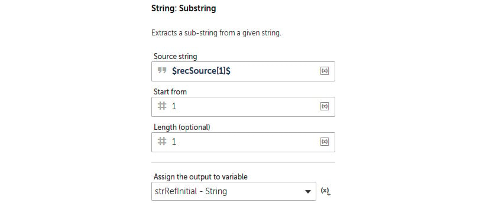
    

4.  Click on **Save**.

We now have our surname initial. Next, we need to identify which
subfolder group this initial belongs to. There are seven sub folders:
`ABCD`, `EFGH`, `IJKL`, `MNOP`,
`QRST`, `UVWX`, and `YZ`. Our bot needs to
make a decision here. Since this is a rule-based decision, it\'s ideal
for RPA. We will now look at how to apply conditions in order to make
statements using Automation Anywhere . These conditions will be
used to decide which subfolder group the surname initial belongs to.

Applying logical conditions 
===========================

Let\'s continue with our walk-through and add our condition:

1.  Create a `String` type variable named
    `strSubFoldersList` for storing our subfolders.

2.  Create a `List` type variable, set as a `String`
    subtype named `lstSubFoldersList` , for looping through
    our subfolders.

3.  Create a `String` type variable named
    `strSubFolder` for storing the allocated subfolder.

    The variables list should look like this:

    
    
    

4.  To assign our subfolder groups to the `strSubFoldersList`
    variable, drag the **String: Assign** action just below line **7**,
    ensuring it is within the **Loop** element on line **5**.

5.  Set the following properties for the **String:
    Assign** action on line **8**:

    **Select the source string variable/value**:
    `ABCD,EFGH,IJKL,MNOP,QRST,UVWX,YZ`

    **Select the destination string variable**: **strSubFoldersList -
    String**

    The properties window should look like this:

    
    
    

6.  Click on **Save**.

7.  Next, we need to split this variable into our `List`
    variable so that we can loop through it. Drag the **String: Split**
    action just below line **8**, ensuring it is within the **Loop**
    element on line **5**.

8.  Set the following properties for the **String: Assign** action on
    line **9**:

    **Source string**: `$strSubFoldersList$`

    **Delimiter**: `,`

    **Assign the output to list variable**: **lstSubFoldersList - List
    of Strings**

    The properties window should look like this:

    
    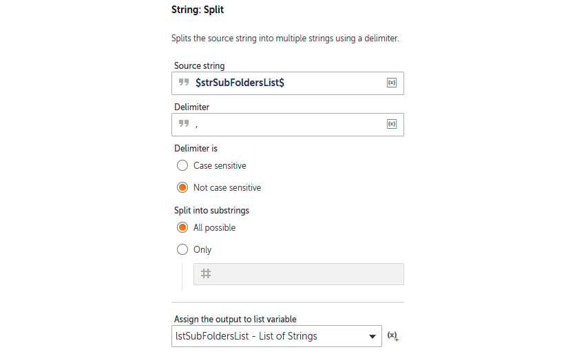
    

9.  Click on **Save**.

10. We now have a list of our seven subfolder
    groups and have our surname initial. Next, we will create a loop
    that will iterate through the list of subfolder groups. Add the
    **Loop** action just below line **9**, ensuring it is within the
    **Loop** element on line **5**.

11. Set the following properties for the **Loop** action on line **10**:

    **Loop Type**: **Iterator**

    **Iterator**: **For each item in the list**

    **List**: **lstSubFoldersList - List**

    **For**: **All items in the list**

    **Assign the current value to variable**: **strSubFoldersList -
    String**

    The properties window should look like this:

    
    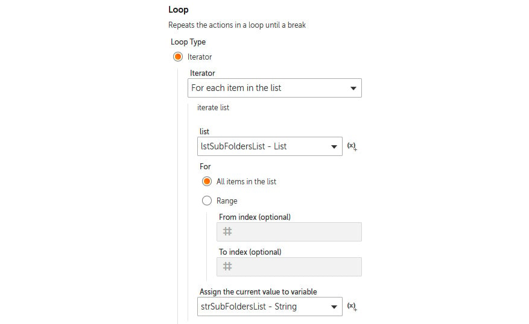
    

12. Click on **Save**.

13. Next, we will add a condition statement that
    checks whether our surname initial is contained in the current
    subfolder group. Drag the **If** action just below line **10**,
    ensuring it is within the **Loop** element on line **10**.

14. Set the following properties for the **If** action on line **11**:

    **Condition**: **String condition**

    **Source value**: `strSubFoldersList`

    **Operator**: **Includes**

    **Target value**: `$strRefInitial$`

    The properties window should look like this:

    
    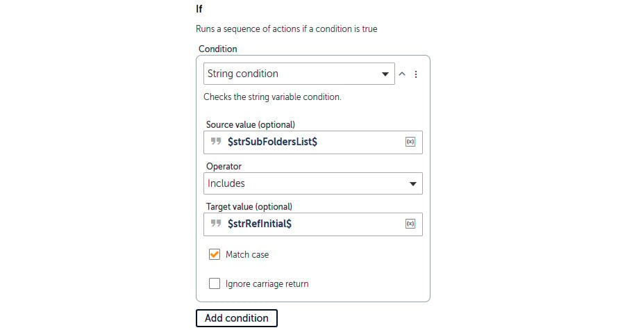
    

15. Click on **Save**.

16. We can assign the allocated subfolder group to
    our variable if this condition is met. Drag the **String: Assign**
    action just below line **11**, ensuring it is within the **If**
    statement on line **11**.

17. Set the following properties for the **String: Assign** action on
    line **12**:

    **Select the source string variable(s)/value (optional)**:
    `$strSubFoldersList$`

    **Select the destination string variable**: **strSubFolder -
    String**

    The properties window should look like this:

    
    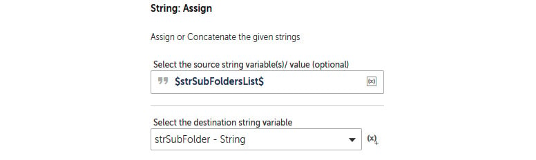
    

18. Click on **Save**.

The bot is at a stage now where it has identified
the subfolder group for the working record using the surname initial.
This brings *Section 3 -- Getting the surname initial and identifying
the group*, to an end. The development interface for this section should
look like this:

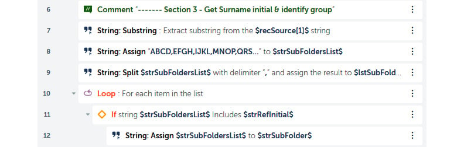

Our next task is to append our working record to an output file. This
output file is within the subfolder that has been identified. This
output folder and file may not exist, so the bot should create the
file/folder in this case. The name of the file should be
`Output.csv`.

Section 4 -- Checking or creating a subfolder 
---------------------------------------------

The output subfolders should be created in the
`C:\Hands-On-RPA-with-AA-Sample-Data\Chapter09_Output\` folder
path if they don\'t exist. Currently, this folder
is empty; a subfolder will need to be created whenever a customer record
is added to the subfolder group. Let\'s get started:

1.  We know that the output subfolder has been assigned to the
    `strSubFolder` variable, so we need to check that it
    exists. Drag the **If** action just below line **13**, ensuring it
    is within the **Loop** element on line 5.

2.  Set the following properties for the **If**
    action on line **14**:

    **Condition**: **Folder does not exist**

    **Folder path**:
    `C:\Hands-On-RPA-with-AA-Sample-Data\Chapter09_Output\$strSubFolder$`

    The properties window should look like this:

    
    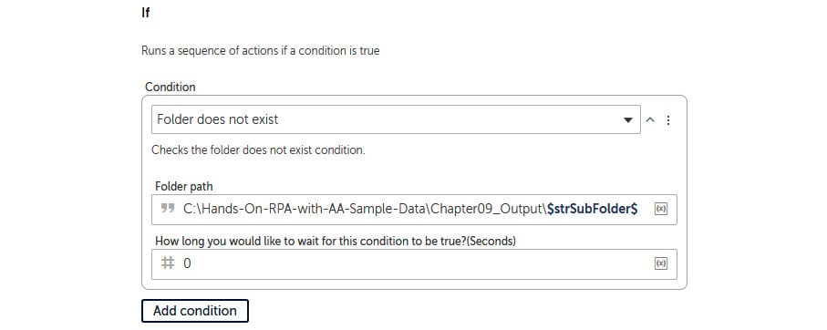
    

3.  Click on **Save**.

All the actions within the **If** action on line
**14** will only be performed if the output folder doesn\'t exist. The
bot will need to create this folder and the output
file containing headers only. We\'ll look at creating this in the next
section.

### Section 4a -- Creating a subfolder and output file

Before we create the folder and file, it would
make sense to move the **Comment** on line **15**
so that it\'s within the **If** action on line **14**. This will make
the bot more readable and logically accurate. The output file we\'re
creating should be identical to the source file in terms of structure.
This field structure is `Ref,Surname,FirstName,Amount`.

Let\'s continue with the walk-through and move the **Comment** before
creating the output subfolder and file:

1.  Drag the **Comment** on line **15** so that it\'s within the **If**
    action on line **14**. The **Comment** line should remain as line
    **15**.

2.  To create the subfolder, drag the **Folder: Create** action just
    below line **15**, ensuring it remains within the **If** action on
    line 14.

3.  Set the **Folder** property for the **Folder: Create** action on
    line **16** to
    `C:\Hands-On-RPA-with-AA-Sample-Data\Chapter09_Output\$strSubFolder$`.

4.  The properties window should look like this:

    
    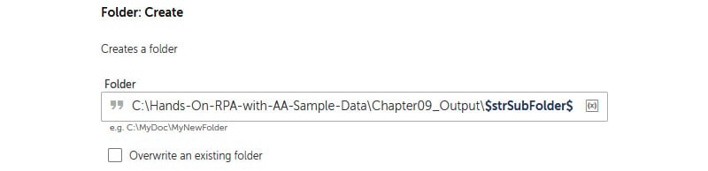
    

5.  Click on **Save**.

6.  To create the output file with headers, add
    the **Log to file** action just below line **16**.

7.  Set the following properties for the **Log to file** action on line
    17:

    **File path**:
    `C:\Hands-On-RPA-with-AA-Sample-Data\Chapter09_Output\$strSubFolder$\Output.csv`

    **Enter text to log**: `Ref,Surname,FirstName,Amount`

    **When logging**: **Overwrite existing log file**

    The properties window should look like this:

    
    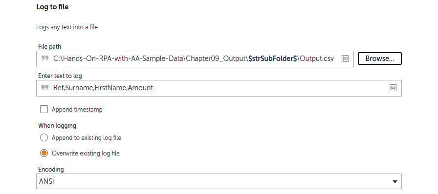
    

8.  Click on **Save**.

Great work -- that\'s *Section 4 -- Checking or creating a subfolder*,
complete! Our bot will create the necessary
subfolder and file if needed. The development
window for this section should look like this:

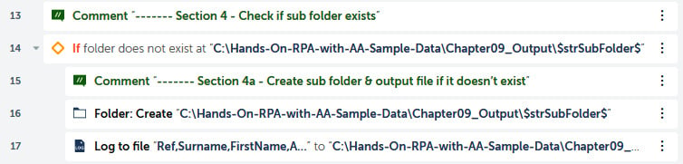

In the next section, we will append the working record to our output
file. This goes for every record in the source file. At this stage of
the process, the output will be present with headers, even if it
contains no records.

Section 5 -- Updating the output file 
-------------------------------------

It\'s time to append our record to the output
file. The result will be one file in each subfolder. This file will
contain one or more records. Since we have assigned the record to a
`Record` type variable, we will use the field index to get the
values. We know that there are four fields in each record, so we\'ll
have an index from `0` to `3` (as it\'s a zero-based
index). Let\'s get started:

1.  To append the record to our output file, add the **Log to file**
    action just below line **18**, ensuring it is within the **Loop**
    element on line 5.

2.  Set the following properties for the **Log to file** action on line
    **19**:

    **File path**:
    `C:\Hands-On-RPA-with-AA-Sample-Data\Chapter09_Output\$sSubFolder$\Output.csv`

    **Enter text to log**:
    `$recSource[0]$,$recSource[1]$,$recSource[2]$,$recSource[3]$`

    **When logging**: **Append existing log file**

    The properties window should look like this:

    
    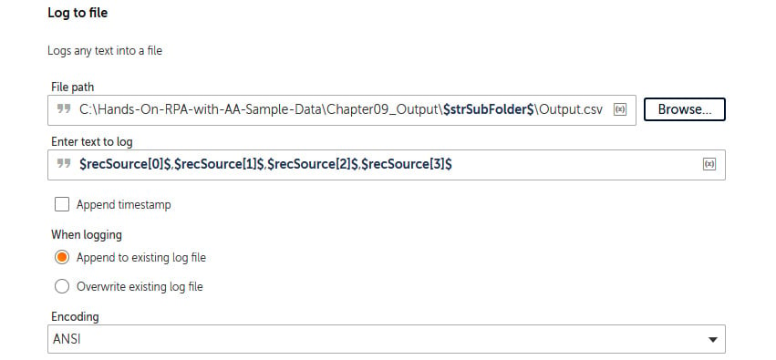
    

3.  Click on **Save**.

And that\'s it -- great work! Our bot is now complete. The development
interface for this section should look like this:

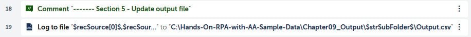

The bot will now append the customer record to the correct output file
in the correct location. In the next section, we will be closing the
source file since all the records will have been processed by now.

Section 6 -- Closing the source file 
------------------------------------

Remember when we created the file session in
*Section 1 -- Opening the source file*? Well, that session needs to be
closed. It is best practice to add the **Close** action at the same time
you create a session. Follow these steps to close the session:

1.  Add the **CSV/TXT: Close** action just below line **20**.

2.  Set the following properties for the **CSV/TXT: Close** action on
    line **21**:

    **Session name**: `Data`

    The properties window should look like this:

    
    
    

3.  Click on **Save**.

And that\'s it -- great work! Our bot is now complete. The development
interface for this section should look like this:

Go ahead and run the bot to test it. It should create the necessary
subfolders. Each subfolder should have an output file. The bot will
process each record by appending it to the correct output file.

Here, you have had some good practice creating loops and applying
certain condition statements. In the next section, we will explore files
and folders further. So far, we have been working on a CSV file at a
fixed location. However, there may be cases where you will have to move,
rename, copy, and delete files and folders. Due to this, understanding
how to work with files and folders is a very useful skill to have.

Working with the filesystem 
===========================

There may be instances where we must create,
delete, move, or rename files and folders. Automation Anywhere has two
packages: one for files and one for folders. In the following
screenshot, you can see the actions that are available for managing the
filesystem in Automation Anywhere:

Our current bot creates seven subfolders, with each folder containing a
CSV file called `output.csv`. To get some hands-on experience
with files and folders, we are going to automate the following process:

1.  Rename every `output.csv` file to its subfolder name.
2.  Move the renamed file(s) to
    `C:\Hands-On-RPA-with-AA-Sample-Data\Chapter09_Output`.
3.  Delete the empty subfolder(s).

You may have noticed that there isn\'t a file move
action. In order to achieve this, we will perform a copy and delete. We
will break this walk-through into five sections to make it easier to
follow:

-   Section 1 -- Looping through subfolders
-   Section 2 -- Renaming the output file
-   Section 3 -- Copying the output file
-   Section 4 -- Deleting the output file
-   Section 5 -- Deleting the subfolder

As always, we will start by adding some comments to guide us. We will
begin with just the basic skeleton and add further levels of detail as
we progress.

Let\'s start this walk-through by executing the following steps:

1.  Log into the **Control Room** section.
2.  Create a new bot and call it
    `Lab 9 - Files & Folders`. Place it in the
    `\Bot\` folder.
3.  As always, we\'ll begin by adding some comments that will be used as
    templates for our bot. Add a new **Comment** action on line **1**,
    set the value to `"---------------------"`, and click on
    **Save**.
4.  Add a new **Comment** action called
    `"------- Section 1 - Loop through Sub Folders"` on line
    **2** and click on **Save**.
5.  Add a new **Comment** action called
    `"------- Section 2 - Rename output file"` on line **3**
    and click on **Save**.
6.  Add a new **Comment** action called
    `"------ Section 3 - Copy output file"` on line **4** and
    click on **Save**.
7.  Add a new **Comment** action called
    `"------- Section 4 - Delete file"` on line **5** and
    click on **Save**.
8.  Add a new **Comment** action called
    `"------- Section 5 - Delete Sub Folder"` on line **6**
    and click on **Save**.
9.  Add a new **Comment** action called
    `"---------------------"` on line **7** and click on
    **Save**. Your bot should look like this:

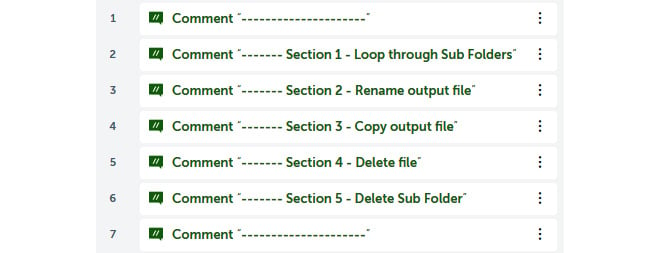

With that, we can proceed with this walk-through as we know what our bot
will be performing. Since this bot works with the files that were
generated in the previous walk-through, it is key to build it once the
previous bot has been built and tested.

Section 1 -- Looping through subfolders 
---------------------------------------

To loop through all the subfolders that were
created, follow these steps:

1.  We will need a variable to store the subfolder name. For this,
    create a `String` type variable called
    `strSubFolder`.

2.  To loop through all the subfolders, add the **Loop** action just
    below line **2**.

3.  Set the following properties for the **Loop** action on line **3**:

    **Loop Type**: **For each folder in folder**

    **Folder path**:
    `C:\Hands-On-RPA-with-AA-Sample-Data\Chapter09_Output`

    **Assign folder name to this variable**: **strSubFolder - String**

    The properties window should look like this:

    
    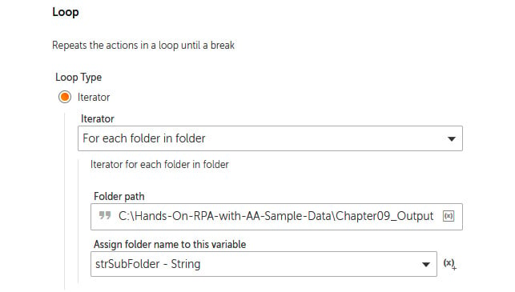
    

4.  Click on **Save**.

5.  Since all the other sections will be completed within this **Loop**,
    drag **Comment** lines **4** to **7** so that they are within the
    **Loop** element on line **3**. The development interface should
    look like this:

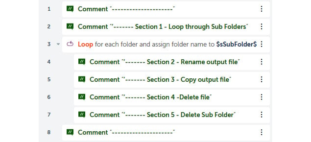

The initial loop has now been created. This will instruct the bot to
iterate through every subfolder within
`C:\Hands-On-RPA-with-AA-Sample-Data\Chapter09_Output\`. The
remaining actions will also be repeated for each subfolder. In the next
section, we will rename our `output.csv` file so that its name
is the same as the subfolders\'.

Section 2 -- Renaming the output file 
-------------------------------------

Here, we will use the variable holding the current
subfolder, `strSubFolder`, in order to rename the file. We
already know that the original name will be `output.csv`.
Let\'s get started:

1.  To rename a file, drag the **File: Rename** action just below line
    **4**.

2.  Set the following properties for the **File: Rename** action on line
    **5**:

    **File**:
    `C:\Hands-On-RPA-with-AA-Sample-Data\Chapter09_Output\$strSubFolder$\output.csv`

    **New file name**: `$strSubFolder$.csv`

    The properties window should look like this:

    
    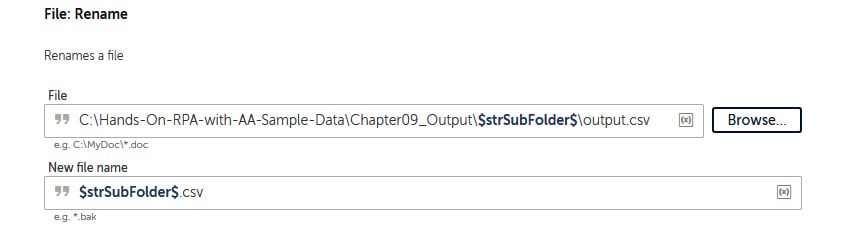
    

3.  Click on **Save**.

That\'s *Section 2 -- Renaming the output file*, completed. We have not
only automated the process of renaming of a file, but have also used
variables to identify the file and folder names.
Next, we have to move this file, but since a move action isn\'t
available, we will copy and delete instead.

Section 3 -- Copying the output file 
------------------------------------

The **Copy** action for files duplicates a file. We
could have used this function to perform the
rename and move process in one action, but I decided against this as I
wanted to demonstrate how to use the rename action. Let\'s get started:

1.  To copy a file, drag the **File: Copy** action just below line
    **6**.

2.  Set the following properties for the **File: Copy** action on line
    **7**:

    **Source file**:
    `C:\Hands-On-RPA-with-AA-Sample-Data\Chapter09_Output\$sSubFolder$\$strSubFolder$.csv`

    **Destination file/folder**:
    `C:\Hands-On-RPA-with-AA-Sample-Data\Chapter09_Output\$strSubFolder$.csv`

    The properties window should look like this:

    
    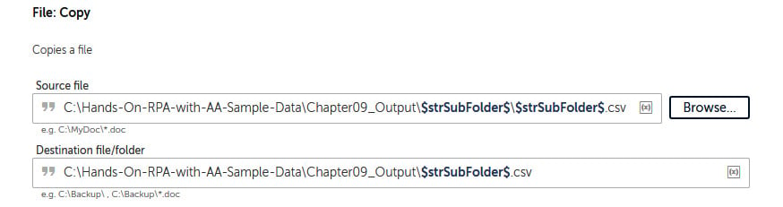
    

3.  Click on **Save**.

With that, *Section 3 -- Copying the output file*, has been completed;
the file has been copied to our target destination. Now, we need
to delete the original source file.

Section 4 -- Deleting the output file 
-------------------------------------

You will have noticed how similar the file and
folder actions are. As with the previous file actions, we will now
delete the file from our subfolder. Let\'s get started:

1.  To delete the source file, drag the **File: Delete** action just
    below line **8**.

2.  Set the following properties for the **File: Delete** action on line
    **9**:

    **File**:
    `C:\Hands-On-RPA-with-AA-Sample-Data\Chapter09_Output\$strSubFolder$\$strSubFolder$.csv`

    The properties window should look like this:

    
    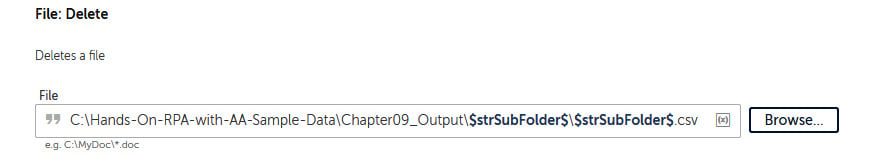
    

3.  Click on **Save**.

We are fast approaching the end of this process. We have one last action
to perform, deleting the subfolder.

Section 5 -- Deleting the subfolder 
-----------------------------------

Now that we have an empty folder that is obsolete,
it needs to be deleted. Deleting a folder is very similar to deleting a
file: it can be done with just one parameter. Let\'s get started:

1.  To delete the subfolder, drag the **Folder: Delete** action just
    below line **10**.

2.  Set the following properties for the **Folder: Delete** action on
    line **11**:

    **Folder**:
    `C:\Hands-On-RPA-with-AA-Sample-Data\Chapter09_Output\$strSubFolder$`

    The properties window should look like this:

    
    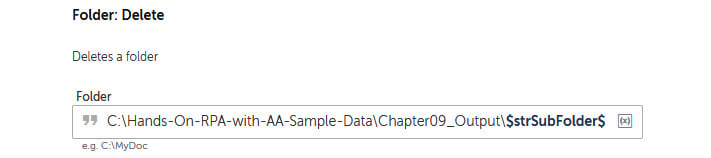
    

3.  Click on **Save**.

Now that the bot is complete, you can go ahead and run it. The
development interface should look like this:

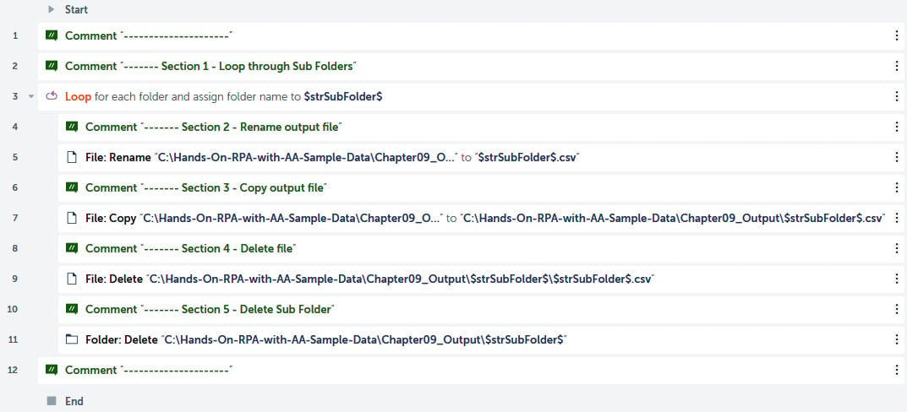

This bot should collate and rename all the files
that were generated by the first bot in this lab. It will also
delete all the subfolders that were created. I\'ve made you work hard in
this lab by building two bots. Hopefully, you have had some great
insight into the types of tasks that can be automated using RPA.

Summary 
=======

I know this has been a pretty full-on lab, but you have persevered
through it, so I think a big congratulations is in order. In this
lab, we went through two separate walk-throughs and built two
separate bots. We have covered a lot of packages. Just to recap once
more, first, we built some nested loops that went through lists,
records, and folders. We also discovered a new `Record` data
type variable. You were then given some exposure to all the other types
of looping available, all of which we will cover in later chapters. The
walk-throughs also included building some rule-based decisions with
conditional statements, using variables, and checking
if files exist.

Hopefully, you have had a great confidence boost in your RPA skills, but
there is still more to come. In the next lab, we will be delving
into how to automate XML files. For this, I have a great walk-through
for you. It will involve working with nodes within XML files, which will
include updating, creating, and deleting node values, as well as reading
multiple nodes.
