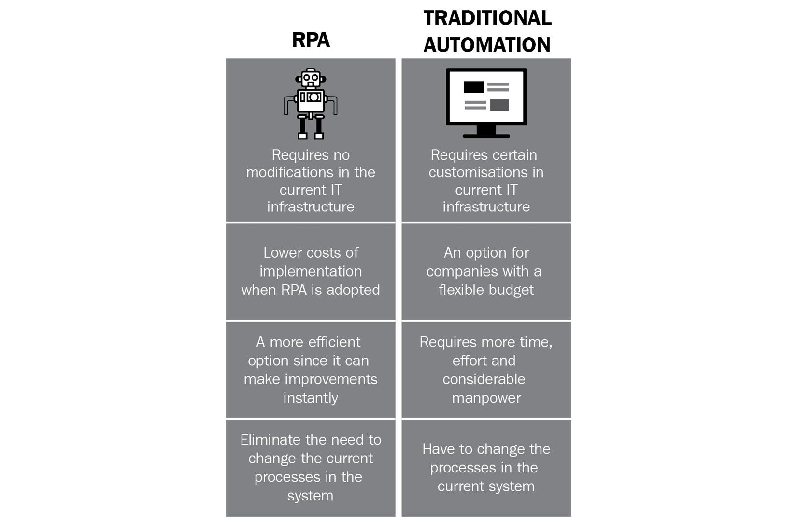
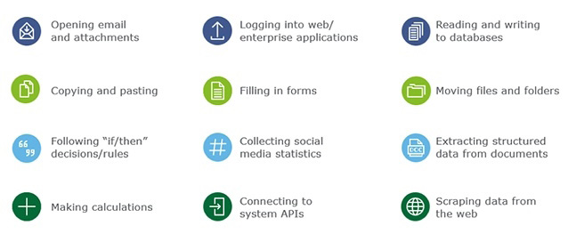
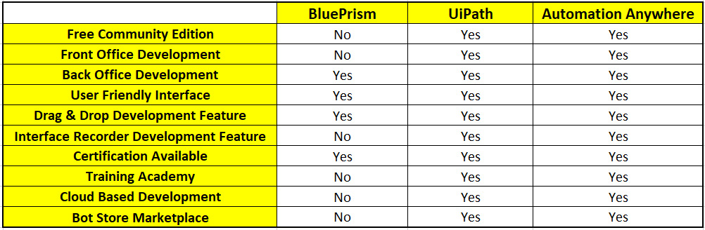
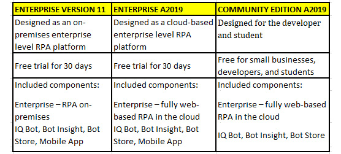

Lab 1: About Automation Anywhere 
================================

Along with building bots, AA also has a number of additional features
and components. These include IQ Bot, Bot Insight, Bot Store, Mobile
Bot, and Automation Anywhere University. In this lab, you will get
insights into what these are and how you can benefit from these features
and components.

We will cover the following topics in this lab:

-   What is robotic process automation?
-   Overview of Automation Anywhere
-   Automation Anywhere Versions
-   Community Edition 

Technical requirements 
======================

In order to use AA  Community Edition, the following requirements
are necessary:

-   Windows OS version 7 or higher
-   A processor with a minimum speed of 3 GHz
-   A minimum of 4 GB RAM
-   Internet Explorer v10 or higher, or Chrome v49 or higher
-   An internet connection with a minimum speed of 10 Mb/second

What is robotic process automation? 
===================================

You probably already know what RPA is, but we will
go through a quick overview here. The words *automation* or *robot*
usually conjure up images of a physical machine performing repetitive
tasks. We began to see this type of automation years ago, particularly
in manufacturing. Physical robotic machines were built to help automate
tasks usually done by humans. This form of industrial manufacturing
automation was later adopted by many other
industries including logistics, distribution, and packaging. This also
led to automation being taught in universities at postgraduate level.
Many new technology jobs were also created from this, including roles
such as robotics engineer, designer, and maintenance operative, as well
as automated programmable manufacturing tools such as CNC machinery.
Since the widespread adoption of the internet, we have seen the concept
of web-controlled automation also being introduced. As an example, large
buildings often deploy internet-enabled CCTV, heating controls, and
security systems, where all these systems can be managed remotely over
the internet. You could have a very fulfilling career as a developer or
engineer working in automation.

We can see the same thing happening with RPA. RPA is specifically
designed to automate tasks that are performed by humans on desktops.
Most jobs have an element that involves tasks that are high volume,
repetitive, and tedious. Such tasks tend to drain the enjoyment out of
our jobs. This is where RPA can be applied to automate these types of
tasks.

We can build bots to perform these types of tasks, and this is
specifically what RPA bots have been designed for. Having a bot can give
you more time to spend doing the tasks that you actually enjoy and excel
at. This in turn would deliver more job satisfaction.

You may be thinking, *well, what\'s the difference
between RPA and traditional software development?* Well, with
traditional development, the developer needs to be proficient in
developing the application with it being automated as well. For example,
to automate a task in Excel, you would expect the developer to have
skills in VBA. To develop web applications, the developer may need
skills in Java or HTML. The developer needs to understand how the
application is executing the tasks as well as what the user needs to do.
It would usually also involve a greater learning curve to master these
skills and would involve writing lines of code to build the solutions.
RPA is different. It doesn\'t really matter what application you are
working with as it interacts with the user interface. The user only
needs to understand how to operate the application they are working with
without necessarily understanding how the applications executes the
task, and this is all that RPA needs to know. So, no specific expertise
is needed to work on multiple applications. It also does not require
writing lines of code, as you can build a solution by designing a
workflow or using pre-defined drag and drop commands. This makes it an
ideal technology to rapidly learn how to build bots and doesn\'t require
years of learning to become a bot developer. See the following
comparison:

You can clearly see the benefits of having an RPA
bot as opposed to building a new traditional-style software solution.
So, what sort of tasks can a bot actually perform? Bots can pretty much
do most tasks that involve a human using the desktop. This includes the
automation of the tasks shown in the following diagram:

You should now have a good understanding of what RPA is. This is a
growing market with great demand for RPA skills. We know we can learn
these skills far more quickly and easily than those required for
traditional development. The scope of the types of tasks that can be
automated with RPA is vast and not limited to
specific industries.

The number of RPA vendors on the market is growing. As in most
industries, only a few become recognized and reputable as market
leaders, although we have seen a handful of industry leaders emerging
over the last few years. One of the key players has been AA.

Overview of Automation Anywhere 
===============================

The list of vendors that provide RPA tools is
growing constantly. There are three main leaders in this technology.
These are UiPath, Blue Prism, and **AA**. All these vendors provide RPA
tools with pretty much the same functionality. You can see the top 10
RPA vendors of 2020 at the following link, created
by **Horses for Sources**:
<https://www.horsesforsources.com/RPA_Top10_2020_012920>.

Although the aforementioned top three do provide similar
functionalities, there are some key differences. The following table
shows a breakdown of the features available from each provider:

We can see that AA and UiPath have the most comprehensive tools and
features when compared to Blue Prism.

In this book we will be using AA, as they were the first to release a
fully cloud-based RPA tool. This eliminates the need to install AA on
your desktops to build, manage, and deploy bots. AA has also won a
number of prestigious technology awards and was recently named the
*market leader* in RPA by a Forrester report.

AA also runs a number of annual events, where they host the *Bot Games*.
Here, developers from around the world are challenged against each other
to build specific bots. Maybe, once you have gained enough confidence in
your own bot development skills, you can be part of these Bot Games.

The mission statement of AA, as published on their
website at <https://www.automationanywhere.com/company/about-us>, is as
follows:

\"To enable companies to operate with unprecedented productivity and
efficiency by automating any part of the enterprise that can be
automated with the most intelligent and intuitive robotic process
automation platform we call

\- The Intelligent Digital Workforce\"

We can break this statement down into three distinct elements:

-   **What AA offers**: Giving organizations the opportunity to increase
    productivity and efficiency.
-   **How they can offer this**: Creating the opportunity to automate
    any process within the organization by the deployment of intelligent
    RPA.
-   **The outcome**: This results in building bots that make up the
    **Digital Workforce**.

When designing and building an RPA solution, it is essential that a
statement relates to the purpose of why RPA is needed. The Digital
Workforce has to add value within the organization. This can be measured
in terms of cost savings, time reduction, or the reduction of effort. As
a developer, understanding why automation is needed can help in
designing a robust intelligent solution.

We will take a closer look at some of the additional features and
components available with AA. This will show how AA stands out from the
crowd of its competitors. We will look at the following features and
components:

-   The Digital Workforce
-   IQ Bot
-   Bot Insight
-   Bot Store
-   Mobile Bot
-   Automation Anywhere University

Let\'s take a look at these in more detail.

The Digital Workforce 
---------------------

A bot is referred to by AA
as a **Digital Worker** as it clones the actions of a human to perform a
given task. A Digital Worker is a member of the team designed to carry
out a process just the same as any human worker. In a working
environment, a team can consist of both humans and bots, hence the bot
being referred to as a Digital Worker. As more bots are built within an
organization, you can see a Digital Workforce being created. These bots
can work side by side with a human or can be deployed to run on their
own. Decision-making is a key aspect when using RPA. RPA has the
capability to perform condition-based decisions. This is when the
outcome is purely based on a single condition or set of conditions.

For example, a condition-based decision could be, *do we order some
keyboards?*

We would check our stock levels in the stock database, and if it is
below our re-ordering threshold, then yes, we do; otherwise, we don\'t.

In some cases, condition-based decisions are not sufficient to get the
correct outcome. There are occasions when decisions have to be made
using **Artificial Intelligence** (**AI**) or by
applying machine learning algorithms. This is where RPA needs to be used
in conjunction with AI. AA allows us to train an RPA bot to perform
complex decisions involving some machine learning algorithms and AI.
This is achievable using the IQ Bot feature of AA.

IQ Bot 
------

As well as utilizing condition-based decisions,
more and more processes require a certain level of cognitive
intelligence to make decisions. An example of this would be when dealing
with unstructured data. A common scenario would be based on invoices,
they all tend to have the same type of data such as supplier, items,
costings, and dates, but the layout and format will vary between
different suppliers. The consistency is not present when handling
multiple suppliers. AA has developed a product called **IQ Bot**. This
bot uses cognitive automation with RPA to learn how to handle
unstructured data. This enables such processes to be automated from end
to end without human intervention. It integrates AI
technologies such as fuzzy logic, **Natural
Language Processing** (**NLP**), computer vision,
and **Machine Learning (ML)**, all without the help of data scientists
or highly trained experts.

We will look at IQ Bot later in the advanced commands section of this
book and will give you the opportunity to create and train your own IQ
Bot to handle unstructured data.

Bot Insight 
-----------

Designing and building bots is not the complete
story. AA has also developed a platform that produces real-time
analytics about your Digital Workforce, processes, and business-level
processes This is all a part of the Bot Insights tool, the RPA analytics
tool for AA. Bot Insights is broken down into two categories:
operational analytics and business intelligence.

As bots are deployed, as well as executing tasks, they also process
data. This data is related to each specific process and can provide
valuable insight. Bot Insight analyzes this data and transforms it into
meaningful insights. It also captures operational data such as how well
the bot is performing, tracking data as it is being processed. All this
data can be presented in various formats including graphs, charts, and
tables. It can also predict possible bot failures. It can be integrated
seamlessly with other leading business intelligence platforms such as
Tableau, ThoughtSpot, and QlikView. As an independent tool, Bot Insight
provides a complete analytics solution without the need to integrate
with other tools. It\'s simple to use; all it requires is tagging the
data items that need to be analyzed and Bot Insight will do the rest for
you.

Note

You can learn more about Bot Insight at
<https://www.automationanywhere.com/products/bot-insight>.

Bot Store 
---------

AA is the first RPA vendor to have a fully
operational Bot Store. Bot Store is an online store with a collection of
Digital Workers. The bots available here are built by independent
developers from all around the world as well as AA themselves. AA Bot
Store won the Silver award in the 2019 Edison Awards for developing the
world\'s first and largest enterprise automation marketplace.

These are complete bots out of the box that will perform a specific task
or role. They are available as bots for specific applications,
categories, or business processes. These applications include Microsoft,
Google Cloud, CyberArk, and LinkedIn. You can pick specific bots for
tasks such as converting speech to text or converting a QR code image to
text. The bots on offer are continuously growing as more of them are
added. Many of these bots are available for free, but there are some you
will have to pay for.

Once you have mastered bot development, maybe you can submit your bots
to be hosted on Bot Store. This is a great way to promote your skills as
well as having the opportunity to sell your bots.

Note

You can learn more about Bot Store at
<https://www.automationanywhere.com/products/botstore>.

Mobile Bot 
----------

AA has also released a mobile app to work with
your bots. It allows you to manage your Digital Workers from your mobile
device. Bot Insight is available on the mobile app. This app will give
you live alerts on bot performance as well as business insights on bot
data. You can control your bots from the app including starting and
stopping them. It also provides a platform for you to connect with the
wider AA RPA community.

Note

You can learn more about Mobile Bot at
<https://www.automationanywhere.com/products/apps>.

Automation Anywhere University 
------------------------------

AA also has an online university that provides
many learning paths and opportunities to get a globally recognized
certificate. You can gain many accreditation badges approved by AA by
completing the online assessments. These assessments usually consist of
multiple-choice questionnaires. In order to gain the Certified Master
Professional accreditation, you will have to build three bots and submit
them to the university. These will then be assessed to determine whether
you qualify or not. There are many areas of AA that you can gain
accreditation badges for, including Bot Developer, Business Analyst, IQ
Bot Developer, Control Room Administrator, Solutions Architect,
Technical Support Specialist, and RPA Program Manager.

You can attempt the accreditation badge assessments for free, but there
is a cost for the certifications. The costs vary from 50 USD to 100 USD
depending on the certificate.

These certifications are great ways to promote your RPA skills and I
would recommend you to try the Automation Anywhere Certified Advanced
RPA Professional certification after completing this hands-on book.

Note

You can learn more about the AA University at
<https://university.automationanywhere.com/>.

Hopefully, you will now have a better insight into the features of AA.
There is a distinct advantage of using AA for RPA over its competitors.
We know that the AA platform offers far more than just bot development.
It allows data analytics, a platform to showcase and generate revenue
from our bots, a tool specifically designed to incorporate AI in our
bots, as well as a path to gain recognized certifications for our
skills.

Along with these features, there are three versions of AA available. We
will now look at the differences between all three of them.

Automation Anywhere versions 
============================

As mentioned, there are three versions available
from AA. We will learn what each version has to offer. Also, we will
look at which version we will be using and why.

Each version is designed with a different user in mind. The following
table shows you what these versions are and their main differences:

We will be using Community Edition , the main reason being that
it\'s totally free. Both the other two versions come with a 30-day free
trial, after which you have to purchase an AA license to continue using
them. Community Edition  is specifically designed for students and
developers. There is no limit to the number of bots you can build nor is
there any limited functionality.

I am sure you can now see the benefits of using Community Edition 
as well as understanding what additional capabilities the other versions
have to offer. In the next section, we will take a closer look at
Community Edition  as well as a walk-through on how to register
with AA in order to start using it.

Community Edition  
-----------------------

AA Community Edition  is the latest free
version available and was released in November 2019. The version prior
to this, AA v11.x, used a client-server architecture where the
management was done through the web-based Control Room app while the bot
development was done through a client application installed on the
desktop.

Community Version  is a fully cloud-based solution. The bot
management and building are all done through the web application. No
development client is installed on your desktop. Each device that you
will run the bot on will need to download and install a **Bot agent**.
Once installed, you build your bot, then connect
to your device using a Bot agent, and then deploy.

### Registration with Automation Anywhere

As Community Edition  is free, you can start
using it once we have registered with AA.

To register, follow these instructions:

1.  Navigate to
    <https://www.automationanywhere.com/products/community-edition>.
2.  Complete the appropriate details, including your **First Name**,
    **Last Name**, **Email Address**, **Country**, **Phone Number**, and
    **Company Name**.
3.  Then submit your details.

You will shortly get a welcome email including your login credentials.
The key details to note are the following:

-   Your Control Room URL
-   Your username
-   Your password

You will need these credentials every time you launch AA so keep a note
of them. You need to change the password when you first log in.

You are now ready to start your RPA journey using AA.

Summary 
=======

You will now have a good understanding of AA and its competitors as well
as what AA\'s capabilities are. Having registered with AA to use the
free Community Edition , you must be keen to get AA up and running
on your machine.

In the next lab, you will be guided through the installation process
of AA. This will be done through step-by-step instructions to get you
ready to start taking a closer look at the AA interface.
