Lab 2: Installing Automation Anywhere 
================================================================

The latest Community Edition of Automation Anywhere is a fully
cloud-based platform. It is also available to students and small
businesses for free. There is no limit on the number of bots you can
build; the only limitation is that they can only be deployed to one
device. This makes it ideal to learn how to start building RPA bots.

The basic components needed for any version of Automation Anywhere to
run are **Control Room** and the **Client**. **Control Room** functions
as a management tool. It is used to manage your user accounts, devices,
bots, and schedules, as well as giving bot insights. In previous
versions, the **Client** was the bot development interface, but this has
been superseded in the latest Community Edition  and all the
development is now done from within **Control Room**. So, there is no
need to install any client application.

The previous lab showed how to register with Automation Anywhere.
This registration process will create a user account for you and
allocate your account to a control room. You will receive an email with
the **Control Room** URL details as well as your login credentials.

In this lab, we will get Automation Anywhere up and running, ready
to start building bots. You will learn how to connect to the control
room and update your profile, and we will move forward to setting up the
machine you would run your bot on, known as a **device**. After creating
the device, you will learn how to configure and set up any credentials
needed to log in to the device. By the end of this lab, you will
have completed learning how to set up the environment and get ready for
your RPA bot development journey using Automation Anywhere.

We will cover the following topics in this lab:

-   Connecting to **Control Room**
-   Preparing your device
-   Configuring profile and device credentials

Technical requirements 
======================

In order to install the Automation Anywhere  Community Edition Bot
agent, the following requirements are necessary:

-   Windows OS version 7 or higher
-   A processor with a minimum speed of 3 GHz
-   A minimum of 4 GB RAM
-   At least 100 MB hard disk space
-   Internet Explorer v10 or higher, or Chrome v49 or higher
-   A minimum screen resolution of 1024\*768
-   An internet connection with a minimum speed of 10 Mb/second
-   Have completed the registration process with Automation Anywhere for
    Community Edition AA 2019

Connecting to Control Room 
==========================

Continuing from *Lab 1*,
About Automation Anywhere*,
after your registration with
Automation Anywhere is complete, you should have received an email with
the following details:

-   Your Control Room URL
-   Your username
-   Your password

Let\'s start by logging into **Control Room** and getting familiar with
the interface.

Launching and logging into Control Room 
---------------------------------------

As Automation Anywhere is
100% cloud-based, the platform is a totally web-based application. As
such, we need to run Automation Anywhere from our web browser. I am
using Chrome, but Internet Explorer can also be used to launch
Automation Anywhere:

1.  Copy the **Control Room** URL details from your registration email
    and enter this URL into your web browser address bar:

    
    
    

2.  Next, enter the **Username** (this is usually
    your email address), followed by the
    **Password** sent in the email from Automation Anywhere.

3.  Click on the **Log in** button. When you have successfully logged
    in, you will be navigated to the **Home** page:

You have managed to log in to Automation Anywhere
**Control Room**. The top right shows the user
details, while the left-hand pane has all the different sections of
Control Room.

Updating your profile and password 
----------------------------------

The first thing you may want to do is update your
profile and set a new password:

1.  In the top right-hand corner of the **Home** page, click on your
    profile icon:

    
    
    

2.  From the dialog box, click on **Go to My profile**:

    
    
    

3.  This will take you to your profile details
    interface; to make any changes to your
    profile, click on **Edit**:

    
    
    

4.  This will allow you to update your details.
    Here, you can update your **password**; once
    you have made your changes, click on **Save changes** to apply them:

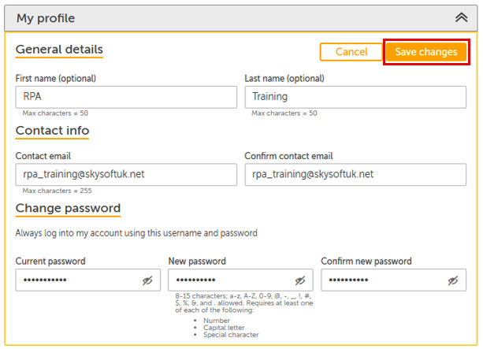

You are now successfully connected to **Control
Room** and have configured it to your liking.
Every time you want to launch Automation Anywhere, you will navigate via
your browser to the URL given and use your credentials to log in. Now
let\'s prepare your device.

Preparing your device 
=====================

When bots are built, they need to be run on a
device. This device can be a physical desktop, laptop, or even a virtual
machine. We need to install and configure all devices that we may want
to run a bot on. With this free edition of Automation Anywhere, we can
add only one device.

To add a device, two stages are involved:

-   Installing a Bot agent
-   Enabling the extension

Let\'s go through each stage now.

Installing a Bot agent 
----------------------

The Bot agent is a small application that allows
the device to communicate with the task bots. To install the Bot agent,
follow these steps:

1.  Click on **MY DEVICES** from the left-hand menu bar, then click on
    the **Add local bot agent** icon:

    
    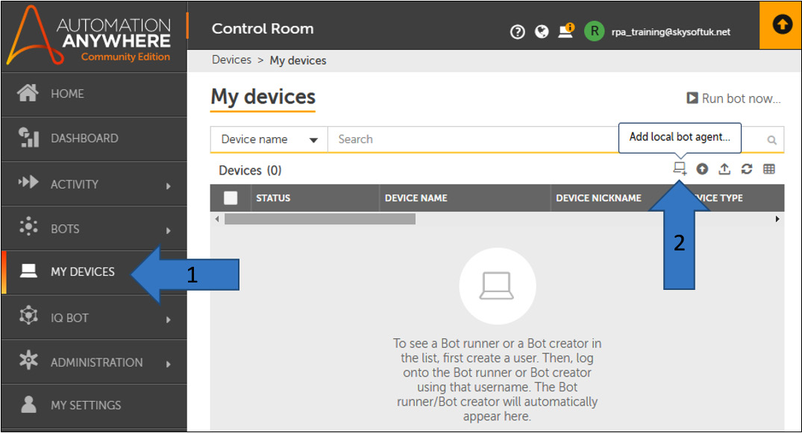
    

2.  The connection wizard will pop up. Click on
    **Connect to my computer**:

    
    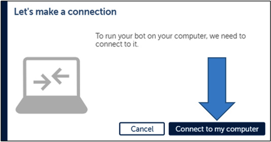
    

3.  The wizard will start to download the Bot
    agent (into your default downloads folder) as shown in the following
    screenshot:

    
    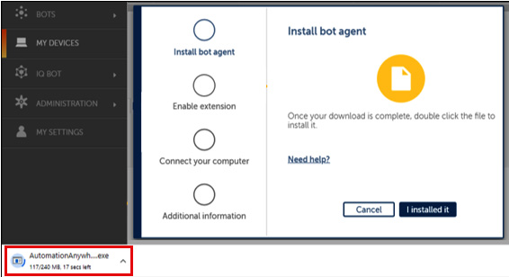
    

4.  Once the Bot agent has been downloaded,
    right-click on the downloaded file\'s icon and select **Open**:

    
    
    

5.  This will initiate the Bot agent install
    wizard. Follow any onscreen instructions to install the Bot agent.

6.  Once it has been installed, you will notice a green tick in the
    **Install bot agent** step. This green tick indicates the successful
    completion of that task:

The wizard will automatically lead you into the
next section for enabling the extension.

Enabling the extension 
----------------------

If you are using Google Chrome as your browser,
Automation Anywhere will need to enable an extension for this. This
allows Automation Anywhere to identify and interact with web-based
objects for automating your bots. To enable the extension, you may need
to download it from the Chrome Web Store. Follow these steps to enable
the extension:

1.  Click on the **I enabled it** button shown in *Figure 2.11*. This
    will tell you whether the extension is already enabled or not:

    
    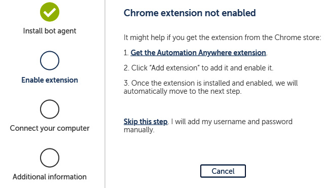
    

2.  Click on the **Get the Automation Anywhere
    extension** link to navigate to the Chrome Web Store:

    
    
    

3.  Click on **Add to Chrome** button and you will
    get the following prompt; click on **Add extension**:

    
    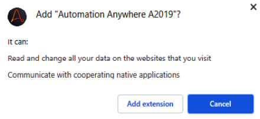
    

4.  This will install and enable the extension. To view or disable the
    extension in Chrome, navigate to **Settings** \| **Extensions** and
    the Automation Anywhere extension should be visible:

    
    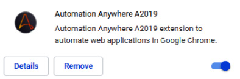
    

5.  Once the extension has been enabled, the
    progress indicator will be updated with further green ticks, shown
    as follows:

    
    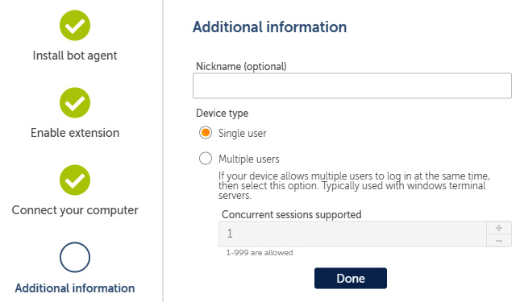
    

6.  Finally, to complete the installation, click on the **Done** button.
    You can give your workstation a nickname in the **Nickname
    (optional)** text box if you wish.

7.  Looking at **My devices** in **Control Room**, you will now notice
    your device listed:

    
    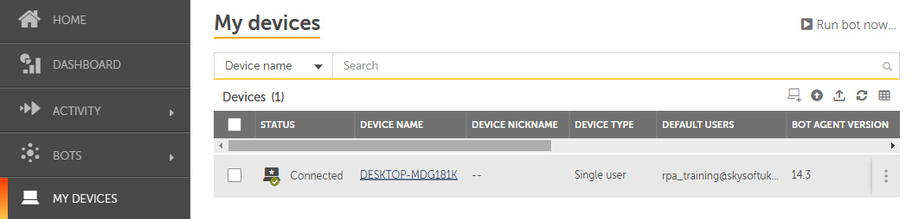
    

8.  The Bot agent should now be successfully installed on your device.
    You will also notice a little green tick against your local device
    icon on the top pane:

We now need to configure the device so that
Automation Anywhere can log in to it, even if no one is logged in to
that device or if it\'s locked.

Configuring profile and device credentials 
==========================================

Once your device is visible on the listed devices
in **Control Room**, you may need to configure the
user profile for that device. Imagine that we build a bot and deploy it
to your device, but the device is locked or you are not logged in to it.
Automation Anywhere will need to log in to the device. In order to
achieve this, we need to set the login user credentials for the device.

This is achieved with the following steps:

1.  Once in **Control Room**, from the **Home** screen, click on the
    local device icon, followed by **Update credentials**:

    
    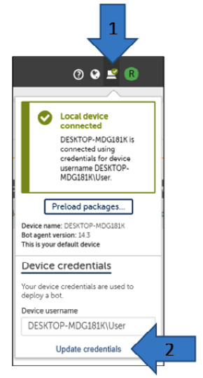
    

2.  The dialog will allow you to update the
    **Device password**. Enter the user password
    for the device and click on **Update**:

    
    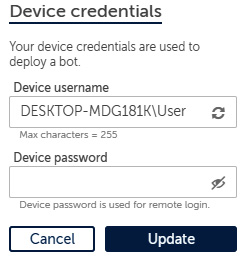
    

3.  Your device has now been successfully
    configured.

Great work! We have now got our device all ready
to start working with **Control Room**. **Control Room** is set up with
a user profile and a device.

Summary 
=======

We are all ready to get going now. You will be comfortable in the future
with setting up and configuring a device with Automation Anywhere
Control Room, and can configure your device credentials as well as
update your user profile. You could have a number of devices installed
in **Control Room**. Once a bot is built, it can be deployed to any one
of them or even a number of devices. Installing and configuring devices
is an essential part of deploying and testing bots, and Control Room
provides a centralized location to manage all your devices easily.

In the next lab, we will look more closely at the **Control Room**
features. We have already looked at setting up devices, but there is a
lot more to it. We will learn about the dashboard, and how your bot is
managed and monitored. This will get you more familiar with the
**Control Room** interface used in Automation Anywhere.
